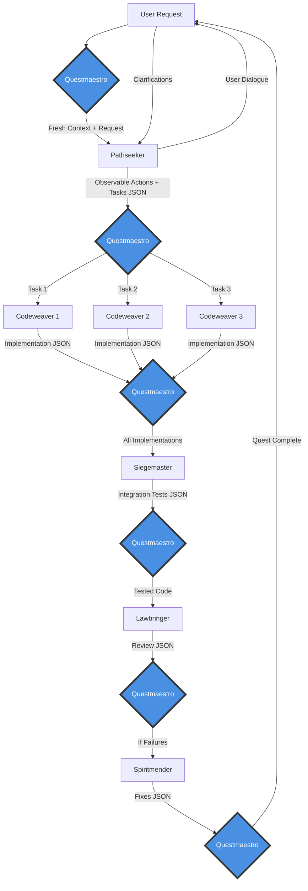
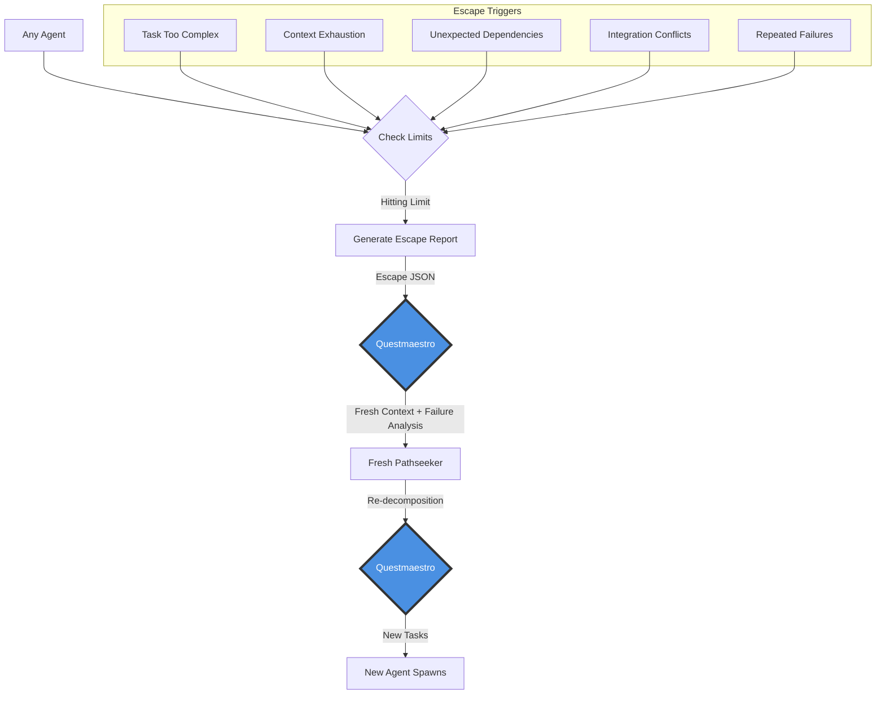
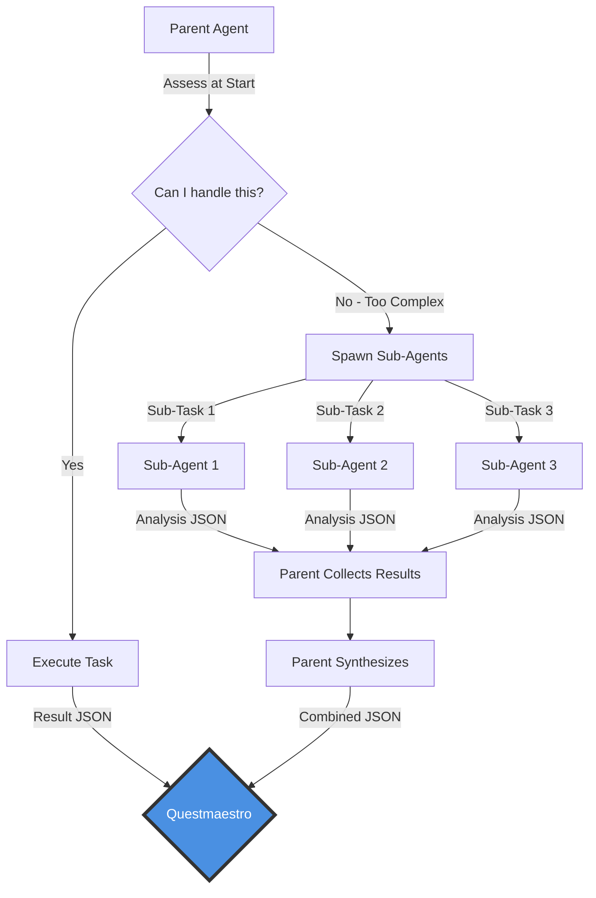
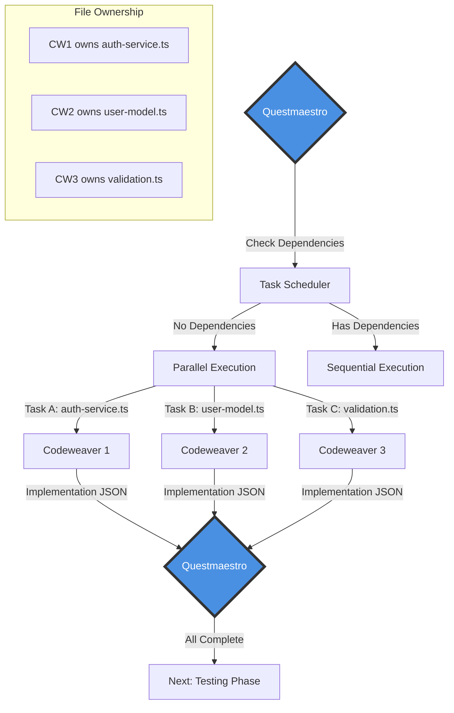
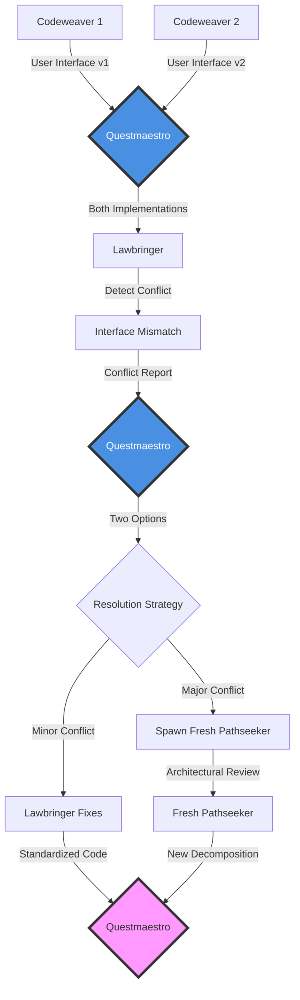
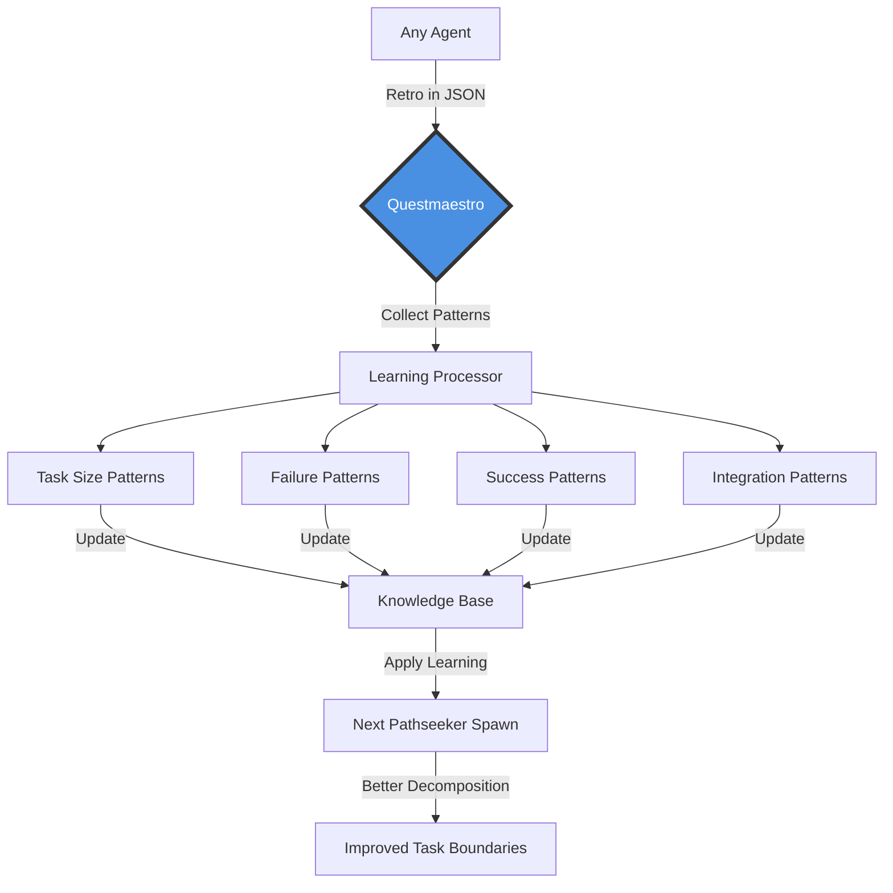
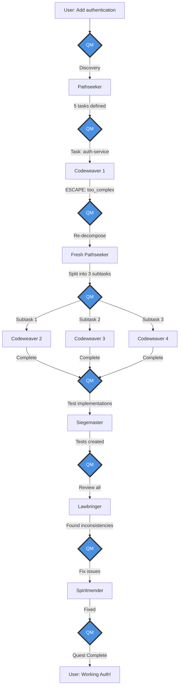
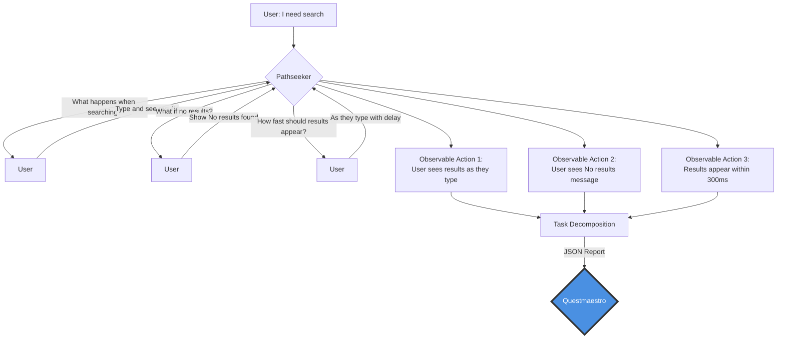

# Questmaestro Orchestration Flows

Complete visualization of all agent communication flows, failure handling, and recovery mechanisms in the Questmaestro system.

## Core Principles

1. **All communication goes through Questmaestro** - No direct agent-to-agent communication
2. **Fresh context for each spawn** - Agents receive only their specific task, no conversation history
3. **JSON reports only** - Agents communicate through structured JSON reports
4. **Escape hatches prevent death spirals** - Any agent can escape when hitting limits

## 1. Main Quest Flow

The standard flow from user request to completed implementation:



## 2. Escape Hatch Flows

Any agent can trigger an escape hatch when hitting limits:



### Escape Report Format

```json
{
  "status": "blocked",
  "reason": "task_too_complex",
  "analysis": "Task requires 5 different integrations exceeding agent scope",
  "recommendation": "split_into_discovery_plus_implementation",
  "retro": "Authentication tasks typically need 4-5 subtasks",
  "partialWork": "Completed interface definitions before hitting complexity"
}
```

## 3. Sub-Agent Spawning Flow

Agents can spawn sub-agents for parallel analysis (one level deep only):



### Sub-Agent Constraints

- **One Level Deep**: Sub-agents cannot spawn their own sub-agents
- **Discovery Only**: Sub-agents analyze and report, don't implement
- **Parallel Analysis**: Multiple sub-agents can work simultaneously
- **Parent Synthesis**: Parent must combine findings into cohesive output

## 4. Parallel Codeweaver Execution

Multiple Codeweavers work on independent tasks simultaneously:



## 5. Integration Conflict Resolution

When parallel agents create conflicts:



## 6. Learning Cycle Flow

How the system learns from failures and successes:



### Learning Categories

```json
{
  "retrospectiveNotes": [
    {
      "category": "task_boundary_learning",
      "note": "Auth tasks in this codebase need ~100 lines per task"
    },
    {
      "category": "pattern_recognition",
      "note": "Always separate validators from business logic"
    },
    {
      "category": "failure_insights",
      "note": "Context exhausted at 300 lines of implementation"
    }
  ]
}
```

## 7. Complete Quest Lifecycle with Failures

Showing a realistic flow with escapes and recovery:



## 8. Observable Action Discovery Flow

How Pathseeker discovers atomic actions through dialogue:



## Key Communication Rules

1. **No Direct Communication**: Agents never talk to each other directly
2. **JSON Only**: All communication is structured JSON reports
3. **Fresh Context**: Each spawn gets clean context, no history
4. **Escape Early**: Better to escape than get stuck
5. **Learn Always**: Every interaction provides learning data

## Failure Recovery Patterns

### Pattern 1: Task Too Complex
```
Agent realizes task is too big → Escape → Fresh Pathseeker → Smaller tasks → Success
```

### Pattern 2: Integration Conflict
```
Parallel agents conflict → Lawbringer detects → Spiritmender fixes OR Pathseeker re-architects
```

### Pattern 3: Context Exhaustion
```
Agent approaching limit → Escape with partial work → Continue from stopping point
```

### Pattern 4: Repeated Failures
```
Fix attempts fail → Escape → Pathseeker recognizes pattern → Different approach
```

## Success Indicators

- Agents complete without escaping (task size was right)
- Parallel agents integrate smoothly (good interface contracts)
- Observable actions demonstrated working (user value delivered)
- Learning improves future decomposition (fewer escapes over time)