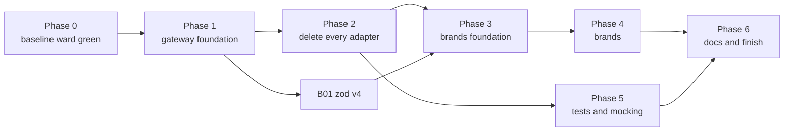

# Brands and gateways: the epic

This file is the operator's run sheet. It lists every work item, the order they run in, which can run
side by side, and what state each is in. Each item is its own file under `items/`. An operator hands an
agent one item's link plus `agent-brief.md`, and nothing else.

Two source docs feed this epic. Neither is edited by the epic; they stay as the record of why.

| Source | What it holds |
|---|---|
| `scrolls/gateway/followup-sustainability.md` | Open work on the four gateway packages under `packages/@gateway/`, and the deletion of every `adapters/` folder |
| `scrolls/brands-types-tests-rules.md` | The rules for brands, library types, returns, tests and mocking, and the lint rules that enforce them |

Every command runs from this worktree's root, `worktrees/gateway-pivot`, on the branch `gateway-pivot`.

## What this epic is trying to do

This epic bridges two large new systems into one. The gateway decides how code reaches anything outside
the repo. The brand rules decide how our own data is typed, checked and tested. The two docs were written
separately, and this epic is a best stab at linking them into one order of work.

The goals:

1. Every object contract, every object nested in it, and every string and number field in it is branded.
   Brand texts are derived, never chosen.
2. The gateway file structure is used as it stands: four packages, `#gateway/<kind>/<subpath>` imports,
   `{subpath}.ts` barrels, one folder per wrapper. The one change is the user's: there are no `_test_`
   barrels. A test imports each stub and proxy from its own file (brands doc C6), in the gateway and in
   workspace packages alike. Item G26 makes that change.
3. Everything works in a consumer repo that `dungeonmaster init` touched, not only here.

As items land, a build error, a type error or a Node, TypeScript or Jest disagreement may show that the
layout planned here does not work. When that happens, the operator tweaks the plan so the whole epic can
succeed. **Every such change is written into "Concessions" below**, with what the plan said, what we did
instead, and why. A concession nobody wrote down is a silent rewrite of the rules, and is not allowed.

Decide by clean architecture. When two designs both work, pick the one with fewer places to keep in step,
and the one that works unchanged in a consumer repo.

## How to operate — the user's standing instructions

1. **At most FIVE sub-agents at a time.** The user raised the cap from three to five this session.
2. **A heartbeat every 30 minutes.** Use `CronCreate` with `13,43 * * * *` (recurring). Do NOT use `/loop` or
   `ScheduleWakeup`; the user asked for cron. It fires only while the session is idle, and dies with the session.
3. **The operator owns builds and commits. A dispatched agent does neither.** Agents also never run `git add` or
   `git mv`: the git index is shared, and one agent's `git mv` was swept into another unit's commit this session.
   Before every commit, run `git diff --cached --stat` and stage explicit paths, never a whole package another
   agent is still editing.
4. **FIX EVERY PRE-EXISTING FAILURE YOU FIND.** The user's words: *"any pre-existing needs to be fixed... we're
   trying to get to a good state with this slew of changes."* A full `npm run ward` must exit 0. A failure an agent
   reports but leaves standing becomes a unit.
5. **Commit on the branch you are on, `gateway-pivot`.** The operator may branch off it when that helps,
   such as giving a large item or a group of agents its own worktree through
   `mcp__dungeonmaster__create-worktree`, so they stop sharing one git index. Every such branch merges
   back into `gateway-pivot` when its work is done, and the operator deletes it and its worktree after
   the merge. Nothing merges anywhere else. Agents still never create branches themselves.

More rules for the operator:

6. **The user gives no input until the epic is marked finished.** When an item is blocked, make a real
   effort to clear it: dispatch an agent to explore the Node, TypeScript, Jest or config disagreement
   behind it. If it still will not clear, mark it `blocked` in the status table with the reason, and move
   on to any item that does not depend on it. Never stop working because one item is stuck.
7. **Use sub-agents for everything that is not coordination:** planning an item's split, implementing,
   writing tests, fixing build errors, and exploring disagreements. The operator reads reports, builds,
   commits and updates this file.
8. **Hand each agent one item file and `agent-brief.md`.** When an item says "operator splits", the
   operator dispatches it as several agents, each given 1 to 3 files for cleanup work or 2 to 4 files for
   migration work, and names the files in the prompt. Use `model: "sonnet"` for large mechanical fan-outs.
9. **Two agents never edit the same package at once** unless the operator has named disjoint file lists
   for them. An item marked "runs alone" runs with no other agent editing its package.
10. **After each item lands:** the operator runs `npm run ward -- --uncommitted` until it exits 0, commits
    the item's paths, then sets the item's row below to `done` with the commit SHA. Build only when
    the `<dungeonmaster-buildDiscipline>` snippet's table, or repo `CLAUDE.md`'s build table, says the
    next thing to run needs compiled output.
11. **Update this file as you go.** Status, blockers and concessions live here, so a fresh session can
    pick up from this file alone.
12. **`create-worktree` branches from the main checkout's HEAD (`master`), not from `gateway-pivot`.** After carving one, run `git merge --ff-only gateway-pivot` inside it before anything else (the pre-bash hook blocks `git reset --hard`), then `npm run build:clean` there, because it arrives with no `dist`.
13. **Keep the consumer suite growing.** Once G27 lands, any item that changes what `init` writes, what a
    package publishes, or how a consumer resolves, loads or tests code adds its assertions to the
    consumer suite in the same item. Before committing such an item, the operator runs
    `npm run build:clean`, then `npm run check:consumer`. G27 lists the items known to need this.
14. **No item is dispatched without a plan that names its files.** Every remaining item's file under
    `items/` carries a `## Plan` section before any agent implements it. The section lists every file
    the item creates, edits or deletes, by full path, grouped into the agent-sized batches of rule 8.
    The operator sizes the job from that list: how many agents, how many waves, and which items can run
    side by side without two agents touching one file. The list is also each agent's complete scope.
    - Not "the adapters in `packages/server`". Write each path.
    - Not "and their callers". Name each caller.
    - Not "about 40 files". Give the list itself.

    An item with no named-file plan gets a planning agent first. That agent reads the code, writes the
    `## Plan` section into the item file, and changes nothing else. Only then is the item implemented.
    A file an implementing agent finds it must touch that is not on the list is reported back to the
    operator, who adds it to the plan before the agent proceeds. The agent never widens its own scope.
15. **No mutation checks** (user, 2026-09-28). Agents do not break code on purpose to prove a test goes red; the
    step is gone from `agent-brief.md`. Tests still assert real values.
16. **Scripts are allowed where they cut real work, and each one is recorded** in "Scripts used" below (user,
    2026-09-28). Their output is gated by ward like any other change.
17. **No Antigravity (`agy`) agents** (user, 2026-09-28 evening). Use Claude sub-agents only.
18. **Gate every commit yourself** with `lint,typecheck,unit,integration` on the touched packages plus every package
    that composes their proxies, and web's `e2e` whenever web runtime code changes.
19. **Update this file in the same commit as the work, every time something finishes** (user, 2026-09-28 night).
    Each commit that lands an item, a batch, a gateway unit or a fix also edits `EPIC.md`: the item's status row and
    SHA, the "In flight" section (what landed, what is active, what is next), any new concession, follow-up or
    gateway gap, and a Log line when a session ends. Not "at the next heartbeat", not "once a few batches are in".
    A fresh session must be able to pick up from this file alone at any moment, and a report that sits unrecorded
    until later is lost if the session dies.
20. **Never `rm` a file; move it out to `tmp/deletions/` instead** (user, 2026-09-29). Deleting a file (`rm`,
    `git rm`, `unlink`, a script's delete step) needs the user's approval, and a pending approval stalls the operator
    and every agent waiting on it. Moving a file does not. So:
    - First prove nothing imports the file any more (`discover` grep for its path and its exported names, across
      every package, tests and harnesses included). A file something still imports is not deletable yet.
    - Then move it with plain `mv` (never `git mv`: the index is shared) to
      `<repoRoot>/tmp/deletions/<wave-or-item>/<its original repo-relative path>`, creating the folders with
      `mkdir -p`. `tmp/` is gitignored and outside every package, so git records the file as deleted, ward never
      checks it, and the original path is kept for a restore.
    - Scripts that delete do the same: move, not `rm`. An agent lists every file it moved under DELETIONS in its
      report.
    - The operator commits the move like any other change. Emptying `tmp/deletions/` itself is optional
      housekeeping, done once at the end with the user's approval; nothing waits on it.
    - Not covered: temporary files a test or a script creates and removes under `tmp/` or the OS `/tmp`.

21. **Slow tests are tabled until Phase 6** (user, 2026-09-29 afternoon). The refactor runs many memory-heavy agents at once, so
    slow-file flags and load timeouts are expected. During Phases 3 to 5, a red that is only a slow-file flag or a
    timeout under load is re-run alone; if it passes alone, record the run ids in F106 and move on. Do not dispatch
    an agent to investigate or speed up a slow test before Phase 6. A test that fails alone is a real red and is fixed.

## START HERE — where the epic stands and what to do next

### Big-bang run (user decision, 2026-09-29 evening) — IN PROGRESS, READ THIS FIRST

The user adopted the open proposal below. Every Phase 4 brand script runs back to back on `gateway-pivot`, and
each run's output is committed while the tree is red. Only then do fixer agents clear the fallout, in this order:
typecheck to 0 (leaves first up the import graph), then unit, then lint, then integration (opus fixers), then e2e
(opus fixers). Rule F's per-wave gate and rule 18's per-commit gate are suspended for the length of this run.

| What | Where |
|---|---|
| Run sheet: order, commands, red-tree verdict per script, hand pre-steps | `bigbang/RUNBOOK.md` |
| Patched scripts (apply modes, per-file stub specifiers, line-free gate key in `lib/repo.cjs`, moves not deletes) | `phase34-scripts/` (committed c2cbc43d4); run copies in `tmp/phase34/`, `tmp/phase34-feasibility/` |
| Fix-queue tools: `diag.cjs` (whole-repo typecheck, about 60 s), `graph.cjs` (import levels), `queue.cjs` (batches, error clusters) | `bigbang/tools/`; run copies in `tmp/bigbang/tools/` |
| Segment A driver (W1, SD12, W3, W4, W2), progress log, per-run logs | `tmp/bigbang/run-a.sh`, `tmp/bigbang/logs/A-progress.log`; ends with `tmp/bigbang/A.done` or `A.failed` |

Order: W1 → H1 (done, e1e08c3c3) → SD12 → W3 → W4 → W2 → W5 (first five as trials) → W6 (fallout script, then R2
and R7 autofix) → W7 → W8 `--only=json,own`. Held until typecheck is green: W8 `--responders` and W9 (both decide
from checker types and can bake in a wrong type or drop a runtime check), then H2 to H8, then W10.

Machine limits: 62G RAM, 12 cores. Fixer agents only edit; the operator runs `diag.cjs` and the tests centrally
between rounds. The Workflow tool runs at most 10 agents at once per workflow.

Done so far: prep c2cbc43d4, W1 `functionName` trial 8620299fe, H1 e1e08c3c3; segment A started 18:48.

### Handoff (2026-09-29, 17:10) — READ THIS FIRST

**State.** Nothing is running and nothing is uncommitted (HEAD after 898ce9e8a). `build:clean` passed at 17:05. The full `npm run ward` was NOT run at the end of this session: the user stopped it to re-plan (see "Open proposal" below). Last full ward: 1790704851764-b386 at 11:01, green, 1,113 s (18.5 minutes; e2e alone 331 s). A full ward of about 20 minutes is therefore the baseline, not a new regression.

**Done this session:** L2 merged; wave 3.5 (L0 to L5); T05, T06, T08, B18; F56, F57, F72, F108 to F114, F117, F118; the F100 shared half; R5 built and on; T05's three rules on; T06's wrapper-mock ban on; R7 a to e built but not registered. The R1 queue is down to: testing 14 (quiet wave), eslint-plugin 4 (`astNode` and `ruleViolation` wait on B06; `eslintRuleName`'s stub is used by the config test; the `RuleViolation` type), orchestrator 1 (`workItemId`, W3), web 12 (W1). Open follow-ups: F30, F63, F100 (plugin half), F105, F106 (tabled), F107, F115, F116, F119.

**Next, in order (unless the user adopts the open proposal):**

| Step | What |
|---|---|
| 1 | Full `npm run ward` (timeout 600000, wait on it), then `check:consumer` (hooks install now parses settings; F117 loosened the Claude Code-owned enums) and `check:published` (shared dropped `adapterResultContract`; orchestrator dropped four exports). |
| 2 | Testing's quiet wave: K-test-1, K-test-2, R1-testing-a to -c (plans in `items/b02-*.md`), with nothing else running. |
| 3 | R7-f and R7-g (register off, scan); F100's three eslint-plugin batches; F119, F115, F107. |
| 4 | R1 switch-on once its scan reads 0 (after W1 and W3 clear the web rows and `workItemId`). |
| 5 | Phase 4 brand waves W1 to W10, then B16, T09, Phase 6 (Z08 is the slow-test review). |

**Open proposal (user, 17:10), not yet decided:** run every Phase 4 script up front, accept a full-red tree, then fan out agents file by file until green, so each file is touched once instead of once per wave. The operator's recommendation is in this session's Log line; the next session decides it with the user.

**Disk:** 55G free at 17:05. `/tmp/jest_rt` holds 20G of Jest transform cache, and 76 `/tmp/dm-e2e-*` directories remain. Clearing them needs the user's approval; ask before free space nears 30G.

**Still open from earlier sessions:**

- **How waves run.** A runner agent applies a script package by package, gates each, and writes `tmp/<wave>-commits/<NN>-<pkg>.txt`. The operator commits one list per package, checks each list is non-empty first, and builds any package whose barrel or export key moved before the next gate. Rule F: integration and web e2e once per wave.
- **Open decision:** SD1's dead-condition pass strips `parent === null` checks that are live at runtime (`Program.parent` is `null`); decide whether the pass stops stripping them. In eslint-plugin the parent walks use truthiness.
- **Open decision:** `testing`'s `mockArgValueMatchTransformer` has no cycle guard, so a proxy addressing a call by a real AST node overflows the stack; eslint-plugin works around it.

### Lessons worth keeping

- **Gate composers.** A change to one package's proxies is gated with a unit run of every package that composes
  them, not just its own. A shared proxy change once broke 22 config and 25 siegelense tests this way.
- **Always gate `integration` too.** Only siegelense's flow integration tests caught PNG screenshots being read
  through the UTF-8 `readFile`; unit tests with staged strings passed.
- **Gate every agent's work yourself on all four checks.** Agents sometimes skip typecheck; one R1 chunk left 7
  type errors that its own report did not mention.
- **Two agents in one package need disjoint file lists**, and their work commits together when their files
  interleave, because a package-wide typecheck sees the other agent's half-edited files.
- **Tests that read the real tree** (shared's project-map test) break when the tree changes; re-anchor them in the
  chunk that deletes their anchor, and keep them fast (a real-repo census test took 6 to 30 seconds).
- **Chunks feeding the proxy-mock hoister are slow** (18 to 28 minutes per adapter); keep them to one or two items.
- **At one hour, send a sonnet status check** (it reads the tail of the transcript); stop an agent at a green point
  rather than let it run on.
- **Scan every diff** for `as never`, `as unknown as`, `calledWith([])`, `onceFor([])`, accept-all staging
  predicates, raw `'fs'`/`'path'`/`'os'`/`'process'` imports, and real `process.cwd()` or `homedir()` in tests.
- **An eslint-plugin rule edit is live for every agent's lint at once**; keep rule edits correct before saving.
- **A gateway export read at module load can open a handle.** `export const { stdin } = process` opened stdin in
  every test importing the barrel. Export a call-time function instead.
- **A recorded failure must not do real I/O at a caller's test time.** A stub that opens a socket to record a
  refusal trips the I/O trap in every composing package; hold the recorded error as data, checked by the gateway's
  own test against a real one.
- **The A18 lint rules are off, so lint does not catch a missed raw import** (a web agent skipped
  `react-router-dom`). Check each report's file list against the plan's reason for listing it.
- **Script first, then census the gaps, then queue the hand work.** A18's last session went from 745 files to 0 this
  way: a TypeScript-checked codemod (`tmp/a18-codemod/run.cjs`) cleared about three quarters, and a read-only gap
  census built every missing gateway method before any hand batch started.
- **A stub in a production barrel reaches the browser bundle.** Shared's contracts barrel re-exports stubs, so a
  stub importing `#gateway/node/*` broke web's `vite build`. Web's e2e is the only check that builds the bundle;
  run it after any shared change.
- **A new gateway proxy makes every older proxy of that function's callers red.** `enforce-proxy-child-creation`
  demands the child proxy once it exists (the `setTimeout`, `setInterval` and `CpNotInstalledError` cases). After
  adding a gateway proxy, lint every package that imports the function.
- **Two agents' edits to one package commit together**, and a "restore to HEAD" (`git show HEAD:<path> > <path>`)
  by one agent wipes another's uncommitted work. Brief agents never to restore a file that way.
- **Gate a whole folder, and read the exit code, not a piped `tail`.** Two agents each added a layer broker to one rule folder and gated only their own files; the rule broker's `.proxy.ts` then failed `enforce-proxy-child-creation`, and an operator lint piped through `tail` hid the red and committed it (60958a2f8, fixed after).
- **A 3.3-S1 step on a package ward loads breaks ward for everyone until that package is built.** Shared's S1 moved its barrels to `src/<ft>/<ft>.ts`; ward's binary loads `@dungeonmaster/shared/contracts` from `dist`, which had no file at the new path, so every ward run died with `MODULE_NOT_FOUND`. Build the package right after its S1 apply, before any gate.
- **Never pass a possibly-empty path list to `git add -A --`.** With no paths it stages the whole tree. An operator script did this with an empty commit list and committed a running agent's half-finished files (2c71f98f3, relabelled rather than rewritten, since the hook blocks `git reset` on a shared checkout). Check the list is non-empty first.
- **A contract whose type changes needs its whole package linted.** L4-P1 made ward's `signal` a string type and gated only the four files it edited; two callers' `String(signal)` then failed `no-unnecessary-type-conversion`, found only by a later full lint.
- **Gate the barrel beside a new file.** F118's second half added `file-handle-schema.ts` in `@gateway/node` and was gated on its own folder only; `gateway-colocation` then failed on the `fs__promises.ts` barrel one level up, found by a whole-repo lint an hour later. Lint the package, or at least every barrel whose folder gained a file.
- **Watch the disk.** Jest's `/tmp/jest_rt` cache and leaked consumer-check prefixes filled the 458G disk mid-wave; every agent then failed with ENOSPC. `df -h /` at each heartbeat.
- **Stopping `build:clean` part-way deletes every `dist`**, and lint then fails for every agent (eslint loads
  `shared` from `dist`). Let it finish, or run `npm run build` at once.

## Converting the next repo

One other repo needs the same adapter-to-gateway and brand pivot. It is a consumer: it gets every lint rule this epic ships and everything `dungeonmaster init` scaffolds, so it does not rebuild the tooling. It does have to move its own code. This is the operator's plan for that run. Everything in "How to operate" and the handoff's lessons applies there too.

### What the consumer gets for free, and what it must do itself

| Comes from dungeonmaster | The consumer's operator does |
|---|---|
| The lint rules (gateway rules, `ban-workspace-export-mocks`, `ban-proxy-catch-all-defaults`, `ban-invented-failures`, `ban-proxy-empty-called-with`, and the rest), tagged `pre-edit` and off until switched on | Move its own callers so the rules can be switched on |
| `init` scaffolding: `packages/@gateway/{node,browser}` with real source, empty `packages/@gateway/{npm,bin}`, the `#gateway/*` imports map, node16 tsconfig, per-package jest configs, the I/O trap | Write its own `npm` and `bin` wrappers (the `<dungeonmaster-consumerGatewayWrapper>` snippet says how) |
| The `testing` package: `registerMock`, the proxy-mock hoister, stubs | Replace its own `jest.mock` and adapter proxies with gateway proxies |
| The recipes and traps in `items/a12-adapters-shared.md` | Follow them |

This epic's items that build tooling (the G items that write rules and scaffolding, T01, T02, T04, T05's rule-writing half, F2 to F20's tooling fixes) do not repeat there. Its items that move code (A, B, and T05's fix sweeps) do, in the consumer's own packages.

### Execution plan

1. **Precheck.** The repo must be an npm-workspaces monorepo with packages under `packages/*`. Upgrade `dungeonmaster` to a release carrying this epic, run `dungeonmaster init`, and commit what it writes. Record a baseline full `ward` and keep it: it is the "was it already red" answer later.
2. **Plan with planner agents, read-only, before any edit.** One planner per few packages writes a census like A12's "Phase 2 census": every import of an npm package, a Node builtin and a program (`child_process` calls) per package, every `adapters/` folder, every `jest.mock` and `as never` or `as unknown as`, and what each outside call maps to. Its output is a split into small groups (2 to 6 caller files each) with a dependency order, including which proxies compose which (see the O10 lesson). The operator turns that into an EPIC.md-style status table in the consumer's own `scrolls/`.
3. **Wrappers first.** One small group per outside dependency writes the consumer's `packages/@gateway/npm/src/<package>/` or `packages/@gateway/bin/src/<program>/` folder: wrapper, `.proxy.ts`, `.stub.ts`, with read-back and exact staging in the proxy from the start (so the F25, F29 and F34 gaps never appear). Build the gateway packages after each group lands; other packages typecheck against their compiled output.
   - Every proxy whose wrapper takes an argument ships a `getCallsFor` read-back returning each call's full argument tuple in call order. Here the missing read-back stopped callers one proxy at a time (F43, F44, F46, F55) until F57 swept the whole of `@gateway/node`.
   - A wrapper that spawns a program stages by command, args and cwd (`runProxy`, `streamLinesProxy` since F51), so two calls to one binary can be told apart.
   - A wrapper that wraps another wrapper (every `@gateway/bin` program) stages through the inner wrapper's proxy (`runProxy`), never by mocking the inner function (A03: the two levels cannot share a test).
   - A write-side proxy offers predicate staging for a path minted at run time (a fresh uuid folder), so no caller has to mock the wrapper directly (F52).
   - A browser `fetch` wrapper stages through MSW endpoint handlers, not a spy on `globalThis.fetch`, or it breaks every MSW-staged caller in the same test file (F56).
4. **Move callers, package by package, in small groups.** Same recipe as A12: gateway call in the code, gateway proxy composed and staged by exact argument tuple in the `.proxy.ts`, mutations proving each migrated line. After each group, run the whole unit suite of every package that composes a changed proxy. Scan every diff for the banned shapes listed in the handoff.
   - Never mock a gateway wrapper that has a real body (`run`, `streamLines`, `ensureDir`, a bin wrapper) with `registerMock({ fn })`. It replaces the wrapper for the whole test file and breaks every other composed proxy that needs its body (the A12 item's `### G-V` Trap sections). If the gateway proxy cannot say what a caller needs, the agent stops and the gateway proxy gains it.
   - Import a gateway function only from its barrel (`#gateway/node/fs__promises`); import its proxy or stub from its own file. `#gateway/node/fs__promises/read-file/read-file` does not resolve (G-O).
   - A `.filter((x): x is OurType => ...)` becomes a plain `.filter((x) => x !== null)`: TypeScript 5.8 infers the narrowing, and `ban-contract-type-predicates` refuses the hand-written form (B17).
   - Deleting a package's adapters can change how dungeonmaster classifies it: package-type detection read "HTTP backend" from an adapter folder until the wrap-up added a flow-content check. After deleting a backend package's adapters, run `get-project-map` and confirm the package's type; F58 (the edge-graph grouping) is still open.
5. **Delete the consumer's adapters** once a census shows no caller left (the equivalent of A03 to A17 and A12's phase 3).
6. **Brands.** Follow this epic's B items as they close here (B01 zod v4 first; then B02 onward once A19 lands here). Their item files describe the rules and the order; re-plan them against the consumer's own contracts with a planner agent.
7. **Switch the rules on.** Turn each `pre-edit` rule from off to error one at a time, run its scan, and send the reds out in small fix groups (this epic's T04 and T05 sweeps are the pattern). A rule switched on at `error` must scan clean first; a scan that finds violations registers the rule `off` and lists them (B06 and B17-1 both found violations their planners missed).
8. **Prove it.** A full `ward` green, and the consumer's own e2e run (the browser is the verdict, per CLAUDE.md).

### Operating rules carried over

- At most five sub-agents, small chunks, and any sub-agent past one hour gets checked through a sonnet sub-agent and split or redirected.
- Planner agents before dispatch, again whenever the table and the code disagree.
- Stage only an agent's own files; commit only on ward's exit code; the operator owns builds and commits.
- A migration that removes a catch-all breaks every proxy that leaned on it: give composing proxies to the same agent.
- Agents never dispatch sub-agents of their own, and never fork. A fork carries its parent's whole task and redoes it beside the parent (F54 measured it; this repo's `CLAUDE.md` "Dispatching Sub-Agents" has the numbers). A consumer's `CLAUDE.md` does not carry that section, so every dispatch prompt says it.
- Use Claude sub-agents only; Antigravity (`agy`) is not used (user, 2026-09-28).
- A verification worktree carved by `create-worktree` comes from the main checkout's HEAD; if the consumer's working branch has moved past it (new dependencies), build and `check`-type runs happen in the working checkout at a quiet point instead.

## Scripts used

Each row is a script used for bulk edits or census. Output is always gated by ward before commit.

| Script | What it does | Where | Used by |
|---|---|---|---|
| `tmp/t05-scan-pkgs.js <pkg>` | Runs the three T05 rules (off in the shared config) on one package through `tmp/t05-ward.config.js`; prints counts, writes hits to `tmp/t05-scan-out.txt`. Scan one package at a time (several at once runs out of memory). | `tmp/` (gitignored) | T05 sweeps 46c51491c to f5975a007 |
| `tmp/t04-scan.config.js` | ESLint config that switches `ban-workspace-export-mocks` on; run as `node_modules/.bin/eslint -c tmp/t04-scan.config.js -f json -o <out> <paths>` | `tmp/` | T04 82713ea0c to 0bd6040d1 |
| python import-path rewrites | One-off `python3` rewrites of import lines (rule-tester harness, testing-library, mantine render paths), output checked by the agent and gated by ward | agents' scratch | 235a64368, cdd59573b, 2d7f1d25f, f7eabaf73 |
| `adapter-census` | Census of remaining adapters per package (published command) | `@dungeonmaster/tooling` | S1 4130e9c6f |
| `tmp/a18-zod/rewrite.py <pkg> [apply]` | A18 -Z sweep: re-censuses a package's files whose only raw import is `zod` and rewrites `from 'zod'` to `from '#gateway/npm/zod'` (dry run without `apply`; skips files with any other raw import) | `tmp/a18-zod/` (gitignored) | A18 -Z wave 1 (cli, config, hooks, hydration, mcp, session-forensics, tooling); wave 2 bd5242af3 |
| `tmp/a18-codemod/run.cjs <pkg> [--apply] [--files a,b]` | A18 codemod: re-censuses the package, swaps raw imports and same-named globals onto `#gateway/*` exports checked against the gateway barrel by the TypeScript checker, rewrites read-only `process.X`, skips any construct a test or proxy mocks raw, and verifies each file by typecheck and full lint before and after | `tmp/a18-codemod/` (gitignored) | A18 codemod trial (91c4b3b4b) and package runs |
| `tmp/phase34/*` (nine scripts; `tmp/phase34/README.md` holds run order, dry-run counts and proofs) | Phase 3 and 4 codemods, written before those phases on the user's request. Each re-censuses on every run, writes only with `apply`, and resolves through TypeScript fenced to this worktree (`lib/repo.cjs`). `b02-contract-index/{index,delete}.cjs` (index; deletes only contracts a fresh index still calls dead, from a reviewed list), `b03-exports-barrels/run.cjs` (three-key `exports`, barrels into `src/<ft>/<ft>.ts`), `b03-per-file-imports/rewrite.cjs` (stub and proxy imports to per-file specifiers: 1,670 files, 4,090 names on 2026-09-28), `b03-strip-barrels/run.cjs`, `b11-contract-merge/{census,move}.cjs`, `b15-as-never/run.cjs` (removes a stub-field `as never` only where typecheck stays identical: 2,970 of 3,717), `b15-stub-unwrap/run.cjs`, `b15-rename/rename.cjs` (language-service renames). Re-measured 2026-09-29: see the next row. | `tmp/phase34/`; committed copy in `scrolls/brands-gateways-epic/phase34-scripts/` | not yet run |
| `phase34-scripts/sd1-retype-residue/pipeline.cjs [--work=d] [--narrow]` | SD1 residue pipeline for L2: retype, guard narrowing, dead-condition strip, stub printer v2, test conversion, malformed-test list, leftovers. Copy to `tmp/phase34/` first. | `scrolls/brands-gateways-epic/phase34-scripts/sd1-retype-residue/` | SD1 dry runs on copies (2026-09-29); L2 applies it |
| `phase34-scripts/{feasibility,brand-census,libcopy-census}/` | Prototypes and censuses for the Phase 3 and 4 re-plan: B04 retype and `TsestreeStub` printer (48% of files clean, 76% of stub roots printed), B13 retype, B14 shape-to-contract generator (125 of 204 clean), B17 and B18(b) rewrites, the B15 plain-brand codemod and dead re-parse finder; the brand census (`standalone-brands.csv` and friends); the library-copy census and `stub-map.json`. `lib/repo.cjs` now resolves overlay files not yet on disk. Proven on copies only; no unit test was run. | committed in `scrolls/brands-gateways-epic/phase34-scripts/` | not yet run; the plan names which chunk promotes each |

## Machine-wide side effects

**`npm link --workspaces` in this worktree moves every global `@dungeonmaster/*` link onto it**, for every repo on
the machine. Before running `CLAUDE.md`'s "Regenerating `.claude/settings.json` Here" steps from this worktree, tell
the user, or run `npm link --workspaces` from the main checkout afterwards. Regenerate settings with this checkout's
own `node packages/cli/dist/bin/dungeonmaster.js init` instead. Ward and tests never need the global links.

## Concessions

Each row is a place where this epic departs from a source doc. The first rows were decided while the epic
was planned. Add a row whenever execution forces another.

| # | Source doc said | We do instead | Why |
|---|---|---|---|
| 1 | Gateway follow-ups, "Gateway standards as built" and item 45: every package has a `./_test_/*` export and a `<subpath>.proxy.ts` test barrel, and callers import `#gateway/<kind>/_test_/<subpath>`. | The brands doc wins (C6), by the user's decision on 2026-09-26: no `_test_` barrel and no `_test_` import path anywhere. A test imports each stub and proxy from its own file: `#gateway/node/fs__promises/read-file-if-exists/read-file-if-exists.proxy`, or `@dungeonmaster/orchestrator/startup/start-orchestrator.proxy`. Each package's `exports` holds three keys: `"./*.proxy": "./src/*.proxy.ts"`, `"./*.stub": "./src/*.stub.ts"` and the barrel key `"./*": "./src/*/*.ts"`, each with the usual conditions. G26 makes the change in the gateway; B03 makes it in workspace packages. | No barrel of test support to keep current. A probe on 2026-09-26 showed Node and TypeScript (`node16`, `source` condition) resolve all three key forms from one package: a more specific pattern key beats `./*`. Jest's resolver and the proxy-mock hoister are not proven yet; G26 proves them first. |
| 2 | Brands doc T6 builds each workspace package's own proxy in step 10, near the end. | Orchestrator's own proxy (`startOrchestratorProxy`) is built in Phase 2, item A00, before the forwarder adapters are deleted. The lint rule `ban-workspace-export-mocks` still lands in Phase 5. | Server and mcp have 65 adapters that only forward into orchestrator. Deleting them leaves their callers' tests nothing to mock except orchestrator's exports, which T6 forbids. The proxy has to exist first. |
| 3 | Gateway follow-up item 45 (every workspace package's `exports`) and brands doc C6 (stubs and proxies out of production barrels, imported per file) are two separate pieces of work. | One item, B03, does both, using row 1's three-key `exports` form. | They move the same barrels and rewrite the same import lines. Two passes would touch every file twice. |
| 4 | Gateway follow-up item 25 is one item. | Split three ways: G16 (the colocation rule, recorded-failure stubs and Node library stubs), G17 (AST, rule-context and TypeScript stubs), G18 (a stub for every remaining subpath). | Each part is a different kind of work, and G17 alone is large. |
| 5 | Gateway follow-ups, "Gateway standards as built": each gateway's `exports` targets carry the conditions `gateway-dist`, `source`, `import`, `require` and `types`. | Each gateway also carries a `<kind>-own-source` condition first (`npm-own-source`, `node-own-source` and so on), and only that gateway's own `tsconfig.build.json` activates it. `init`'s gateway scaffold writes it too. Commit 9bf4bf74d. | A gateway's build reached itself through `testing` and `shared` (for example `#gateway/npm/zod`), resolved that to its own `dist` under `gateway-dist`, and then failed every warm build with TS5055. TypeScript's conditions are active for the whole program, so no shared condition can tell a self-reference from a cross-gateway one; `paths` cannot express the folder-named layout (TS5062). |
| 6 | `scrolls/adapters-to-one-place.md` direction 8, and item A02: workspace packages call each other directly, with no wrapper. The folder config lets `responders/` import no other workspace package. | `responders/` may import `@dungeonmaster/orchestrator` directly, as `brokers/`, `contracts/` and `bindings/` already may. | Every caller of a forwarder adapter in `server` and `mcp` is a responder. Once the adapters go (A02, then A19 removes the folder type), a responder has no other legal way to reach `orchestrator`. Calling a lower-level orchestrator broker instead would skip the orchestrator responder's own logic; `guild remove`'s process cleanup is the proven case. |
| 7 | G22 item: every bare `jest.*` call in production test support goes through `#gateway/npm/jest__globals`. | A `registerModuleMock` factory keeps the bare `jest.requireActual` (and `jest.fn`) global. Four orchestrator proxies did this; F35 (63d807fa7) removed it from `quest-route-scope`, `quest-run-step` and `step-handler-riftcarver`, and a10-fs3 from `quest-node-dispatch-loop`. None remain, so the concession is historical once a10-fs3 commits. | The proxy-mock hoister re-parses the factory as standalone text and prepends it above every import in the file that loads the proxy. An imported wrapper is not initialised there; the trial failed with `ReferenceError: gatewayRequireActual is not defined`. Only a Jest-injected global survives the hoist. |
| 8 | Concession 1: a package's test support is imported per file through `"./*.proxy"`, `"./*.stub"` export keys. | eslint-plugin's rule-tester harness is exported under one explicit key, `"./rule-tester.harness"`, with only a `source` condition, pointing at `test/harnesses/rule-tester/rule-tester.harness.ts`. | `local-eslint`'s rule tests need the harness, and `test/**` is outside the build and `files`, so no `dist` target exists. Ward's Jest and tsc set `source`. Commit 235a64368. Check that `check:published` accepts a source-only key at the next build. |
| 9 | Folder types hold all code; external package imports go through `#gateway/*` and are refused in `widgets/`, `startup/`, `responders/`, and `assets/` may not import npm packages. | Web's global stylesheet imports (`@mantine/core/styles.css`, `@mantine/notifications/styles.css`, `@xyflow/react/dist/style.css`) live in `packages/web/src/main.ts`, the Vite entry `index.html` loads. | CSS side-effect imports are not code a gateway can wrap, and no folder type allows them; the Vite entry is the one file outside the folder types that the bundler loads first. F71, commit pending with W-LAST. |
| 10 | T05: no accept-all staging predicate (`() => true`, `typeof value === 'string'`) on a path argument. | A proxy's opt-in `setupImplementation` (a test-supplied function that answers per path, for a virtual file tree) may address `[anyPath]` where `anyPath` accepts any string. Exact `setupReturns`/`setupError` stages still outrank it, and no proxy stages it by default. Shared's architecture proxies (the T05 shared commit) and F32's `imports-in-folder-type-find` do this. | Staging the full `[path, 'utf8']` arity ties with exact addresses and the later staging wins, which broke 10 tests. The one-argument address keeps exact stages winning. A test opts in by calling `setupImplementation`, so nothing is answered silently. |
| 11 | EPIC rule 8: 2 to 4 files per migration agent. | A18's `-Z` lists (files whose only change is `'zod'` becoming `'#gateway/npm/zod'`) run as one scripted agent per package: a `python3` substitution, then that package's lint, typecheck and unit. Each script is listed in "Scripts used". | A one-token edit per file; splitting into fours makes hundreds of agents. The user allowed scripts that cut work, provided they are notated (2026-09-28). |
| 12 | Hydration's negative type-fixture tests compile a standalone TypeScript program with `Node10` module resolution. | `packages/hydration/test/type-fixtures/typescript-program-diagnostics.ts` uses `Bundler` resolution with `customConditions: ['source']` and `module: ESNext`. | `Node10` ignores `package.json` `imports`, so `#gateway/npm/zod` resolved to nothing and the fixtures saw `any` (about 25 failures); `Bundler` alone resolved `@dungeonmaster/hydration-recipes` to `dist`. A18's zod sweep. |
| 13 | T05: `ban-invented-failures` applies to every test and proxy file. | When T05 switches the rule on, the eslint config turns it off for `packages/testing/src/transformers/mock-staging-create/mock-staging-create-transformer.test.ts` alone, by a file-scoped config entry, not an inline disable. | That file tests the mock-staging API itself: its `new Error(...)` is an opaque value the test checks is passed through, not a faked outside failure. The rule matches any `new Error` under a `rejects`/`throws`/`implement` call and reads no message or `code`, so no rewrite of the test clears it (T05 testing agent, 2026-09-28). |
| 24 | T08: a catch-everything implementation narrows to the error code it expects, and its test stages a recorded failure. | `eslint-is-path-ignored-broker.ts` keeps its catch, and its test stages ESLint's own code-less "outside of base path" error. Concession 13 also covers the three testing tests T08 lists as mock-API pass-through keeps. | ESLint's `isPathIgnored` throws a plain `Error` with no `code` for a path outside its base; there is nothing to narrow on and no recorded failure to stage (T08 planner, 2026-09-29). |
| 14 | A18: every raw platform global goes through the gateway. | `packages/testing/src/brokers/timers/watch/timers-watch-broker.ts` (testing's open-handle timer watcher) keeps patching the raw global timers; the eslint config turns `platform-globals-ban` off for that file alone, by a file-scoped config entry, when A19 switches the rule on. | Its job is to replace the global timers so it can see every handle a test opens. No gateway export can patch a global for every caller (A18 gap census, 2026-09-28). |
| 15 | Concession 10 allows an accept-any-path address only for an opt-in `setupImplementation`. | `@gateway/node`'s `readFileProxy` gains `returnsOnceFallback`/`throwsOnceFallback`, one-shots addressed by the path alone, and orchestrator's `quest-load-broker.proxy.ts` stages them with an any-string predicate. Every exact `[path, 'utf8']` stage outranks them. | quest-load's path-less one-shot queue is composed by about 30 proxies that pass no path; the full-arity one-shot tied with exact stages and answered other files' reads (88 failures). A lower-ranked fallback keeps one place to change instead of 30 (A18 orchestrator gap agent, 2026-09-28). |
| 16 | EPIC rule 18: gate every commit with `lint,typecheck,unit,integration`. | Phases 3 and 4 use rule F in the Phase 3 and 4 plan ("The order of work"): each batch is gated and committed on `lint,typecheck,unit`; `integration` runs once at the end of each wave, then `e2e`, and their reds are fixed before the next wave. | The user's decision on 2026-09-29: cycles are faster. One commit per batch keeps an integration red bisectable. |
| 17 | B04 and B05 are two items, covering nine named library-type copies. | One wave, 3.5 (chunks L0 to L5), covering all 33 copies the 2026-09-28 census found, with a stub-swap table (`phase34-scripts/libcopy-census/stub-map.json`). | 24 copies were missing from the items; the swaps share one mechanism and one set of gateway stubs. |
| 19 | A18: every npm package is reached through a `#gateway/npm/<subpath>` that re-exports its values. | `#gateway/npm/vite` is type-only: `export type * from 'vite' with { 'resolution-mode': 'import' }`. Web's `vite.config.ts` writes `satisfies UserConfig` instead of calling `defineConfig`. `vite` sits in `@gateway/npm`'s `dependencies`. | The gateway compiles as CommonJS, and plain `vite` resolves there to its `export = any` CJS entry, so a value re-export loses every type. `defineConfig` is an identity function; `satisfies` gives the same check with no runtime import (GNPM-vite, A18). |
| 20 | A19: `raw-import-ban` refuses every outside npm package; a consumer reaches each one through its own `#gateway/npm/<subpath>` wrapper. | `raw-import-ban` lets any `@dungeonmaster/*` import through in every repo (`isDungeonmasterToolkitImportGuard`), except the four gateway packages (`@dungeonmaster/node/fs` is still refused). | In a consumer, `@dungeonmaster/shared` and `@dungeonmaster/testing` are the toolkit its scaffolds import directly, and the proxy-mock hoister recognises the literal specifier `@dungeonmaster/testing/register-mock`, so a consumer wrapper would break mocking. A wrapper per toolkit subpath, seeded by `init`, is the alternative; it adds places to keep in step for no safety (F81, 2026-09-29). |
| 21 | Brands doc and G25: a consumer's tests report type errors like its `tsc` does. | `packages/testing/ts-jest/published-options.js` keeps `diagnostics: false`; a consumer sees type errors from `tsc` and ward's typecheck, not from Jest. | ts-jest 29.4.0 outside `isolatedModules` rewrites every file's options to `commonjs`/`node10`, which ignores `package.json` `imports`, so every `#gateway/*` import fails TS2307 with diagnostics on; inside `isolatedModules` it reports no type errors at all (F10, 2026-09-29). |
| 22 | Concession 1: each package's barrel key is the pattern `"./*": "./src/*/*.ts"`. | One explicit `exports` key per folder-type barrel the package has (`"./contracts": "./src/contracts/contracts.ts"`, `"./brokers"`, ...), each with the usual conditions. The single-star `./*.proxy` and `./*.stub` keys stay. | TypeScript generates an import specifier from an `exports` pattern by splitting the target at the first `*` only (`tryGetModuleNameFromExportsOrImports`, `typescript.js:50258-50284`), so a two-star target never matches and declaration emit falls back to a `node_modules/...` path: TS2742 in eleven `hydration-recipes` brokers after hydration's 3.3-S1. Proven by minimal repros and real-package copies under `tmp/ts2742/` (explicit keys 0 errors, two-star 11) and by hydration-recipes typecheck 1790688511642-87b6. Shared's importers passed only because each one also imports the barrel textually. (A first hand test read an out-of-date log and was briefly withdrawn.) |
| 23 | Item B03 (3.3-R): extend `enforce-import-dependencies` to refuse stub and proxy imports outside test support; decision (b): the caller-facing proxy lives at `src/startup/start-<pkg>.proxy.ts` beside a startup entry. | A new rule, `ban-test-support-in-production` (pre-edit), refuses `.stub`/`.proxy` imports and `...Stub`/`...Proxy` names from workspace or relative modules in any non-test-support file, production barrels included; `packages/testing/src/index.ts` has a file-scoped `off` (testing publishes its stubs, decision (c)). `enforce-project-structure` accepts a re-export-only `src/startup/start-<pkg>.ts` as a caller-proxy anchor (config's `start-config.ts` re-exports `configResolveBroker`). | A check added inside an already-`error` rule goes live for every agent at once and cannot land off and be scanned first. A real `StartConfig` entry would need a flow and responder nothing calls. (3.3-R part a, 2026-09-29.) |
| 18 | EPIC rule 5: agents share one checkout. | Chunk L2 runs in its own worktree and branch, merged back when eslint-plugin and local-eslint are green. | `eslint.config.js` loads the rules from eslint-plugin's source, and L2's script leaves 226 type errors before the hand queue fixes them; in the shared checkout that breaks lint for every agent. |

## Status key

| Status | Meaning |
|---|---|
| `todo` | Not started |
| `ready` | Every dependency is `done`, so it can be dispatched now |
| `active` | An agent is working on it; the Notes column names the agent |
| `review` | The agent reported; the operator is checking ward and the diff |
| `done` | Committed; the Notes column holds the SHA |
| `blocked` | Tried and stuck; the Notes column says why and what was tried |

## The order of work

Phases run roughly in order, but an item may start as soon as every item in its "Needs" column is
`done`. Items in the same phase with no link between them run side by side, up to five at once.



Phase 0 must finish before an item's own ward run means anything, but Phase 1 items that touch only
tooling may start while Phase 0's fixes are in flight.

Each item that adds or changes a lint rule also: tags it `'pre-edit'` in
`packages/shared/src/statics/dungeonmaster-rule-enforce-on-statics.ts` only when the item file says it can
run pre-edit; updates the teaching text rows the item file names; and runs the rule as a scan over the
whole repo before switching it on, hand-checking a sample of what it flags and what it lets through.

### Phase 0 — a green baseline

Done. Every item landed (P0-1 a72edb985); see git log.

### Phase 1 — gateway foundation

Mostly tooling and the gateway packages themselves. Most items here are independent.

Done. Every item landed (G01 090d01fdd to G27 7a5f7517f); see git log.

### Phase 2 — delete every adapter

The biggest phase. Each package's item moves its callers onto gateway exports and turns what is left into
brokers, transformers or statics, then deletes every adapter with its proxy, test and stub.

A package item may start once A00 to A02 are `done` and every Phase 1 item in its own "Needs" is `done`. The operator also holds each package's own A item until A12's sweep of that package is done, because both would edit the same import lines (A12's Traps).
Package items run side by side, one agent group per package. Each is split by the operator into agents of
2 to 4 adapters each.

Done. Every item landed (A00 6a8898f2b to A19); see git log.

### Phases 3 and 4 — the plan (re-planned against the code, 2026-09-29)

This section is the Phase 3 and Phase 4 order of work. The item files under `items/` still hold
each rule's specification: what it refuses, its message, its autofix, its traps. It decides how the work
is cut, in what order, who does each chunk (a script, an eslint autofix, or an agent), and how each wave is
gated. Where this section and an item file disagree about order, size or chunking, this section wins. Where they
disagree about what a rule refuses, the item file wins.

Every count below was measured on 2026-09-28 night against `gateway-pivot`, while A18 was still landing. Re-run
the named census before each wave; the scripts re-census on every run anyway.

#### How every wave is run

##### Rule F: fast lane first (user, 2026-09-29)

This replaces EPIC rule 18's per-commit gate for Phases 3 and 4.

1. Within a wave, the operator gates each script run or batch report on `lint,typecheck,unit` only. The gate
   covers the touched packages and every package that composes their proxies. The operator commits on that green,
   one commit per batch, so a later red can be bisected.
2. Agents in a hand queue gate their own batches on `lint,typecheck,unit` the same way.
3. When the wave's last batch is committed, the operator runs `integration` once over every package the wave
   touched, and fixes every red before anything else starts.
4. Then `e2e` once, for web and every other e2e-eligible package. Fix its reds.
5. Only then does the next wave start.

A wave is at most one script run across one package group, or one queue of hand batches. Keep waves narrow, so an
integration red found at step 3 points at few commits.

##### Rule S: script first

- Every chunk marked **Script** is run by the operator: dry run, read the diff summary, `apply`, gate. No agent is
  involved unless the gate goes red.
- Every script writes a leftovers file. That file IS the file list for the chunk's hand queue (EPIC rule 14 is
  satisfied by committing it into the item file as its `## Plan` before dispatch).
- Record each run in "Scripts used" above.
- **A delete step moves, never removes (rule 20).** Every chunk that deletes files moves each one, once nothing
  imports it, to `tmp/deletions/<chunk>/<original path>`: 3.1 (dead contracts and copies; change `delete.cjs` to
  move), 3.2 (enum stubs nothing calls), 3.3-S3 (`testing.ts` barrels), L2 (the three copies), W1 (the plain brands'
  contract, stub and test files), W2 (merged-away contracts) and W9. Check each script for `rm`, `unlinkSync` or
  `rmSync` on a source file before running it, and switch it to a move.
- The scripts live in `phase34-scripts/`. Copy them to `tmp/phase34/` before running (they write under `tmp/`).
  `feasibility/` holds the prototypes measured on 2026-09-28 night; each chunk below names the one it grows from.
  A prototype is promoted to a full script inside its chunk, proven on `--sample-out` with `lib/verify-sample.cjs`,
  then applied.

##### Rule Q: hand queues

- An agent gets a queue of 2-to-4-file batches, in the order the leftovers file gives. It gates each batch on the
  fast lane and reports every four or five batches. It stops early only on a gateway gap or a red outside its files.
- Five agents busy, disjoint file lists, never two in one package unless the lists are named.
- Big packages split by folder (orchestrator, web, eslint-plugin rule folders).

##### Rule W: eslint-plugin work happens in its own worktree

`eslint.config.js` loads this repo's rules from eslint-plugin's source. A half-converted eslint-plugin breaks lint
for every agent at once. Chunk L2 (the syntax-tree retype) leaves 226 type errors after its script. So it runs in a
worktree carved with `create-worktree`, on a branch, and merges back only when that package is green.

#### The measured surface

| Area | Measured | Source |
|---|---|---|
| Contracts nothing parses | 77 dead contracts | `b02-contract-index` dry run |
| Library-type copies | 33, of which 14 are dead. B04 and B05 named only 9. | `libcopy-census/` |
| `Tsestree` type references | 312 in 171 production files | `libcopy-census/retype.js` |
| `TsestreeStub` calls | 916 outermost. 691 print to `{ code }` and verify against the parser. | `feasibility/b04/stubprint.cjs` |
| `EslintContextStub` calls | 352. 344 map straight to `RuleContextStub`. | `libcopy-census/stub-map.json` |
| B03 import rewrites | 1,665 files, 4,087 names. Orchestrator 592, web 269, siegelense 241. | `b03-per-file-imports` dry run |
| Production files importing a stub | 43 imports in 34 files, mostly orchestrator quest-validation transformers | `b03-per-file-imports/out/leftovers.json` |
| Removable `as never` in tests | 2,970, where typecheck stays identical | `b15-as-never` |
| Contracts | 1,170 files, 692 object contracts, 41 already branded | `brand-census/per-package.csv` |
| Enum contracts carrying a brand | 37 of 92. Enum stub calls: 1,348. | `brand-census/enum-stubs.csv` |
| Standalone scalar brands | 349. 153 never an object field (they go plain), 196 are fields. | `brand-census/standalone-brands.csv` |
| Fan-out of standalone brands | Plain class 3,761. Field class 22,030, of which shared holds 16,371. | same |
| `z.unknown()` in contracts | 124 | `brand-census/per-package.csv` |
| B14 shapes that become contracts | 219 in production (orchestrator 101). 144 print to zod mechanically. | `brand-census/b14-*.csv`, `feasibility/b14/` |
| B13 parameters named like an owner's id, typed `string` | 55 in production, 288 with tests and harnesses | `brand-census/b13-*.csv` |
| Dead re-parses | 1,821 found by the type checker (427 in production) | `feasibility/b15/dead-reparse.cjs` |
| B17 `JSON.parse` sites | 166 in 134 files. 59 already direct, 24 scripted. | `feasibility/b17/` |
| B18 split (b) | 156 candidate functions. 38 convert by script, covering 163 callers. | `feasibility/b18/` |

#### Phase 3 — foundation

##### P3-0 Entry gate (operator)

A18's census at 0, A19's switch-on committed, `build:clean`, a full `npm run ward`, `check:consumer`,
`check:published`, all green. Nothing below starts before this.

##### Tooling (agents; run beside wave 3.1)

| Chunk | Who | What | Files |
|---|---|---|---|
| T1 | 1 agent | `npm run ward -- scan <rule>`: runs one rule at error whatever the config says, and prints violations per package in 2-to-4-file batches as JSON. Every later rule chunk uses it. | `packages/ward` (a new responder and broker; the agent names them in its plan) |
| T2 | 1 agent | The pre-edit hook runs every rule tagged `pre-edit` at error for NEW violations only, even when the host config registers it off. Today `eslint-config-filter-transformer.ts:43-46` copies the host's `'off'` through. | `packages/hooks/src/transformers/eslint-config-filter/`, its test, and the violations-analyze broker |

##### Wave 3.1 Deletions (Script)

1. One review agent reads the union of the 77 dead contracts (`b02-contract-index/out/delete-candidates.txt`) and
   the 14 dead library copies (the "COPY, dead" rows in `libcopy-census`). It writes the reviewed list. It drops any
   contract reached by a string, a dynamic import or a fixture.
2. The operator runs `b02-contract-index/delete.cjs <list> --verify`, then `apply`, per package.

##### Wave 3.2 Enum brands off (Script)

B1 says an enum takes no brand. Drop `.brand` from the 37 branded enum contracts, then unwrap enum stub calls with
`b15-stub-unwrap/run.cjs <pkg> --stubs=<the enum stubs>` (1,348 calls, e.g. `QuestStatusStub` 135,
`ExecutionStepStatusStub` 129). Delete each enum stub once nothing calls it. The brand removal is a one-line edit
per contract; a script does it too.

##### Wave 3.3 B03 package exports and per-file stub and proxy imports

| Step | Who | What |
|---|---|---|
| 3.3-D | 1 agent | Three decisions, written into `items/b03-*.md` before any script runs. (a) The 34 production files importing a stub (list in `b03-per-file-imports/out/leftovers.json`): redesign each so production builds its value without a stub. That is a hand queue of about 9 batches, mostly orchestrator's quest-validation transformers. (b) The one sanctioned home for a package's caller-facing proxy (F18's `config-resolve-caller.proxy.ts`, orchestrator's `startup/start-orchestrator.proxy.ts`). (c) Recommended: the `./*.stub` and `./*.proxy` export keys carry only the `source` condition in every package but `testing`, because `tsconfig.build.json` never emits stubs or proxies (concession 8 already does this for one key). Prove it with `check:consumer`. |
| 3.3-S1 | Script | `b03-exports-barrels/run.cjs <pkg> apply`: three-key `exports`, barrels into `src/<ft>/<ft>.ts`. `shared` first and alone, then the other packages in three groups. |
| 3.3-S2 | Script | `b03-per-file-imports/rewrite.cjs --importers=<pkg> apply`, one importing package per run. Run orchestrator, web and siegelense each alone. |
| 3.3-S3 | Script | `b03-strip-barrels/run.cjs <pkg> apply`. It deletes each `testing.ts` once nothing imports it. |
| 3.3-R | 1 agent | Extend `enforce-import-dependencies` to refuse stub and proxy imports outside test support; the barrel-honesty rules for workspace packages; `create-package` templates; `init`'s consumer scaffold; `packages/CLAUDE.md` and `packages/shared/CLAUDE.md`. Then the operator runs `build:clean` and `check:consumer`. |

Order: 3.3-D, then S1, S2 and S3 for `shared`; then S1 to S3 per remaining group; then 3.3-R. Each group is one wave.

##### Wave 3.4 `as never` sweep (Script)

`b15-as-never/run.cjs <pkg> apply`, package by package, after B03 so the two never edit one file in one wave.
2,970 removable casts. The 540 kept casts go into `out/<pkg>-kept.txt` and wait for Phase 4, where brand changes
remove most of them.

##### Wave 3.5 Library-type copies (B04 and B05 merged, chunk prefix L)

B04 and B05 become one item: every copy of a library type goes, whichever item first named it. The census table
in `libcopy-census/` is the full list, and its `stub-map.json` is the swap table.

| Chunk | Who | What |
|---|---|---|
| L0 | 1 agent, `@gateway/npm` | Every stub the swaps need, built first, then built and committed: about 20 more `typescript-eslint__utils` node stubs taking `{ code }` (generate them from the existing 14 with one template; `feasibility/b04/` generated them in its sample); a `TSESLint.FlatConfig.Config` stub; a `ts.Program` stub; a hono `WSContext` stub; MCP SDK `JSONRPCRequest`/`JSONRPCResponse` and `CallToolResult`/`ListToolsResult` stubs. |
| L1 | operator | Decisions for the ten rows the census left unclear. Written below; record them in `items/b05-*.md`. |
| L2 | Script, then 2-3 agents, **in its own worktree (rule W)** | One atomic pass over `eslint-plugin` and `local-eslint`: retype visitor parameters from the selector key, helpers to `TSESTree.Node`, `EslintContext` to `TSESLint.RuleContext`, `tsestreeNodeTypeStatics` to `AST_NODE_TYPES`; strip the `?.` and `??` the real types make dead (310 and 179); print 691 `TsestreeStub` trees to `XStub({ code })`; swap 344 `EslintContextStub` calls. Measured: 82 of 172 production files end at 0 errors; 226 errors remain in about 90 files. Prototype: `feasibility/b04/run.cjs`. The hand queue then works by rule folder: narrowing before a field read (about 181), the about 158 dead conditions lint still reports, the 218 stub trees the printer cannot print (54 need `parent`, 44 build malformed nodes that test a dead branch: delete test and branch together, and list each). Delete the three copies last. Merge the branch back when both packages are green. |
| L3 | Script | Every other MAP-class stub swap from `stub-map.json`: `TimerHandleStub`, `TypescriptSourceFileStub` (42 unwrap to the real source file), `TypescriptNodeFactoryStub`, `TypescriptStatementStub`, `EslintConfigStub`, `LinterConfigStub`, `EslintRulesStub`, `WsClientStub`, `JsonRpcRequestStub`. Type references per `stub-map.json` `_typeMap`. eslint-plugin done (the 3.4/L3 eslint-plugin commit): 14 `EslintRulesStub` swaps by script; the `EslintConfig` family retyped to `TSESLint.FlatConfig.Config` by hand; `FlatConfigStub` takes `plugins`/`languageOptions`; `eslint-config` and `eslint-rules` copies moved to `tmp/deletions/L3/`; gate 1790707564689-68b3. L3 left: testing (L4 wave 3). |
| L4 | 2 agents | The HAND rows outside eslint-plugin. `testing`: the `ts.Program` stub callers and the 24 casts in `mock-calls-to-statements-transformer.ts` and its neighbours. `mcp`: the SDK copies (`json-rpc-*`, `tool-*`), the 27 `ToolCallResultStub` calls in `mcp-server-flow.integration.test.ts` that parse real responses. `hooks`: `linter-config`, `eslint-raw-message`, `is-node-error` onto `#gateway/node/fs` `isFsError`. `server` and `siegelense`: both `zod-issue-error` copies onto `z.ZodError`. `shared`: `process-signal` onto `NodeJS.Signals`. |
| L5 | 1 agent | The teaching text that tells agents to write copies: `packages/eslint-plugin/CLAUDE.md:70` ("Pattern 1: Use Minimal Structural Interfaces"), `packages/eslint-plugin/src/brokers/rule/CLAUDE.md` lines 7, 41, 58, 118-143, `packages/mcp/src/statics/folder-constraints/contracts-constraints.md:85-89`, `adapters-constraints.md:171-174`. Ships in the same wave as L2, so no agent re-learns the old pattern mid-migration. |

L1 decisions (operator may overturn, with a concession row):

| Copy | Decision | Why |
|---|---|---|
| `eslint-plugin` `eslint-rule` (90 production users) | Copy. Retype to `TSESLint.RuleModule`; a script swaps the type. | Its `meta` parse checks only our own literals. |
| `eslint-plugin` `tsconfig-options` | Our data. Keep. | It is a tsconfig JSON file read from disk, like ward's `tsconfig-json`. |
| `mcp` `tool-response` | Copy. `CallToolResult`. | A text-only subset of the SDK type. |
| `orchestrator` `spawn-options-snapshot` | Copy. `SpawnOptions`, picked. | A subset of Node's type recorded for a test read-back. |
| `hooks` `eslint-raw-message` | Copy. `Linter.LintMessage`. | ESLint returns it in-process, already typed. |
| `testing` `endpoint-control` | Copy for `HttpMethod` (msw `HttpMethods`); `EndpointResponseContract` becomes `z.ZodType`. | Both restate a library type. |
| `eslint-plugin` and `shared` `node-builtin` statics | Replace with `builtinModules` from `#gateway/node/module`, unless the agent finds the 37-of-42 subset is deliberate; then keep and say why in the header. | A hand-picked list drifts with Node. |
| `hooks/@types/error-cause.d.ts` | Delete if typecheck stays green. | The root target is ES2022, which has `ErrorOptions`. |
| root `@types/@typescript-eslint__parser/index.d.ts` | Delete. | The package ships its own types. |
| `mcp-server-client` | Delete (dead). | No production importer. |

#### Phase 4 — brands

##### 4.0 Decisions first (1 agent, read-only except the item files)

Every judgement the migration needs is decided before any brand wave, and written into the item files as tables
the scripts read. Inputs are the census CSVs.

1. **B11 duplicates.** 39 names. For each: keeper package, or "goes away under B2" (scalar), or "needs a
   dependency edge" (the 19 with no keeper; `b11-contract-merge/out/duplicates.json` lists the missing edges).
   `FolderType` keeps shared's enum.
2. **Standalone brand classes.** Split the 196 field-class brands into: an owned id (the brand is some owner's
   `id`, like `questId`, `guildId`, `questWorkItemId`), an ownerless id (open decision 4: `sessionId`, `processId`,
   `agentId`, `toolUseId`, `instanceId`, `runId`, plus any others found), and a value brand (`contentText`,
   `absoluteFilePath`, `filePath`, `errorMessage`, `fileContents`, `identifier`, `pathSegment`, `packageName` ...).
   For each ownerless id: its new owner contract, or "plain".
3. **The 124 `z.unknown()` sites.** Per site: our data's contract (name it), `z.json()`, a gateway schema, or the
   one recorded exception (`staged-call-contract.ts` `args`).
4. **The hydration generic interfaces** (`Collection`, `RowVerbs`, `Op`), `JestSuiteName`, and every contract
   file the B02 index says exports a type that is not `z.infer` (48 files).

##### 4.1 Rules wave (agents in parallel; every rule lands off and is scanned with T1)

Each rule's autofix is built from the prototype logic named, so the fixer and the proven script agree.

| Chunk | Needs | Rule | Pre-edit? | Prototype |
|---|---|---|---|---|
| R1 | wave 3.1 | B02's contract index as a broker in `shared`, and `require-contract-parse`. Switch on at error when its scan is 0 (after 3.1 and 4.0 item 4). | no | `b02-contract-index/index.cjs` Afternoon: `ward scan` per package reads 122 unparsed (plan and operator decisions in `items/b02-*.md` "## Plan — R1 switch-on queue": 39 batches, 32 runnable, 7 blocked on W1, B06/B05/L2 and W3). R1-web-a to -d done (the R1-web commit; 7 contracts parsed or moved out; `chatEntryGroup.agentId` accepts empty; F107). Gate 1790709546394-cfe5 lint, typecheck, unit, integration green; e2e waits on F108. R1-config, -tooling, -hydration-a, -hydration-b done and R1-siege half (the R1-cths commit; `browserSession`, `laneSession` wait on the types-only contract-file lint change b14 decided; `exitCodeStatics` in tooling now unused). Gate lint/typecheck/unit/integration green on the four packages, hydration-recipes 1790710568578-a03a. R1-hooks, R1-hyd-recipes-b and tooling `exit-code` statics done (the R1-hooks-hr commit; gate 1790711525811-fdf6). R1-mcp-a to -d done (the R1-mcp commit; mcp scans 0; `mcpConfig` is loose so a user `.mcp.json` with url servers or extra keys survives init's merge; `toolRegistration` parsed once in `McpServerFlow`). R1-shared-a to -d done (the R1-shared commit; shared scans 10: `adapterResult`, R1-shared-e, the f/g decisions; the local-eslint fixture edit of R1-shared-a landed in b4e7364f3). Gate 1790711698388-d196, typecheck all 1790711800337-dd27. R1-K planned (`items/b02-*.md` "## Plan — types-only contract files (R1-K)" with operator decisions D1 to D5): 4 eslint-plugin rules and shared's classifier learn types-only contract files, then 6 K batches. R1-K rules TO-1a to TO-4 done (the R1-K rules commit): a `-contract.ts` whose every export is a type passes `enforce-project-structure` and `enforce-implementation-colocation` (no stub or test required); a stub importing its contracts as types only need not parse; `require-contract-parse` skips a types-only file and reports `typeNotSchemaInferred` per plain data type (scan: hydration 8, testing 5, hooks 3, cli, hydration-recipes, mcp, server, siegelense 2 each, eslint-plugin, orchestrator, shared 1 each). Gate 1790714862224-b841; lint of every package green except two ward files from L4-P1 (fix dispatched). Left: TO-5 (shared classifier), docs batch, K batches. TO-5 and docs done (the R1-K TO-5 commit: the classifier accepts a call-signature property and a `length` member beside functions; get-folder-detail and the mcp constraint docs teach types-only contract files). Shared build needed before testing's scan shows it. K-orch-1, K-orch-2 and D4 done (the R1-K orch commit: six carriers are types-only; orchestration-events-state-module holds the facade as `z.custom`; gate 1790716612896-e0fe, server/mcp/cli unit 1790716824635-492c). K-siege-1, K-siege-2 done (the R1-K siege commit): `browserSession` types-only with a non-parsing stub (D1); `laneSession` a branded data contract parsed in `lane-boot-broker.ts` (D2); new `bufferLengths` contract parsed in `browser-session-launch-broker.ts`; siegelense scans 0; gate 1790716729110-37ab, driver-flow integration 1790717413036-0e36. Left in siegelense: `run-execute-broker.proxy.ts` and `step-health-broker.proxy.ts` build BufferLengths literals by hand. R1-orch-a, -b, -d, -e done (the R1-orch-abde commit): six dead contracts moved out (`elapsedMs` users moved to shared `timeoutMs`), process, activity, pending clarification and scenario state built through their parses; orchestrator scan 19 to 9 (left: R1-orch-f, -g, -h); gate 1790717643077-c6ad. R1-hyd-recipes-a and R1-eslint-a done except `eslintRuleName` (the R1-hr-a/eslint-a commit; its stub is still used by the config broker test, which T05 C will edit; move it after). hydration-recipes left: `dmResponseBody`, `recipeCatalogEntry` (typeNotSchemaInferred). Gate 1790718202117-84b2, integration 1790718392920-77ab. R1-orch-f and -g done (the R1-orch-fg commit; six contracts built through their parse; orchestrator 1790718656505-16b9; F114). Orchestrator left: R1-orch-h (W3 for `workItemId`, operator decision for the other two). R1-shared-e done; -f and -g partly (the R1-shared-efg commit): `installContext`, `rateLimitsHistoryLine`, `questSection`, `summaryStreamLine` parsed; web claude/ward mock harnesses parse `claudeQueueResponse`/`wardQueueResponse` at enqueue. Operator decision (2026-09-29 15:10): the contract index counts parses in `test/harnesses/**` (a harness standing in for the Claude CLI or ward is a real boundary for those shapes); that clears `claudeQueueResponse`, `wardQueueResponse`, `wardRunId`, and `resultStreamLine`/`systemInitStreamLine` if nested in the queue response (else parse the raw line where production reads it). Shared scan left 7. Server scan shows `iso-timestamp`, `process-id` unparsed (new queue items). Gate lint/unit 1790719469927-371e (the one typecheck red is F114 mid-edit). R1-T planned (`items/b02-*.md` "## Plan — typeNotSchemaInferred queue (R1-T)" plus T-D1 to T-D4): 24 hits; a shared classifier batch (RC-1, RC-2) then 7 convert batches. Harness decision implemented (the R1-index commit: `isContractParseSourceFileGuard` counts `test/harnesses/**` parse sites, not tests, stubs or proxies); server `iso-timestamp` and `process-id` shims moved out; server scans 0. T-shared done (`WorkItemForUpsert` is `z.infer`, the R1-T-shared commit). `resultStreamLine`/`systemInitStreamLine` have no production boundary (production normalises every raw line generically); operator decision: the orchestration-jsonl harness that writes fake CLI output parses them. Raw stream lines parsed in `orchestration-jsonl.harness.ts` (the R1-harness commit). T-hyd-a to -d done (the R1-T hydration commit: four zod aliases and `OpFilterNestedOp` gone, `HydrationRunState` maps in the schema; hydration scan left: `AnyIngredient`, `Registry` for RC-2; F116). Shared scan now 1 (`adapterResult`, B18). RC-1 and RC-2 done (the R1-T classifier commit: same-file alias resolution; phantom unique-symbol carriers exempt; four new layer files). Shared build pending (B18 finish mid-edit in shared). T-hooks, T-cli done and hooks settings parsed at the boundary (the R1-T hooks commit): `settingsHookListEntry` has its own contract, entries are built through it, `install-create-settings-responder` parses `.claude/settings.json` through a loosened `claudeSettingsContract` (unknown keys kept; malformed hooks reject and write nothing; `command` optional for http/prompt hooks). hooks and cli scan 0. F117 before `check:consumer`. T-hyr and mcp TreeNode done (the R1-T hyr commit: `DmResponseBody` is `z.json()`; `RecipeCatalogEntry.inputs` and `TreeNode.children` in their schemas). After a shared rebuild (15:55) R1 scans: shared, hydration, mcp, hooks, cli, server, siegelense, config, tooling 0; left testing 14 (quiet window), eslint-plugin 4, orchestrator 3 (R1-orch-h), web 12 (W1). R1-orch-h done except `workItemId` (the R1-orch-h commit: `followupDepth`, `slotManagerResult` moved out, their index exports gone; orchestrator scan 1 = `workItemId`, W3). Build orchestrator (public API lost four exports). |
| R2 | — | `require-object-contract-brands` (syntax half) with autofix. Remove `ban-primitives` and `require-zod-on-primitives` from config and enforce-on statics in the same commit. | yes | — |
| R3 | — | `ban-type-aliases` (B5, and C2's alias of a library type), `ban-adhoc-types` B9 extension as an option that lands off. | yes | `brand-census` B14 scan |
| R4 | — | `ban-join-id-beside-child` | yes | — |
| R5 | wave 3.5 | `enforce-stub-usage` C5 extension: proxies and harnesses too, and object literals cast to a package type. | yes | — Built: the outside-type-cast check in any test, proxy, stub or harness file (gateway included), behind `outsideTypeCasts`, set false in the config until its scan reads 0 (scan: shared 26 `Dirent` casts, orchestrator 3, `@gateway/node` 4, others 0). Gate 1790722102925-5d28, lint all packages 1790722294555-3052. Fix queue: F118. `outsideTypeCasts` on (same commit): scan 0 in all 21 packages after F118. |
| R6 | R1 | B10 owner index, extending R1's index | — | `feasibility/b13/index.cjs` |
| R7 | R6 | `require-object-contract-brands-indexed` | no | — R7-a to R7-e done (the R7-a..e commit: leaf half with autofix, layer half; not registered yet). Left: R7-f (create responder), R7-g (config off, enforce-on test, integration lists), then the scan. F119. |
| R8 | R6 | `enforce-owner-field-reuse` with autofix | no | `feasibility/b13/retype.cjs` |
| R9 | R6 | `enforce-unique-contract-names` | no | `b11-contract-merge/census.cjs` |

R2, R3, R4 and R5 run side by side (all in `eslint-plugin`, disjoint rule folders; each also edits the plugin's
create responder and config broker, so the operator commits them one at a time). R6 follows R1; R7, R8, R9 follow R6.

##### 4.2 Brand waves (Script, then hand queue, fast lane)

Each wave: the script runs as an overlay trial first and prints new diagnostics per package; the operator reads
that count, cuts the hand queue from it, then applies. Waves run in this order because each removes surface the
next would otherwise touch.

| Wave | What | Size | Who |
|---|---|---|---|
| W1 Plain brands | The 153 standalone brands that are never a field go plain: type references become `string`/`number`, parses drop, stub wraps become literals, then contract, stub, test and barrel lines go. Big ones run alone: `baseName` (406 stub calls), `relativePath`, `fileContent`, eslint-plugin `filePath`, `globPattern`, `cliArg`. The rest batch many per run. | fan-out 3,761 | Script: `feasibility/b15/codemod.cjs` (proven: 0 new diagnostics on `headerText`, 10 on `selector` across 22 users) |
| W2 Merges | B11 object-contract merges per 4.0 item 1 | 14 object names | Script: `b11-contract-merge/move.cjs` after an agent reconciles each keeper |
| W3 Owned ids | Each owned-id brand becomes its owner's `id` field. Other contracts' fields reuse `ownerContract.shape.id`; type references become `Owner['id']`; parameters get R8's autofix. The brand text stays the same (`QuestId`), so values flow unchanged. | e.g. `questId` 1,815 fan-out, `questWorkItemId` 825, `guildId` 749 | Script variant of the W1 codemod plus R8's autofix |
| W4 Ownerless ids | Per 4.0 item 2: give the owner contract its `id`, then the W3 treatment; or plain (W1 treatment) | `sessionId` 605, `processId` 545, `agentId`, `toolUseId`, `instanceId` 426, `runId` | Script plus hand queue |
| W5 Value brands | Each field of a value brand gets its own derived brand (`'QuestTitle'`); loose uses go plain. The fallout is values assigned into an owned field without going through the owner's parse: build through the root parse by hand. Run the top five alone, as trials, in this order: `errorMessage`, `filePath`, `fileContents`, `absoluteFilePath`, `contentText`. Cut the rest into batches from the trials' diagnostic counts. | fan-out about 19,000 | Script (W1 codemod extended to inline field brands), then hand queue |
| W6 Object brands | R2's autofix adds `.brand<'Owner'>()` to the 651 unbranded object contracts and brands remaining leaves, per package in dependency order (`shared` first). Before applying, run it as an overlay trial and count errors where code builds a contract value as a plain object literal. Those sites are the hand queue. | 651 contracts | Autofix, then hand queue |
| W7 Ad-hoc shapes (B14) | 125 of 204 shapes generate clean; the rest by hand. Generated contracts are branded per B1 at birth. Can run beside W1 to W5, since it touches return types in brokers, not contracts. Orchestrator (101) splits across two agents. | 219 shapes | Script: `feasibility/b14/batch.cjs`, then hand queue |
| W8 `z.unknown()` | Per 4.0 item 3. Runs beside W7. | 124 sites | Hand queue |
| W9 Clean-up | Dead re-parses (`feasibility/b15/dead-reparse.cjs`, 427 production sites; a removed parse drops a runtime check, so remove only where the value came from a parse, not a cast); re-run `b15-as-never` and `b15-stub-unwrap` for the brands that went plain. | 1,821 sites | Script |
| W10 Switch on | R2, R4, R7, R8 on at error. Full bare `npm run ward`, `build:clean`, `check:consumer`. | — | Operator |

##### 4.3 After the switch-on

B16 (`require-real-owner`, `ban-id-rebrand`): census, rules, fixes, as its item file says, sized from `ward scan`
once W10 is green.

##### Filler lane (any free agent slot in any wave, never in a package a wave holds)

| Chunk | What | Who |
|---|---|---|
| B17-rest | Re-plan B17-10 onward first: its B17-30/31 rows name web fetch adapters that no longer exist. Then 24 sites by script (`feasibility/b17/`), 83 by hand, the rule extension, and `require-gateway-unknown-parse`. | Script plus agent |
| B18-b | 38 of 156 functions convert by script (`feasibility/b18/`, 109 files, 7 diagnostics to fix by hand); the other 118 by hand queue; then delete `adapterResultContract`. | Script plus agent |
| F53-last | Two predicates left: `web/.../subagent-chain-widget.tsx:201`, `siegelense/.../instance-start-broker.ts:357`; plus `local-eslint`'s `element is Tsestree`, which L2 removes. Then switch `ban-contract-type-predicates` on. | Agent |
| T04, T05 rest | Siegelense's 2 T04 hits; T05 sweeps in orchestrator, siegelense, hydration-recipes. Then switch both on. | Agent |

#### Script-development lane (SD items)

Where a prototype left real residue, or a hand queue looks patterned, a pre-worker turns it into a script BEFORE
the wave that needs it. These items run in isolation, beside any wave:

- The agent writes only under `tmp/` and `phase34-scripts/`, never `packages/`, so it collides with no one.
- It proves its script on copies (`--sample-out` plus `lib/verify-sample.cjs`) against the current tree, and runs
  the unit tests of a sample by staging it in a scratch worktree only if the item says so.
- It delivers: the script, its dry-run counts per package, its leftovers file (the hand queue it could not
  remove), and a one-paragraph "what it can get wrong" note for the README.
- It must finish before the "Needed by" wave starts. If it is late, the wave runs on the prototype and the
  leftovers go to the hand queue; the wave never waits.
- It is judged by one number: how much of its wave's hand queue it removed. Stop when the next increment would
  remove less than about 20 hand edits.

| ID | Needed by | What to script | Starts from | Residue it targets |
|---|---|---|---|---|
| SD1 | L2 | Narrowing for the retype: after a field read fails on a union, insert the `AST_NODE_TYPES` check the loose copy let code skip, or retype the helper to the narrowest node its callers pass. Printer extension for the 218 unprinted stub trees: `parent` (build the parent from code, then select the child), trees built by helper functions, JSX, template literals. Rewrite the 44 malformed-node tests into a deletion list with the dead branch each one covers. | `feasibility/b04/` | 226 type errors, 218 stub trees, about 158 dead conditions |
| SD2 | 3.3 | The 34 production files importing a stub: classify how each uses it (a default shape, a sample value, a builder), and script the common case (inline the stub's literal as a local contract parse). | `b03-per-file-imports/out/leftovers.json` | 43 imports in 34 files |
| SD3 | W3, W4 | The id-brand codemod: a standalone id brand becomes its owner's `id` field; other contracts' fields become `ownerContract.shape.id` (or the annotated getter across an import cycle); type references become `Owner['id']`; stub wraps of an owned id stay. Reads 4.0's brand-class table. | `feasibility/b15/codemod.cjs`, `feasibility/b13/` | owned and ownerless id brands |
| SD4 | W5 | The value-brand codemod: each field that uses a value brand gets its derived inline brand; loose type references become plain; then a "build through the root parse" rewriter for each object literal that now fails because a plain value goes into a branded field (wrap the literal in `ownerContract.parse(...)`, or move the parse up to where the object is built). Trial on `errorMessage`, then `filePath`. | `feasibility/b15/codemod.cjs` | the value-brand fallout, about 19,000 fan-out |
| SD5 | W6 | The object-brand fallout: after R2's autofix, every `const x: Owner = { … }` and every function returning an object literal as a contract type fails. Script the same root-parse rewrite as SD4 for these, and report sites where the literal is partial (spread of another value), which need a person. | SD4's rewriter | the unknown share of 651 contracts' construction sites; SD5 measures it first |
| SD6 | W7 | The B14 generator: fix the variable and type-argument bug; handle `Map`, `Set`, `Error` fields through gateway schemas; derive names that do not collide; emit branded contracts per B1; decide `Promise<boolean>` for one-fact shapes. | `feasibility/b14/` | 79 of 204 shapes not clean |
| SD7 | W8 | `z.unknown()` replacement from 4.0's decisions table: `z.json()` sites, gateway-schema sites, and a generator for a responder's `data` contract from the TypeScript type of what the responder returns. | `brand-census` | 124 sites |
| SD8 | W9 | Dead re-parse removal: trace provenance (a value from a parse can drop its re-parse; a value from a cast cannot) and fix the nested-edit syntax errors that broke 16 files. | `feasibility/b15/dead-reparse.cjs` | 1,821 sites, 16 failing files |
| SD9 | B17 | The 83 hand sites: `as unknown` followed by a parse, and variable-then-use, into `contract.parse(JSON.parse(x))`. | `feasibility/b17/` | 83 sites Afternoon: hooks done (the B17-hooks commit; S-hooks by script, H-hooks-1 to -5 by hand; flows parse straight from `JSON.parse`, fail-open flows use `safeParse`, typed flows keep the "Unsupported hook event" exit 1; gate 1790707728059-b957). Hooks responders still re-parse `unknown` (redundant, harmless). eslint-plugin done (same commit; S-eslint-plugin 4 files by script, H-eslint-plugin-1; a local `gateway-lint-config-file` contract duplicates shared's unexported one: F109). |
| SD10 | B18 | Callers that read `.success` off an `AdapterResult` (rewrite to a plain `await`), and proxy mocks resolving `undefined` against the old type. | `feasibility/b18/` | 118 functions, 7 diagnostics Afternoon: hooks done (the B18-hooks commit; 13 of 13 by script, gate 1790706818272-240f; hooks needs a build before the live hook runs it). siegelense done (the B18-siegelense commit; 34 of 35 by script plus sg-1, sg-2, c-2 to c-4; no `AdapterResult` left in siegelense). orchestrator, hydration-recipes, server, mcp done as one wave (the B18-linked commit; 46+8+6+4 by script, orch-4/server-1/mcp-1 by hand; `guildRemoveRouteBroker` returns what its calls told it (`Promise<unknown>`), `questRemoveRouteBroker` drops `deleted`; gate 1790708354587-3008, cli/web 1790708502463-23d2). Left: eslint-plugin (script #6, ep-1, c-1 eslint-plugin files), shared fixture sh-1, web c-5, then `adapter-result` moves out. eslint-plugin done (the B17/B18 eslint-plugin commit; 17 of 17 by script, ep-1, c-1). Left: shared fixture sh-1, web c-5, then `adapter-result` moves out. |
| SD11 | T05 | Invented errors that carry a Node `code` (for example `Object.assign(new Error(..), { code: 'ENOENT' })`), staged on a gateway fs proxy, become that proxy's recorded-failure method. | `scripting-opportunities.md`, T05's scan | about a third of 223 invented errors Audit 2026-09-29 scan: orchestrator 57 (54 empty-called-with, 3 invented failures), siegelense 34 (empty-called-with), testing 2 (concession 13's file); hydration-recipes, web and every `@gateway/*` are 0. `@gateway/node`'s 7 spy hits are sanctioned void-sink recorders (stdout/stderr `write`, `process.on`, each with a read-back): the rule exempts that shape when the file reads the handle back (the void-sink commit); `@gateway/node` scans 0. Left: empty-called-with orchestrator 55, siegelense 33; invented failures orchestrator 3. Siegelense swept (the T05-siegelense commit): all three rules 0 there, 33 `calledWith([])` stages become argument-addressed (bounded predicates for argv-built queries and the self-made kill-signal promise). Orchestrator swept (2c71f98f3 and 2f87a555e): `ban-proxy-empty-called-with` 55 to 3, invented failures and catch-alls 0. Left: two `start-orchestrator.proxy.ts` constructor defaults (server's tests rely on them) and a `stderr` recorder the rule misreads (it matches `process.stderr` syntax, not the `#gateway/node/process` alias). Then switch the three rules on. Batch A done (the T05-A commit: both defaults gone, `removeGuildResolves({ guildId })`; A2 not needed; gate 1790713730234-35eb, mcp/cli unit 1790714407781-ed9d). Left: B, C. Batch B done (the T05-B commit: the rule reads the `#gateway/node/process` `stderr`/`stdout` import alias; orchestrator scan 0). Left: C (switch-on). Batch C stopped before switch-on (14:40): all 21 packages scan 0 on all three rules except concession 13's file and 3 `ban-invented-failures` hits in web (`comment-queue-bar-widget.proxy.tsx:120`, `home-content-widget.proxy.tsx:231,243`); web fix dispatched, then C re-runs. Web hits fixed (the T05-web commit: delete-quest stages a real 409 through the broker proxy; comment-queue stages an MSW network error; the empty-message scenario removed; web scans 0; F115). C re-runs. |
| SD12 | W3, B13 | The test-side fallout of R8's parameter retype: 1,480 of 1,823 diagnostics are in web's harnesses. Script harness parameter retyping and the call sites that pass literals. | `feasibility/b13/validate.cjs` | 1,823 diagnostics |

Five agents at most still applies across both lanes; the operator fills free slots with SD items first, since each
one shrinks a later hand queue.

#### Order at a glance

```text
P3-0 gate
  ├─ T1, T2 (tooling)                       ┐
  ├─ 3.1 deletions → 3.2 enum brands off     │ side by side where packages differ
  ├─ 3.3 B03 (shared, then groups)           │
  └─ L0 gateway stubs                        ┘
3.4 as-never sweep
3.5 L1 → L2 (worktree) ∥ L3 → L4, L5
4.0 decisions ∥ 4.1 rules (R2-R5, R1 → R6 → R7-R9)
4.2 W1 → W2 → W3 → W4 → W5 → W6, with W7 ∥ W8 alongside, then W9 → W10
4.3 B16
filler lane throughout
```

#### What carries to the consumer repo

The consumer repeats the brand and gateway work on its own code, so the scripts that do this repo's brand
migration should ship once proven here. Promote them into `@dungeonmaster/tooling` (a `migrate` bin) in Phase 6,
after they have run here: the W1/W3/W5 brand codemod, the B14 shape-to-contract generator, the dead re-parse
remover, `b15-as-never`, and the B03 exports and per-file-imports scripts. The B04 retype and stub printer, the
B17 and B18 rewrites, and the library-copy swaps are this repo only.

#### Phase 3 and 4 status

The tracker for the plan above. B04 and B05 are merged into wave 3.5 (chunks L0 to L5). B10 to B15 are no
longer dispatched as whole items: their rules are chunks R1 to R9, and the B15 migration is waves W1 to W10.

##### Phase 3

| ID | Chunk | Needs | Who | Status | Notes |
|---|---|---|---|---|---|
| B01 | [Upgrade zod to v4](items/b01-zod-v4.md) | G15 | — | done bf8e0d2f6 | bf8e0d2f6. The worktree `worktrees/gp-b01-zod4` and branch `gp-b01-zod4` still exist; delete them. |
| B06 | [Contract fields of outside types use the gateway's schemas](items/b06-gateway-schema-fields-in-contracts.md) | G20, B01 | — | done | dd2d7332d. |
| B07 | [Layer files in four more folder types; regex allowed in statics](items/b07-layers-and-statics-regex.md) | P0-1 | — | done | 2a9e3537e; no `*-layer-contract.ts` file exists yet. |
| P3-0 | Entry gate: A18 at 0, A19 on, `build:clean`, full ward, `check:consumer`, `check:published` | A18, A19 | operator | done | Full ward 1790673289169-efcf; `check:consumer` 89 of 89; `check:published` exit 0. |
| T1 | `ward scan <rule>` | P3-0 | 1 agent | done (the T1 commit) | `npm run ward -- scan <rule> [-- paths]` prints `{ rule, packages: [{ name, violations, batches }] }`, one package at a time. |
| T2 | Pre-edit hook enforces `pre-edit` rules registered off, new violations only | P3-0 | 1 agent | done (the T2 commit) | hooks gate 1790675897483-59ed; the pre-edit hook enforces every `pre-edit` rule registered `off`, for new violations only. |
| 3.1 | [Dead contracts and dead library copies deleted](items/b02-contract-index-and-unused-contracts.md) | P3-0 | review agent, then script | done (the 3.1 commit) | Gate 1790678349113-2208; moved contracts sit in `tmp/deletions/3.1/`; `packages/mcp/CLAUDE.md` lines 131-148 still name deleted contracts (F88). |
| 3.2 | Enum brands off, enum stub wraps unwrapped | 3.1 | script | done (dfab5d711 brands off; 5285a0eb4 to a9fd7b2a6 unwraps, one commit per package; 65dab3fe6 is web's brands-off `String()` fix, landed early under the unwrap label) | dfab5d711, 5285a0eb4 to a9fd7b2a6, 65dab3fe6; 160 wraps remain in enum contract and stub tests by design. |
| 3.3 | [B03 exports and per-file stub and proxy imports](items/b03-package-exports-and-per-file-test-imports.md) | 3.1 | 3.3-D agent, scripts, 3.3-R agent | done | 22b18b25a to 82647b205 and the 3.3-R commits: explicit per-barrel `exports` keys (concession 22), `ban-test-support-in-production` at error (concession 23); `packages/ward/README.md` waits for Z, and the `programmatic-service`, `eslint-plugin` and `hook-handlers` seeds depend on `__SCOPE__/shared` (F103). |
| 3.4 | `as never` sweep | 3.3 | script | done (763258ab3 to 8ddf5e3ed, one commit per package) | 763258ab3 to 8ddf5e3ed and 558b6ed81; steps in `phase34-scripts/b15-as-never/RUN.md`. |
| L0 | Gateway stubs the copy swaps need | P3-0 | 1 agent | done (the L0 commit) | Gate 1790676457488-a614; `FlatConfigStub` takes `files`, `ignores`, `rules` only. |
| L1 | Decide the ten unclear copies | L0 | operator | done (the L1 commit) | Decisions in `items/b05-*.md` "Decisions (L1, 2026-09-29)". |
| L2 | [`TSESTree` retype of eslint-plugin and local-eslint](items/b04-eslint-rules-on-real-tsestree.md) | L0, 3.3 | script, then 2-3 agents, **own worktree** | done (merge 62507f92d) | Merge 62507f92d, gate 1790706064075-51bd; copies sit in `tmp/deletions/L2/`; delete worktree `worktrees/gp-l2-tsestree` and branch `gp-l2-tsestree`; SD1 stripped `parent === null` checks that are live at runtime. |
| L3 | [Other copy stubs and types swapped](items/b05-other-library-type-copies.md) | L0, L1 | script | done (the L4 testing wave 3 commit) | Gate 1790712511654-cd23, unit all packages 1790712542121-04ad. |
| L4 | Hand rows outside eslint-plugin | L3 | 2 agents | done (the L4 T5 commit) | Gate 1790713310305-62ec, unit all packages 1790713012141-ed98; copies sit in `tmp/deletions/L4/`. |
| L5 | Teaching text that recommends copies | L2 | 1 agent | done (the L5 commit) | The rule `CLAUDE.md` mocking example still shows `beforeEach` (Z04). |

##### Phase 4

| ID | Chunk | Needs | Who | Status | Notes |
|---|---|---|---|---|---|
| 4.0 | Decisions: B11 keepers, brand classes (owned id, ownerless id, value), the 124 `z.unknown()` sites, hydration interfaces | Phase 3 | 1 agent | done (the 4.0-b commit) | Tables in `items/b11-*.md`, `items/b14-*.md` and `items/b15-*.md` "Decisions (4.0)"; 12 carrier contracts nothing parses stay open for R1; `questFolder` is `Quest['folder']` and web's harnesses are wrong (F94); five owned ids change brand text in W3. |
| R1 | [Contract index in `shared`; `require-contract-parse`](items/b02-contract-index-and-unused-contracts.md) | 3.1 | 1 agent | partial (no agent running; the R1 commit) | `contractIndexBuildBroker` in shared (every `-contract.ts`, its exports, who parses it; cached per root) and `require-contract-parse` registered `off` (ward-only, not pre-edit). Gate 1790682756640-99db. Scan by a tsx script (shared's `dist` predates the broker): 1,110 contracts, 135 unparsed (orchestrator 24, shared 20, testing 19, web 19, mcp 18, ...). Shared is built now. Next: `npm run ward -- scan @dungeonmaster/require-contract-parse` for real counts (wave 3.1 and later work changed them), then the unparsed list is a hand queue (after 4.0 item 4's carrier-contract decision) before switch-on. |
| R2 | [`require-object-contract-brands` with autofix](items/b12-require-object-contract-brands.md); `ban-primitives`, `require-zod-on-primitives` removed | Phase 3 | 1 agent | done (the R2+R3 commit) | Registered `off`, tagged `pre-edit`, with autofix; gate 1790690817112-ef2d; the fixer appends `& z.$brand<'Owner'>` to a getter-form contract's local `Self` alias (`tmp/r2-selftype/`). |
| R3 | [`ban-type-aliases`; `ban-adhoc-types` B9 extension](items/b14-type-alias-and-adhoc-type-rules.md) | Phase 3 | 1 agent | done (the R2+R3 commit) | `ban-type-aliases` (scan 8) and `ban-adhoc-types` option `checkModuleLevelShapes` (scan 213) are registered `off`. |
| R4 | [`ban-join-id-beside-child`](items/b13-owner-field-reuse.md) | Phase 3 | 1 agent | done (the R4+R8+R9 commit) | Registered `off`, tagged `pre-edit`, no autofix; scan 0 in every package; on at W10. |
| R5 | [`enforce-stub-usage` C5 extension](items/r05-enforce-stub-usage-outside-cast.md) | 3.5 | 1 agent | done (the R5 commit) | Gate 1790722102925-5d28; `outsideTypeCasts` on, scan 0 in all 21 packages. |
| R6 | [Owner index](items/b10-owner-index.md) | R1 | 1 agent | done (the R6 commit) | Gate 1790691332510-4665; the index sees top-level keys only, so nested brands and `.extend()` contracts are missed. |
| R7 | `require-object-contract-brands-indexed` | R6 | 1 agent | partial (R7-f, R7-g left) | Planned in `items/b12-*.md` "## Plan — R7": 24 files, 7 batches R7-a to R7-g, one agent at a time; lands off. R7-g and R5-c both edit the config broker: never together. R7-a to R7-e done (the R7-a..e commit: leaf half with autofix, layer half; not registered yet). Left: R7-f (create responder), R7-g (config off, enforce-on test, integration lists), then the scan. F119. |
| R8 | [`enforce-owner-field-reuse` with autofix](items/b13-owner-field-reuse.md) | R6 | 1 agent | done (the R4+R8+R9 commit) | Registered `off` (ward-only); scan 255; the nested-object and inline-enum copy checks are follow-up F100. |
| R9 | [`enforce-unique-contract-names`](items/b11-unique-contract-names.md) | R6 | 1 agent | done (the R4+R8+R9 commit) | Registered `off` (ward-only); scan 24 violations; on at W10. |
| W1 | [Plain brands](items/b15-brand-migration.md): 153 never-a-field brands go plain | R2, 4.0 | script | todo | fan-out 3,761 |
| W2 | B11 object-contract merges | R9, 4.0 | script plus agent | todo | 14 names |
| W3 | Owned-id brands become their owner's `id` | W1, R8 | script plus R8 autofix | todo | |
| W4 | Ownerless ids: new owner or plain | W3, 4.0 | script plus agents | todo | |
| W5 | Value brands: per-field derived brands, loose uses plain | W4 | script, then hand queue | todo | fan-out about 19,000; top five run alone as trials |
| W6 | Object brands by R2's autofix, dependency order | W5, R7 | autofix, then hand queue | todo | 651 contracts |
| W7 | [Ad-hoc shapes become contracts](items/b14-type-alias-and-adhoc-type-rules.md) | R3 | script, then hand queue | todo | 219 shapes, 125 generate clean; beside W1 to W5 |
| W8 | `z.unknown()` replacements | 4.0 | hand queue | todo | 124 sites; beside W7 |
| W9 | Dead re-parses, `as never`, stub unwraps | W6 | script | todo | 427 production dead re-parses |
| W10 | Brand rules on; full ward, `build:clean`, `check:consumer` | W9 | operator | todo | |
| B16 | [An owner is a real object; an id is never re-branded](items/b16-real-owner-and-id-rebrand.md) | W10 | agents | todo | |
| B17 | [No type predicate onto our types; parsed JSON goes straight into a parse](items/b17-predicates-and-json-parse.md) | G15, B01 | filler lane | partial (no agent running) | B17-2 to B17-9 done. Re-planned (the B17 re-plan commit): 47 batches in the item's `## Plan` (10 script runs, 31 hand batches, 5 rule batches, 1 teaching text); B17-24/30/31 obsolete; server `c.req.json()` into responders gets a narrow rule exemption, testing's endpoint-mock and `safe-json-parse-transformer.ts` too. Every batch runs after wave 3.3 for its package. Rule C4's extension lands last. Shared, testing, config, hydration-recipes, ward, cli, web done (the seven B17 commits; new contracts `gateway-lint-config-file`, `claude-settings`, `mcp-config`, `dm-response-body`, `eslint-raw-report`, `quest-chat-response`, `comment-queue-stored`); integration 1790697810534-eec0 62 of 62. Siegelense done (the B17-siegelense commit, ward 1790698697229-c3da). Left: orchestrator, hooks, server, eslint-plugin batches; rule batches R1a/R1b/R2a-c (R1b carries the `safe-json-parse-transformer.ts` and testing endpoint-mock exemptions); teaching text; web e2e. |
| B18 | [A function returns what its calls told it](items/b18-returns-say-what-happened.md) | A19 | filler lane | done (the B18-finish commit) | 2c71f98f3 and the B18-finish commit; build shared, then run `check:consumer` (published API changed). |

##### Script-development lane

| ID | Needed by | Scripts | Who | Status | Notes |
|---|---|---|---|---|---|
| SD1 | L2 | Retype narrowing; printer for the 218 unprinted stub trees; malformed-node test deletion list | 1 agent | done | `phase34-scripts/sd1-retype-residue/pipeline.cjs`; its dead-condition pass strips `parent === null` checks that are live at runtime. |
| SD2 | 3.3 | The 34 production files importing a stub | 1 agent | done | `phase34-scripts/b03-stub-type-alias/run.cjs`, applied in wave 3.3. |
| SD3 | W3, W4 | Id-brand codemod | 1 agent | done | `phase34-scripts/b15-id-brands/run.cjs --brand=<Brand>`; before W3, `PieceId`'s owner moves to shared and QuestWorkItemId's group narrows orchestrator's `WorkItemId` from `min(1)` to `uuid()` (run unit tests); SD12's stub map needs a one-line change after W3. |
| SD4 | W5 | Value-brand codemod and the build-through-root-parse rewriter | 1 agent | done | `phase34-scripts/b15-value-brands/run.cjs --brand=<xContract> --file=<path>`; same-name standalone copies are retyped as a group, and parse drops remove `.min(1)` checks. |
| SD5 | W6 | Object-brand construction-site fallout | 1 agent | done | `phase34-scripts/b12-object-brand-fallout/run.cjs` (about 17 minutes, `--max-old-space-size=40000`); parses now validate at runtime, so W6 runs unit tests. |
| SD6 | W7 | B14 generator residue (79 of 204 shapes) | 1 agent | done | `phase34-scripts/b14-shape-contracts/run.cjs`; generated stubs and contract tests were never executed, so W7 runs unit tests; 90 shapes wait in `leftovers.txt`. |
| SD7 | W8 | `z.unknown()` replacements from the decisions table | 1 agent | done | `phase34-scripts/b15-unknown-fields/run.cjs [--responders]`; generated objects are strict (reject extra keys), so confirm before W8 applies; stubs and tests for the 31 new contracts are listed in `out/responder-data-todo.txt`. |
| SD8 | W9 | Dead re-parse provenance and the 16 failing files | 1 agent | done | `phase34-scripts/b15-dead-reparse/run.cjs` (`--max-old-space-size=32000`); 362 sites kept in `kept-sites.tsv`, among them 90 composed object literals that W9 decides. |
| SD9 | B17 | The 83 `JSON.parse` hand sites | 1 agent | done | `phase34-scripts/b17-json-parse/run.cjs`; hand queue in `b17-json-parse/leftovers.txt`; cast-contract rewrites add validation, so run unit tests. |
| SD10 | B18 | `.success` readers and proxy mock types | 1 agent | done | `phase34-scripts/b18-adapter-result/run.cjs`; hand queue in `leftovers.json`; run unit tests before committing each package. |
| SD11 | T05 | Invented errors with a Node `code` become recorded failures | 1 agent | done | `phase34-scripts/t05-recorded-failures/run.cjs`; 9 hand sites in `leftovers.txt`; run unit tests after applying. |
| SD12 | W3 | Test-side fallout of the parameter retype (1,823 diagnostics) | 1 agent | done | `phase34-scripts/b13-test-fallout/run.cjs`; leftovers in `leftovers.txt`; the `feasibility/b13/*.cjs` scripts resolve `../../phase34/lib/repo.cjs` only from `tmp/phase34/`. |

### Phase 5 — tests and mocking

| ID | Item | Needs | Runs with | Status | Notes |
|---|---|---|---|---|---|
| T01 | [MSW loads in every package and fails on anything unhandled](items/t01-msw-everywhere.md) | G08 | any | done | 02176f3c5; `testing`'s own `jest.config.js` does not spread the base. |
| T02 | [The I/O trap covers every way out of the process](items/t02-io-trap-every-way-out.md) | T01 | any | done | 7134a7159; `fs` and `child_process` classes still pass through the trap. |
| T03 | [MSW handlers are checked against the server's contracts](items/t03-contract-checked-handlers.md) | T01 | any | done | The T03 wrap-up commit; `.responds()` and `.respondRaw()` are not contract-checked. |
| T04 | [No test mocks another workspace package's exports](items/t04-workspace-export-mocks-ban.md) | A02 | any | done (the F53-last commit) | The F53-last commit; `ban-workspace-export-mocks` is at `error`, scan 0 in every package. |
| T05 | [No catch-all proxy defaults; no invented failures](items/t05-proxy-catch-all-and-invented-failures.md) | G19 | any | done (the T05-C commit) | The T05-C commit; the three rules are at `error`, scan 0 in all 21 packages, lint all 1790722888745-a4b4; concession 13's file-scoped off is in `eslint.config.js`. |
| T06 | [A proxy composes the proxy beside each wrapper it calls](items/t06-proxy-child-creation.md) | B03 | any | done (the switch-on commit) | The switch-on commit; `banWrapperMocks` is on, scan 0 in all 21 packages, lint all 1790726369173-d851. |
| T07 | [Consumers get the Jest home sandbox](items/t07-home-sandbox-for-consumers.md) | P0-1 | any | done | 9844987fa; a comment at `web/test/harnesses/claude-mock/bin/claude:232` still names the deleted rule (Z06). |
| T08 | [Read every catch-everything implementation](items/t08-catch-everything-implementations.md) | T05 | any | done (the T08-Z1 commit) | The T08-Z1 commit; concession 24. |
| T09 | [A generated catalog of the test infrastructure](items/t09-test-infrastructure-catalog.md) | B03, T05, T06 | any | todo | |
| T10 | [JSX only in `widgets/` and `flows/`](items/t10-jsx-only-in-widgets-and-flows.md) | A17 | any | done (the T10 commit) | The T10 commit; `ban-jsx-outside-widgets-and-flows` is at `error`, tagged `pre-edit`, gate 1790680759524-5312. |

### Phase 6 — docs and the finish line

Do this phase last. Every code item above may still change the layout the docs describe.

| ID | Item | Needs | Runs with | Status | Notes |
|---|---|---|---|---|---|
| Z01 | [The `gateway` folder-type doc](items/z01-gateway-folder-type-doc.md) | every A, B, G, T item | Z02–Z06 | todo | |
| Z02 | [`get-architecture` and the session snippets](items/z02-architecture-and-snippet-text.md) | every A, B, G, T item | Z01, Z03–Z06 | todo | |
| Z03 | [`get-folder-detail` and `get-testing-patterns`](items/z03-folder-type-and-testing-docs.md) | every A, B, G, T item | Z01, Z02, Z04–Z06 | todo | `get-testing-patterns` calls `Reflect.set` sanctioned in proxies, but the pre-edit hook allows it only in guards and contracts. Make the doc and the rule agree. |
| Z04 | [Every `CLAUDE.md` and `AGENTS.md`](items/z04-claude-md-and-agents-md.md) | every A, B, G, T item | Z01–Z03, Z05, Z06 | todo | operator splits |
| Z05 | [Every `PURPOSE` header in `packages/@gateway`](items/z05-gateway-purpose-headers.md) | every A, B, G, T item | Z01–Z04, Z06 | todo | operator splits per subpath |
| Z06 | [Pointers in the older scrolls](items/z06-scrolls-pointers.md) | every A, B, G, T item | Z01–Z05 | todo | |
| Z08 | Slow tests: investigate every slow-file flag and load timeout recorded in F106 (and any found since), on a quiet machine | Z01–Z06 | before Z07 | todo | Tabled here by the user (2026-09-29): the refactor runs memory-heavy work in parallel, so slow tests are not chased before this. |
| Z07 | [The finish line](items/z07-finish-line.md) | Z01–Z06, G27 | — | todo | runs alone |

## Follow-up units

Work that execution found and no item file owns. Each runs like an item.

| ID | What | Found by | Status | Notes |
|---|---|---|---|---|
| F30 | Orchestrator test files lean on `as never` casts heavily: `quest-get-quest-work-broker.test.ts` holds 55, `quest-get-blight-checklist-broker.test.ts` 37, `ward-rows-layer-broker.test.ts` 19 (counted at 9337a0bbd). They predate the pivot; A12 agents only add them when copying the local pattern. Replace them with the matching stubs, split per file. Belongs with the T items' cast rules. | O3 review | open | |
| F63 | This repo pins jest 30.2.0, whose `toStrictEqual` rejects Node-realm objects such as `response.json()`'s result; consumers get 30.5.2, which accepts them. Bump the repo's jest so repo and consumer grade tests the same way. | F60 | open | Audit 2026-09-29: root `jest` `^30.0.4`, installed 30.2.0. Needs an operator `npm install` at a quiet point. |
| F100 | R8's item also specifies a nested-object copy check and an inline-enum copy check; R8 built only the parameter and contract-key checks. Build the two as a follow-up chunk in `enforce-owner-field-reuse` before W10. | R8 | ready | Planned in `items/b13-*.md` "## Plan — F100": 18 shared files (5 batches) then a shared build, then 9 eslint-plugin files (3 batches). The two-inline-copies case gets a message but no autofix. Shared batches done (the F100-shared commit: owner index records enums; object-copy and enum-copy matchers; five helper files beyond the plan; gate 1790724135952-f5a5). Next: shared build (quiet window), then the three eslint-plugin batches. |
| F105 | Loading `eslint.config.js` costs about 3.1s per process, most of it tsx transpiling eslint-plugin's rule source; every hook integration worker and every lint process pays it, and it grows with each rule. Consider loading eslint-plugin's compiled `dist` in `eslint.config.js` (keeping source for ward's own lint of eslint-plugin), or lazy-importing the heavy index brokers inside the rules that use them. | F104 | open | |
| F106 | Slow-file flags in the whole-repo integration run 1790700091564-feb3: `typed-return-is-void-like-transformer.integration.test.ts` 14.6s (give it F102's fixture tsconfig) and hooks' `start-post-ask-question-hook.integration.test.ts` 11.9s (the config-load warm-up F104 describes; give its `beforeAll` a warm-up timeout or fix F105). | operator | tabled until Phase 6 (Z08) | Also `siegelense/src/flows/driver/driver-flow.integration.test.ts`: 9 tests failed "api never answered their ready path" at load average 17 (run 1790717002382-c2c3) and passed alone (1790717413036-0e36). |
| F107 | `packages/web/src/transformers/collect-subagent-chains/collect-subagent-chains-transformer.ts` parses every group with `chatEntryGroupContract` on each render and discards the result (R1-web-b), because a full parse copies each `ChatEntry` and breaks the identity `chat-entry-list-widget` and `chat-panel-widget` rely on. Decide: build groups through the parse once where entries enter, or give the group contract a by-reference entry field. | R1-web-b | open | |
| F115 | `packages/web/src/widgets/home-content/home-content-widget.tsx` keeps a `'Failed to delete quest'` fallback for an error with no message; `fetchJson` always builds a message, so no real path reaches it. Drop the branch. | T05 web fix | open | |
| F116 | `packages/hydration/src/contracts/hydration-run-state/hydration-run-state-contract.ts` holds its map values as a file-local `resolvedRecordContract = z.custom<unknown>()`, which is `z.unknown()` under another name (the pre-edit hook bans `z.unknown()`). Decide the value type in W8 (`z.json()`, the recipe record contracts, or a named exception) and add the pattern `z.custom<unknown>()` to the `z.unknown` ban. | R1-T hydration | open (W8) | Also `hydration-recipes` `recipe-catalog-entry-contract.ts` `inputs: zodSchemaContract` (`z.custom` with no type argument, so `unknown`; same as `recipe-def-contract.ts`). |
| F119 | R7 grades neither an unbranded leaf inside a `*-layer-contract.ts` file (the syntax rule skips layers; the layer half checks brand text only) nor a non-contract file importing a layer (`contractIndexBuildBroker`'s `nestedInFiles` records contract files only). No layer file exists yet; close both before C7's layers land. | R7 | open | |

## Blocked items

When an item is marked `blocked`, add a row here. Clear the row when the item unblocks.

| ID | What blocks it | What was tried | What else it holds up |
|---|---|---|---|

## Log

One line per session: the date, what landed, and where the next session starts.

| Date | What happened |
|---|---|
| 2026-09-26 | Epic planned. Item files written. Nothing executed yet. |
| 2026-09-27 | After B01: clean build, full ward, `gp-b01-zod4` removed, MCP reconnected. F37 fixed (uncommitted), full ward exit 0. F38 opened. Next: commit F37, then the "Before the next operator dispatches anything" section. |
| 2026-09-28 | 02:59: every Claude sub-agent died on the weekly limit and `agy` on its quota, leaving G-I-b, B17-1, G-S, G-L and web fetch half done. 09:03: the user reported the limit reset; all five were resumed with their context, and `agy` took G-BB-1c and G-T. |
| 2026-09-28 | Wrap-up for the operator handoff: every agent committed (last: orchestrator 49dfcd262). `build:clean` passed. `check:consumer` 86 of 89 (three failures, fix agent dispatched). Full ward 1790618403822-2d41: lint, typecheck, unit and e2e green; integration red in shared's project-map test (it reads the real tree, whose adapters this session deleted) and `@gateway/npm`'s dependency test (`jest-mock` has no wrapper folder); fix agent dispatched. |
| 2026-09-28 | Handoff: all agents committed; F56 fix-ups; consumer fix (jest base loads MSW from `dist`); shared project-map and `@gateway/npm` jest-mock integration reds fixed. `build:clean` green, full ward 1790620960022-58d3 green, `check:consumer` 87 of 89 (F59, F60 intermittent). Next: this file's top Handoff section. |
| 2026-09-28 | Evening (new operator): Phase 2 finished in every package but siegelense's last chunk (A10, A14, A16, A17, A06, A12, A08 done); F35, F39, F40, F45, F47, F52, F58 to F62, F64 to F75 done; T04 and T05 swept most packages; S1 census command; A18 planned and started. User decisions: no mutation checks; scripts allowed and notated. Next: START HERE at the top. |
| 2026-09-28 | Night (operator): master merged; Phase 2 finished (A13); A18 zod sweep everywhere; A18 hand batches ward, hooks, cli done, web to B27, orchestrator and server to B02, siegelense to S04; gateway units GN5 to GN10 and more; T05 swept in web, testing, `@gateway/*`; two web e2e races fixed; phase 3/4 scripts written; rule 19. User stopped new dispatch at the end. Next: START HERE. |
| 2026-09-29 | Planning session (no code changed): Phase 3 and 4 re-planned against measured counts in `phase-3-4-plan.md` (since merged into "Phases 3 and 4 — the plan"); Phase 3/4 tables replaced; concessions 16 to 18; prototypes and censuses committed under `phase34-scripts/`. |
| 2026-09-29 | Phase 2 finish session (operator): A18 finished in code — gateway units GB4, U1 to U3, GN13 to GN15, GBIN1, GNPM-vite; the A18 codemod; hand queues in every package; dependency removals (a1d6abed6 to a86065b08); A19 prep (0ba37e71e); F77, F78 closed; concessions 14, 15. The user stopped before the final ward. The last A18 diff (GN15, `vite` subpath, web's last spots) is uncommitted. Phase 3 and 4 plan merged into this file. Next: START HERE "Phase 2 handoff". |
| 2026-09-29 | Operator session (day): Phase 2 closed (A18, A19 switch-on, P3-0 gate); waves 3.1 to 3.4 done; 3.3's layout with explicit per-barrel keys (concession 22) and `ban-test-support-in-production` (concession 23); 4.0 decisions; R1, R2, R3, R4, R6, R8, R9, T10, T2, T1, L0, L1; L3 and L4 for hooks, server, mcp; L2 part 1 on branch `gp-l2-tsestree`; every SD script; B17 and B18 in most packages; T05 swept; disk-full incident fixed (F95 to F97); about 60 follow-ups closed. Next: START HERE "Handoff (2026-09-29, evening)". |
| 2026-09-29 | Operator session (afternoon, 10:58 to 17:10): L2 merged; wave 3.5 done; T05, T06, T08, B18 done with their rules on; R5 built and on; the R1 queue went from 122 to about 31 (all waiting on W1, W3, B06 or testing's quiet wave); F56, F57, F72, the F100 shared half, F108 to F114, F117, F118 closed; R7 a to e built. The user tabled slow tests to Phase 6 (rule 21, Z08) and proposed running every Phase 4 script up front, then fixing file by file. Operator recommendation: do it on a worktree branch (rule W), applying the scripts in wave order with each script's leftovers file as the queue; keep gateway-pivot green and merge the branch when it is green. Next: START HERE "Handoff (2026-09-29, 17:10)". |
