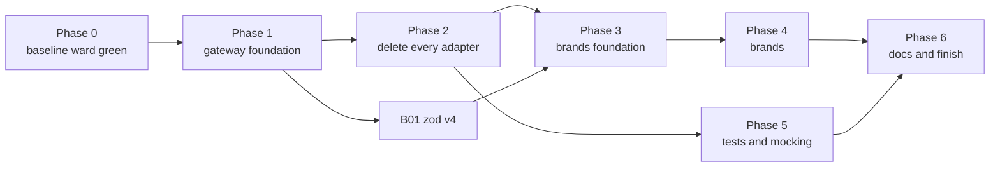

# Brands and gateways: the epic

This file is the operator's run sheet. It lists every work item, the order they run in, which can run
side by side, and what state each is in. Each item is its own file under `items/`. An operator hands an
agent one item's link plus `agent-brief.md`, and nothing else.

Two source docs feed this epic. Neither is edited by the epic; they stay as the record of why.

| Source | What it holds |
|---|---|
| `scrolls/gateway/followup-sustainability.md` | Open work on the four gateway packages under `packages/@gateway/`, and the deletion of every `adapters/` folder |
| `scrolls/brands-types-tests-rules.md` | The rules for brands, library types, returns, tests and mocking, and the lint rules that enforce them |

Every command runs from this worktree's root, `worktrees/gateway-pivot`, on the branch `gateway-pivot`.

## What this epic is trying to do

This epic bridges two large new systems into one. The gateway decides how code reaches anything outside
the repo. The brand rules decide how our own data is typed, checked and tested. The two docs were written
separately, and this epic is a best stab at linking them into one order of work.

The goals:

1. Every object contract, every object nested in it, and every string and number field in it is branded.
   Brand texts are derived, never chosen.
2. The gateway file structure is used as it stands: four packages, `#gateway/<kind>/<subpath>` imports,
   `{subpath}.ts` barrels, one folder per wrapper. The one change is the user's: there are no `_test_`
   barrels. A test imports each stub and proxy from its own file (brands doc C6), in the gateway and in
   workspace packages alike. Item G26 makes that change.
3. Everything works in a consumer repo that `dungeonmaster init` touched, not only here.

As items land, a build error, a type error or a Node, TypeScript or Jest disagreement may show that the
layout planned here does not work. When that happens, the operator tweaks the plan so the whole epic can
succeed. **Every such change is written into "Concessions" below**, with what the plan said, what we did
instead, and why. A concession nobody wrote down is a silent rewrite of the rules, and is not allowed.

Decide by clean architecture. When two designs both work, pick the one with fewer places to keep in step,
and the one that works unchanged in a consumer repo.

## How to operate — the user's standing instructions

1. **At most FIVE sub-agents at a time.** The user raised the cap from three to five this session.
2. **A heartbeat every 30 minutes.** Use `CronCreate` with `13,43 * * * *` (recurring). Do NOT use `/loop` or
   `ScheduleWakeup`; the user asked for cron. It fires only while the session is idle, and dies with the session.
3. **The operator owns builds and commits. A dispatched agent does neither.** Agents also never run `git add` or
   `git mv`: the git index is shared, and one agent's `git mv` was swept into another unit's commit this session.
   Before every commit, run `git diff --cached --stat` and stage explicit paths, never a whole package another
   agent is still editing.
4. **FIX EVERY PRE-EXISTING FAILURE YOU FIND.** The user's words: *"any pre-existing needs to be fixed... we're
   trying to get to a good state with this slew of changes."* A full `npm run ward` must exit 0. A failure an agent
   reports but leaves standing becomes a unit.
5. **Commit on the branch you are on, `gateway-pivot`.** The operator may branch off it when that helps,
   such as giving a large item or a group of agents its own worktree through
   `mcp__dungeonmaster__create-worktree`, so they stop sharing one git index. Every such branch merges
   back into `gateway-pivot` when its work is done, and the operator deletes it and its worktree after
   the merge. Nothing merges anywhere else. Agents still never create branches themselves.

More rules for the operator:

6. **The user gives no input until the epic is marked finished.** When an item is blocked, make a real
   effort to clear it: dispatch an agent to explore the Node, TypeScript, Jest or config disagreement
   behind it. If it still will not clear, mark it `blocked` in the status table with the reason, and move
   on to any item that does not depend on it. Never stop working because one item is stuck.
7. **Use sub-agents for everything that is not coordination:** planning an item's split, implementing,
   writing tests, fixing build errors, and exploring disagreements. The operator reads reports, builds,
   commits and updates this file.
8. **Hand each agent one item file and `agent-brief.md`.** When an item says "operator splits", the
   operator dispatches it as several agents, each given 1 to 3 files for cleanup work or 2 to 4 files for
   migration work, and names the files in the prompt. Use `model: "sonnet"` for large mechanical fan-outs.
9. **Two agents never edit the same package at once** unless the operator has named disjoint file lists
   for them. An item marked "runs alone" runs with no other agent editing its package.
10. **After each item lands:** the operator runs `npm run ward -- --uncommitted` until it exits 0, commits
    the item's paths, then sets the item's row below to `done` with the commit SHA. Build only when
    the `<dungeonmaster-buildDiscipline>` snippet's table, or repo `CLAUDE.md`'s build table, says the
    next thing to run needs compiled output.
11. **Update this file as you go.** Status, blockers and concessions live here, so a fresh session can
    pick up from this file alone.
12. **`create-worktree` branches from the main checkout's HEAD (`master`), not from `gateway-pivot`.** After carving one, run `git merge --ff-only gateway-pivot` inside it before anything else (the pre-bash hook blocks `git reset --hard`), then `npm run build:clean` there, because it arrives with no `dist`.
13. **Keep the consumer suite growing.** Once G27 lands, any item that changes what `init` writes, what a
    package publishes, or how a consumer resolves, loads or tests code adds its assertions to the
    consumer suite in the same item. Before committing such an item, the operator runs
    `npm run build:clean`, then `npm run check:consumer`. G27 lists the items known to need this.
14. **No item is dispatched without a plan that names its files.** Every remaining item's file under
    `items/` carries a `## Plan` section before any agent implements it. The section lists every file
    the item creates, edits or deletes, by full path, grouped into the agent-sized batches of rule 8.
    The operator sizes the job from that list: how many agents, how many waves, and which items can run
    side by side without two agents touching one file. The list is also each agent's complete scope.
    - Not "the adapters in `packages/server`". Write each path.
    - Not "and their callers". Name each caller.
    - Not "about 40 files". Give the list itself.

    An item with no named-file plan gets a planning agent first. That agent reads the code, writes the
    `## Plan` section into the item file, and changes nothing else. Only then is the item implemented.
    A file an implementing agent finds it must touch that is not on the list is reported back to the
    operator, who adds it to the plan before the agent proceeds. The agent never widens its own scope.
15. **No mutation checks** (user, 2026-09-28). Agents do not break code on purpose to prove a test goes red; the
    step is gone from `agent-brief.md`. Tests still assert real values.
16. **Scripts are allowed where they cut real work, and each one is recorded** in "Scripts used" below (user,
    2026-09-28). Their output is gated by ward like any other change.
17. **No Antigravity (`agy`) agents** (user, 2026-09-28 evening). Use Claude sub-agents only.
18. **Gate every commit yourself** with `lint,typecheck,unit,integration` on the touched packages plus every package
    that composes their proxies, and web's `e2e` whenever web runtime code changes.
19. **Update this file in the same commit as the work, every time something finishes** (user, 2026-09-28 night).
    Each commit that lands an item, a batch, a gateway unit or a fix also edits `EPIC.md`: the item's status row and
    SHA, the "In flight" section (what landed, what is active, what is next), any new concession, follow-up or
    gateway gap, and a Log line when a session ends. Not "at the next heartbeat", not "once a few batches are in".
    A fresh session must be able to pick up from this file alone at any moment, and a report that sits unrecorded
    until later is lost if the session dies.
20. **Never `rm` a file; move it out to `tmp/deletions/` instead** (user, 2026-09-29). Deleting a file (`rm`,
    `git rm`, `unlink`, a script's delete step) needs the user's approval, and a pending approval stalls the operator
    and every agent waiting on it. Moving a file does not. So:
    - First prove nothing imports the file any more (`discover` grep for its path and its exported names, across
      every package, tests and harnesses included). A file something still imports is not deletable yet.
    - Then move it with plain `mv` (never `git mv`: the index is shared) to
      `<repoRoot>/tmp/deletions/<wave-or-item>/<its original repo-relative path>`, creating the folders with
      `mkdir -p`. `tmp/` is gitignored and outside every package, so git records the file as deleted, ward never
      checks it, and the original path is kept for a restore.
    - Scripts that delete do the same: move, not `rm`. An agent lists every file it moved under DELETIONS in its
      report.
    - The operator commits the move like any other change. Emptying `tmp/deletions/` itself is optional
      housekeeping, done once at the end with the user's approval; nothing waits on it.
    - Not covered: temporary files a test or a script creates and removes under `tmp/` or the OS `/tmp`.

21. **Slow tests are tabled until Phase 6** (user, 2026-09-29 afternoon). The refactor runs many memory-heavy agents at once, so
    slow-file flags and load timeouts are expected. During Phases 3 to 5, a red that is only a slow-file flag or a
    timeout under load is re-run alone; if it passes alone, record the run ids in F106 and move on. Do not dispatch
    an agent to investigate or speed up a slow test before Phase 6. A test that fails alone is a real red and is fixed.

## START HERE — where the epic stands and what to do next

### Handoff (2026-09-29, evening) — READ THIS FIRST

**State.** Phase 2 is done. Phase 3 is done except the eslint-plugin share of wave 3.5 (L2 to L5) and R5. Phase 4's groundwork is done: 4.0 decisions, both indexes (R1, R6), and rules R2, R3, R4, R8, R9 registered (R2/R3/R4 tagged `pre-edit`, all off). Every script-development item is done, and every brand wave has a proven script. The filler lane is part-way: B17 and B18 done in most packages, T05 swept everywhere but three orchestrator hits.

**Last proof on this branch (HEAD after the T05 orchestrator commit 2f87a555e):** integration 1790700091564-feb3 226 of 226 (two slow-file flags, F106); web e2e 1790700266232-e240 131 of 131; `check:consumer` 174 of 174 and `check:published` green after wave 3.3 (bc5a82729). No full `npm run ward` has run since the P3-0 gate: run one first.

**Nothing is running and nothing is uncommitted in the main checkout.** One branch is open: `gp-l2-tsestree` in `worktrees/gateway-pivot/worktrees/gp-l2-tsestree` (see step 2).

#### What to do next, in order

| Step | What | Runs with |
|---|---|---|
| 1 (done) | `npm run build:clean`, then a full `npm run ward` (`timeout: 600000`, wait on it). Fix every red (rule 4). Expect slow-file flags only (F106). | alone |
| 2 (done, 62507f92d) | **Finish L2 in its worktree** (row L2): the `eslint-rule` copy to `TSESLint.RuleModule` (98 parse sites, about 525 references; `RuleModule` needs `defaultOptions`), move that copy out, then merge `gp-l2-tsestree` into gateway-pivot (`git merge`, from the main checkout), refresh the lockfile (`local-eslint` gained `@dungeonmaster/npm`), `build:clean`, gate eslint-plugin and local-eslint on all four checks, delete the worktree and branch. | alone for the merge; other packages' work may run beside the L2 agent |
| 3 | After the merge, in eslint-plugin: wave 3.4's 6 removals (`phase34-scripts/b15-as-never/RUN.md`), L3 for eslint-plugin (`l3-stub-swaps`: 14 `EslintRulesStub`, `EslintConfigStub` leftovers need `plugins` in `FlatConfigStub`), L5 (teaching text; also `packages/eslint-plugin/src/brokers/rule/CLAUDE.md`), then R5, F100, R7, and B17/B18's eslint-plugin batches. | one agent per package |
| 4 | Rest of L4: testing's `ts.*` rows and L3 blockers (`TimerHandle` retypes to `NodeJS.Timeout \| NodeJS.Immediate`), siegelense `zod-issue-error`, shared `process-signal`, the `node-builtin` swap to `builtinModules`, root `@types/@typescript-eslint__parser`. | beside step 3 |
| 5 | Filler lane rest: B18's orchestrator + hydration-recipes + server + mcp wave (`orch-4`, `server-1`, `mcp-1` together), hooks, siegelense, then `adapter-result` moves out; B17's orchestrator, hooks, server batches, then its rule batches (R1a/R1b/R2a-c); T05's last three orchestrator hits (two `start-orchestrator.proxy.ts` constructor defaults server relies on; the rule does not see `#gateway/node/process`'s `stderr` alias), then switch T05's three rules on. | disjoint packages side by side |
| 6 | Phase 3 close: full ward, `build:clean`, `check:consumer`, `check:published`. Then Phase 4 waves W1 to W10 per "4.2 Brand waves", each with its SD script (W1 `feasibility/b15/codemod.cjs`, W3/W4 `b15-id-brands`, W5 `b15-value-brands`, W6 `b12-object-brand-fallout`, W7 `b14-shape-contracts`, W8 `b15-unknown-fields`, W9 `b15-dead-reparse`) and 4.0's tables in `items/b15-*.md`, `items/b11-*.md`, `items/b14-*.md`. | one wave at a time |
| 6b | Rules waiting for switch-on, each after its scan reads 0: R1 `require-contract-parse` (135 unparsed contracts at last count, a hand queue after 4.0 item 4's carrier-contract decision), T05's three rules (after step 5), and at W10 R2, R4, R7, R8, R9. | as each clears |
| 7 | B16, Phase 5 (T06, T08, T09; F63's Jest bump needs a quiet `npm install`), Phase 6. | |

**How this session ran waves (keep doing it):** a runner agent applies a script package by package, gates each, and writes `tmp/<wave>-commits/<NN>-<pkg>.txt`; the operator commits one list per package, checks each list is non-empty first, and builds any package whose barrel or export key moved before the next gate. Rule F: integration and web e2e once per wave.

**Status words:** `partial (no agent running)` means some packages or steps landed and the Notes say what is left; nothing is `active` at handoff. F56 and F57 were marked active by an earlier session and never re-checked: audit them before relying on them.

**Disk:** 74G free at handoff. `/tmp/dm-consumer-check-local-*` holds about 6G of consumer dirs `check:consumer` kept after failed runs; the user said to leave them for now.

**Open decisions for the next operator:** the two `start-orchestrator.proxy.ts` constructor defaults (T05); whether SD1's dead-condition pass should stop stripping `parent === null` (L2 found it live at runtime); `testing`'s `mockArgValueMatchTransformer` has no cycle guard, so a proxy addressing a call by a real AST node overflows the stack (L2 worked around it in eslint-plugin).

### Session 2026-09-29 afternoon — in flight

- Step 1 done: `build:clean`, full ward 1790704851764-b386 green on all five checks (no slow-file flags).
- Step 2 done: L2 merged (62507f92d).
- Plans written: T06 (`items/t06-*.md` "## Plan", 15 agents in 3 waves) and L4 rest (`items/b05-*.md` "## Plan — L4 rest and L3 leftovers", 14 batches; hooks, server and mcp L3 leftovers were already done).

### Quiet window planned (16:25)

No new dispatch until the running agents drain (R7 a-e, T06 E1, F100 shared, R1-orch-h). Then, with nothing else running: `build:clean`, full `npm run ward`, `check:consumer` and `check:published` (hooks install parses settings now; shared and testing APIs changed); then testing's quiet wave (K-test-1, K-test-2, R1-testing-a to -c); then R5's switch-on (`outsideTypeCasts` on after a full scan), R7-f/g, F100's eslint-plugin batches.

### Lessons worth keeping

- **Gate composers.** A change to one package's proxies is gated with a unit run of every package that composes
  them, not just its own. A shared proxy change once broke 22 config and 25 siegelense tests this way.
- **Always gate `integration` too.** Only siegelense's flow integration tests caught PNG screenshots being read
  through the UTF-8 `readFile`; unit tests with staged strings passed.
- **Gate every agent's work yourself on all four checks.** Agents sometimes skip typecheck; one R1 chunk left 7
  type errors that its own report did not mention.
- **Two agents in one package need disjoint file lists**, and their work commits together when their files
  interleave, because a package-wide typecheck sees the other agent's half-edited files.
- **Tests that read the real tree** (shared's project-map test) break when the tree changes; re-anchor them in the
  chunk that deletes their anchor, and keep them fast (a real-repo census test took 6 to 30 seconds).
- **Chunks feeding the proxy-mock hoister are slow** (18 to 28 minutes per adapter); keep them to one or two items.
- **At one hour, send a sonnet status check** (it reads the tail of the transcript); stop an agent at a green point
  rather than let it run on.
- **Scan every diff** for `as never`, `as unknown as`, `calledWith([])`, `onceFor([])`, accept-all staging
  predicates, raw `'fs'`/`'path'`/`'os'`/`'process'` imports, and real `process.cwd()` or `homedir()` in tests.
- **An eslint-plugin rule edit is live for every agent's lint at once**; keep rule edits correct before saving.
- **A gateway export read at module load can open a handle.** `export const { stdin } = process` opened stdin in
  every test importing the barrel. Export a call-time function instead.
- **A recorded failure must not do real I/O at a caller's test time.** A stub that opens a socket to record a
  refusal trips the I/O trap in every composing package; hold the recorded error as data, checked by the gateway's
  own test against a real one.
- **The A18 lint rules are off, so lint does not catch a missed raw import** (a web agent skipped
  `react-router-dom`). Check each report's file list against the plan's reason for listing it.
- **Script first, then census the gaps, then queue the hand work.** A18's last session went from 745 files to 0 this
  way: a TypeScript-checked codemod (`tmp/a18-codemod/run.cjs`) cleared about three quarters, and a read-only gap
  census built every missing gateway method before any hand batch started.
- **A stub in a production barrel reaches the browser bundle.** Shared's contracts barrel re-exports stubs, so a
  stub importing `#gateway/node/*` broke web's `vite build`. Web's e2e is the only check that builds the bundle;
  run it after any shared change.
- **A new gateway proxy makes every older proxy of that function's callers red.** `enforce-proxy-child-creation`
  demands the child proxy once it exists (the `setTimeout`, `setInterval` and `CpNotInstalledError` cases). After
  adding a gateway proxy, lint every package that imports the function.
- **Two agents' edits to one package commit together**, and a "restore to HEAD" (`git show HEAD:<path> > <path>`)
  by one agent wipes another's uncommitted work. Brief agents never to restore a file that way.
- **Gate a whole folder, and read the exit code, not a piped `tail`.** Two agents each added a layer broker to one rule folder and gated only their own files; the rule broker's `.proxy.ts` then failed `enforce-proxy-child-creation`, and an operator lint piped through `tail` hid the red and committed it (60958a2f8, fixed after).
- **A 3.3-S1 step on a package ward loads breaks ward for everyone until that package is built.** Shared's S1 moved its barrels to `src/<ft>/<ft>.ts`; ward's binary loads `@dungeonmaster/shared/contracts` from `dist`, which had no file at the new path, so every ward run died with `MODULE_NOT_FOUND`. Build the package right after its S1 apply, before any gate.
- **Never pass a possibly-empty path list to `git add -A --`.** With no paths it stages the whole tree. An operator script did this with an empty commit list and committed a running agent's half-finished files (2c71f98f3, relabelled rather than rewritten, since the hook blocks `git reset` on a shared checkout). Check the list is non-empty first.
- **A contract whose type changes needs its whole package linted.** L4-P1 made ward's `signal` a string type and gated only the four files it edited; two callers' `String(signal)` then failed `no-unnecessary-type-conversion`, found only by a later full lint.
- **Watch the disk.** Jest's `/tmp/jest_rt` cache and leaked consumer-check prefixes filled the 458G disk mid-wave; every agent then failed with ENOSPC. `df -h /` at each heartbeat.
- **Stopping `build:clean` part-way deletes every `dist`**, and lint then fails for every agent (eslint loads
  `shared` from `dist`). Let it finish, or run `npm run build` at once.

## Converting the next repo

One other repo needs the same adapter-to-gateway and brand pivot. It is a consumer: it gets every lint rule this epic ships and everything `dungeonmaster init` scaffolds, so it does not rebuild the tooling. It does have to move its own code. This is the operator's plan for that run. Everything in "How to operate" and the handoff's lessons applies there too.

### What the consumer gets for free, and what it must do itself

| Comes from dungeonmaster | The consumer's operator does |
|---|---|
| The lint rules (gateway rules, `ban-workspace-export-mocks`, `ban-proxy-catch-all-defaults`, `ban-invented-failures`, `ban-proxy-empty-called-with`, and the rest), tagged `pre-edit` and off until switched on | Move its own callers so the rules can be switched on |
| `init` scaffolding: `packages/@gateway/{node,browser}` with real source, empty `packages/@gateway/{npm,bin}`, the `#gateway/*` imports map, node16 tsconfig, per-package jest configs, the I/O trap | Write its own `npm` and `bin` wrappers (the `<dungeonmaster-consumerGatewayWrapper>` snippet says how) |
| The `testing` package: `registerMock`, the proxy-mock hoister, stubs | Replace its own `jest.mock` and adapter proxies with gateway proxies |
| The recipes and traps in `items/a12-adapters-shared.md` | Follow them |

This epic's items that build tooling (the G items that write rules and scaffolding, T01, T02, T04, T05's rule-writing half, F2 to F20's tooling fixes) do not repeat there. Its items that move code (A, B, and T05's fix sweeps) do, in the consumer's own packages.

### Execution plan

1. **Precheck.** The repo must be an npm-workspaces monorepo with packages under `packages/*`. Upgrade `dungeonmaster` to a release carrying this epic, run `dungeonmaster init`, and commit what it writes. Record a baseline full `ward` and keep it: it is the "was it already red" answer later.
2. **Plan with planner agents, read-only, before any edit.** One planner per few packages writes a census like A12's "Phase 2 census": every import of an npm package, a Node builtin and a program (`child_process` calls) per package, every `adapters/` folder, every `jest.mock` and `as never` or `as unknown as`, and what each outside call maps to. Its output is a split into small groups (2 to 6 caller files each) with a dependency order, including which proxies compose which (see the O10 lesson). The operator turns that into an EPIC.md-style status table in the consumer's own `scrolls/`.
3. **Wrappers first.** One small group per outside dependency writes the consumer's `packages/@gateway/npm/src/<package>/` or `packages/@gateway/bin/src/<program>/` folder: wrapper, `.proxy.ts`, `.stub.ts`, with read-back and exact staging in the proxy from the start (so the F25, F29 and F34 gaps never appear). Build the gateway packages after each group lands; other packages typecheck against their compiled output.
   - Every proxy whose wrapper takes an argument ships a `getCallsFor` read-back returning each call's full argument tuple in call order. Here the missing read-back stopped callers one proxy at a time (F43, F44, F46, F55) until F57 swept the whole of `@gateway/node`.
   - A wrapper that spawns a program stages by command, args and cwd (`runProxy`, `streamLinesProxy` since F51), so two calls to one binary can be told apart.
   - A wrapper that wraps another wrapper (every `@gateway/bin` program) stages through the inner wrapper's proxy (`runProxy`), never by mocking the inner function (A03: the two levels cannot share a test).
   - A write-side proxy offers predicate staging for a path minted at run time (a fresh uuid folder), so no caller has to mock the wrapper directly (F52).
   - A browser `fetch` wrapper stages through MSW endpoint handlers, not a spy on `globalThis.fetch`, or it breaks every MSW-staged caller in the same test file (F56).
4. **Move callers, package by package, in small groups.** Same recipe as A12: gateway call in the code, gateway proxy composed and staged by exact argument tuple in the `.proxy.ts`, mutations proving each migrated line. After each group, run the whole unit suite of every package that composes a changed proxy. Scan every diff for the banned shapes listed in the handoff.
   - Never mock a gateway wrapper that has a real body (`run`, `streamLines`, `ensureDir`, a bin wrapper) with `registerMock({ fn })`. It replaces the wrapper for the whole test file and breaks every other composed proxy that needs its body (the A12 item's `### G-V` Trap sections). If the gateway proxy cannot say what a caller needs, the agent stops and the gateway proxy gains it.
   - Import a gateway function only from its barrel (`#gateway/node/fs__promises`); import its proxy or stub from its own file. `#gateway/node/fs__promises/read-file/read-file` does not resolve (G-O).
   - A `.filter((x): x is OurType => ...)` becomes a plain `.filter((x) => x !== null)`: TypeScript 5.8 infers the narrowing, and `ban-contract-type-predicates` refuses the hand-written form (B17).
   - Deleting a package's adapters can change how dungeonmaster classifies it: package-type detection read "HTTP backend" from an adapter folder until the wrap-up added a flow-content check. After deleting a backend package's adapters, run `get-project-map` and confirm the package's type; F58 (the edge-graph grouping) is still open.
5. **Delete the consumer's adapters** once a census shows no caller left (the equivalent of A03 to A17 and A12's phase 3).
6. **Brands.** Follow this epic's B items as they close here (B01 zod v4 first; then B02 onward once A19 lands here). Their item files describe the rules and the order; re-plan them against the consumer's own contracts with a planner agent.
7. **Switch the rules on.** Turn each `pre-edit` rule from off to error one at a time, run its scan, and send the reds out in small fix groups (this epic's T04 and T05 sweeps are the pattern). A rule switched on at `error` must scan clean first; a scan that finds violations registers the rule `off` and lists them (B06 and B17-1 both found violations their planners missed).
8. **Prove it.** A full `ward` green, and the consumer's own e2e run (the browser is the verdict, per CLAUDE.md).

### Operating rules carried over

- At most five sub-agents, small chunks, and any sub-agent past one hour gets checked through a sonnet sub-agent and split or redirected.
- Planner agents before dispatch, again whenever the table and the code disagree.
- Stage only an agent's own files; commit only on ward's exit code; the operator owns builds and commits.
- A migration that removes a catch-all breaks every proxy that leaned on it: give composing proxies to the same agent.
- Agents never dispatch sub-agents of their own, and never fork. A fork carries its parent's whole task and redoes it beside the parent (F54 measured it; this repo's `CLAUDE.md` "Dispatching Sub-Agents" has the numbers). A consumer's `CLAUDE.md` does not carry that section, so every dispatch prompt says it.
- Use Claude sub-agents only; Antigravity (`agy`) is not used (user, 2026-09-28).
- A verification worktree carved by `create-worktree` comes from the main checkout's HEAD; if the consumer's working branch has moved past it (new dependencies), build and `check`-type runs happen in the working checkout at a quiet point instead.

## Scripts used

Each row is a script used for bulk edits or census. Output is always gated by ward before commit.

| Script | What it does | Where | Used by |
|---|---|---|---|
| `tmp/t05-scan-pkgs.js <pkg>` | Runs the three T05 rules (off in the shared config) on one package through `tmp/t05-ward.config.js`; prints counts, writes hits to `tmp/t05-scan-out.txt`. Scan one package at a time (several at once runs out of memory). | `tmp/` (gitignored) | T05 sweeps 46c51491c to f5975a007 |
| `tmp/t04-scan.config.js` | ESLint config that switches `ban-workspace-export-mocks` on; run as `node_modules/.bin/eslint -c tmp/t04-scan.config.js -f json -o <out> <paths>` | `tmp/` | T04 82713ea0c to 0bd6040d1 |
| python import-path rewrites | One-off `python3` rewrites of import lines (rule-tester harness, testing-library, mantine render paths), output checked by the agent and gated by ward | agents' scratch | 235a64368, cdd59573b, 2d7f1d25f, f7eabaf73 |
| `adapter-census` | Census of remaining adapters per package (published command) | `@dungeonmaster/tooling` | S1 4130e9c6f |
| `tmp/a18-zod/rewrite.py <pkg> [apply]` | A18 -Z sweep: re-censuses a package's files whose only raw import is `zod` and rewrites `from 'zod'` to `from '#gateway/npm/zod'` (dry run without `apply`; skips files with any other raw import) | `tmp/a18-zod/` (gitignored) | A18 -Z wave 1 (cli, config, hooks, hydration, mcp, session-forensics, tooling); wave 2 bd5242af3 |
| `tmp/a18-codemod/run.cjs <pkg> [--apply] [--files a,b]` | A18 codemod: re-censuses the package, swaps raw imports and same-named globals onto `#gateway/*` exports checked against the gateway barrel by the TypeScript checker, rewrites read-only `process.X`, skips any construct a test or proxy mocks raw, and verifies each file by typecheck and full lint before and after | `tmp/a18-codemod/` (gitignored) | A18 codemod trial (91c4b3b4b) and package runs |
| `tmp/phase34/*` (nine scripts; `tmp/phase34/README.md` holds run order, dry-run counts and proofs) | Phase 3 and 4 codemods, written before those phases on the user's request. Each re-censuses on every run, writes only with `apply`, and resolves through TypeScript fenced to this worktree (`lib/repo.cjs`). `b02-contract-index/{index,delete}.cjs` (index; deletes only contracts a fresh index still calls dead, from a reviewed list), `b03-exports-barrels/run.cjs` (three-key `exports`, barrels into `src/<ft>/<ft>.ts`), `b03-per-file-imports/rewrite.cjs` (stub and proxy imports to per-file specifiers: 1,670 files, 4,090 names on 2026-09-28), `b03-strip-barrels/run.cjs`, `b11-contract-merge/{census,move}.cjs`, `b15-as-never/run.cjs` (removes a stub-field `as never` only where typecheck stays identical: 2,970 of 3,717), `b15-stub-unwrap/run.cjs`, `b15-rename/rename.cjs` (language-service renames). Re-measured 2026-09-29: see the next row. | `tmp/phase34/`; committed copy in `scrolls/brands-gateways-epic/phase34-scripts/` | not yet run |
| `phase34-scripts/sd1-retype-residue/pipeline.cjs [--work=d] [--narrow]` | SD1 residue pipeline for L2: retype, guard narrowing, dead-condition strip, stub printer v2, test conversion, malformed-test list, leftovers. Copy to `tmp/phase34/` first. | `scrolls/brands-gateways-epic/phase34-scripts/sd1-retype-residue/` | SD1 dry runs on copies (2026-09-29); L2 applies it |
| `phase34-scripts/{feasibility,brand-census,libcopy-census}/` | Prototypes and censuses for the Phase 3 and 4 re-plan: B04 retype and `TsestreeStub` printer (48% of files clean, 76% of stub roots printed), B13 retype, B14 shape-to-contract generator (125 of 204 clean), B17 and B18(b) rewrites, the B15 plain-brand codemod and dead re-parse finder; the brand census (`standalone-brands.csv` and friends); the library-copy census and `stub-map.json`. `lib/repo.cjs` now resolves overlay files not yet on disk. Proven on copies only; no unit test was run. | committed in `scrolls/brands-gateways-epic/phase34-scripts/` | not yet run; the plan names which chunk promotes each |

## Machine-wide side effects

**`npm link --workspaces` in this worktree moves every global `@dungeonmaster/*` link onto it**, for every repo on
the machine. Before running `CLAUDE.md`'s "Regenerating `.claude/settings.json` Here" steps from this worktree, tell
the user, or run `npm link --workspaces` from the main checkout afterwards. Regenerate settings with this checkout's
own `node packages/cli/dist/bin/dungeonmaster.js init` instead. Ward and tests never need the global links.

## Antigravity (`agy`) agents

Not used from 2026-09-28 evening, by the user's decision. Their launchers and prompts are still under `tmp/agy/`,
and git history holds what was learned about driving them. The main lesson carries over to any agent: review and
gate the diff yourself, because a report can be accurate about what it changed and still miss a real defect.

## Concessions

Each row is a place where this epic departs from a source doc. The first rows were decided while the epic
was planned. Add a row whenever execution forces another.

| # | Source doc said | We do instead | Why |
|---|---|---|---|
| 1 | Gateway follow-ups, "Gateway standards as built" and item 45: every package has a `./_test_/*` export and a `<subpath>.proxy.ts` test barrel, and callers import `#gateway/<kind>/_test_/<subpath>`. | The brands doc wins (C6), by the user's decision on 2026-09-26: no `_test_` barrel and no `_test_` import path anywhere. A test imports each stub and proxy from its own file: `#gateway/node/fs__promises/read-file-if-exists/read-file-if-exists.proxy`, or `@dungeonmaster/orchestrator/startup/start-orchestrator.proxy`. Each package's `exports` holds three keys: `"./*.proxy": "./src/*.proxy.ts"`, `"./*.stub": "./src/*.stub.ts"` and the barrel key `"./*": "./src/*/*.ts"`, each with the usual conditions. G26 makes the change in the gateway; B03 makes it in workspace packages. | No barrel of test support to keep current. A probe on 2026-09-26 showed Node and TypeScript (`node16`, `source` condition) resolve all three key forms from one package: a more specific pattern key beats `./*`. Jest's resolver and the proxy-mock hoister are not proven yet; G26 proves them first. |
| 2 | Brands doc T6 builds each workspace package's own proxy in step 10, near the end. | Orchestrator's own proxy (`startOrchestratorProxy`) is built in Phase 2, item A00, before the forwarder adapters are deleted. The lint rule `ban-workspace-export-mocks` still lands in Phase 5. | Server and mcp have 65 adapters that only forward into orchestrator. Deleting them leaves their callers' tests nothing to mock except orchestrator's exports, which T6 forbids. The proxy has to exist first. |
| 3 | Gateway follow-up item 45 (every workspace package's `exports`) and brands doc C6 (stubs and proxies out of production barrels, imported per file) are two separate pieces of work. | One item, B03, does both, using row 1's three-key `exports` form. | They move the same barrels and rewrite the same import lines. Two passes would touch every file twice. |
| 4 | Gateway follow-up item 25 is one item. | Split three ways: G16 (the colocation rule, recorded-failure stubs and Node library stubs), G17 (AST, rule-context and TypeScript stubs), G18 (a stub for every remaining subpath). | Each part is a different kind of work, and G17 alone is large. |
| 5 | Gateway follow-ups, "Gateway standards as built": each gateway's `exports` targets carry the conditions `gateway-dist`, `source`, `import`, `require` and `types`. | Each gateway also carries a `<kind>-own-source` condition first (`npm-own-source`, `node-own-source` and so on), and only that gateway's own `tsconfig.build.json` activates it. `init`'s gateway scaffold writes it too. Commit 9bf4bf74d. | A gateway's build reached itself through `testing` and `shared` (for example `#gateway/npm/zod`), resolved that to its own `dist` under `gateway-dist`, and then failed every warm build with TS5055. TypeScript's conditions are active for the whole program, so no shared condition can tell a self-reference from a cross-gateway one; `paths` cannot express the folder-named layout (TS5062). |
| 6 | `scrolls/adapters-to-one-place.md` direction 8, and item A02: workspace packages call each other directly, with no wrapper. The folder config lets `responders/` import no other workspace package. | `responders/` may import `@dungeonmaster/orchestrator` directly, as `brokers/`, `contracts/` and `bindings/` already may. | Every caller of a forwarder adapter in `server` and `mcp` is a responder. Once the adapters go (A02, then A19 removes the folder type), a responder has no other legal way to reach `orchestrator`. Calling a lower-level orchestrator broker instead would skip the orchestrator responder's own logic; `guild remove`'s process cleanup is the proven case. |
| 7 | G22 item: every bare `jest.*` call in production test support goes through `#gateway/npm/jest__globals`. | A `registerModuleMock` factory keeps the bare `jest.requireActual` (and `jest.fn`) global. Four orchestrator proxies did this; F35 (63d807fa7) removed it from `quest-route-scope`, `quest-run-step` and `step-handler-riftcarver`, and a10-fs3 from `quest-node-dispatch-loop`. None remain, so the concession is historical once a10-fs3 commits. | The proxy-mock hoister re-parses the factory as standalone text and prepends it above every import in the file that loads the proxy. An imported wrapper is not initialised there; the trial failed with `ReferenceError: gatewayRequireActual is not defined`. Only a Jest-injected global survives the hoist. |
| 8 | Concession 1: a package's test support is imported per file through `"./*.proxy"`, `"./*.stub"` export keys. | eslint-plugin's rule-tester harness is exported under one explicit key, `"./rule-tester.harness"`, with only a `source` condition, pointing at `test/harnesses/rule-tester/rule-tester.harness.ts`. | `local-eslint`'s rule tests need the harness, and `test/**` is outside the build and `files`, so no `dist` target exists. Ward's Jest and tsc set `source`. Commit 235a64368. Check that `check:published` accepts a source-only key at the next build. |
| 9 | Folder types hold all code; external package imports go through `#gateway/*` and are refused in `widgets/`, `startup/`, `responders/`, and `assets/` may not import npm packages. | Web's global stylesheet imports (`@mantine/core/styles.css`, `@mantine/notifications/styles.css`, `@xyflow/react/dist/style.css`) live in `packages/web/src/main.ts`, the Vite entry `index.html` loads. | CSS side-effect imports are not code a gateway can wrap, and no folder type allows them; the Vite entry is the one file outside the folder types that the bundler loads first. F71, commit pending with W-LAST. |
| 10 | T05: no accept-all staging predicate (`() => true`, `typeof value === 'string'`) on a path argument. | A proxy's opt-in `setupImplementation` (a test-supplied function that answers per path, for a virtual file tree) may address `[anyPath]` where `anyPath` accepts any string. Exact `setupReturns`/`setupError` stages still outrank it, and no proxy stages it by default. Shared's architecture proxies (the T05 shared commit) and F32's `imports-in-folder-type-find` do this. | Staging the full `[path, 'utf8']` arity ties with exact addresses and the later staging wins, which broke 10 tests. The one-argument address keeps exact stages winning. A test opts in by calling `setupImplementation`, so nothing is answered silently. |
| 11 | EPIC rule 8: 2 to 4 files per migration agent. | A18's `-Z` lists (files whose only change is `'zod'` becoming `'#gateway/npm/zod'`) run as one scripted agent per package: a `python3` substitution, then that package's lint, typecheck and unit. Each script is listed in "Scripts used". | A one-token edit per file; splitting into fours makes hundreds of agents. The user allowed scripts that cut work, provided they are notated (2026-09-28). |
| 12 | Hydration's negative type-fixture tests compile a standalone TypeScript program with `Node10` module resolution. | `packages/hydration/test/type-fixtures/typescript-program-diagnostics.ts` uses `Bundler` resolution with `customConditions: ['source']` and `module: ESNext`. | `Node10` ignores `package.json` `imports`, so `#gateway/npm/zod` resolved to nothing and the fixtures saw `any` (about 25 failures); `Bundler` alone resolved `@dungeonmaster/hydration-recipes` to `dist`. A18's zod sweep. |
| 13 | T05: `ban-invented-failures` applies to every test and proxy file. | When T05 switches the rule on, the eslint config turns it off for `packages/testing/src/transformers/mock-staging-create/mock-staging-create-transformer.test.ts` alone, by a file-scoped config entry, not an inline disable. | That file tests the mock-staging API itself: its `new Error(...)` is an opaque value the test checks is passed through, not a faked outside failure. The rule matches any `new Error` under a `rejects`/`throws`/`implement` call and reads no message or `code`, so no rewrite of the test clears it (T05 testing agent, 2026-09-28). |
| 24 | T08: a catch-everything implementation narrows to the error code it expects, and its test stages a recorded failure. | `eslint-is-path-ignored-broker.ts` keeps its catch, and its test stages ESLint's own code-less "outside of base path" error. Concession 13 also covers the three testing tests T08 lists as mock-API pass-through keeps. | ESLint's `isPathIgnored` throws a plain `Error` with no `code` for a path outside its base; there is nothing to narrow on and no recorded failure to stage (T08 planner, 2026-09-29). |
| 14 | A18: every raw platform global goes through the gateway. | `packages/testing/src/brokers/timers/watch/timers-watch-broker.ts` (testing's open-handle timer watcher) keeps patching the raw global timers; the eslint config turns `platform-globals-ban` off for that file alone, by a file-scoped config entry, when A19 switches the rule on. | Its job is to replace the global timers so it can see every handle a test opens. No gateway export can patch a global for every caller (A18 gap census, 2026-09-28). |
| 15 | Concession 10 allows an accept-any-path address only for an opt-in `setupImplementation`. | `@gateway/node`'s `readFileProxy` gains `returnsOnceFallback`/`throwsOnceFallback`, one-shots addressed by the path alone, and orchestrator's `quest-load-broker.proxy.ts` stages them with an any-string predicate. Every exact `[path, 'utf8']` stage outranks them. | quest-load's path-less one-shot queue is composed by about 30 proxies that pass no path; the full-arity one-shot tied with exact stages and answered other files' reads (88 failures). A lower-ranked fallback keeps one place to change instead of 30 (A18 orchestrator gap agent, 2026-09-28). |
| 16 | EPIC rule 18: gate every commit with `lint,typecheck,unit,integration`. | Phases 3 and 4 use rule F in the Phase 3 and 4 plan ("The order of work"): each batch is gated and committed on `lint,typecheck,unit`; `integration` runs once at the end of each wave, then `e2e`, and their reds are fixed before the next wave. | The user's decision on 2026-09-29: cycles are faster. One commit per batch keeps an integration red bisectable. |
| 17 | B04 and B05 are two items, covering nine named library-type copies. | One wave, 3.5 (chunks L0 to L5), covering all 33 copies the 2026-09-28 census found, with a stub-swap table (`phase34-scripts/libcopy-census/stub-map.json`). | 24 copies were missing from the items; the swaps share one mechanism and one set of gateway stubs. |
| 19 | A18: every npm package is reached through a `#gateway/npm/<subpath>` that re-exports its values. | `#gateway/npm/vite` is type-only: `export type * from 'vite' with { 'resolution-mode': 'import' }`. Web's `vite.config.ts` writes `satisfies UserConfig` instead of calling `defineConfig`. `vite` sits in `@gateway/npm`'s `dependencies`. | The gateway compiles as CommonJS, and plain `vite` resolves there to its `export = any` CJS entry, so a value re-export loses every type. `defineConfig` is an identity function; `satisfies` gives the same check with no runtime import (GNPM-vite, A18). |
| 20 | A19: `raw-import-ban` refuses every outside npm package; a consumer reaches each one through its own `#gateway/npm/<subpath>` wrapper. | `raw-import-ban` lets any `@dungeonmaster/*` import through in every repo (`isDungeonmasterToolkitImportGuard`), except the four gateway packages (`@dungeonmaster/node/fs` is still refused). | In a consumer, `@dungeonmaster/shared` and `@dungeonmaster/testing` are the toolkit its scaffolds import directly, and the proxy-mock hoister recognises the literal specifier `@dungeonmaster/testing/register-mock`, so a consumer wrapper would break mocking. A wrapper per toolkit subpath, seeded by `init`, is the alternative; it adds places to keep in step for no safety (F81, 2026-09-29). |
| 21 | Brands doc and G25: a consumer's tests report type errors like its `tsc` does. | `packages/testing/ts-jest/published-options.js` keeps `diagnostics: false`; a consumer sees type errors from `tsc` and ward's typecheck, not from Jest. | ts-jest 29.4.0 outside `isolatedModules` rewrites every file's options to `commonjs`/`node10`, which ignores `package.json` `imports`, so every `#gateway/*` import fails TS2307 with diagnostics on; inside `isolatedModules` it reports no type errors at all (F10, 2026-09-29). |
| 22 | Concession 1: each package's barrel key is the pattern `"./*": "./src/*/*.ts"`. | One explicit `exports` key per folder-type barrel the package has (`"./contracts": "./src/contracts/contracts.ts"`, `"./brokers"`, ...), each with the usual conditions. The single-star `./*.proxy` and `./*.stub` keys stay. | TypeScript generates an import specifier from an `exports` pattern by splitting the target at the first `*` only (`tryGetModuleNameFromExportsOrImports`, `typescript.js:50258-50284`), so a two-star target never matches and declaration emit falls back to a `node_modules/...` path: TS2742 in eleven `hydration-recipes` brokers after hydration's 3.3-S1. Proven by minimal repros and real-package copies under `tmp/ts2742/` (explicit keys 0 errors, two-star 11) and by hydration-recipes typecheck 1790688511642-87b6. Shared's importers passed only because each one also imports the barrel textually. (A first hand test read an out-of-date log and was briefly withdrawn.) |
| 23 | Item B03 (3.3-R): extend `enforce-import-dependencies` to refuse stub and proxy imports outside test support; decision (b): the caller-facing proxy lives at `src/startup/start-<pkg>.proxy.ts` beside a startup entry. | A new rule, `ban-test-support-in-production` (pre-edit), refuses `.stub`/`.proxy` imports and `...Stub`/`...Proxy` names from workspace or relative modules in any non-test-support file, production barrels included; `packages/testing/src/index.ts` has a file-scoped `off` (testing publishes its stubs, decision (c)). `enforce-project-structure` accepts a re-export-only `src/startup/start-<pkg>.ts` as a caller-proxy anchor (config's `start-config.ts` re-exports `configResolveBroker`). | A check added inside an already-`error` rule goes live for every agent at once and cannot land off and be scanned first. A real `StartConfig` entry would need a flow and responder nothing calls. (3.3-R part a, 2026-09-29.) |
| 18 | EPIC rule 5: agents share one checkout. | Chunk L2 runs in its own worktree and branch, merged back when eslint-plugin and local-eslint are green. | `eslint.config.js` loads the rules from eslint-plugin's source, and L2's script leaves 226 type errors before the hand queue fixes them; in the shared checkout that breaks lint for every agent. |

## Status key

| Status | Meaning |
|---|---|
| `todo` | Not started |
| `ready` | Every dependency is `done`, so it can be dispatched now |
| `active` | An agent is working on it; the Notes column names the agent |
| `review` | The agent reported; the operator is checking ward and the diff |
| `done` | Committed; the Notes column holds the SHA |
| `blocked` | Tried and stuck; the Notes column says why and what was tried |

## The order of work

Phases run roughly in order, but an item may start as soon as every item in its "Needs" column is
`done`. Items in the same phase with no link between them run side by side, up to five at once.



Phase 0 must finish before an item's own ward run means anything, but Phase 1 items that touch only
tooling may start while Phase 0's fixes are in flight.

Each item that adds or changes a lint rule also: tags it `'pre-edit'` in
`packages/shared/src/statics/dungeonmaster-rule-enforce-on-statics.ts` only when the item file says it can
run pre-edit; updates the teaching text rows the item file names; and runs the rule as a scan over the
whole repo before switching it on, hand-checking a sample of what it flags and what it lets through.

### Phase 0 — a green baseline

| ID | Item | Needs | Runs with | Status | Notes |
|---|---|---|---|---|---|
| P0-1 | [Full `npm run ward` exits 0, including the slow `cli` install test](items/p0-1-baseline-ward.md) | — | any Phase 1 item outside the failing packages | done | Full ward on `a72edb985` exited 0 (run `1790490064405-d32d`, 783s). The `cli` slow-test gate did not trip on that run; Z07 rechecks it. |

### Phase 1 — gateway foundation

Mostly tooling and the gateway packages themselves. Most items here are independent.

| ID | Item | Needs | Runs with | Status | Notes |
|---|---|---|---|---|---|
| G01 | [One list of gateway folder names](items/g01-gateway-folder-names-one-list.md) | — | any | done | 090d01fdd. It also removed a sixth hand-typed copy in `packageScaffoldConfigStatics`; `create-package` now calls `gatewayImportsFieldTransformer`. |
| G02 | [Build order ignores `devDependencies`](items/g02-build-order-ignores-dev-deps.md) | — | any | done | b8132dee1. Ward has no check type for root `scripts/`, so none ran. The build proof rides on the next operator build. |
| G03 | [Publish `@dungeonmaster/testing` publicly](items/g03-publish-testing-public.md) | — | any | done | b09a13acc. Found: the published `jest-config-base.js` wires only `jest.setup.js`, so a consumer gets no sandboxed `HOME`. That gap is T07's job. |
| G04 | [Delete the hand-written MCP SDK types](items/g04-delete-hand-written-mcp-sdk-types.md) | — | any | done | b6b79b1f4. The real SDK types mark the bare `Server` constructor deprecated, so the server is now built as `new McpServer(...).server` through a new subpath, `#gateway/npm/modelcontextprotocol__sdk__server__mcp`. G18 must stub that subpath. |
| G05 | [Error classes live in `.error.ts` files](items/g05-error-classes-in-error-files.md) | — | any outside `@gateway/bin`, `@gateway/node` | done | a44b74c6f; bin and node rebuilt. Error classes live in `<name>.error.ts` beside their wrapper, and `lsof` gains `lsofRun`. A flake remains: ward on the bare `gateway-colocation` directory sometimes trips the I/O trap on a RuleTester or esbuild worker cold start (see F16). |
| G06 | [A per-name `type` import is not a value](items/g06-type-import-specifiers-skipped.md) | — | any | done | e78c7936b. The transformer parses with a regex, not an AST, so the fix reads the `type ` prefix text. Whole `import type` lines were also mishandled, and are fixed too. |
| G07 | [Turn on `@typescript-eslint/no-shadow`](items/g07-no-shadow.md) | — | runs alone per package | done | d537e51ca. The rule was already `error`, every package has 0 shadows, and it is now tagged `pre-edit`. |
| G08 | [`node16` in the published base tsconfig; one ts-jest options entry](items/g08-node16-base-tsconfig-and-ts-jest.md) | — | any not editing jest or tsconfig files | done | Done: 7dcaf21ec, 07152b725, 27af89b4c, 8f31f0b56. Every package and `create-package`'s templates require `testing/ts-jest/options.js`, which derives from `published-options.js`. `@gateway/npm/jest.config.js` too (a7e9572a7). `web` keeps its own ts-jest config: it points at a real `tsconfig.test.json` for JSX and names only the proxy-mock transformer. `testing` has no `./ts-jest/*` export, yet its `transformers.js` header says consumers can require it; G25 checks this. |
| G09 | [Tool tests use the current gateway layout as sample data](items/g09-tool-test-fixtures-current-layout.md) | — | any | done | 85205d640. `is-proxy-import-guard` dropped its `_test_` branch. Some `_test_` strings remain on purpose: generic key-matching tests, and comments that name the barrels still on disk until G26 step 4. |
| G10 | [Ward's `lint` runs the platform and dedupe checks](items/g10-platform-and-dedupe-into-ward-lint.md) | — | any outside `ward` | done | b6231e81b; ward rebuilt. `npm run ward -- platform` and `-- dedupe` are gone. Z06 must fix the scrolls that still name them. |
| G11 | [Per-package tests for the gateway layout](items/g11-gateway-layout-package-tests.md) | G01 | any | done | d3f170e5a. The tests are `*.integration.test.ts`, because `enforce-test-colocation` refuses a package-root `.test.ts`. The gateway tests inline their small lists, because `gateway-import-boundary` bans importing `shared`. |
| G12 | [The `gateway` key in `.dungeonmaster.json` and its lint rules](items/g12-gateway-config-key-and-rules.md) | — | any | done | cff56a3c5, ebbe3122b. `gatewayLintConfigContract` lives once, in `shared`, and `shared` is rebuilt. Keep this in mind: a contract that `eslint.config.js` reaches through another package needs that package rebuilt before lint sees it. |
| G13 | [The Mantine-wrapped `render` moves to `@dungeonmaster/testing`](items/g13-mantine-render-to-testing.md) | G12, G26 | any outside `web`, `testing` | done | 562a2d6a7, with the lockfile updated for `testing`'s new dependencies. `web`'s own `mantineRenderAdapter` remains for A17. |
| G14 | [Lint rules that keep gateway barrels honest](items/g14-gateway-barrel-lint-rules.md) | G05, G26 | any | done | 0d3b984cf, e20ca3f51. Four barrel checks. Each gateway keeps test support in one reserved folder, `src/gateway-test-support/` (npm now included). `enforce-proxy-*` judge block-bodied and implicit-return proxies alike. |
| G15 | [A gateway function returns a real type or `unknown`](items/g15-gateway-returns-unknown-not-caller-type.md) | — | any | done | eda4a46fe. `gateway-return-unknown-not-caller-type` runs in the gateway config only (type-aware), so it has no enforce-on entry, the same as the other gateway-shape rules. `fetchJson` and `dynamicImport` return `unknown`, and nothing outside the gateway calls them. |
| G16 | [Gateway stubs: the colocation rule, recorded failures, Node library types](items/g16-gateway-stubs-node-and-failures.md) | G26 | any | done | 870d29f24, which also swept in T01's `@gateway/node/jest.config.js` edit. Recorded failures come from really failing (ECONNREFUSED, EADDRINUSE, ENOTFOUND, ESRCH, ENOENT). `gateway-colocation` takes `requireStub`, off until G18 turns it on in config. |
| G17 | [Gateway stubs: AST nodes, rule context, TypeScript source file](items/g17-gateway-stubs-ast-and-typescript.md) | G26 | any | done | 26f7286ed. `parseAndFindNode` plus 14 AST-node stubs, `RuleContextStub` and `SourceFileStub`, all imported per file. It adds `@typescript-eslint/typescript-estree` to `@gateway/npm` `dependencies`; the operator must update the lockfile (`npm install --package-lock-only`) at a quiet point. |
| G18 | [A stub for every remaining gateway subpath](items/g18-gateway-stub-every-subpath.md) | G16, G17 | any | done | c543e1e18, 181bffbcf, 009a9a80f, and the requireStub switch-on after 3c4cd720a. For T05 and T08 to review: npm's `ServerStub` opens a real port; `MatcherAugmentedStub` returns `true`; node's fetch-json and fetch-ok proxies build `Response` with casts, where `FetchResponseStub` exists. |
| G19 | [Gateway proxies use recorded failures and drop catch-all defaults](items/g19-gateway-proxies-recorded-failures-no-catch-all.md) | G16, G26 | any | done | 7fbf2d6ce. No catch-all defaults remain. fs__promises proxies offer named recorded failures; fetchJson offers `setupConnectionRefused`; `@gateway/browser` depends on `@gateway/node` for the stub. Still open: the write-side fs__promises proxies take a typed `rejects({error: FsError})`, which T05 judges. It also cleared 2 of F1's 5 hits (`stat`, `stat-if-exists`). |
| G20 | [Gateway schemas branded `#Gateway<Type>`](items/g20-gateway-schemas-gateway-brand.md) | G16 | any | done | 23f562ee2 (lockfile updated; node rebuilt). `childProcessSchema` and `walkedFileSchema` exist; the rule is `gateway-schema-brand`, gateway config only. No `Stats` schema yet, because no contract holds `fs.Stats`; add one when B06 needs it. |
| G21 | [Gateway proxies offer loose addressing and call read-back](items/g21-gateway-proxy-addressing-read-back.md) | G19, G26 | any | done | 7467c0cf7 (node), 5b893896f (bin, browser). Each package has one matcher type file (`bin/src/arg-matcher`, `browser/src/value-matcher`, `node/src/fs__promises/path-matcher`). A proxy whose fake has no argument to key on records calls only. Lesson: a cross-gateway import typechecks against the target gateway's `dist`, so rebuild the target after adding a file another gateway imports. |
| G22 | [Jest goes through the gateway](items/g22-jest-through-gateway.md) | G02, G03 | any outside `testing` | done | 6873a3fb6 (`#gateway/npm/jest__globals`, built), 5f9837295 (spy-on, require-actual, isolate-modules adapters), and the G22-12 commit (child-process mocker). G22-13 is concession 7. |
| G23 | [The discovery tools show the gateway as `#gateway`](items/g23-discovery-tools-show-gateway.md) | G12 | any | done | 3977a3251, 2e1fae51d. `shared`, `mcp` and `hooks` are rebuilt; a live session needs an MCP reconnect and a new session to see it. The literal `@gateway` group-folder name is written in two places, the `hooks` responder and `architecture-gateway-inventory-broker`; fold it into `gatewayLocationsStatics` when either is next touched. `shared`'s `gatewayLintConfigReadBroker` and eslint-plugin's `configGatewayLintConfigBroker` both read the `gateway` key. |
| G24 | [Tell a consumer's agent how to add an npm or bin wrapper](items/g24-consumer-npm-bin-wrapper-snippet.md) | — | any | done | b6ce9b203, c03a24d4f, 64f3206f2, and the wrap-up commit: the jsdom polyfills live in `testing` (`./jsdom-polyfills`), and every jest config, the gateway scaffold and the frontend-react seed point at it; `init` no longer copies `__mocks__`. `web` keeps its own copy (it also stubs `performance.markResourceTiming`). |
| G25 | [`init` works end to end in a scratch consumer](items/g25-consumer-init-end-to-end.md) | G03, G08 | any | done | 62de99da9, merged in b430a2100. Two scratch consumers under `/tmp` ran `init`, typecheck, test and build green. Fixes: - `packageDiscoverBroker` scans `node_modules` in a consumer - `siegelense` joins `devDependenciesStatics` - the published Jest base transforms `@dungeonmaster/testing` - the published ts-jest options set `diagnostics: false` (see G27) - the scaffolded `eslint.config.js` wires the gateway carve-out - four `@gateway/node` fixes for newer tool versions  Left for unit **F1**: a consumer's newer `@typescript-eslint` (8.70.1 against the repo's 8.45.0) fails lint on `@gateway/node`: 5 proxies report `no-unused-vars` on types used in `as unknown as X`, and `fetch-ok.ts` reports `no-deprecated` on `util.types.isNativeError`. |
| G26 | [Stubs and proxies are imported from their own files; the gateway's `_test_` barrels go](items/g26-per-file-proxy-and-stub-imports.md) | — | any outside `@gateway/*` and `testing` | done | 3e8d30de1, 55b993cfa, f8eab6107, fdca16800, c7409c6b5, 4b0728ba0, d3f170e5a. No `_test_` key or barrel exists; the 22 barrels are deleted. G23 removes the dead `gatewayLocationsStatics.testSubpath`. Concession 1 is realised. |
| G27 | [A test suite proves a fresh consumer repo is bootstrapped correctly](items/g27-consumer-repo-test-suite.md) | G25, G26 | any | done | a5ecf226e, merged in 7a5f7517f. `npm run check:consumer` (after `build:clean`) lives in `scripts/consumer-check/`, outside ward by design. The last run had 43 passing and 13 failing checks, each traced to F1, F5 to F9. `hooks`, `mcp` and `ward` gained `publishConfig`, and the published Jest base transforms every `node_modules` ESM file. |

### Phase 2 — delete every adapter

The biggest phase. Each package's item moves its callers onto gateway exports and turns what is left into
brokers, transformers or statics, then deletes every adapter with its proxy, test and stub.

A package item may start once A00 to A02 are `done` and every Phase 1 item in its own "Needs" is `done`. The operator also holds each package's own A item until A12's sweep of that package is done, because both would edit the same import lines (A12's Traps).
Package items run side by side, one agent group per package. Each is split by the operator into agents of
2 to 4 adapters each.

| ID | Item | Needs | Runs with | Status | Notes |
|---|---|---|---|---|---|
| A00 | [Orchestrator ships its own proxy](items/a00-orchestrator-own-proxy.md) | P0-1, G26 | any outside `orchestrator` | done | 6a8898f2b. `StartOrchestratorProxy` is PascalCase. `enforce-implementation-colocation` allows a startup proxy. `enforce-proxy-child-creation` recognises bare workspace-root imports, taking the scope from the real workspace. `orchestrator` and `config` are rebuilt. Note: `find-workspace-root-layer-broker` is now copied in two rule folders (follow-up F4). |
| A01 | [Delete the adapters the trials left without callers](items/a01-dead-adapters.md) | P0-1 | any | done | 7751fb471, d52d180cb. The `testing` row was a false positive: `web`'s claude-mock and ward-mock harnesses import `fs-queue-metadata-read-adapter`, so it stays for A14 (row FS-2). Tell A02: server has 46 orchestrator forwarders, not 47. Tell A03: orchestrator's `process-kill-by-port` adapter was dead and is gone. |
| A02 | [Delete the forwarder adapters](items/a02-forwarder-adapters.md) | A00 | any outside `mcp`, `server` | done | Every forwarder deleted in 3747a95c0; every caller calls orchestrator or config directly. It becomes `done` once F19 (hoister property-access mocks and removing the proxy workarounds) and F18 (config's black-box proxy) land and the server, mcp and orchestrator unit suites run green whole. Four A02 proxies still import stubs from `@dungeonmaster/orchestrator/testing` (the `quest-handle`, `quest-resume`, `quest-start` and `dispatch-play` proxies); B03 moves them to per-file stubs. | Closed: F21 (50b65c0cd), F22 (c2f89acad) and F27 (4863ee390) cleared every whole-package red.
| A03 | [One broker lists what is on a port and kills it](items/a03-port-kill-broker.md) | G21 | any outside `orchestrator`, `ward` | done | The A03 commit: `portKillListenersBroker` in shared over `#gateway/bin` lsof and kill; ward's net adapters gone; every `@gateway/bin` wrapper proxy stages through `runProxy`. Ward's e2e teardown now throws if `lsof` or `kill` is missing. A10 and A16 are unblocked. |
| A04 | [Adapters: `cli`](items/a04-adapters-cli.md) | G05, G15, G19, G21 | other A items | done | G-E 970811fea, G-F cebe0acb2. `packages/cli/src/adapters/` is gone. cli now depends on `@dungeonmaster/npm`. |
| A05 | [Adapters: `config`](items/a05-adapters-config.md) | G05, G15, G19, G21 | other A items | done | ef06670a6. `packages/config/src/adapters/` is gone. `dirname` and `join` run for real (no mock), because `configRootFindBrokerProxy` already stages that singleton. Only orchestrator and siegelense compose `config-resolve-caller.proxy.ts`. |
| A06 | [Adapters: `eslint-plugin`](items/a06-adapters-eslint-plugin.md) | G05, G15, G19, G21 | other A items | done | `packages/eslint-plugin/src/adapters/` is gone (last: f296f59cb, G-J). The rule-tester and typed rule-tester are harnesses under `test/harnesses/` (concession 8). |
| A07 | [Adapters: `hooks`](items/a07-adapters-hooks.md) | G05, G15, G19, G21 | other A items | done | G-K1 e5947b88a, G-K2 66b93f775, G-L f13f77134 (shared and hooks rebuilt). `packages/hooks/src/adapters/` is gone. The pre-edit rule names come from shared's `preEditRuleNamesExtractTransformer`; `preEditLintConfigContract` stays in hooks, which uses it widely (the item's own escape hatch). F45 (a gateway eslint proxy) remains. |
| A08 | [Adapters: `hydration` and `hydration-recipes`](items/a08-adapters-hydration.md) | G05, G15, G19, G21 | other A items | done | G-M 38b5eb777, G-N 39ecde862, G-O 852830806. Neither `hydration` nor `hydration-recipes` has an `adapters/` folder. hydration-recipes' three shared-adapter callers are A12's group G-P (on agy). |
| A09 | [Adapters: `mcp`](items/a09-adapters-mcp.md) | A02, G05, G15, G19, G21 | other A items | done | G-A f641316fe, G-B (the A09 G-B commit). `packages/mcp/src/adapters/` is gone. Two real-file checks moved to F39. |
| A10 | [Adapters: `orchestrator`](items/a10-adapters-orchestrator.md) | A03, G05, G15, G19, G21 | other A items | done | `packages/orchestrator/src/adapters/` is gone (last: 299278ad5, watch-tail). |
| A11 | [Adapters: `server`](items/a11-adapters-server.md) | A02, G05, G15, G19, G21 | other A items | done | G-C fc74b4ea9, G-D 39daffdbf, F44 callers (the A11-done commit). `packages/server/src/adapters/` is gone. F49 (hono proxies) and F51 (quest-new's direct `rm` mock) remain. |
| A12 | [Adapters: `shared`](items/a12-adapters-shared.md) | G05, G15, G19, G21 | other A items | done | `packages/shared/src/adapters/`, `adapters.ts` and the `./adapters` export are gone (d743fa187). |
| A13 | [Adapters: `siegelense`](items/a13-adapters-siegelense.md) | G05, G15, G19, G21 | other A items | done | SL-LAST part 1 0a7d99398; GN8 c19106922; SL-A cade93840; SL-B and the last adapter 7cb5ff272. No package has an `adapters/` folder: Phase 2 is complete. |
| A14 | [Adapters: `testing`](items/a14-adapters-testing.md) | G22 | other A items | done | `packages/testing/src/adapters/` is gone (last: f7eabaf73). `registerMock` and friends are middleware; the Mantine render is `@dungeonmaster/testing/middleware/mantine-render`. |
| A15 | [Adapters: `tooling`](items/a15-adapters-tooling.md) | G05, G15, G19, G21 | other A items | done | 5f4dcd0af. Only `typescript/parse` was left (the rest went in 7751fb471); its AST walk is now `typescriptParseBroker`. `packages/tooling/src/adapters/` is gone. |
| A16 | [Adapters: `ward`](items/a16-adapters-ward.md) | A03, G05, G15, G19, G21 | other A items | done | `packages/ward/src/adapters/` is gone (7f79340c8). |
| A17 | [Adapters: `web`](items/a17-adapters-web.md) | G05, G13, G15, G19, G21 | other A items | done | `packages/web/src/adapters/` is gone (2d7f1d25f). Global stylesheets load from `src/main.ts` (concession 9). |
| A18 | [Raw outside calls that never had an adapter; drop duplicate package deps](items/a18-raw-calls-and-dependency-cleanup.md) | A04–A17 | — | done | 4c1ce496c. Code finished; census 0 outside concessions 9 and 14. Last diff (GN15, `vite` subpath as concession 19, web's last spots and dependency row) committed in the A18-last commit after node and npm builds, a lockfile refresh, ward run 1790668493466-3339 (four checks) and web e2e. `done` with A19's switch-on. |
| A19 | [`adapters` stops being a folder type; caller-facing lint rules on](items/a19-adapters-folder-type-gone-caller-rules-on.md) | A18 | — | done | Switch-on: the A19 switch-on commit (scan 0 outside concessions 9 and 14 in every package; the three rules join `WARD_ONLY_TYPE_CHECKED_RULES` in the enforce-on integration test; eslint-plugin, shared and hooks rebuilt; gate 1790669584386-8309). Prep landed (the A19-prep commit): `adapters` folder type gone from `folderConfigStatics` and every reader; `platform-globals-ban` catches `{ fetch }` shorthand and exempts `evaluate`/`evaluateAll`/`waitForFunction`/`addInitScript` callbacks (inline, or a named function passed to one); `raw-import-ban` refuses the scoped gateway name (`@dungeonmaster/node/fs`). Concession 14's file-scoped off is in `eslint.config.js` (05c485afc). Left: the switch-on, START HERE "Phase 2 handoff" step 2. Known leftovers for Z items: config's consumer preset keys (`architecture-folder-statics.ts`, `framework-preset-keys-statics.ts`) still list `'adapters'`; `adapter-imports-find-layer-broker.ts` is unused; `rule-enforce-import-dependencies-broker.test.ts`'s `adapters/` valid cases test nothing. |

### Phases 3 and 4 — the plan (re-planned against the code, 2026-09-29)

This section is the Phase 3 and Phase 4 order of work. The item files under `items/` still hold
each rule's specification: what it refuses, its message, its autofix, its traps. It decides how the work
is cut, in what order, who does each chunk (a script, an eslint autofix, or an agent), and how each wave is
gated. Where this section and an item file disagree about order, size or chunking, this section wins. Where they
disagree about what a rule refuses, the item file wins.

Every count below was measured on 2026-09-28 night against `gateway-pivot`, while A18 was still landing. Re-run
the named census before each wave; the scripts re-census on every run anyway.

#### Why Phase 2 took two days, and what this plan does differently

| What happened in Phase 2 | What this plan does |
|---|---|
| Item files carried counts from a 2026-09-24 sample. A18 turned out to be 294 batches. | Every chunk below is sized from a census run on 2026-09-28 night. The census scripts are committed, so the operator re-runs them before each wave. |
| One 2-to-4-file batch per agent message, with operator gating between every batch. 73 of 294 batches done in a session. | Scripts do the mechanical share, run by the operator per package group. Agents only get what a script's "leftovers" file lists, and they work it as a queue. |
| A gateway gap stopped an agent mid-batch, one agent at a time. | Every gateway stub or proxy method a wave needs is built in one gateway unit BEFORE the wave. The library-copy census already lists them (chunk L0). |
| Rules landed off, so lint did not catch a missed file. | Tooling chunk T2 makes the pre-edit hook enforce every `pre-edit` rule that is registered off, for new violations only. Chunk T1 gives `ward scan <rule>`. |
| Integration ran on every commit, so every cycle was slow. | Fast lane first (below). |
| Tests were deleted to get to green (F77). | A hand-queue agent may delete a test only when the test builds a value real code cannot produce, and it must list each one. The B04 census names these tests in advance (`libcopy-census/tsestree-hand-sites.txt`). |

#### How every wave is run

##### Rule F: fast lane first (user, 2026-09-29)

This replaces EPIC rule 18's per-commit gate for Phases 3 and 4.

1. Within a wave, the operator gates each script run or batch report on `lint,typecheck,unit` only. The gate
   covers the touched packages and every package that composes their proxies. The operator commits on that green,
   one commit per batch, so a later red can be bisected.
2. Agents in a hand queue gate their own batches on `lint,typecheck,unit` the same way.
3. When the wave's last batch is committed, the operator runs `integration` once over every package the wave
   touched, and fixes every red before anything else starts.
4. Then `e2e` once, for web and every other e2e-eligible package. Fix its reds.
5. Only then does the next wave start.

A wave is at most one script run across one package group, or one queue of hand batches. Keep waves narrow, so an
integration red found at step 3 points at few commits.

##### Rule S: script first

- Every chunk marked **Script** is run by the operator: dry run, read the diff summary, `apply`, gate. No agent is
  involved unless the gate goes red.
- Every script writes a leftovers file. That file IS the file list for the chunk's hand queue (EPIC rule 14 is
  satisfied by committing it into the item file as its `## Plan` before dispatch).
- Record each run in "Scripts used" above.
- **A delete step moves, never removes (rule 20).** Every chunk that deletes files moves each one, once nothing
  imports it, to `tmp/deletions/<chunk>/<original path>`: 3.1 (dead contracts and copies; change `delete.cjs` to
  move), 3.2 (enum stubs nothing calls), 3.3-S3 (`testing.ts` barrels), L2 (the three copies), W1 (the plain brands'
  contract, stub and test files), W2 (merged-away contracts) and W9. Check each script for `rm`, `unlinkSync` or
  `rmSync` on a source file before running it, and switch it to a move.
- The scripts live in `phase34-scripts/`. Copy them to `tmp/phase34/` before running (they write under `tmp/`).
  `feasibility/` holds the prototypes measured on 2026-09-28 night; each chunk below names the one it grows from.
  A prototype is promoted to a full script inside its chunk, proven on `--sample-out` with `lib/verify-sample.cjs`,
  then applied.

##### Rule Q: hand queues

- An agent gets a queue of 2-to-4-file batches, in the order the leftovers file gives. It gates each batch on the
  fast lane and reports every four or five batches. It stops early only on a gateway gap or a red outside its files.
- Five agents busy, disjoint file lists, never two in one package unless the lists are named.
- Big packages split by folder (orchestrator, web, eslint-plugin rule folders).

##### Rule W: eslint-plugin work happens in its own worktree

`eslint.config.js` loads this repo's rules from eslint-plugin's source. A half-converted eslint-plugin breaks lint
for every agent at once. Chunk L2 (the syntax-tree retype) leaves 226 type errors after its script. So it runs in a
worktree carved with `create-worktree`, on a branch, and merges back only when that package is green.

#### The measured surface

| Area | Measured | Source |
|---|---|---|
| Contracts nothing parses | 77 dead contracts | `b02-contract-index` dry run |
| Library-type copies | 33, of which 14 are dead. B04 and B05 named only 9. | `libcopy-census/` |
| `Tsestree` type references | 312 in 171 production files | `libcopy-census/retype.js` |
| `TsestreeStub` calls | 916 outermost. 691 print to `{ code }` and verify against the parser. | `feasibility/b04/stubprint.cjs` |
| `EslintContextStub` calls | 352. 344 map straight to `RuleContextStub`. | `libcopy-census/stub-map.json` |
| B03 import rewrites | 1,665 files, 4,087 names. Orchestrator 592, web 269, siegelense 241. | `b03-per-file-imports` dry run |
| Production files importing a stub | 43 imports in 34 files, mostly orchestrator quest-validation transformers | `b03-per-file-imports/out/leftovers.json` |
| Removable `as never` in tests | 2,970, where typecheck stays identical | `b15-as-never` |
| Contracts | 1,170 files, 692 object contracts, 41 already branded | `brand-census/per-package.csv` |
| Enum contracts carrying a brand | 37 of 92. Enum stub calls: 1,348. | `brand-census/enum-stubs.csv` |
| Standalone scalar brands | 349. 153 never an object field (they go plain), 196 are fields. | `brand-census/standalone-brands.csv` |
| Fan-out of standalone brands | Plain class 3,761. Field class 22,030, of which shared holds 16,371. | same |
| `z.unknown()` in contracts | 124 | `brand-census/per-package.csv` |
| B14 shapes that become contracts | 219 in production (orchestrator 101). 144 print to zod mechanically. | `brand-census/b14-*.csv`, `feasibility/b14/` |
| B13 parameters named like an owner's id, typed `string` | 55 in production, 288 with tests and harnesses | `brand-census/b13-*.csv` |
| Dead re-parses | 1,821 found by the type checker (427 in production) | `feasibility/b15/dead-reparse.cjs` |
| B17 `JSON.parse` sites | 166 in 134 files. 59 already direct, 24 scripted. | `feasibility/b17/` |
| B18 split (b) | 156 candidate functions. 38 convert by script, covering 163 callers. | `feasibility/b18/` |

#### Phase 3 — foundation

##### P3-0 Entry gate (operator)

A18's census at 0, A19's switch-on committed, `build:clean`, a full `npm run ward`, `check:consumer`,
`check:published`, all green. Nothing below starts before this.

##### Tooling (agents; run beside wave 3.1)

| Chunk | Who | What | Files |
|---|---|---|---|
| T1 | 1 agent | `npm run ward -- scan <rule>`: runs one rule at error whatever the config says, and prints violations per package in 2-to-4-file batches as JSON. Every later rule chunk uses it. | `packages/ward` (a new responder and broker; the agent names them in its plan) |
| T2 | 1 agent | The pre-edit hook runs every rule tagged `pre-edit` at error for NEW violations only, even when the host config registers it off. Today `eslint-config-filter-transformer.ts:43-46` copies the host's `'off'` through. | `packages/hooks/src/transformers/eslint-config-filter/`, its test, and the violations-analyze broker |

##### Wave 3.1 Deletions (Script)

1. One review agent reads the union of the 77 dead contracts (`b02-contract-index/out/delete-candidates.txt`) and
   the 14 dead library copies (the "COPY, dead" rows in `libcopy-census`). It writes the reviewed list. It drops any
   contract reached by a string, a dynamic import or a fixture.
2. The operator runs `b02-contract-index/delete.cjs <list> --verify`, then `apply`, per package.

##### Wave 3.2 Enum brands off (Script)

B1 says an enum takes no brand. Drop `.brand` from the 37 branded enum contracts, then unwrap enum stub calls with
`b15-stub-unwrap/run.cjs <pkg> --stubs=<the enum stubs>` (1,348 calls, e.g. `QuestStatusStub` 135,
`ExecutionStepStatusStub` 129). Delete each enum stub once nothing calls it. The brand removal is a one-line edit
per contract; a script does it too.

##### Wave 3.3 B03 package exports and per-file stub and proxy imports

| Step | Who | What |
|---|---|---|
| 3.3-D | 1 agent | Three decisions, written into `items/b03-*.md` before any script runs. (a) The 34 production files importing a stub (list in `b03-per-file-imports/out/leftovers.json`): redesign each so production builds its value without a stub. That is a hand queue of about 9 batches, mostly orchestrator's quest-validation transformers. (b) The one sanctioned home for a package's caller-facing proxy (F18's `config-resolve-caller.proxy.ts`, orchestrator's `startup/start-orchestrator.proxy.ts`). (c) Recommended: the `./*.stub` and `./*.proxy` export keys carry only the `source` condition in every package but `testing`, because `tsconfig.build.json` never emits stubs or proxies (concession 8 already does this for one key). Prove it with `check:consumer`. |
| 3.3-S1 | Script | `b03-exports-barrels/run.cjs <pkg> apply`: three-key `exports`, barrels into `src/<ft>/<ft>.ts`. `shared` first and alone, then the other packages in three groups. |
| 3.3-S2 | Script | `b03-per-file-imports/rewrite.cjs --importers=<pkg> apply`, one importing package per run. Run orchestrator, web and siegelense each alone. |
| 3.3-S3 | Script | `b03-strip-barrels/run.cjs <pkg> apply`. It deletes each `testing.ts` once nothing imports it. |
| 3.3-R | 1 agent | Extend `enforce-import-dependencies` to refuse stub and proxy imports outside test support; the barrel-honesty rules for workspace packages; `create-package` templates; `init`'s consumer scaffold; `packages/CLAUDE.md` and `packages/shared/CLAUDE.md`. Then the operator runs `build:clean` and `check:consumer`. |

Order: 3.3-D, then S1, S2 and S3 for `shared`; then S1 to S3 per remaining group; then 3.3-R. Each group is one wave.

##### Wave 3.4 `as never` sweep (Script)

`b15-as-never/run.cjs <pkg> apply`, package by package, after B03 so the two never edit one file in one wave.
2,970 removable casts. The 540 kept casts go into `out/<pkg>-kept.txt` and wait for Phase 4, where brand changes
remove most of them.

##### Wave 3.5 Library-type copies (B04 and B05 merged, chunk prefix L)

B04 and B05 become one item: every copy of a library type goes, whichever item first named it. The census table
in `libcopy-census/` is the full list, and its `stub-map.json` is the swap table.

| Chunk | Who | What |
|---|---|---|
| L0 | 1 agent, `@gateway/npm` | Every stub the swaps need, built first, then built and committed: about 20 more `typescript-eslint__utils` node stubs taking `{ code }` (generate them from the existing 14 with one template; `feasibility/b04/` generated them in its sample); a `TSESLint.FlatConfig.Config` stub; a `ts.Program` stub; a hono `WSContext` stub; MCP SDK `JSONRPCRequest`/`JSONRPCResponse` and `CallToolResult`/`ListToolsResult` stubs. |
| L1 | operator | Decisions for the ten rows the census left unclear. Written below; record them in `items/b05-*.md`. |
| L2 | Script, then 2-3 agents, **in its own worktree (rule W)** | One atomic pass over `eslint-plugin` and `local-eslint`: retype visitor parameters from the selector key, helpers to `TSESTree.Node`, `EslintContext` to `TSESLint.RuleContext`, `tsestreeNodeTypeStatics` to `AST_NODE_TYPES`; strip the `?.` and `??` the real types make dead (310 and 179); print 691 `TsestreeStub` trees to `XStub({ code })`; swap 344 `EslintContextStub` calls. Measured: 82 of 172 production files end at 0 errors; 226 errors remain in about 90 files. Prototype: `feasibility/b04/run.cjs`. The hand queue then works by rule folder: narrowing before a field read (about 181), the about 158 dead conditions lint still reports, the 218 stub trees the printer cannot print (54 need `parent`, 44 build malformed nodes that test a dead branch: delete test and branch together, and list each). Delete the three copies last. Merge the branch back when both packages are green. |
| L3 | Script | Every other MAP-class stub swap from `stub-map.json`: `TimerHandleStub`, `TypescriptSourceFileStub` (42 unwrap to the real source file), `TypescriptNodeFactoryStub`, `TypescriptStatementStub`, `EslintConfigStub`, `LinterConfigStub`, `EslintRulesStub`, `WsClientStub`, `JsonRpcRequestStub`. Type references per `stub-map.json` `_typeMap`. eslint-plugin done (the 3.4/L3 eslint-plugin commit): 14 `EslintRulesStub` swaps by script; the `EslintConfig` family retyped to `TSESLint.FlatConfig.Config` by hand; `FlatConfigStub` takes `plugins`/`languageOptions`; `eslint-config` and `eslint-rules` copies moved to `tmp/deletions/L3/`; gate 1790707564689-68b3. L3 left: testing (L4 wave 3). |
| L4 | 2 agents | The HAND rows outside eslint-plugin. `testing`: the `ts.Program` stub callers and the 24 casts in `mock-calls-to-statements-transformer.ts` and its neighbours. `mcp`: the SDK copies (`json-rpc-*`, `tool-*`), the 27 `ToolCallResultStub` calls in `mcp-server-flow.integration.test.ts` that parse real responses. `hooks`: `linter-config`, `eslint-raw-message`, `is-node-error` onto `#gateway/node/fs` `isFsError`. `server` and `siegelense`: both `zod-issue-error` copies onto `z.ZodError`. `shared`: `process-signal` onto `NodeJS.Signals`. |
| L5 | 1 agent | The teaching text that tells agents to write copies: `packages/eslint-plugin/CLAUDE.md:70` ("Pattern 1: Use Minimal Structural Interfaces"), `packages/eslint-plugin/src/brokers/rule/CLAUDE.md` lines 7, 41, 58, 118-143, `packages/mcp/src/statics/folder-constraints/contracts-constraints.md:85-89`, `adapters-constraints.md:171-174`. Ships in the same wave as L2, so no agent re-learns the old pattern mid-migration. |

L1 decisions (operator may overturn, with a concession row):

| Copy | Decision | Why |
|---|---|---|
| `eslint-plugin` `eslint-rule` (90 production users) | Copy. Retype to `TSESLint.RuleModule`; a script swaps the type. | Its `meta` parse checks only our own literals. |
| `eslint-plugin` `tsconfig-options` | Our data. Keep. | It is a tsconfig JSON file read from disk, like ward's `tsconfig-json`. |
| `mcp` `tool-response` | Copy. `CallToolResult`. | A text-only subset of the SDK type. |
| `orchestrator` `spawn-options-snapshot` | Copy. `SpawnOptions`, picked. | A subset of Node's type recorded for a test read-back. |
| `hooks` `eslint-raw-message` | Copy. `Linter.LintMessage`. | ESLint returns it in-process, already typed. |
| `testing` `endpoint-control` | Copy for `HttpMethod` (msw `HttpMethods`); `EndpointResponseContract` becomes `z.ZodType`. | Both restate a library type. |
| `eslint-plugin` and `shared` `node-builtin` statics | Replace with `builtinModules` from `#gateway/node/module`, unless the agent finds the 37-of-42 subset is deliberate; then keep and say why in the header. | A hand-picked list drifts with Node. |
| `hooks/@types/error-cause.d.ts` | Delete if typecheck stays green. | The root target is ES2022, which has `ErrorOptions`. |
| root `@types/@typescript-eslint__parser/index.d.ts` | Delete. | The package ships its own types. |
| `mcp-server-client` | Delete (dead). | No production importer. |

#### Phase 4 — brands

##### 4.0 Decisions first (1 agent, read-only except the item files)

Every judgement the migration needs is decided before any brand wave, and written into the item files as tables
the scripts read. Inputs are the census CSVs.

1. **B11 duplicates.** 39 names. For each: keeper package, or "goes away under B2" (scalar), or "needs a
   dependency edge" (the 19 with no keeper; `b11-contract-merge/out/duplicates.json` lists the missing edges).
   `FolderType` keeps shared's enum.
2. **Standalone brand classes.** Split the 196 field-class brands into: an owned id (the brand is some owner's
   `id`, like `questId`, `guildId`, `questWorkItemId`), an ownerless id (open decision 4: `sessionId`, `processId`,
   `agentId`, `toolUseId`, `instanceId`, `runId`, plus any others found), and a value brand (`contentText`,
   `absoluteFilePath`, `filePath`, `errorMessage`, `fileContents`, `identifier`, `pathSegment`, `packageName` ...).
   For each ownerless id: its new owner contract, or "plain".
3. **The 124 `z.unknown()` sites.** Per site: our data's contract (name it), `z.json()`, a gateway schema, or the
   one recorded exception (`staged-call-contract.ts` `args`).
4. **The hydration generic interfaces** (`Collection`, `RowVerbs`, `Op`), `JestSuiteName`, and every contract
   file the B02 index says exports a type that is not `z.infer` (48 files).

##### 4.1 Rules wave (agents in parallel; every rule lands off and is scanned with T1)

Each rule's autofix is built from the prototype logic named, so the fixer and the proven script agree.

| Chunk | Needs | Rule | Pre-edit? | Prototype |
|---|---|---|---|---|
| R1 | wave 3.1 | B02's contract index as a broker in `shared`, and `require-contract-parse`. Switch on at error when its scan is 0 (after 3.1 and 4.0 item 4). | no | `b02-contract-index/index.cjs` Afternoon: `ward scan` per package reads 122 unparsed (plan and operator decisions in `items/b02-*.md` "## Plan — R1 switch-on queue": 39 batches, 32 runnable, 7 blocked on W1, B06/B05/L2 and W3). R1-web-a to -d done (the R1-web commit; 7 contracts parsed or moved out; `chatEntryGroup.agentId` accepts empty; F107). Gate 1790709546394-cfe5 lint, typecheck, unit, integration green; e2e waits on F108. R1-config, -tooling, -hydration-a, -hydration-b done and R1-siege half (the R1-cths commit; `browserSession`, `laneSession` wait on the types-only contract-file lint change b14 decided; `exitCodeStatics` in tooling now unused). Gate lint/typecheck/unit/integration green on the four packages, hydration-recipes 1790710568578-a03a. R1-hooks, R1-hyd-recipes-b and tooling `exit-code` statics done (the R1-hooks-hr commit; gate 1790711525811-fdf6). R1-mcp-a to -d done (the R1-mcp commit; mcp scans 0; `mcpConfig` is loose so a user `.mcp.json` with url servers or extra keys survives init's merge; `toolRegistration` parsed once in `McpServerFlow`). R1-shared-a to -d done (the R1-shared commit; shared scans 10: `adapterResult`, R1-shared-e, the f/g decisions; the local-eslint fixture edit of R1-shared-a landed in b4e7364f3). Gate 1790711698388-d196, typecheck all 1790711800337-dd27. R1-K planned (`items/b02-*.md` "## Plan — types-only contract files (R1-K)" with operator decisions D1 to D5): 4 eslint-plugin rules and shared's classifier learn types-only contract files, then 6 K batches. R1-K rules TO-1a to TO-4 done (the R1-K rules commit): a `-contract.ts` whose every export is a type passes `enforce-project-structure` and `enforce-implementation-colocation` (no stub or test required); a stub importing its contracts as types only need not parse; `require-contract-parse` skips a types-only file and reports `typeNotSchemaInferred` per plain data type (scan: hydration 8, testing 5, hooks 3, cli, hydration-recipes, mcp, server, siegelense 2 each, eslint-plugin, orchestrator, shared 1 each). Gate 1790714862224-b841; lint of every package green except two ward files from L4-P1 (fix dispatched). Left: TO-5 (shared classifier), docs batch, K batches. TO-5 and docs done (the R1-K TO-5 commit: the classifier accepts a call-signature property and a `length` member beside functions; get-folder-detail and the mcp constraint docs teach types-only contract files). Shared build needed before testing's scan shows it. K-orch-1, K-orch-2 and D4 done (the R1-K orch commit: six carriers are types-only; orchestration-events-state-module holds the facade as `z.custom`; gate 1790716612896-e0fe, server/mcp/cli unit 1790716824635-492c). K-siege-1, K-siege-2 done (the R1-K siege commit): `browserSession` types-only with a non-parsing stub (D1); `laneSession` a branded data contract parsed in `lane-boot-broker.ts` (D2); new `bufferLengths` contract parsed in `browser-session-launch-broker.ts`; siegelense scans 0; gate 1790716729110-37ab, driver-flow integration 1790717413036-0e36. Left in siegelense: `run-execute-broker.proxy.ts` and `step-health-broker.proxy.ts` build BufferLengths literals by hand. R1-orch-a, -b, -d, -e done (the R1-orch-abde commit): six dead contracts moved out (`elapsedMs` users moved to shared `timeoutMs`), process, activity, pending clarification and scenario state built through their parses; orchestrator scan 19 to 9 (left: R1-orch-f, -g, -h); gate 1790717643077-c6ad. R1-hyd-recipes-a and R1-eslint-a done except `eslintRuleName` (the R1-hr-a/eslint-a commit; its stub is still used by the config broker test, which T05 C will edit; move it after). hydration-recipes left: `dmResponseBody`, `recipeCatalogEntry` (typeNotSchemaInferred). Gate 1790718202117-84b2, integration 1790718392920-77ab. R1-orch-f and -g done (the R1-orch-fg commit; six contracts built through their parse; orchestrator 1790718656505-16b9; F114). Orchestrator left: R1-orch-h (W3 for `workItemId`, operator decision for the other two). R1-shared-e done; -f and -g partly (the R1-shared-efg commit): `installContext`, `rateLimitsHistoryLine`, `questSection`, `summaryStreamLine` parsed; web claude/ward mock harnesses parse `claudeQueueResponse`/`wardQueueResponse` at enqueue. Operator decision (2026-09-29 15:10): the contract index counts parses in `test/harnesses/**` (a harness standing in for the Claude CLI or ward is a real boundary for those shapes); that clears `claudeQueueResponse`, `wardQueueResponse`, `wardRunId`, and `resultStreamLine`/`systemInitStreamLine` if nested in the queue response (else parse the raw line where production reads it). Shared scan left 7. Server scan shows `iso-timestamp`, `process-id` unparsed (new queue items). Gate lint/unit 1790719469927-371e (the one typecheck red is F114 mid-edit). R1-T planned (`items/b02-*.md` "## Plan — typeNotSchemaInferred queue (R1-T)" plus T-D1 to T-D4): 24 hits; a shared classifier batch (RC-1, RC-2) then 7 convert batches. Harness decision implemented (the R1-index commit: `isContractParseSourceFileGuard` counts `test/harnesses/**` parse sites, not tests, stubs or proxies); server `iso-timestamp` and `process-id` shims moved out; server scans 0. T-shared done (`WorkItemForUpsert` is `z.infer`, the R1-T-shared commit). `resultStreamLine`/`systemInitStreamLine` have no production boundary (production normalises every raw line generically); operator decision: the orchestration-jsonl harness that writes fake CLI output parses them. Raw stream lines parsed in `orchestration-jsonl.harness.ts` (the R1-harness commit). T-hyd-a to -d done (the R1-T hydration commit: four zod aliases and `OpFilterNestedOp` gone, `HydrationRunState` maps in the schema; hydration scan left: `AnyIngredient`, `Registry` for RC-2; F116). Shared scan now 1 (`adapterResult`, B18). RC-1 and RC-2 done (the R1-T classifier commit: same-file alias resolution; phantom unique-symbol carriers exempt; four new layer files). Shared build pending (B18 finish mid-edit in shared). T-hooks, T-cli done and hooks settings parsed at the boundary (the R1-T hooks commit): `settingsHookListEntry` has its own contract, entries are built through it, `install-create-settings-responder` parses `.claude/settings.json` through a loosened `claudeSettingsContract` (unknown keys kept; malformed hooks reject and write nothing; `command` optional for http/prompt hooks). hooks and cli scan 0. F117 before `check:consumer`. T-hyr and mcp TreeNode done (the R1-T hyr commit: `DmResponseBody` is `z.json()`; `RecipeCatalogEntry.inputs` and `TreeNode.children` in their schemas). After a shared rebuild (15:55) R1 scans: shared, hydration, mcp, hooks, cli, server, siegelense, config, tooling 0; left testing 14 (quiet window), eslint-plugin 4, orchestrator 3 (R1-orch-h), web 12 (W1). R1-orch-h done except `workItemId` (the R1-orch-h commit: `followupDepth`, `slotManagerResult` moved out, their index exports gone; orchestrator scan 1 = `workItemId`, W3). Build orchestrator (public API lost four exports). |
| R2 | — | `require-object-contract-brands` (syntax half) with autofix. Remove `ban-primitives` and `require-zod-on-primitives` from config and enforce-on statics in the same commit. | yes | — |
| R3 | — | `ban-type-aliases` (B5, and C2's alias of a library type), `ban-adhoc-types` B9 extension as an option that lands off. | yes | `brand-census` B14 scan |
| R4 | — | `ban-join-id-beside-child` | yes | — |
| R5 | wave 3.5 | `enforce-stub-usage` C5 extension: proxies and harnesses too, and object literals cast to a package type. | yes | — Built: the outside-type-cast check in any test, proxy, stub or harness file (gateway included), behind `outsideTypeCasts`, set false in the config until its scan reads 0 (scan: shared 26 `Dirent` casts, orchestrator 3, `@gateway/node` 4, others 0). Gate 1790722102925-5d28, lint all packages 1790722294555-3052. Fix queue: F118. |
| R6 | R1 | B10 owner index, extending R1's index | — | `feasibility/b13/index.cjs` |
| R7 | R6 | `require-object-contract-brands-indexed` | no | — R7-a to R7-e done (the R7-a..e commit: leaf half with autofix, layer half; not registered yet). Left: R7-f (create responder), R7-g (config off, enforce-on test, integration lists), then the scan. F119. |
| R8 | R6 | `enforce-owner-field-reuse` with autofix | no | `feasibility/b13/retype.cjs` |
| R9 | R6 | `enforce-unique-contract-names` | no | `b11-contract-merge/census.cjs` |

R2, R3, R4 and R5 run side by side (all in `eslint-plugin`, disjoint rule folders; each also edits the plugin's
create responder and config broker, so the operator commits them one at a time). R6 follows R1; R7, R8, R9 follow R6.

##### 4.2 Brand waves (Script, then hand queue, fast lane)

Each wave: the script runs as an overlay trial first and prints new diagnostics per package; the operator reads
that count, cuts the hand queue from it, then applies. Waves run in this order because each removes surface the
next would otherwise touch.

| Wave | What | Size | Who |
|---|---|---|---|
| W1 Plain brands | The 153 standalone brands that are never a field go plain: type references become `string`/`number`, parses drop, stub wraps become literals, then contract, stub, test and barrel lines go. Big ones run alone: `baseName` (406 stub calls), `relativePath`, `fileContent`, eslint-plugin `filePath`, `globPattern`, `cliArg`. The rest batch many per run. | fan-out 3,761 | Script: `feasibility/b15/codemod.cjs` (proven: 0 new diagnostics on `headerText`, 10 on `selector` across 22 users) |
| W2 Merges | B11 object-contract merges per 4.0 item 1 | 14 object names | Script: `b11-contract-merge/move.cjs` after an agent reconciles each keeper |
| W3 Owned ids | Each owned-id brand becomes its owner's `id` field. Other contracts' fields reuse `ownerContract.shape.id`; type references become `Owner['id']`; parameters get R8's autofix. The brand text stays the same (`QuestId`), so values flow unchanged. | e.g. `questId` 1,815 fan-out, `questWorkItemId` 825, `guildId` 749 | Script variant of the W1 codemod plus R8's autofix |
| W4 Ownerless ids | Per 4.0 item 2: give the owner contract its `id`, then the W3 treatment; or plain (W1 treatment) | `sessionId` 605, `processId` 545, `agentId`, `toolUseId`, `instanceId` 426, `runId` | Script plus hand queue |
| W5 Value brands | Each field of a value brand gets its own derived brand (`'QuestTitle'`); loose uses go plain. The fallout is values assigned into an owned field without going through the owner's parse: build through the root parse by hand. Run the top five alone, as trials, in this order: `errorMessage`, `filePath`, `fileContents`, `absoluteFilePath`, `contentText`. Cut the rest into batches from the trials' diagnostic counts. | fan-out about 19,000 | Script (W1 codemod extended to inline field brands), then hand queue |
| W6 Object brands | R2's autofix adds `.brand<'Owner'>()` to the 651 unbranded object contracts and brands remaining leaves, per package in dependency order (`shared` first). Before applying, run it as an overlay trial and count errors where code builds a contract value as a plain object literal. Those sites are the hand queue. | 651 contracts | Autofix, then hand queue |
| W7 Ad-hoc shapes (B14) | 125 of 204 shapes generate clean; the rest by hand. Generated contracts are branded per B1 at birth. Can run beside W1 to W5, since it touches return types in brokers, not contracts. Orchestrator (101) splits across two agents. | 219 shapes | Script: `feasibility/b14/batch.cjs`, then hand queue |
| W8 `z.unknown()` | Per 4.0 item 3. Runs beside W7. | 124 sites | Hand queue |
| W9 Clean-up | Dead re-parses (`feasibility/b15/dead-reparse.cjs`, 427 production sites; a removed parse drops a runtime check, so remove only where the value came from a parse, not a cast); re-run `b15-as-never` and `b15-stub-unwrap` for the brands that went plain. | 1,821 sites | Script |
| W10 Switch on | R2, R4, R7, R8 on at error. Full bare `npm run ward`, `build:clean`, `check:consumer`. | — | Operator |

##### 4.3 After the switch-on

B16 (`require-real-owner`, `ban-id-rebrand`): census, rules, fixes, as its item file says, sized from `ward scan`
once W10 is green.

##### Filler lane (any free agent slot in any wave, never in a package a wave holds)

| Chunk | What | Who |
|---|---|---|
| B17-rest | Re-plan B17-10 onward first: its B17-30/31 rows name web fetch adapters that no longer exist. Then 24 sites by script (`feasibility/b17/`), 83 by hand, the rule extension, and `require-gateway-unknown-parse`. | Script plus agent |
| B18-b | 38 of 156 functions convert by script (`feasibility/b18/`, 109 files, 7 diagnostics to fix by hand); the other 118 by hand queue; then delete `adapterResultContract`. | Script plus agent |
| F53-last | Two predicates left: `web/.../subagent-chain-widget.tsx:201`, `siegelense/.../instance-start-broker.ts:357`; plus `local-eslint`'s `element is Tsestree`, which L2 removes. Then switch `ban-contract-type-predicates` on. | Agent |
| T04, T05 rest | Siegelense's 2 T04 hits; T05 sweeps in orchestrator, siegelense, hydration-recipes. Then switch both on. | Agent |

#### Script-development lane (SD items)

Where a prototype left real residue, or a hand queue looks patterned, a pre-worker turns it into a script BEFORE
the wave that needs it. These items run in isolation, beside any wave:

- The agent writes only under `tmp/` and `phase34-scripts/`, never `packages/`, so it collides with no one.
- It proves its script on copies (`--sample-out` plus `lib/verify-sample.cjs`) against the current tree, and runs
  the unit tests of a sample by staging it in a scratch worktree only if the item says so.
- It delivers: the script, its dry-run counts per package, its leftovers file (the hand queue it could not
  remove), and a one-paragraph "what it can get wrong" note for the README.
- It must finish before the "Needed by" wave starts. If it is late, the wave runs on the prototype and the
  leftovers go to the hand queue; the wave never waits.
- It is judged by one number: how much of its wave's hand queue it removed. Stop when the next increment would
  remove less than about 20 hand edits.

| ID | Needed by | What to script | Starts from | Residue it targets |
|---|---|---|---|---|
| SD1 | L2 | Narrowing for the retype: after a field read fails on a union, insert the `AST_NODE_TYPES` check the loose copy let code skip, or retype the helper to the narrowest node its callers pass. Printer extension for the 218 unprinted stub trees: `parent` (build the parent from code, then select the child), trees built by helper functions, JSX, template literals. Rewrite the 44 malformed-node tests into a deletion list with the dead branch each one covers. | `feasibility/b04/` | 226 type errors, 218 stub trees, about 158 dead conditions |
| SD2 | 3.3 | The 34 production files importing a stub: classify how each uses it (a default shape, a sample value, a builder), and script the common case (inline the stub's literal as a local contract parse). | `b03-per-file-imports/out/leftovers.json` | 43 imports in 34 files |
| SD3 | W3, W4 | The id-brand codemod: a standalone id brand becomes its owner's `id` field; other contracts' fields become `ownerContract.shape.id` (or the annotated getter across an import cycle); type references become `Owner['id']`; stub wraps of an owned id stay. Reads 4.0's brand-class table. | `feasibility/b15/codemod.cjs`, `feasibility/b13/` | owned and ownerless id brands |
| SD4 | W5 | The value-brand codemod: each field that uses a value brand gets its derived inline brand; loose type references become plain; then a "build through the root parse" rewriter for each object literal that now fails because a plain value goes into a branded field (wrap the literal in `ownerContract.parse(...)`, or move the parse up to where the object is built). Trial on `errorMessage`, then `filePath`. | `feasibility/b15/codemod.cjs` | the value-brand fallout, about 19,000 fan-out |
| SD5 | W6 | The object-brand fallout: after R2's autofix, every `const x: Owner = { … }` and every function returning an object literal as a contract type fails. Script the same root-parse rewrite as SD4 for these, and report sites where the literal is partial (spread of another value), which need a person. | SD4's rewriter | the unknown share of 651 contracts' construction sites; SD5 measures it first |
| SD6 | W7 | The B14 generator: fix the variable and type-argument bug; handle `Map`, `Set`, `Error` fields through gateway schemas; derive names that do not collide; emit branded contracts per B1; decide `Promise<boolean>` for one-fact shapes. | `feasibility/b14/` | 79 of 204 shapes not clean |
| SD7 | W8 | `z.unknown()` replacement from 4.0's decisions table: `z.json()` sites, gateway-schema sites, and a generator for a responder's `data` contract from the TypeScript type of what the responder returns. | `brand-census` | 124 sites |
| SD8 | W9 | Dead re-parse removal: trace provenance (a value from a parse can drop its re-parse; a value from a cast cannot) and fix the nested-edit syntax errors that broke 16 files. | `feasibility/b15/dead-reparse.cjs` | 1,821 sites, 16 failing files |
| SD9 | B17 | The 83 hand sites: `as unknown` followed by a parse, and variable-then-use, into `contract.parse(JSON.parse(x))`. | `feasibility/b17/` | 83 sites Afternoon: hooks done (the B17-hooks commit; S-hooks by script, H-hooks-1 to -5 by hand; flows parse straight from `JSON.parse`, fail-open flows use `safeParse`, typed flows keep the "Unsupported hook event" exit 1; gate 1790707728059-b957). Hooks responders still re-parse `unknown` (redundant, harmless). eslint-plugin done (same commit; S-eslint-plugin 4 files by script, H-eslint-plugin-1; a local `gateway-lint-config-file` contract duplicates shared's unexported one: F109). |
| SD10 | B18 | Callers that read `.success` off an `AdapterResult` (rewrite to a plain `await`), and proxy mocks resolving `undefined` against the old type. | `feasibility/b18/` | 118 functions, 7 diagnostics Afternoon: hooks done (the B18-hooks commit; 13 of 13 by script, gate 1790706818272-240f; hooks needs a build before the live hook runs it). siegelense done (the B18-siegelense commit; 34 of 35 by script plus sg-1, sg-2, c-2 to c-4; no `AdapterResult` left in siegelense). orchestrator, hydration-recipes, server, mcp done as one wave (the B18-linked commit; 46+8+6+4 by script, orch-4/server-1/mcp-1 by hand; `guildRemoveRouteBroker` returns what its calls told it (`Promise<unknown>`), `questRemoveRouteBroker` drops `deleted`; gate 1790708354587-3008, cli/web 1790708502463-23d2). Left: eslint-plugin (script #6, ep-1, c-1 eslint-plugin files), shared fixture sh-1, web c-5, then `adapter-result` moves out. eslint-plugin done (the B17/B18 eslint-plugin commit; 17 of 17 by script, ep-1, c-1). Left: shared fixture sh-1, web c-5, then `adapter-result` moves out. |
| SD11 | T05 | Invented errors that carry a Node `code` (for example `Object.assign(new Error(..), { code: 'ENOENT' })`), staged on a gateway fs proxy, become that proxy's recorded-failure method. | `scripting-opportunities.md`, T05's scan | about a third of 223 invented errors Audit 2026-09-29 scan: orchestrator 57 (54 empty-called-with, 3 invented failures), siegelense 34 (empty-called-with), testing 2 (concession 13's file); hydration-recipes, web and every `@gateway/*` are 0. `@gateway/node`'s 7 spy hits are sanctioned void-sink recorders (stdout/stderr `write`, `process.on`, each with a read-back): the rule exempts that shape when the file reads the handle back (the void-sink commit); `@gateway/node` scans 0. Left: empty-called-with orchestrator 55, siegelense 33; invented failures orchestrator 3. Siegelense swept (the T05-siegelense commit): all three rules 0 there, 33 `calledWith([])` stages become argument-addressed (bounded predicates for argv-built queries and the self-made kill-signal promise). Orchestrator swept (2c71f98f3 and 2f87a555e): `ban-proxy-empty-called-with` 55 to 3, invented failures and catch-alls 0. Left: two `start-orchestrator.proxy.ts` constructor defaults (server's tests rely on them) and a `stderr` recorder the rule misreads (it matches `process.stderr` syntax, not the `#gateway/node/process` alias). Then switch the three rules on. Batch A done (the T05-A commit: both defaults gone, `removeGuildResolves({ guildId })`; A2 not needed; gate 1790713730234-35eb, mcp/cli unit 1790714407781-ed9d). Left: B, C. Batch B done (the T05-B commit: the rule reads the `#gateway/node/process` `stderr`/`stdout` import alias; orchestrator scan 0). Left: C (switch-on). Batch C stopped before switch-on (14:40): all 21 packages scan 0 on all three rules except concession 13's file and 3 `ban-invented-failures` hits in web (`comment-queue-bar-widget.proxy.tsx:120`, `home-content-widget.proxy.tsx:231,243`); web fix dispatched, then C re-runs. Web hits fixed (the T05-web commit: delete-quest stages a real 409 through the broker proxy; comment-queue stages an MSW network error; the empty-message scenario removed; web scans 0; F115). C re-runs. |
| SD12 | W3, B13 | The test-side fallout of R8's parameter retype: 1,480 of 1,823 diagnostics are in web's harnesses. Script harness parameter retyping and the call sites that pass literals. | `feasibility/b13/validate.cjs` | 1,823 diagnostics |

Five agents at most still applies across both lanes; the operator fills free slots with SD items first, since each
one shrinks a later hand queue.

#### Order at a glance

```text
P3-0 gate
  ├─ T1, T2 (tooling)                       ┐
  ├─ 3.1 deletions → 3.2 enum brands off     │ side by side where packages differ
  ├─ 3.3 B03 (shared, then groups)           │
  └─ L0 gateway stubs                        ┘
3.4 as-never sweep
3.5 L1 → L2 (worktree) ∥ L3 → L4, L5
4.0 decisions ∥ 4.1 rules (R2-R5, R1 → R6 → R7-R9)
4.2 W1 → W2 → W3 → W4 → W5 → W6, with W7 ∥ W8 alongside, then W9 → W10
4.3 B16
filler lane throughout
```

#### What carries to the consumer repo

The consumer repeats the brand and gateway work on its own code, so the scripts that do this repo's brand
migration should ship once proven here. Promote them into `@dungeonmaster/tooling` (a `migrate` bin) in Phase 6,
after they have run here: the W1/W3/W5 brand codemod, the B14 shape-to-contract generator, the dead re-parse
remover, `b15-as-never`, and the B03 exports and per-file-imports scripts. The B04 retype and stub printer, the
B17 and B18 rewrites, and the library-copy swaps are this repo only.

#### Phase 3 and 4 status

The tracker for the plan above. B04 and B05 are merged into wave 3.5 (chunks L0 to L5). B10 to B15 are no
longer dispatched as whole items: their rules are chunks R1 to R9, and the B15 migration is waves W1 to W10.

##### Phase 3

| ID | Chunk | Needs | Who | Status | Notes |
|---|---|---|---|---|---|
| B01 | [Upgrade zod to v4](items/b01-zod-v4.md) | G15 | — | done bf8e0d2f6 | Merged into gateway-pivot; zod 4.6.5 resolves. The worktree `worktrees/gp-b01-zod4` and branch `gp-b01-zod4` still exist; delete them. |
| B06 | [Contract fields of outside types use the gateway's schemas](items/b06-gateway-schema-fields-in-contracts.md) | G20, B01 | — | done | dd2d7332d. |
| B07 | [Layer files in four more folder types; regex allowed in statics](items/b07-layers-and-statics-regex.md) | P0-1 | — | done | 2a9e3537e. No `*-layer-contract.ts` file exists yet; the folder config allows them. |
| P3-0 | Entry gate: A18 at 0, A19 on, `build:clean`, full ward, `check:consumer`, `check:published` | A18, A19 | operator | done | Full ward 1790673289169-efcf green on every check (slow-file flags under load only; F84, F85); `check:consumer` 89 of 89 after F81; `check:published` exit 0. |
| T1 | `ward scan <rule>` | P3-0 | 1 agent | done (the T1 commit) | `npm run ward -- scan <rule> [-- paths]` prints `{ rule, packages: [{ name, violations, batches }] }` JSON; batches hold at most 4 files, a file's hits kept together. It writes a wrapper config under the OS tmp that loads the repo config and appends the rule at error per plugin-registering entry (ESLint's `--rule` fails on files whose config lacks the plugin). One package at a time; the whole repo took 7m52s through source. Proof: `ban-workspace-export-mocks` finds siegelense 2, every other package 0. ward rebuilt. |
| T2 | Pre-edit hook enforces `pre-edit` rules registered off, new violations only | P3-0 | 1 agent | done (the T2 commit) | `eslint-config-filter-transformer` runs a `pre-edit`-tagged rule the host registers `off`/`0` at `error`, keeping its options (`isOffRuleSeverityGuard`); old-versus-new counting in `violationsAnalyzeBroker` keeps pre-existing hits from blocking. hooks gate 1790675897483-59ed; hooks rebuilt, so the live hook enforces from now on. No end-to-end test drives real ESLint with an off host rule (the transformer tests prove the config). |
| 3.1 | [Dead contracts and dead library copies deleted](items/b02-contract-index-and-unused-contracts.md) | P3-0 | review agent, then script | done (the 3.1 commit) | Fresh index: 77 dead, the same count; the 12 still-dead library copies are among them (six more census copies are now test- or type-only and wait for L3/L4). Review dropped 9 (string fixtures, docs teaching them, `config/index.ts` type re-exports, orchestrator public API): `phase34-scripts/b02-contract-index/reviewed-dropped.md`. `delete.cjs` now moves; 68 contracts (204 files) moved to `tmp/deletions/3.1/`, 5 barrels edited. Gate: typecheck 1790678349113-2208 (14 packages), lint and unit 1790678409194-eb9c. Rule F end of wave: integration 1790678596600-e0b5 red only in hooks pre-edit-lint (stale shared `dist`; green after a shared build, 1790678796452-b4ca) plus load-only slow-file flags; web e2e 1790678841436-1ee3 131 of 131. Left: `packages/mcp/CLAUDE.md` lines 131-148 name deleted contracts (F88). |
| 3.2 | Enum brands off, enum stub wraps unwrapped | 3.1 | script | done (dfab5d711 brands off; 5285a0eb4 to a9fd7b2a6 unwraps, one commit per package; 65dab3fe6 is web's brands-off `String()` fix, landed early under the unwrap label) | 37 enum brands off (0 kept by the gate); 958 of 1,118 wraps unwrapped. `b15-stub-unwrap` also rewrites an enum's own `-contract.test.ts` and `.stub.test.ts` (turning `expect(() => XStub({ value: 'bad' })).toThrow()` into a bare literal); the runner reverted those by hand, so 160 wraps remain there, by design. The mover's one candidate (`install-action`) is still imported by its contract test and stays: no enum stub moved. Every package green on lint, typecheck and unit per package (run ids in the runner's report). Web typecheck red from R1 (F98). Rule F: integration 1790684641723-2804 green (10 packages, 159 files). Web e2e 1790685810198-63d7 131 of 131. |
| 3.3 | [B03 exports and per-file stub and proxy imports](items/b03-package-exports-and-per-file-test-imports.md) | 3.1 | 3.3-D agent, scripts, 3.3-R agent | done | 1,665 files rewritten by script; 34 production files importing a stub are the hand queue. `shared` first and alone. 3.3-D done (the 3.3-D commit): decisions in `items/b03-*.md` "Decisions (3.3-D)". Hand queue H1-H4 is 4 files, 9 names (testing `FlowObservableStub`; four hydration-recipes transcript-line transformers); caller-facing proxies live at `src/startup/start-<pkg>.proxy.ts` (config's `config-resolve-caller.*` moves there); `@dungeonmaster/orchestrator/testing` imports become per-file; `./*.proxy`/`./*.stub` keys source-only except `testing` and the gateways (16 `package.json` files). Order: SD2 apply, H1-H4, then S1-S3 by group (shared; config, hydration, session-forensics, eslint-plugin, local-eslint, tooling, testing; orchestrator, hydration-recipes, siegelense, ward, hooks; cli, mcp, server, web), then 3.3-R. Before web's S2: F90. H1-H4 done (the 3.3-H commit): testing's seed observable is a statics value parsed by `flowObservableContract`; four hydration-recipes `transcript-*-line` transformers replace the stubs in three recipe brokers; no production file in testing or hydration-recipes imports a stub. SD2 applied (30 orchestrator files, the 3.3 SD2 commit). Next: S1-S3 by group, after wave 3.2. Shared group started (runner agent, per-step lists in `tmp/3.3-commits/`). Shared S1 applied: typecheck and unit green, lint red only because `enforce-project-structure` and `enforce-implementation-colocation` reject the new `src/<ft>/<ft>.ts` barrels; 3.3-R's rule part landed (22b18b25a: both rules accept a re-export-only `src/<ft>/<ft>.ts` barrel). Committed: S1 shared a515ec2c3, S2 shared into orchestrator bc4635101 (558 files), web 0dcef1947 (248), siegelense 8ab4bb908 (237), the other 13 packages 3bc697057 (547). S3 shared (the S3-shared commit): 234 stub/proxy re-exports gone from the contracts barrel; `shared/testing.ts` and `./testing` moved out. Shared group done; shared rebuilt. Next: group 1 (config, hydration, session-forensics, eslint-plugin, local-eslint, tooling, testing). Group 1: S1 applied for hydration, session-forensics, tooling, local-eslint and S2 for their importers, but hydration's S1 made 11 hydration-recipes brokers fail TS2742 through the two-star `./*` key: the cause is the two-star key (TypeScript honours only the first `*` when naming a module); explicit per-barrel keys fix it (concession 22, reinstated with the proof). Applied: 5e7218049 to d7828bf45 (group 1's hydration, session-forensics, tooling, local-eslint S1 and S3, S2 into hydration-recipes and server, explicit keys for those and shared). testing needed no S2. Config and eslint-plugin: a2c4483a7 to a8f2e77a0. Group 1 done; config and eslint-plugin rebuilt. Group 2 done (lists 21-30 up to 82647b205): orchestrator, hydration-recipes, siegelense barrels to `src/`; every `@dungeonmaster/<pkg>/testing` barrel and key gone; `orchestrator/testing` imports now per-file; `enforce-hydration-recipes-structure` expects `src/responders/responders.ts`. Orchestrator, hydration-recipes, siegelense rebuilt. Decision (b) (config's caller proxy to `src/startup/start-config.*`) blocked: `startup/` lint forbids a bare re-export anchor and wants a header and integration test; goes to 3.3-R. Group 3 done (cli, mcp, server, web; lists 31-36): a package gaining `exports` keeps `./package.json` and a `.` key from `main` (cli resolves dependencies' `package.json`). All scripted groups done; `build:clean` green. Rule F integration 1790692821065-1a79: 222 of 225 (stale barrel paths in config, web, testing tests: F101; three slow eslint-plugin tests: F102). 3.3-R part b done (the 3.3-R-b commit): `create-package` templates, the gateway and recipes scaffolds, and `check:consumer` (`assertScaffoldedLayout`) use the layout; every package exports `./package.json`; `check:published` fails a stub/proxy/harness in any `dist` but testing's and the gateways'; docs and the session snippet rewritten. Left from part b: `packages/ward/README.md` (Z phase); `programmatic-service`, `eslint-plugin` and `hook-handlers` seeds depend on `__SCOPE__/shared` (F103). 3.3-R part a done (the 3.3-R-a commit, concession 23): `ban-test-support-in-production` at error, scan 0 outside testing's entry; config's caller proxy at `src/startup/start-config.*`, four importers repointed. `build:clean` green; `check:published` exit 0; `check:consumer` 174 of 174 after the consumer-check fix (the probe's known violation is now `no-explicit-any`, since `ban-primitives` left the config; the pre-edit probe path was wrongly named and only passed by accident). Wave 3.3 done. web e2e 1790693098774-e2ce 131 of 131 (also proves F90's source condition); then `check:consumer`. |
| 3.4 | `as never` sweep | 3.3 | script | done (763258ab3 to 8ddf5e3ed, one commit per package) | 2,970 removable casts; `b15-as-never`. Prep done (`phase34-scripts/b15-as-never/RUN.md`): 2,920 removable in 438 files, 537 kept; samples for hydration-recipes and orchestrator (97 files) 0 new diagnostics. Applied to every package but eslint-plugin (its 6 run after L2 merges). Hand restores: 4 load-bearing `JSON.parse(...) as never` casts (server 3, siegelense 1) the kept-detector missed. Rule F integration 1790696433684-3047: 225 of 226; hooks' post-edit-hook integration times out in all 11 tests (F104). F104 fixed; web e2e 1790696648817-8a76 131 of 131. Wave 3.4 done in every package; eslint-plugin in 558b6ed81. eslint-plugin done (the 3.4/L3 eslint-plugin commit: 5 removed, 1 kept). |
| L0 | Gateway stubs the copy swaps need | P3-0 | 1 agent | done (the L0 commit) | 51 more `typescript-eslint__utils` node stubs taking `{ code }` (every node type the swap sources use), `FlatConfigStub`, `typescript/program` `ProgramStub` (a real in-memory program), MCP SDK `JsonRpcRequestStub`/`JsonRpcResponseStub`/`CallToolResultStub`/`ListToolsResultStub` under `modelcontextprotocol__sdk__types/`, and a new `hono__ws` subpath with `WsContextStub`. Gate 1790676457488-a614; `@gateway/npm` rebuilt. `FlatConfigStub` takes `files`, `ignores`, `rules` only. |
| L1 | Decide the ten unclear copies | L0 | operator | done (the L1 commit) | All ten decisions held against the code; recorded in `items/b05-*.md` "Decisions (L1, 2026-09-29)" with the L0 stub paths. `node-builtin` lists hold 35 names, not 37, and the seven missing (`async_hooks`, `diagnostics_channel`, `inspector`, `punycode`, `sys`, `trace_events`, `wasi`) are a bug, so both copies (and `@gateway/node`'s hand copy in `gateway-node-builtin-globals.integration.test.ts`) go to `builtinModules`. `eslint-rule` has 83 production users. Deleting root `@types/@typescript-eslint__parser` retypes `#gateway/npm/typescript-eslint__parser`: L4 typechecks eslint-plugin and `@gateway/npm`. `FlatConfigStub` lacks `plugins`/`languageOptions` (24 L3 calls stay hand). |
| L2 | [`TSESTree` retype of eslint-plugin and local-eslint](items/b04-eslint-rules-on-real-tsestree.md) | L0, 3.3 | script, then 2-3 agents, **own worktree** | done (merge 62507f92d) | Step 3 (b44c92c33 on the branch): `eslint-rule` copy retyped onto `TSESLint.RuleModule` by `tmp/l2-rulemodule.py` (95 brokers) and moved to `tmp/deletions/L2/`; merged, lockfile refreshed, `build:clean`, gate 1790706064075-51bd green on four checks. Worktree and branch to delete. Earlier: Script leaves 226 errors in about 90 files; 218 stub trees and about 158 dead conditions by hand. In worktree `worktrees/gp-l2-tsestree` (branch `gp-l2-tsestree`, from 22689ab76, `build:clean` done); Part 1 committed on the branch (d390c0649, not merged): both packages on real `TSESTree`/`TSESLint.RuleContext`, 0 type errors, ward 1790698463412-9eb5 green; 63 malformed-node tests deleted with their dead branches (list in the agent report and `tmp/l2-deleted-tests.log`); `Tsestree`, `EslintContext`, `tsestree-node-type` copies moved out; nine more gateway node stubs. SD1's pipeline stripped `parent === null` checks that are live at runtime (`Program.parent` is `null`): parent walks use truthiness. Left: step 3 (`eslint-rule` copy to `TSESLint.RuleModule`: 98 parse sites, about 525 references), then move that copy; `local-eslint` gained `@dungeonmaster/npm` in `dependencies` (lockfile refresh at merge); then merge into gateway-pivot, run wave 3.4 and L3 for eslint-plugin, L5. |
| L3 | [Other copy stubs and types swapped](items/b05-other-library-type-copies.md) | L0, L1 | script | done (the L4 testing wave 3 commit) | From `libcopy-census/stub-map.json`. Script ready (the L3 prep commit): `phase34-scripts/l3-stub-swaps/run.cjs`. Dry run: 121 swaps in hooks, server and eslint-plugin; testing and mcp are entangled with L4 (with `--keep-blocked`, testing lands 66 swaps and 27 retypes and leaves 14 hand sites). 206 leftover lines (22 `plugins` calls, the testing and mcp entanglements). Decide: `TimerHandle` retypes to `NodeJS.Timeout \| NodeJS.Immediate`, not `NodeJS.Timeout`. `FlatConfigStub` adds default `files`/`ignores`: run hooks unit after apply. Apply after 3.3 per package (eslint-plugin after L2). Applied to hooks (33 of 38 swaps; `eslint-load-config-broker.test.ts` reverted for hand, since `FlatConfigStub`'s default `files`/`ignores` change what it asserts) and server (49 stub and 20 type swaps; the real `WSContext.send` passes `{}` as a second argument). Leftovers for L4: hooks `LinterConfig` type in `eslint-config-filter-transformer.ts:25` plus six calls; server `ws-event-relay-broadcast-broker` (proxy's mock signature, 3 retypes). No copy contract dead yet. eslint-plugin after L2; testing and mcp with L4. Testing done: operator applied `run.cjs testing --keep-blocked --no-dependents` (realType `(NodeJS.Timeout | NodeJS.Immediate)`), T1 to T4 finished the hand sites; testing gate 1790712511654-cd23, unit all packages 1790712542121-04ad. The copy contracts move out in L4 wave 4 (T5). |
| L4 | Hand rows outside eslint-plugin | L3 | 2 agents | done (the L4 T5 commit) | testing `ts.*` casts, mcp SDK copies, hooks config copies, two `zod-issue-error` copies, `process-signal`. hooks, server, mcp done (three L4 commits; ward 1790698122384-43dd, 1790698392558-fbb8, 1790698930725-152a): `linter-config`, `eslint-raw-message`, `is-node-error`, `hooks/@types/error-cause.d.ts`, `ws-client`, server `zod-issue-error`, mcp `json-rpc-*`, `tool-call-result`, `tool-list-result`, `tool-response`, `rpc-id`, `rpc-method` moved to `tmp/deletions/L4/`. `file-read-or-empty` now swallows only ENOENT (it hid two unstaged reads). Left: testing's `ts.*` rows and L3 blockers, siegelense `zod-issue-error`, shared `process-signal`, the `node-builtin` swap (L1), root `@types/@typescript-eslint__parser` delete (L1). Afternoon session, plan in `items/b05-*.md` "## Plan — L4 rest and L3 leftovers": P1 done (the L4-P1 commit; ward `signal` is `z.custom<NodeJS.Signals>`, gate 1790706256799-f7d1). N1 done (the L4-N1 commit; shared import-source transformer and `@gateway/node` builtin test read `builtinModules`, gate 1790706352201-1f94). S-A and S-B done (the L4-S-AB commit; siegelense catches `z.ZodError` by `instanceof`; unit 1790706402798-2ef1 whole package). Next: S-C moves the siegelense copy out. P2 done (the L4-P2 commit; shared `process-signal` moved to `tmp/deletions/L4/`). Build `shared` and `ward` at the next quiet point. S-C done (in the B18-siegelense commit; siegelense `zod-issue-error` moved out). E1 to E3 done (the L4-E commit): eslint-plugin rules read `builtinModules`; both `node-builtin` statics copies moved out; root `@types/@typescript-eslint__parser` moved out (its emptied folder crashed every typecheck until removed; every package typechecks without it, 1790709154459-890c). Left: testing waves 3 and 4 (quiet tree). Wave 3 (T1 to T4) done in the same commit as L3 testing. Next: T5 (ts-jest `proxy-mock-transformer.js` and the 5 copy contract folders), quiet tree. T5 done: `proxy-mock-transformer.js` passes `program` through; the five testing copies (`typescript-program`, `-source-file`, `-node-factory`, `-statement`, `timer-handle`) moved to `tmp/deletions/L4/`; gate 1790713310305-62ec, unit all packages 1790713012141-ed98; testing rebuilt. Wave 3.5 (L0 to L5) is done. |
| L5 | Teaching text that recommends copies | L2 | 1 agent | done (the L5 commit) | `packages/eslint-plugin/CLAUDE.md` and `src/brokers/rule/CLAUDE.md` teach `TSESTree`/`TSESLint` from the gateway and the `{ code }` node stubs, `RuleContextStub`; mcp `contracts-constraints.md` and `adapters-constraints.md` say a library type is never re-declared. mcp statics unit 1790708036615-a4ac. Left for Z04: the rule `CLAUDE.md` mocking example still shows `beforeEach`. |

##### Phase 4

| ID | Chunk | Needs | Who | Status | Notes |
|---|---|---|---|---|---|
| 4.0 | Decisions: B11 keepers, brand classes (owned id, ownerless id, value), the 124 `z.unknown()` sites, hydration interfaces | Phase 3 | 1 agent | done (the 4.0-b commit) | Writes tables into B11, B15 item files. Started early (read-only, 2026-09-29): one agent on items 1 and 4 (B11 keepers, hydration interfaces, non-`z.infer` exports), one on items 2 and 3 (brand classes including `questFolder`, `z.unknown()` sites). Items 1 and 4 done (the 4.0-a commit), in `items/b11-*.md` and `items/b14-*.md`: 37 duplicate names (23 go away under B2, 4 lifts to shared, 9 renames because their checks differ, 1 delete); no new dependency edge needed; W2 is 4 lifts, 9 renames, 1 delete, not 14 merges; R9 scans object contracts only and switches on at W10. Non-`z.infer` exports: 40 real (5 index false positives), 30 sanctioned exceptions in three named shapes, 7 hand conversions; `Collection`/`RowVerbs`/`Op` kept; `JestSuiteName` is an inline field brand. Open for R1: 12 carrier contracts nothing parses. The index still shows 17 dead contracts after 3.1 (the 9 the review dropped, plus new ones). Items 2 and 3 done (the 4.0-b commit) in `items/b15-*.md` "Decisions (4.0)": 329 standalone brands (188 field-class: 21 owned ids, 14 ownerless rows, 153 value brands; 141 never-a-field, 17 of them NOT PLAIN YET because a parse carries a real check); `z.unknown()` 107 sites (66 `z.json()`, 29 own contract, 11 new gateway schemas, 1 exception). `questFolder` is `Quest['folder']`: R8's mapping is right, web's harnesses are wrong (F94). Plan corrections: five owned ids change brand text in W3 (`QuestWorkItemId` becomes `WorkItemId` and four more); `InstanceId`/`RunId` owners are new shared contracts; `cliArg` is a field; 176 inline brands share a standalone's text. |
| R1 | [Contract index in `shared`; `require-contract-parse`](items/b02-contract-index-and-unused-contracts.md) | 3.1 | 1 agent | partial (no agent running; the R1 commit) | `contractIndexBuildBroker` in shared (every `-contract.ts`, its exports, who parses it; cached per root) and `require-contract-parse` registered `off` (ward-only, not pre-edit). Gate 1790682756640-99db. Scan by a tsx script (shared's `dist` predates the broker): 1,110 contracts, 135 unparsed (orchestrator 24, shared 20, testing 19, web 19, mcp 18, ...). Shared is built now. Next: `npm run ward -- scan @dungeonmaster/require-contract-parse` for real counts (wave 3.1 and later work changed them), then the unparsed list is a hand queue (after 4.0 item 4's carrier-contract decision) before switch-on. |
| R2 | [`require-object-contract-brands` with autofix](items/b12-require-object-contract-brands.md); `ban-primitives`, `require-zod-on-primitives` removed | Phase 3 | 1 agent | done (the R2+R3 commit) | `require-object-contract-brands` registered `off`, tagged `pre-edit`, with autofix; `ban-primitives` and `require-zod-on-primitives` out of config and enforce-on (their folders stay). Getter-form contracts: the fixer brands the outer object and appends `& z.$brand<'Owner'>` to the local `Self` alias (proven in `tmp/r2-selftype/`). Scan: 2,253 (shared 527, orchestrator 314, siegelense 237, ...): 906 unbranded objects, 817 wrong brand text, 404 standalone brands, 107 `z.unknown`. Gate 1790690817112-ef2d. |
| R3 | [`ban-type-aliases`; `ban-adhoc-types` B9 extension](items/b14-type-alias-and-adhoc-type-rules.md) | Phase 3 | 1 agent | done (the R2+R3 commit) | `ban-type-aliases` registered `off`, tagged `pre-edit` (generic aliases of an indexed type exempt; `z.infer` family exempt): scan 8 (hydration 5, cli, orchestrator, server 1 each). `ban-adhoc-types` option `checkModuleLevelShapes` lands off: 213 module-level shapes (orchestrator 94). |
| R4 | [`ban-join-id-beside-child`](items/b13-owner-field-reuse.md) | Phase 3 | 1 agent | done (the R4+R8+R9 commit) | `ban-join-id-beside-child` registered `off`, tagged `pre-edit`, no autofix: an id key beside its child contract in one object. Scan 0 in every package. On at W10. |
| R5 | [`enforce-stub-usage` C5 extension](items/r05-enforce-stub-usage-outside-cast.md) | 3.5 | 1 agent | done (the R5 commit) | Planned (11 files, 3 batches R5-a to R5-c; lands via an `outsideTypeCasts` option set false, scanned, then on). Built: the outside-type-cast check in any test, proxy, stub or harness file (gateway included), behind `outsideTypeCasts`, set false in the config until its scan reads 0 (scan: shared 26 `Dirent` casts, orchestrator 3, `@gateway/node` 4, others 0). Gate 1790722102925-5d28, lint all packages 1790722294555-3052. Fix queue: F118. |
| R6 | [Owner index](items/b10-owner-index.md) | R1 | 1 agent | done (the R6 commit) | `ownerIndexBuildBroker` in shared, built on R1's index: per object contract its owner, keys and each key's kind (own brand, owner reuse, brand ref, contract ref, plain); name matching by camelCase words (longest owner-plus-key wins), reachability by direct workspace dependency, brand declarers, and reuse-versus-copy per owner key. Real tree: 617 object contracts, 337 standalone brands; owner found for 19 of 21 rows of 4.0's table 2.2 (the two misses are rows 4.0 already flags). Top-level keys only: nested brands and `.extend()` contracts are not seen. Gate 1790691332510-4665. |
| R7 | `require-object-contract-brands-indexed` | R6 | 1 agent | partial (R7-f, R7-g left) | Planned in `items/b12-*.md` "## Plan — R7": 24 files, 7 batches R7-a to R7-g, one agent at a time; lands off. R7-g and R5-c both edit the config broker: never together. R7-a to R7-e done (the R7-a..e commit: leaf half with autofix, layer half; not registered yet). Left: R7-f (create responder), R7-g (config off, enforce-on test, integration lists), then the scan. F119. |
| R8 | [`enforce-owner-field-reuse` with autofix](items/b13-owner-field-reuse.md) | R6 | 1 agent | done (the R4+R8+R9 commit) | `enforce-owner-field-reuse` registered `off` (ward-only), autofix: parameters named like an owner field retype to `Owner['key']`; contract keys become `ownerContract.shape.key`. Built on R6's index. Scan 255 (orchestrator 152, web 47; 233 are `questId`). Not built: the item's nested-object and inline-enum copy checks (follow-up F100). Test support files are not graded. |
| R9 | [`enforce-unique-contract-names`](items/b11-unique-contract-names.md) | R6 | 1 agent | done (the R4+R8+R9 commit) | `enforce-unique-contract-names` registered `off` (ward-only), object contracts only: 11 duplicate names, 24 violations (4.0's other three differ in shape: a record, an `.extend()`, a dead array). On at W10. |
| W1 | [Plain brands](items/b15-brand-migration.md): 153 never-a-field brands go plain | R2, 4.0 | script | todo | fan-out 3,761 |
| W2 | B11 object-contract merges | R9, 4.0 | script plus agent | todo | 14 names |
| W3 | Owned-id brands become their owner's `id` | W1, R8 | script plus R8 autofix | todo | |
| W4 | Ownerless ids: new owner or plain | W3, 4.0 | script plus agents | todo | |
| W5 | Value brands: per-field derived brands, loose uses plain | W4 | script, then hand queue | todo | fan-out about 19,000; top five run alone as trials |
| W6 | Object brands by R2's autofix, dependency order | W5, R7 | autofix, then hand queue | todo | 651 contracts |
| W7 | [Ad-hoc shapes become contracts](items/b14-type-alias-and-adhoc-type-rules.md) | R3 | script, then hand queue | todo | 219 shapes, 125 generate clean; beside W1 to W5 |
| W8 | `z.unknown()` replacements | 4.0 | hand queue | todo | 124 sites; beside W7 |
| W9 | Dead re-parses, `as never`, stub unwraps | W6 | script | todo | 427 production dead re-parses |
| W10 | Brand rules on; full ward, `build:clean`, `check:consumer` | W9 | operator | todo | |
| B16 | [An owner is a real object; an id is never re-branded](items/b16-real-owner-and-id-rebrand.md) | W10 | agents | todo | |
| B17 | [No type predicate onto our types; parsed JSON goes straight into a parse](items/b17-predicates-and-json-parse.md) | G15, B01 | filler lane | partial (no agent running) | B17-2 to B17-9 done. Re-planned (the B17 re-plan commit): 47 batches in the item's `## Plan` (10 script runs, 31 hand batches, 5 rule batches, 1 teaching text); B17-24/30/31 obsolete; server `c.req.json()` into responders gets a narrow rule exemption, testing's endpoint-mock and `safe-json-parse-transformer.ts` too. Every batch runs after wave 3.3 for its package. Rule C4's extension lands last. Shared, testing, config, hydration-recipes, ward, cli, web done (the seven B17 commits; new contracts `gateway-lint-config-file`, `claude-settings`, `mcp-config`, `dm-response-body`, `eslint-raw-report`, `quest-chat-response`, `comment-queue-stored`); integration 1790697810534-eec0 62 of 62. Siegelense done (the B17-siegelense commit, ward 1790698697229-c3da). Left: orchestrator, hooks, server, eslint-plugin batches; rule batches R1a/R1b/R2a-c (R1b carries the `safe-json-parse-transformer.ts` and testing endpoint-mock exemptions); teaching text; web e2e. |
| B18 | [A function returns what its calls told it](items/b18-returns-say-what-happened.md) | A19 | filler lane | done (the B18-finish commit) | Split (a) done. Split (b) re-planned (the B18 re-plan commit, item `## Plan — Split (b)`): 174 functions, 163 by script (216 files, 0 new diagnostics), 23 hand batches; orchestrator, hydration-recipes, server and mcp run as one wave (`orch-4`, `server-1`, `mcp-1` land together); then `adapter-result` moves out. Runs after wave 3.3 per package. Config, testing, tooling, session-forensics, ward, cli, web done (2c71f98f3, which also holds T05 orchestrator's in-progress edits by accident); gates green per package. The script's test output needed two lint post-passes (`.toBeUndefined()` to `.toBe(undefined)`; void-call results): `tmp/b18-fixundef.py`, `tmp/b18-voidfix2.py`. Ward integration tests edited but not yet run. Left: orchestrator, hydration-recipes, server, mcp as one wave, hooks, siegelense, eslint-plugin (after L2), then `adapter-result` moves out. Finish: sh-1 fixtures; c-5 needed nothing; `adapters-constraints.md` teaches returning what the call gave; `adapter-result` contract moved to `tmp/deletions/b18/`, barrel line gone; scan empty; typecheck all packages green. Build shared, then `check:consumer` (published API changed). |

##### Script-development lane

| ID | Needed by | Scripts | Who | Status | Notes |
|---|---|---|---|---|---|
| SD1 | L2 | Retype narrowing; printer for the 218 unprinted stub trees; malformed-node test deletion list | 1 agent | done | `phase34-scripts/sd1-retype-residue/pipeline.cjs` (runs the L2 retype, then guards, dead-condition strip, stub printer v2, test conversion). Re-measured 2026-09-29: type errors 226 in 90 files become 39 in 28; unprinted trees 218 become 59 for hand plus 75 on `malformed-tests-deletion-list.md` (74 tests); dead conditions by its own probe 101 become 8. Hand queue: `hand-queue.md` (98 entries, 56 files). Gate is `tsc` only: L2 must run the converted tests. |
| SD2 | 3.3 | The 34 production files importing a stub | 1 agent | done | `phase34-scripts/b03-stub-type-alias/run.cjs`: 34 of 43 imports (30 orchestrator files whose stub only names a type) become `import type` from the contract; proven on copies, 0 new diagnostics. Hand queue: 9 names in 4 files (8 hydration-recipes builders, 1 testing `FlowObservableStub`), `out/leftovers.json`. Run it in wave 3.3 before 3.3-S2. |
| SD3 | W3, W4 | Id-brand codemod | 1 agent | done | `phase34-scripts/b15-id-brands/run.cjs --brand=<Brand>` reads 4.0's tables 2.2 and 2.4: owner field, `Owner.shape.key` reuse, `Owner['key']` type refs, new owners (W4) with contract, stub, test and barrel, getters across import cycles; stubs stay and retarget. Trials QuestId, GuildId, SiegeRunId (new owner), SessionId (new owner), QuestWorkItemId (grouped): 0 new diagnostics each. Hand queue about 15 lines (`*-leftovers.json`). Before W3: `PieceId`'s owner must move to shared; QuestWorkItemId's group narrows orchestrator's `WorkItemId` from `min(1)` to `uuid()` (run unit tests); SD12's stub map needs a one-line change after W3. Typecheck-only proof. |
| SD4 | W5 | Value-brand codemod and the build-through-root-parse rewriter | 1 agent | done | `phase34-scripts/b15-value-brands/run.cjs --brand=<xContract> --file=<path>`. `errorMessage`: 9 new diagnostics become 1 (a latent bug: `worktree-resume-restore-broker.ts` parses `string \| null`). `filePath` (six same-name copies retyped as one group): 284 become 15. Leftovers `*-leftovers.json`. W5 findings: same-name standalone copies must be retyped as a group, and inline brands sharing the standalone's text are re-derived in the same pass (overlaps B12). Typecheck-only proof; parse drops remove `.min(1)` checks. |
| SD5 | W6 | Object-brand construction-site fallout | 1 agent | done | `phase34-scripts/b12-object-brand-fallout/run.cjs` (about 17 minutes, `--max-old-space-size=40000`): 578 unbranded object contracts (not 651). Branding them adds 822 new diagnostics; the root-parse rewriter (500 edits in 225 files) leaves 450 (cli, config, hooks 0). About 149 of the 450 come from getter-form self-referencing contracts (`TsestreeSelf`, `WidgetNodeSelf` and others), one design decision for R2's autofix; about 155 are map- or conditional-built values; 11 partial literals in `partial-literals.txt`. Parses now validate at runtime: W6 runs unit tests. |
| SD6 | W7 | B14 generator residue (79 of 204 shapes) | 1 agent | done | `phase34-scripts/b14-shape-contracts/run.cjs` (+ `shapes.cjs`): 114 of 204 shapes generate clean behind a whole-package typecheck gate (package and dependents). 90 hand in `leftovers.txt`: 20 mixed data-and-function (web hook returns; parsing would break React identity), 15 single-boolean and 7 always-`{ success: true }` (the `Promise<boolean>` / B18 decision, left to hand), 16 dropped by the gate, about 30 unprintable. Generated stubs and contract tests were never executed: W7 runs unit tests. |
| SD7 | W8 | `z.unknown()` replacements from the decisions table | 1 agent | done | `phase34-scripts/b15-unknown-fields/run.cjs [--responders]` (+ `gen.cjs`, `responder-data.cjs`): 71 of 107 table rows rewrite with 0 new diagnostics; 39 of 47 server responders get a generated `<name>-response-data` contract (30 new plus one shared `responder-error-data`) and `responderResultContract.data` becomes their union. Left: 11 gateway schemas, 15 rows the gate dropped, 3 blocked on orchestrator's missing `./contracts` export, 5 hand decisions; stubs and tests for the 31 new contracts (`out/responder-data-todo.txt`). Generated objects are strict (rejects extra keys): confirm before W8 applies. |
| SD8 | W9 | Dead re-parse provenance and the 16 failing files | 1 agent | done | `phase34-scripts/b15-dead-reparse/run.cjs` (needs `--max-old-space-size=32000`): of 427 production dead re-parses, 65 removable in 39 files with 0 new diagnostics; 23 by parse provenance, 42 are literals the checker proves in an enum union (`--no-literal-unions` keeps those). 362 kept in `kept-sites.tsv`: 214 unknown provenance, 90 composed object literals (a decision for W9: parse the object, or accept the construction), 44 transform contracts, 12 casts, 2 gate. Stubs count as parse provenance unless `--distrust-stubs`. |
| SD9 | B17 | The 83 `JSON.parse` hand sites | 1 agent | done | `phase34-scripts/b17-json-parse/run.cjs` (+ `sites.cjs`): re-census 166 sites, 68 direct, 98 not; 25 scripted (19 single-use, 3 multi-parse, 3 cast-contract), 0 new diagnostics on 22 copies. Hand queue 73 in `b17-json-parse/leftovers.txt` (21 server `c.req.json()` into responders, 9 hooks flows, 6 testing endpoint-mock, 7 web try/catch fallbacks, rest small). Cast-contract rewrites add validation: run unit tests, not only typecheck. |
| SD10 | B18 | `.success` readers and proxy mock types | 1 agent | done | `phase34-scripts/b18-adapter-result/run.cjs`: re-census 172 candidates; 161 convert (175 discard callers, 50 forwarders, 168 test asserts to `toBeUndefined`), 213 files, 1 new diagnostic left (orchestrator `node-dispatch-runner.stub.ts:10`). Hand queue in `leftovers.json`: 11 functions (cli responders, the `guildRemove*` chain, `driverHeartbeatTickBroker`), 3 stubs, 4 proxies, 19 comment files. Typecheck-only proof: run unit tests before committing each package. |
| SD11 | T05 | Invented errors with a Node `code` become recorded failures | 1 agent | done | `phase34-scripts/t05-recorded-failures/run.cjs`: the pattern is 33 sites, not the estimated third of 223; 24 scripted (hooks 3, server 2 onto named proxy failures; orchestrator 5, siegelense 14 onto `FsErrorStub`/`FileMissingErrorStub`), 0 new diagnostics on 20 copies. 9 hand sites in `leftovers.txt` (errors handed to code under test). Recorded stubs change error messages: run unit tests after applying. |
| SD12 | W3 | Test-side fallout of the parameter retype (1,823 diagnostics) | 1 agent | done | `phase34-scripts/b13-test-fallout/run.cjs` (+ `retype-overlay.cjs`): 1,823 diagnostics become 276 (web 1,480 to 215). Left: `QuestFolder` 255 (204 plain strings with no `QuestFolderStub`; 51 pass a `QuestId` where `QuestFolder` is expected, which suggests R8's `questFolder` to `Quest['folder']` mapping is wrong: **4.0 decides**), `WardResultId` 15 (no stub), 6 others. `leftovers.txt`. The committed `feasibility/b13/*.cjs` require `../../phase34/lib/repo.cjs`, which only resolves from `tmp/phase34/`. |

### Phase 5 — tests and mocking

| ID | Item | Needs | Runs with | Status | Notes |
|---|---|---|---|---|---|
| T01 | [MSW loads in every package and fails on anything unhandled](items/t01-msw-everywhere.md) | G08 | any | done | 02176f3c5. MSW loads through the base configs; 11 redundant per-package `setupFilesAfterEnv` overrides that hid it are gone. `testing`'s own `jest.config.js` does not spread the base, so it keeps its own entry. The WebSocket catch-all `ws.link('*')` would also close a connection that a future test mocks itself; see T02/T03. |
| T02 | [The I/O trap covers every way out of the process](items/t02-io-trap-every-way-out.md) | T01 | any | done | 7134a7159. Network modules are trapped by mutating them in place, because a `jest.mock` factory loses to msw's static `node:net` import. Still open, as the item says: `fs` and `child_process` classes pass through, and a late call can drain against the wrong test. |
| T03 | [MSW handlers are checked against the server's contracts](items/t03-contract-checked-handlers.md) | T01 | any | done | The wrap-up commit. `StartEndpointMock.listen` takes an optional `contract`; quest-comment-batch's proxy has `httpEndpoint()`. `check:consumer` proves it in a real install. Open: `.responds()` and `.respondRaw()` are not contract-checked; T05 judges the contract re-export through `comment-batch-response.stub.ts`. |
| T04 | [No test mocks another workspace package's exports](items/t04-workspace-export-mocks-ban.md) | A02 | any | done (the F53-last commit) | Rule `ban-workspace-export-mocks` off. At 0 in every package except siegelense (2). Scan: `tmp/t04-scan.config.js`. Switch on at 0. Audit 2026-09-29: 2 hits, both `siegelense/src/brokers/quest/owning-guild-find/quest-owning-guild-find-broker.proxy.ts:30-31`. Siegelense's 2 hits fixed (the siegelense filler commit: `quest-owning-guild-find` proxy composes `guildListBrokerProxy`/`questListBrokerProxy`); `ward scan` reads 0 in siegelense and every other package (T1's proof run). `ban-workspace-export-mocks` scans 0 in every package and is at `error`. |
| T05 | [No catch-all proxy defaults; no invented failures](items/t05-proxy-catch-all-and-invented-failures.md) | G19 | any | done (the T05-C commit) | Three rules off. At 0 in ward, cli, config, hooks, server, mcp, tooling, shared, hydration, session-forensics, eslint-plugin, local-eslint. Swept everywhere (planner scan 2026-09-29 afternoon: siegelense, hydration-recipes, web, `@gateway/*` 0). Scan: `node tmp/t05-scan-pkgs.js <pkg>`. F72 open. Left (plan `items/t05-*.md` "## Plan — T05 last hits and switch-on"): batch A (drop the `removeGuild` and `findQuestByWorkItemId` constructor defaults in `start-orchestrator.proxy.ts`; `removeGuildResolves({ guildId })`), batch B (`ban-proxy-empty-called-with` sees the `#gateway/node/process` `stderr`/`stdout` alias), batch C (switch-on). C done: `ban-proxy-catch-all-defaults`, `ban-invented-failures`, `ban-proxy-empty-called-with` at `error`; concession 13's file off in `eslint.config.js`; re-scan 0 in all 21 packages; lint all 1790722888745-a4b4. |
| T06 | [A proxy composes the proxy beside each wrapper it calls](items/t06-proxy-child-creation.md) | B03 | any | partial (E1 left) | Planned (the T06 plan, `items/t06-*.md` "## Plan": 15 agents, 3 waves). T1 done (the T06-T1 commit: tooling responder proxies stage `cwdProxy().setupCwd` instead of mocking `cwd`). C1 blocked on a gateway gap: `dynamicImportProxy` is empty; a gateway unit adds staging, then C1. Gateway unit (the T06-C1 commit): `dynamicImportProxy` stages `returns`/`rejects` by exact `{ path }` with `getCallsFor`; C1 done (three cli proxies). Five orchestrator and siegelense proxies still also `registerMock` `dynamicImport` (lane-provision-batch, lane-kill, step-seed, recipes-read, recipe-seed-run): harmless now (unit 1790706913831-cb7f), switch them in T06 O and G batches. H1 and most of H2 done (the T06-H commit: three hooks proxies stage `cwdProxy().setupCwd` in setup methods). `violations-check-new-broker.proxy.ts` waits for `getEnvProxy` staging (gateway gap). O1 to O4 partial (the T06-O commit): `quest-mcp-create`, `orchestration-mode-get`, `worktree-create` stage `cwdProxy`; `lane-provision-batch`, `lane-kill` stage `dynamicImportProxy`; `chat-subagent-tail` stages `ensureDirProxy`. Blocked on gateway gaps (gateway unit GW-T06): `appendFileProxy.succeedsMatchingPath` (quest-outbox-append, chat-subagent-tail), a port-taking `isPortFreeProxy` stage (smoketest-run-teardown-checks), and `spawnStreamJsonProxy` per-spawn children, exit/kill/error emission and call read-back (agent-spawn-stream-json, agent-spawn-unified). Gateway unit (the T06-H2 commit): `getEnvProxy` gains `setupEnv({ name, value })` and `getCallsFor`, a passthrough `registerSpyOn` on the wrapper module (a `registerMock` of `getEnv` misses callers that import through the preloaded barrel); `violations-check-new-broker.proxy.ts` stages through it. H2 done. Held uncommitted (12:45): the appendFile/isPortFree gateway unit (`append-file.proxy.ts` `succeedsMatchingPath`, exact stages outrank it; `is-port-free.proxy.ts` stages by port with a fake server) and three orchestrator proxies moved onto them (quest-outbox-append, chat-subagent-tail, smoketest-run-teardown-checks). Orchestrator unit has 8 red files ("Quest not found" in `questCwdResolveBroker`); not caused by `getEnvProxy` (old proxy swapped in, still red). Suspects: this held work or the in-flight spawnStreamJson agent. Bisect when that agent reports. Held work cleared and committed (the T06-gateway commit) with the spawnStreamJson unit: `spawnStreamJsonProxy` stages the real chain through `spawnLiveProxy` (per-spawn `ChildProcessStub`, exit/kill/error, throws, auto stdout, `getAllSpawnCalls`); `spawnLiveProxy` gains child factories and spawn-throws; `resolveClaudeCliPathProxy` stages inside scenario methods; `agent-spawn-stream-json-broker.proxy.ts` delegates to it. The orchestrator red was the spawnStreamJson agent mid-edit. Gate 1790711031873-4316, composers 1790711288809-71ab. O1 to O4 done. Next: G1 to G3 (siegelense), then E1 (eslint-plugin rule). G1 to G3 done except `instance-reserve-broker.proxy.ts` (the T06-G commit; eight siegelense proxies stage `cwdProxy`/`dynamicImportProxy`; gate 1790714006508-c053). Gateway gap: `freePortPairProxy` cannot stage a sequence of pairs (unit dispatched). Then E1 (eslint-plugin ban). `instance-reserve` done (the T06-G-reserve commit: `freePortPairProxy.returnsSequence({ pairs })` and `getCalls()`). Only E1 (eslint-plugin ban) is left. |
| T07 | [Consumers get the Jest home sandbox](items/t07-home-sandbox-for-consumers.md) | P0-1 | any | done | 9844987fa. The published `jest-config-base` wires `jest.setup-global.js` and its teardown, and `ban-bare-os-home-tmp` is deleted. A comment at `web/test/harnesses/claude-mock/bin/claude:232` still names the deleted rule; Z06 fixes it. |
| T08 | [Read every catch-everything implementation](items/t08-catch-everything-implementations.md) | T05 | any | done (the T08-Z1 commit) | operator splits Planned (the T08 plan commit, `items/t08-*.md` "## Plan" plus operator decisions D1 to D3): 18 batches, T05 no longer blocks it; concession 24. V1, V2, M1 done (the T08-VM commit; server and mcp tests stage recorded failures; gate 1790713734717-47c1; F110). S1 to S4 done (the T08-S commit; shared scanner tests and four proxies stage `FileMissingErrorStub`). G1a and G1b done (the T08-G1 commit; `StorageQuotaErrorStub` added). G3 needs `@dungeonmaster/node` in `@gateway/npm` devDependencies (operator adds it). G3 done (the T08-G3 commit; `@gateway/npm` glob and eslint tests stage recorded fs failures). W1 done (the T08-W1 commit; web comment-queue tests and proxy stage the browser storage error stubs; web unit 1790716025465-a48c). Left: O1, O2, Z1, G2, S5 to S7. G2 and S5 to S7 done (the T08-G2-S commit; gate 1790716261108-0785; F112). Left: O1, O2 (orchestrator), Z1 (siegelense). O1 and O2 done (the T08-O commit): subagent dir scan tolerates only ENOENT; the orchestration loop falls back only for `ConfigNotFoundError` (a malformed config now rejects; recover-guild proxy stages the config it relied on); gate 1790717584372-e419, orchestrator unit and integration 1790717680818-d907; F113. Left: Z1 (running). Z1 done (siegelense recorded fs failures; two proxies build `BufferLengthsStub`; siegelense 1790718036301-3e11). Every T08 batch landed. |
| T09 | [A generated catalog of the test infrastructure](items/t09-test-infrastructure-catalog.md) | B03, T05, T06 | any | todo | |
| T10 | [JSX only in `widgets/` and `flows/`](items/t10-jsx-only-in-widgets-and-flows.md) | A17 | any | done (the T10 commit) | Planned (the T10 plan commit): 0 violating files in every package; the plan is one agent writing `ban-jsx-outside-widgets-and-flows`, landed off, scanned, then switched on. `ban-jsx-outside-widgets-and-flows` reports the outermost JSX tree in any file outside `widgets/` and `flows/` (tests, stubs and harnesses included); scans 0; at `error` and tagged `pre-edit`. Gate 1790680759524-5312. eslint-plugin, shared and hooks rebuilt. |

### Phase 6 — docs and the finish line

Do this phase last. Every code item above may still change the layout the docs describe.

| ID | Item | Needs | Runs with | Status | Notes |
|---|---|---|---|---|---|
| Z01 | [The `gateway` folder-type doc](items/z01-gateway-folder-type-doc.md) | every A, B, G, T item | Z02–Z06 | todo | |
| Z02 | [`get-architecture` and the session snippets](items/z02-architecture-and-snippet-text.md) | every A, B, G, T item | Z01, Z03–Z06 | todo | |
| Z03 | [`get-folder-detail` and `get-testing-patterns`](items/z03-folder-type-and-testing-docs.md) | every A, B, G, T item | Z01, Z02, Z04–Z06 | todo | `get-testing-patterns` calls `Reflect.set` sanctioned in proxies, but the pre-edit hook allows it only in guards and contracts. Make the doc and the rule agree. |
| Z04 | [Every `CLAUDE.md` and `AGENTS.md`](items/z04-claude-md-and-agents-md.md) | every A, B, G, T item | Z01–Z03, Z05, Z06 | todo | operator splits |
| Z05 | [Every `PURPOSE` header in `packages/@gateway`](items/z05-gateway-purpose-headers.md) | every A, B, G, T item | Z01–Z04, Z06 | todo | operator splits per subpath |
| Z06 | [Pointers in the older scrolls](items/z06-scrolls-pointers.md) | every A, B, G, T item | Z01–Z05 | todo | |
| Z08 | Slow tests: investigate every slow-file flag and load timeout recorded in F106 (and any found since), on a quiet machine | Z01–Z06 | before Z07 | todo | Tabled here by the user (2026-09-29): the refactor runs memory-heavy work in parallel, so slow tests are not chased before this. |
| Z07 | [The finish line](items/z07-finish-line.md) | Z01–Z06, G27 | — | todo | runs alone |

## Follow-up units

Work that execution found and no item file owns. Each runs like an item.

| ID | What | Found by | Status | Notes |
|---|---|---|---|---|
| F1 | Consumer lint of `@gateway/node` fails under the newer `@typescript-eslint` (8.70.1) a consumer installs. Five proxies report `no-unused-vars` on types used only in `as unknown as X`, and `fetch-ok.ts` reports `no-deprecated` on `util.types.isNativeError`. | G25 | done | Proven green by F20's `check:consumer` pass (a779e4422). Every named hit is fixed (7fbf2d6ce, b0bf92f54). It is proven only after a `build:clean` and a `check:consumer` run shows node's lint green. |
| F2 | `init` writes `package.json` and `.dungeonmaster.json` with no trailing newline, and reorders `devDependencies`. | operator, c03a24d4f | done | e1fec0c5c. `shared`'s `jsonFileContentsTransformer` serialises every install-time JSON write; `add-dev-deps` sorts. The next `npm run init` rewrites the root `package.json` correctly. |
| F4 | `find-workspace-root-layer-broker` exists twice, in `enforce-gateway-config-names-exist` and `enforce-proxy-child-creation`, because a layer file cannot be imported across folders. Promote it to one ordinary broker that both rules import. Same for the root-name-to-scope derivation, which now exists in `cli` (`gatewayScopeDetectTransformer`), `eslint-plugin` (`workspaceScopeFromRootNameTransformer`) and soon `siegelense` (F8): move one copy into `shared`, which all three depend on. | operator, 6a8898f2b | done | 3c565a66e; `shared` rebuilt |
| F5 | `cli`'s `workspaceScopeDetectTransformer` reads only the root `dependencies` for a `"*"`-versioned `@scope/name`, but `init` writes `@dungeonmaster/*` into `devDependencies`. Every package `create-package` scaffolds after `init` gets a broken `#gateway/*` imports field. | G27 | done | 7c5c6351f. Scope comes from the root `name`. `siegelense`'s own `workspace-scope-detect-transformer` has the same bug (see F8). |
| F6 | `create-package`'s scaffolded `jest.config.js` requires `../../jest.config.base.js`, which exists only in this monorepo, so every fresh consumer package's Jest crashes. | G27 | done | 7c5c6351f. The template is chosen by context. |
| F7 | `create-package --type frontend-react` seeds a package that does not typecheck or build (`@types/react` and `@types/react-dom` missing). | G27 | done | 7c5c6351f |
| F8 | `packages/hydration-recipes`, scaffolded by `siegelense`'s `StartInstall` during `init`, never gets its `#gateway/*` imports merged: the gateway-setup step scans packages before `siegelense` creates it. Also, `siegelense`'s `workspace-scope-detect-transformer` reads only root `dependencies` (the F5 bug); switch it to the root `name`, like `cli`'s `gatewayScopeDetectTransformer`. | G27 | done | 60c0d71ad; `shared` rebuilt. `gatewayImportsFieldTransformer` moved from `cli` into `shared`. F5 had left `cli-flow.integration.test.ts`'s create-package case stale; fixed in b01a6024b. |
| F9 | G27's own sample fixture files in `scripts/consumer-check` (`io-trap-probe.ts`, `msw-trap-probe.ts`, `read-config-or-default.ts`, `pre-edit-probe-broker.ts`) are not lint-clean against the consumer's rules, so they cost 13 red checks. `--mode=global` was not re-hardened. | G27 | done | ec21ed98b and the next commit (the probe gets its own package). It is proved only by `build:clean` plus `check:consumer` at the next quiet point, together with F1, F5 to F8, F10, F14 and T01's consumer checks. | F20's full pass (a779e4422) proves it.
| F10 | `packages/testing/ts-jest/published-options.js` sets `diagnostics: false`, so a consumer's test run reports no type errors (their `tsc` still does). Test whether `moduleResolution: node16` there keeps diagnostics on and still works with the proxy-mock hoister; keep whichever works. | G25, G27 | done (the F10 commit) | Audit 2026-09-29: still `diagnostics: false` at `packages/testing/ts-jest/published-options.js:30`. Diagnostics cannot come back on: concession 21. The measured reason is the file's header comment. |
| F11 | Integration and unit regressions from a full run (1790505592400-0bd9): T01's MSW fails five `hydration`/`hydration-recipes` integration tests that make real requests, and `cli-entry.integration.test.ts`'s 15 `siegelense --help` cases time out. T02's trap also fails six `@gateway/node` unit tests that use real sockets and processes by design. T01 left two TS2379 errors in `testing` that only the build config sees. | T02 | done | ed8c28d38. MSW is a no-op in `*.integration.test.ts` and `*.e2e.*`, and the unit I/O trap skips `packages/@gateway/*`. The CLI spawns were slow under contention, not hung. Two other gateway failures it found: `dynamic-import.test.ts` (agent f-dynimport) and `XMLHttpRequest.test.ts` (given to the G21 bin/browser agent). |
| F12 | G21's node part declared `type PathMatcher` separately in 17 proxies. Fold it into one file per gateway. The agent also clears F1's remaining `@gateway/node` hits. | operator, 7467c0cf7 | done | b0bf92f54. Node's matcher sits at `fs__promises/path-matcher`, because a folder directly under `src/` must name a Node builtin; bin put its at `src/arg-matcher`. |
| F13 | `create-package`'s repo-internal Jest templates (`jestConfigNode`, `jestConfigNodeIntegration`) restate `setupFilesAfterEnv`, which drops T01's `start-endpoint-mock-setup.ts`. A package scaffolded in this monorepo gets no MSW. Also: eslint-plugin's `workspaceScopeFromPackageNamesTransformer` (A00) derives scope from package names; check it cannot pick `@dungeonmaster` in a consumer, and switch it to the root `name` if it can. | F5 to F7 agent | done | see the F13 commit after cdf22d643 |
| F14 | An unanchored `.js` ts-jest transform silently repairs a real `.js` fixture's syntax errors (`transpileModule`), as it did to `@gateway/node`'s `dynamic-import` test (fixed in the commit after ed8c28d38). T01 widened the same kind of transform in `shared`, `server`, `@gateway/bin` and `@gateway/browser`, and G27 made the published `jest-config-base` transform every `node_modules` `.js`/`.mjs`/`.cjs`. Audit each, and scope `.js` transforms to the ESM packages that need them; the published base must still work in a consumer (`check:consumer`). | operator | done | 05faf8d4f. Also made the I/O trap treat `testing`'s own `ts-jest/` glue as infrastructure (part of F16). The G11 browser-globals test is broken by G21's `value-matcher` (given to the G14 agent), and `testing`'s endpoint-mock-flow integration test conflicts with F11 (given to the hoister agent). |
| F15 | `resolveRepoScopeLayerBroker` is copied in three eslint-plugin rule folders (`raw-import-ban`, `gateway-import-boundary`, `bin-program-spawn-ban`). Make it one ordinary broker, as F4 did for the workspace-root finder. Also, `scripts/consumer-check` comments still name the deleted `gatewayScopeDetectTransformer`. | F4 | done | see the commit after 1f8cfe731. Three comments still name the deleted `resolveRepoScopeLayerBroker`: `config-gateway-lint-config-broker.ts:6`, and `gateway-dependency-declared/find-nearest-package-json-layer-broker.ts:5` and `find-package-json-dir-layer-broker.ts:4`. Fix them when those files are next touched. |
| F16 | The I/O trap (T02) catches test-tool internals as if they were a test's own I/O: `new Worker(esbuild/lib/main.js)` in eslint-plugin RuleTester runs, and possibly `net.createConnection('/tmp/tsx-1001/<pid>.pipe')` (tsx's IPC). Allow calls whose caller frame is test infrastructure (esbuild, tsx, ts-jest, typescript-estree), the same way `READ_ONLY_FUNCTIONS` already honours a compiler caller frame. | G05, A02 S4 | done | ts-jest glue (05faf8d4f) and tsx/ts-jest/esbuild toolchain frames (8befb0baf) count as test infrastructure. |
| F17 | Through the barrel `@dungeonmaster/shared/testing`, the proxy-mock hoister collects `registerMock` calls from EVERY re-exported proxy, not just those a test uses. Old adapter proxies such as `path-join-adapter.proxy.ts` therefore silently turn `path.join` into an unconfigured `jest.fn()`. SH8 (62fefd16d) worked around it with per-proxy real passthroughs. | A12 SH8 | done | 8befb0baf. Through a barrel, the hoister follows only the used names; SH8's `join` passthroughs are removed. |
| F18 | `@dungeonmaster/config` has no black-box proxy for `configResolveBroker`. Its existing proxy mocks the broker's internals file-wide (`configRootFindBroker`), which broke siblings' real path resolution. So C1 (6bc846ad5) mocks `configResolveBroker` directly in each caller's proxy, which T04 will refuse. Give `config` a caller-level proxy like `StartOrchestratorProxy`, then move the three callers onto it. | A02 C1 | done | see the commit after 41093b9d9. The shape is awkward: a bare re-export anchor file, `config-resolve-caller.ts`, exists only so lint can pair the proxy with it, and two modules now export `configResolveBrokerProxy`. B03 should define one sanctioned place for a package's caller-facing proxies (concession 2 has orchestrator's beside its startup file) and move this one there. |
| F19 | A property-access `registerMock({ fn: X.method })` auto-mocks the WHOLE module, zod contracts and state included. That forced workarounds in 4474ac997 and 2b1896cf6: broker proxies self-wiring their barrel export, direct bare-export mocks, `registerSpyOn` on contracts, and proxies composed only to satisfy lint. The fix is to record `X` as the identifier, so only that object is auto-mocked, then undo the workarounds. | A02 S11 | done | 8befb0baf. A property-access mock auto-mocks only object X, as a spread-real factory. Removed: the quest-list, find-quest-path and outbox-watch self-barrel wiring, and server-init's isoTimestamp spy. The I/O trap also treats tsx/ts-jest/esbuild frames as toolchain (F16). |
| F20 | The operator's `check:consumer` run on 3c4cd720a had 64 passing and 17 failing checks. `app` (react seed) fails typecheck and build on missing React/JSX types. Clean-fixture lint fails in `lib`'s proxy and `app`'s `playwright.config.ts`. F1 drifted (F12's `is-native-error.ts`). The copied gateways fail typecheck and a browser suite. Consumer ward fails in `hydration-recipes`, `app` and `lib`. Global mode never ran `init`, and its MCP server timed out. | operator | done a779e4422 | `check:consumer` passes 88 of 88 (local 62, global 26) on the branch. The frontend-react seed now ships its own copy of the jsdom polyfills; G24 must point that seed at the shared copy once it moves into `testing`. The operator replaced a new `as unknown as StatsFs` with a spread (65eb4d85e). Worktree and branch deleted. |
| F21 | Whole-package `server` unit run: 33 tests in 6 files fail together but pass alone, because address-less `join`/`fs`/`homedir` FIFO staging in composed proxies collides. Stage by exact argument tuple, then drop server-init's direct broker mocks. | F17/F19 agent | done 50b65c0cd | Server whole-package unit is green. One orchestrator red remains, `followup-chat-start` "spawn completes", from the address-less `pathJoinAdapterProxy` FIFO; it moves to A12 group O1, which takes those brokers off the FIFO adapter. |
| F22 | `orchestration-events-state.proxy.ts` auto-mocks the whole event bus under F19, and self-imports the barrel; 4 orchestrator tests fail in the whole-package run. Redesign it: a real bus by default, handler capture opt-in. | F17/F19 agent | done c2f89acad | The bus is real by default; `captureHandlers()` is the opt-in, used only by server-init. Two orchestrator reds it found (chat-history-replay homedir, followup-chat-start join FIFO) moved to F21. |
| F23 | Whole-package `siegelense` unit: 33 tests in 6 files fail with an unstaged `homedir()`. SH7 (1f8cfe731) moved `dungeonmasterHomeFindBroker` to `#gateway/node/os`, and siegelense's proxies never followed. | operator's run 1790530107333-8b4e | done a66f5bc69 | Siegelense proxies stage home through a new `setupHomeOnly` on the shared home-find chain. Left: `instance-start-broker.proxy.ts` still mocks raw `os` homedir; it passes only because a sibling proxy stages home. A13 or SL groups pick it up. |
| F24 | Orchestrator `usage-ledger-write` fails typecheck and 9 tests: its proxy staged the write at a token-less tmp path that only the old catch-all join produced. SH12's exact staging (landed in 78b69a20c) exposed it. | operator | done c141d1a58 | The proxy computes the same pid-and-nowMs token the broker does. |
| F26 | Siegelense proxy leftovers: `instance-start-broker.proxy.ts` mocks raw `os` homedir; `instance-kill-broker.proxy.ts` carries a dead `registerMock` on raw `process` cwd; `repo-link-path-find`'s proxy (SL1, 397ca9e8c) passes unstaged `cwd()` through to the real one for `instanceReserveBroker`, which reads real process state. Stage cwd in `instance-start`'s test instead and drop the passthrough. | SL1 | done da90895ba | No raw os or process mocks and no real cwd in siegelense helpers; the driver responder's expected socket path is an independent literal. The drain mechanism in the driver responder proxy may be vestigial; SL4 checks it. |
| F27 | O1 (orchestrator quest get, modify, find-quest-path) and SV2 (server image, pasted-image, local-image, web-bundle-response) finished but stay uncommitted: together they leave 8 orchestrator reds (route-scope and riftcarver proxies still `registerModuleMock` shared adapters; guild-config-read's proxy stages a second home) and 5 server pasted-image reds. F27 fixes them on top of both diffs, then all three commit together. | O1, SV2 | done 4863ee390 | Committed together with O1 and SV2. Whole orchestrator, server, mcp and hydration-recipes unit green (1063 files). |
| F28 | Two wrong values no test can see in `server`: `glob-find-adapter.proxy.ts` addresses by pattern only, so session-list's home directory is unchecked; reconcile-watchers-layer's `?? projectDir` fallback looks unreachable. | SV3 finisher | done 9ecfdb733 | glob-find proxy addresses by cwd; reconcile-watchers throws on the map miss it can never hit. |
| F29 | `@gateway/node` test-support gaps: `runProxy` cannot read back spawn `env`; `streamProxy` reads back only the last call; `freePortPairProxy` cannot hand back fixed ports. They block ward's check-run unit, integration and e2e brokers and the multi-package layer, which F29 then migrates. | W3 | done c8ba43246 | runProxy getOptionsFor, streamProxy getCallsFor, freePortPairProxy returns. Ward has no adapter imports left. `@gateway/node` needs a rebuild once the build freeze lifts. |
| F30 | Orchestrator test files lean on `as never` casts heavily: `quest-get-quest-work-broker.test.ts` holds 55, `quest-get-blight-checklist-broker.test.ts` 37, `ward-rows-layer-broker.test.ts` 19 (counted at 9337a0bbd). They predate the pivot; A12 agents only add them when copying the local pattern. Replace them with the matching stubs, split per file. Belongs with the T items' cast rules. | O3 review | open | |
| F31 | Two integration reds found by B01 and confirmed on this branch: cli `start-install.integration.test.ts` (five playwright-template tests, after F20 rewrote the template) and shared `architecture-project-map-broker.integration.test.ts` (expects an adapter A02 deleted). | B01 | done a5d68b885 (shared part b626580fa) | Real product bug fixed: `init` now writes the playwright scaffold's two companion files. The content-diagnostics adapter uses eslint-plugin's real tsconfig and checks only the scaffold file with `types: ['node']`; the VALID test went from 16-19s to about 5s. |
| F32 | Accept-all predicates put the catch-all back on the gateway's no-catch-all fs proxies (`returnsMatchingPath({ path: () => true, exists: false })`), so a broker checking the wrong path still passes. Five staging uses: session-forensics transcript-resolve and subagent-roster-load, shared gateway-inventory and imports-in-folder-type-find (three), server web-bundle-response. Read-back uses (`getCallsFor({ path: () => true })`) are fine. T05's `ban-proxy-catch-all-defaults` should also catch this shape. | SF1 review | done 8e960d50c | shared and session-forensics committed; server's web-bundle-response part lands with X1. Concession: `imports-in-folder-type-find`'s `setupImplementation` keeps one accept-all for the five boot-tree proxies that drive a virtual tree by suffix. Found: server's own `web-bundle-dist-path-adapter` imports raw `fs` and its proxy has an accept-all `calledWith([]).returns(true)` (A11's). |
| F33 | `@gateway/node/src/path/path.ts` uses `import mod = require('path'); export = mod;`, legal only under a CommonJS target, so web's ESNext typecheck fails (TS1202, TS1203) once its graph reaches `#gateway/node/path` through hydration-recipes. B01 saw it too. The fix must keep `registerMock({ fn: join })` intercepting in every consumer. | X1, B01 | done 81c433a8f | `path.ts` re-exports `default` and a named list from `path`, like `module.ts`. web typecheck green; `join` mocks still intercept everywhere. `@gateway/node` rebuilt. |
| F34 | `streamLinesProxy` (`@gateway/node`) cannot read back a spawned call's cwd or command; O12 (841b050e7) mocks `streamLines` directly by command in the cleanup and ward step-handler proxies. Add a read-back like F29's `run.getOptionsFor`, then switch those proxies to it. | O12 | done | cbbe03451 and the F51 commit. |
| F35 | `step-handler-riftcarver-broker.proxy.ts` mocks raw `spawn` for `cp` and adds two `as never` casts on `.implement(...)` (O10, c9e2915d9), because its broker is still on the shared adapters. Migrate `step-handler-riftcarver-broker.ts` itself (streamLines, run, ensureDir, readdirEntriesSync, join) and drop both. | O10 | done 63d807fa7 | Broker migrated (the A12 G-V commit). Proxy still mocks raw `spawn` (for `cp`) and `mkdir`: those calls are in `populateOneRootLayerBroker`, several layers down, so the fix is for riftcarver's proxy to compose that broker's proxy chain (T06's rule) rather than gateway proxies directly. |
| F36 | Five siegelense install integration tests (`start-install`, `install-flow`) pin the old small recipes scaffold; F20 rewrote it richer and SL9 moved it onto the gateway. Found by the second master merge's resolver. | merge 56edcf26a | done | The richer scaffold is intended; the tests now assert it. |
| F37 | Reds in B01's full ward run (1790565795209-c4f2), reproduced on the rebuilt tree (1790567188706-0679), plus two it had not listed: lint in `eslint-plugin`'s `gateway-imports-target-transformer.ts` (4) and `testing`'s `workspace-package-{export-source,imports-target}-transformer.ts` (5, `no-unnecessary-condition`); unit in `session-forensics`'s `digest-run-responder.test.ts` (11) and `siegelense`'s `instance-start-broker.test.ts` (1), both a `homedir` stage on `#gateway/node/os` against Jest's sandboxed `$HOME`; unit in `hydration`'s `registry-create-broker.test.ts` (1, new); and a slow test in `cli`'s `start-install.integration.test.ts` (11.2s against the 10s bar, new). | B01 | done, uncommitted | Lint: dropped the `?.` the contract types make dead. `homedir`: `homedir()` takes no argument, so every proxy stages it at one address and the latest wins; `dungeonmasterHomeFindBrokerProxy` stages a real passthrough in its constructor. `transcriptResolveBrokerProxy`'s setup methods and `stageBootLockAcquireFailsWithReadError` now re-stage `/home/user` themselves. Hydration: TypeScript cuts the message off at a length that includes the absolute checkout path, so the regex now matches each truncated type only up to `Ingredient<{`. Slow test: the config-run harness spawns `tsx`'s CLI under `node` instead of `npx tsx`, and the happy-path test starts that child before its in-process typecheck. Run alone, the slowest test fell from 3.1s to 1.7s. Full ward 1790568891949-552e exited 0. |
| F38 | `npm run build:clean` prints 4 esbuild warnings: `packages/@gateway/node/package.json` lists the `types` export condition after `import` and `require`, so `types` is never used. Move `types` first. | post-B01 build | done | `types` now precedes `import`/`require` (after `source` and the own-source conditions) in every package's `exports` and in cli's gateway scaffold. `build:clean` prints no esbuild warning; `check:consumer` 88 of 88. |
| F39 | Two mcp unit tests used to read real files through an adapter's real-disk passthrough: `folder-constraints-init-broker` read the 14 constraint markdown files, and `shared-package-resolve-adapter` proved `@dungeonmaster/shared` resolves to a real path ending in `/shared`. Both are now staged. Add `*.integration.test.ts` files that read the real constraint files and resolve the real package root. | A09 G-A, G-B | done | the F58 commit|
| F40 | `gateway-dependency-declared` treats only `.proxy`, `.stub` and `.harness` files as test support, so a test-only helper under a package's `test/` folder (hydration's `test/type-fixtures/typescript-program-diagnostics.ts`) must list its gateway in `dependencies`. `test/` never ships, so the rule should accept `devDependencies` for everything under it; then move hydration's `@dungeonmaster/node` and `@dungeonmaster/npm` to `devDependencies`. | A08 G-M review | done 6643c2062 | |
| F41 | `package-lock.json` holds changes from several in-flight `package.json` edits (G24's `undici`, G22's `@jest/globals`, hydration's gateway deps). Commit it with the last of those items, after `npm install --package-lock-only` on the final tree. | operator | done 6643c2062 | |
| F42 | `@gateway/node`'s `readStdinToEndProxy` is empty, so cli's `cli-statusline-tap-responder.proxy.ts` swaps `process.stdin` with `Object.defineProperty` itself. Give the gateway proxy a staging method (`returns({ contents })`) that owns the swap, and move the cli proxy onto it. | A04 G-E | done | cbbe03451 (gateway), 52053038e (cli) |
| F43 | `@gateway/node`'s `fs__promises/rename` proxy has no call read-back (`getCallsFor`), unlike its sibling fs proxies. Add one; cli's `rate-limits-snapshot-write` test dropped its rename read-back for lack of it (the exact `{from, to}` stage still catches a swap). | A04 G-E | done | cbbe03451 (gateway), 52053038e (cli) |
| F44 | `@gateway/node`: (a) the `fs__promises/rm` proxy has no call read-back, which server's `quest-new-responder` test needs to assert `[path, {recursive, force}]`; (b) `stat`/`statIfExists` return no creation time, which server's `session-list-broker` needs for `startedAt`. Blocks server's `fs/stat` and `fs/rm` adapters (A11). | A11 G-C | done | done: gateway cbbe03451, server callers in the A11-done commit. |
| F45 | `@gateway/npm`'s `eslint` subpath ships no proxy, so hooks' eslint brokers' proxies mock the whole module and spy on `ESLint.prototype` themselves (G-K1, e5947b88a). Give the gateway an `ESLint` proxy that stages `lintText`, `lintFiles`, `outputFixes`, `isPathIgnored` and `calculateConfigForFile` by argument, and move hooks' proxies onto it. | A07 G-K1 | done 2b75def09 | |
| F46 | Two more `@gateway/node` proxies stage nothing and read nothing back: `readline`'s `questionProxy` (cli's create-package proxy mocks `question` directly and re-implements its empty-answer fallback) and `child_process`'s `runFireAndForgetProxy` (no call read-back; cli-serve's tests now assert only the return value). Give both a staging method and a read-back, then move cli's two proxies onto them. | A04 G-F | done | c462a595f; `@gateway/node` built. |
| F47 | `@gateway/bin` wrapper proxies (A03): `setupResult`/`returnsMatchingArgs` still accept `timedOut`, which staging at the spawn level cannot produce, so it is silently ignored; drop it from the signature. `setupNotFound`/`throwsMatchingArgs` build an ENOENT `Error` by hand; use a recorded failure (G16) instead. Also: ward's deleted `net-kill-port` integration test killed a real server, and nothing replaces it. | A03 | done | Already done in the tree (found 2026-09-29): no `timedOut` in any bin proxy's staging; `setupNotFound`/`throwsMatchingArgs` stage `FileMissingErrorStub`; `port-kill-listeners-broker.integration.test.ts` kills a real listener and asserts the port frees. Ward 1790674745918-ba66 green. |
| F48 | `dungeonmaster-rule-enforce-on.integration.test.ts`'s pre-edit and post-edit fs checks build a wrong rule path, throw ENOENT and swallow it in an empty `catch`, so they check nothing. Fixing the path exposes a comment-text false positive (`ban-gateway-export`) and rules whose fs work lives in layer files the check never reads. Decide from each rule folder's real imports instead. | A06 G-I-a | done | the F48 commit. Proved by retagging `gateway-dependency-declared` pre-edit: red on its layer files' fs imports. |
| F49 | `@gateway/npm`'s `hono__node-server` (`serve`) and `hono__node-ws` (`createNodeWebSocket`) ship no proxies, so server's `server-init-responder.proxy.ts` stages them with address-less `calledWith([])` and `as never` / `as unknown as` casts carried over from the deleted adapter. Give both gateway subpaths a proxy and stub, and move that proxy onto them. | A11 G-D | done | the F49 commit. |
| F50 | `@gateway/node/fs` has no synchronous raw-bytes read: its `readFileSync` always returns UTF-8 text. Ward's file hash (A16's `crypto/hash-files`) hashes raw bytes and their byte length, so moving it onto `readFileSync` would silently change digests for non-UTF-8 files. Add a `readFileBytesSync` (Buffer) with proxy, stub and test, mirroring the async `readFileBytes`. | A16 G-BB-1 | done | cb135adfc. `@gateway/node` build waits for F46 (its half-edited `question.proxy.ts` fails tsc). Ward's G-BB-1d is unblocked. |
| F51 | Mocking a gateway wrapper that has a real body (`run`, `streamLines`, `ensureDir`) with `registerMock({ fn })` replaces it for the whole test file, which breaks every other composed proxy that needs its body to reach the `spawn` or `mkdir` staging underneath (write-up: the A12 item's two G-V Trap sections). So a caller must always stage through the gateway proxy, and the proxy must be able to say everything a caller needs. `streamLinesProxy().setupSuccess` has no `args` or `cwd` match (unlike `runProxy`), so the ward step handler, whose `streamLines` and `run` calls share one binary, cannot stage through it and mocks `streamLines` directly. Fix: give `streamLinesProxy` staging by args and cwd; then move orchestrator's cleanup, ward and riftcarver step-handler proxies onto the gateway proxies and drop their raw `spawn` and `mkdir` mocks. Same shape: server's `quest-new-responder.proxy.ts` mocks the gateway's `rm` directly, because `rmProxy` stages the raw `fs/promises` `rm` underneath. | A12 G-V | done | the F51 commit, `@gateway/node` built. Ward and cleanup step handlers moved; riftcarver's raw mocks stay (F35). Server's quest-new `rm` mock is still open (F52). |
| F52 | Server's `quest-new-responder.proxy.ts` mocks the gateway's `rm` directly (`registerMock({ fn: rm })` on the barrel export) because `rmProxy` stages the raw `fs/promises` `rm` underneath and cannot address the folder by predicate. Give `rmProxy` predicate staging (like `ensureDirProxy` and the read proxies) and move quest-new onto it; same for `pasted-image-persist`'s direct `ensureDir`/`writeFileFromBase64` mocks (G-C). | A11 | done | Already done in the tree (found 2026-09-29): `rmProxy`, `ensureDirProxy` and `writeFileFromBase64Proxy` stage by path predicate with `getCallsFor`; quest-new and pasted-image-persist compose them with structural predicates. Unit run 1790674661109-b2ce (node, server) green. |
| F53 | `ban-contract-type-predicates` (B17-1, 668d77666) is `off` because its scan found 8 violations: eslint-plugin `resolve-workspace-glob-layer-broker.ts:62` (`PackageName`) and `rule-bin-program-spawn-ban-broker.ts:156` (`Tsestree`); orchestrator `smoketest-ensure-guild-broker.ts:54` (`GuildListItem`) and `recover-guild-layer-responder.ts:137` (`Quest`); siegelense `instance-start-broker.ts:355` (`LaneProcessName`); ward `platform-crossing-check-broker.ts:98` (`GatewayPackageName`) and `workspace-manifest-entries-verify-broker.ts:45` (`ManifestEntryDeclaration`); web `subagent-chain-widget.tsx:201` (`SingleGroup`). Fix each with a plain null check or a contract parse, then switch the rule to `error`. | B17-1 | done (the F53-last commit) | eslint-plugin's two hits fixed (80c10bd6d, e1ac7a47f); orchestrator's two with f54. Audit 2026-09-29: orchestrator and ward hits are fixed. Left: `siegelense/src/brokers/instance/start/instance-start-broker.ts:357`, `web/src/widgets/subagent-chain/subagent-chain-widget.tsx:201`, `local-eslint/.../rule-no-hardcoded-package-names-broker.ts:109`; rule still off. Siegelense's predicate fixed (the siegelense filler commit). Web and local-eslint predicates became `flatMap`s; `ban-contract-type-predicates` scans 0 in every package and is at `error`. |
| F54 | Reds a full ward would hit, found by B17-1's scan: `enforce-folder-return-types` on orchestrator `quest-advance-broker.ts:51`, `spawn-one-agent-layer-broker.ts:63`, `quest-orchestration-loop-broker.ts:48`, `quest-session-record-broker.ts:37`, `quest-work-item-insert-broker.ts:16` (new since B18's rewrite; each discards an informative result or returns a disguised void); `@typescript-eslint/no-unnecessary-type-conversion` in five eslint-plugin rule tests (`enforce-hydration-recipes-structure`, `enforce-implementation-colocation`, `enforce-proxy-patterns`, `enforce-test-colocation`, `gateway-colocation`; recheck after G-I-b lands); and ward's slow-test gate on `rule-platform-globals-ban-broker.integration.test.ts` (10.1s slowest test). | B17-1 | done (closed 2026-09-29 by audit: lint parts clean, slow test fixed by F78) | orchestrator part with agent f54 Audit 2026-09-29: every lint part is clean (10 files, 0 messages); the platform-globals-ban slow test was fixed by F78. Close with the next full ward. |
| F55 | `@gateway/node`'s `fs__promises/unlink` proxy has no call read-back, so ward's `storage-prune-broker` (whose test asserts the deleted paths) still uses its own `fs/unlink` adapter. Add `getCallsFor({ path })` like `rm` and `rename` have, then move storage-prune and delete ward's `fs/unlink` adapter. | A16 G-BB-1c | done | the F55 commit; `@gateway/node` and ward rebuilt. ward's `fs/unlink` adapter stays for the check-run brokers (G-BB-1e). |
| F56 | `@gateway/browser`'s `fetchJson` and `fetchWithStatus` proxies `registerSpyOn` `globalThis.fetch` and throw on unmatched calls, so they cannot coexist with web's MSW staging (`StartEndpointMock`). Operator decision: stage them through MSW endpoint handlers (with T03's optional contract check) and read back the requests each endpoint received. Proof: web's quest-delete and comment-batch brokers move onto `fetchJson`. | A17 | done (audit 2026-09-29: done in code) | agent f56 AUDIT 2026-09-29: DONE in code. `fetch-json.proxy.ts` and `fetch-with-status.proxy.ts` stage through `StartEndpointMock.listen` with `getRequestBodies` and `getRequestCount`; no `registerSpyOn` on `globalThis.fetch` left in `@gateway/browser` fetch proxies; web quest-delete and comment-batch proxies compose them. Only the status text above is stale. See items/f56-f57-gateway-proxy-readback.md. |
| F57 | Many `@gateway/node` proxies stage calls but cannot read them back, so callers stop one proxy at a time (F29, F43, F44, F46, F55 each closed one). SL-FS1 found four more: `copy-file`, `copy-dir-contents`, `append-file` (only the last chunk), `close-sync` (needs a specific fd). Census every `@gateway/node` proxy and give each one with an argument to key on a `getCallsFor` read-back. | A13 SL-FS1 | done (the F57-2/3 commit) | agent f57 AUDIT 2026-09-29: PARTLY DONE. `copy-file`, `append-file`, `close-sync`, `dynamic-import` now read back. 13 proxies still lack a full-tuple read-back (7 none, 6 narrow); plan in 4 batches in items/f56-f57-gateway-proxy-readback.md. Batch 1 done (the F57-1 commit: `getCallsFor` full-tuple read-back on `spawn-piped`, `spawn-live`, `spawn-long-lived`, `run-sync-with-input`; plan `items/f56-f57-*.md`). Batches 2 to 4 left. Batch 4 done (the F57-4 commit: `copy-dir-contents`, `copy-dir-contents-entries-recurse`, `write-file-atomic` gain a `getCallsFor({ seam, path })` read-back). Batches 2 and 3 left (gate orchestrator). Batches 2 and 3 done: `run-sync`, `line-reader`, `fetch-ok`, `find-up-sync`, `glob-sync`, `walk-files-sync` gain `getCallsFor`. Every `@gateway/node` proxy that stages a seam with an argument now reads its calls back. Converting `fetch-ok` to MSW is its own item (not yet opened). |
| F58 | `shared`'s `resolve-package-groups-layer-broker.ts` (edge graph) still decides "HTTP backend" from `hasHonoOrExpressAdapterGuard({ adapterDirNames })` alone; with server's adapters gone it likely buckets `server` wrongly. `detect-package-type-layer-broker` got the content fallback (`flowCreatesHonoOrExpressAppGuard`) in the final wrap-up; give the edge graph the same, with a test on the real tree. | wrap-up | done | the F58 commit|
| F59 | Intermittent `check:consumer` failure: a `PIPEWRAP` open handle from `@gateway/node`'s `read-stdin-to-end.test.ts` (rewritten for F42). The stdin staging likely leaves a pipe open; `readStdinToEndProxy().restore()` or the test must close it. Showed on a cold run; 2 of 2 warm reruns clean. | wrap-up | done 3b25ecb7a | The test read the real `process.stdin`, which makes Node open stdin; when jest's stdin is a pipe, the pipe stays open. The test now compares property descriptors. Reproduced with `sleep 60 \| npm run ward ...`. |
| F60 | Intermittent `check:consumer` failure in T03's contract-check probe (`toStrictEqual` "serializes to the same string"). | wrap-up | done (the F60 commit) | Never intermittent, and not the recorder. One run grades the probe twice: the T03 assertion under the consumer's jest 30.5.2 (passes: it compares cross-realm plain objects), and ward's sweep, which found this checkout's jest 30.2.0 first on `PATH` (always fails). `scripts/consumer-check` now strips this checkout's `node_modules/.bin` from `PATH` and puts the consumer's first. |
| F62 | `packages/ward/src/brokers/bin/resolve/bin-resolve-broker.ts` looks for `jest`, `eslint` and `tsc` only in the package's own `node_modules/.bin`, then falls back to a bare name on `PATH`; it never walks up to the workspace root. A consumer running ward outside `npm run` gets whatever its shell `PATH` holds. Walk up to the root `node_modules/.bin` before the bare fallback. | F60 | done | the F62 commit|
| F63 | This repo pins jest 30.2.0, whose `toStrictEqual` rejects Node-realm objects such as `response.json()`'s result; consumers get 30.5.2, which accepts them. Bump the repo's jest so repo and consumer grade tests the same way. | F60 | open | Audit 2026-09-29: root `jest` `^30.0.4`, installed 30.2.0. Needs an operator `npm install` at a quiet point. |
| F69 | `#gateway/browser/createImageBitmap` is a load-time global read with no proxy (undefined in jsdom), and canvas `getContext`/`toDataURL` have no gateway proxy, so web's `canvas/image-measure` and `canvas/image-rescale` cannot move. | A17 W-MISC | done 403c3e76e | |
| F70 | `@gateway/browser/indexedDB` has no clear-and-replace in one transaction, `getAll` returns no keys, and the `openStore`/`getAll`/`put` proxies each hand out a separate fake database. Web's `indexed-db/*` adapters cannot move. | A17 W-MISC | done 403c3e76e | |
| F71 | Web's global stylesheet imports (`@mantine/core/styles.css`, `@mantine/notifications/styles.css`, `@xyflow/react/dist/style.css`) live in `adapters/react-dom/mount/react-dom-mount-adapter.ts`, because lint refuses external package imports in `widgets/`, `startup/` and `responders/`. When that adapter goes, they need a sanctioned home (for example the Vite entry or a statics/asset file the lint allows). Decide with A19. | A17 W-MISC | done | done (the W-LAST commit); concession 9|
| F73 | `@gateway/npm/src/playwright__test/` has no proxy, so siegelense's browser session facade (`adapters/playwright/session/`: the facade and seven page layers) cannot move; its proxy hand-builds the fake Playwright surface with `registerModuleMock({ module: '@playwright/test' })`. Spec in A13 `## Plan — SL-PW`. | A13 SL-PW | done aae7c9c27 | |
| F76 | `packages/eslint-plugin/src/brokers/rule/enforce-folder-return-types/rule-enforce-folder-return-types-broker.integration.test.ts` anchors `ADAPTER_FILE` on a real file under an `adapters/` folder (currently a siegelense adapter). When the last adapter goes it breaks; A19 removes the adapter folder type, so drop that case there (or re-anchor on a fixture if the rule keeps an adapters branch). | T04 ward agent | done 663e54098 | The case was dropped; other cases and the layer unit tests cover it. |
| F75 | `packages/shared`'s edge graph finds file-bus edges by matching the literal `fsWatchTailAdapter(` (and likely `fsAppendFileAdapter(`) text; both adapters were deleted (299278ad5), so the real tree yields no file-bus edges. Match the gateway `tailFile`/`appendFile` calls by import source. | A10 part 6 | done 3b950e819 | done 3b950e819; `fileBusEdgesLayerBroker` is recreated but not yet wired into `architectureEdgeGraphBroker` |
| F74 | `canvasEncodeProxy` answers per (mediaType, quality), but web's downscale ladder asks for jpeg at the same quality several times and expects a different answer each time; web's `image-rescale-broker.proxy.ts` therefore mocks the gateway `canvasEncode` directly with `onceFor`. Give the proxy one-shot staging and move the broker proxy onto it. | A17 W-MISC2 | done | done (the W-LAST commit)|
| F72 | T05's rules (`ban-proxy-catch-all-defaults`, `ban-proxy-empty-called-with`) inspect only `registerMock({ fn })` handles, not `registerSpyOn`, so a `registerSpyOn(...).calledWith([])` on a method that takes arguments (ward's `process.stderr.write` spy) is not flagged. | T05 ward | done (already implemented; T05 planner 2026-09-29) | Audit 2026-09-29: both T05 rules still inspect only `registerMock`. |
| F68 | `packages/testing/src/responders/endpoint-mock/listen/endpoint-mock-listen-responder.ts`: `holdsOpen` always answers with `HttpResponse.json(data)`, so a held response cannot carry raw text. F67 works around it in `@gateway/browser` (JSON text only). Give `holdsOpen` a raw-body option, then drop the workaround. | F66/F67 | done f98cae4c1 | |
| F66 | `#gateway/browser/XMLHttpRequest` exports only the raw global (no wrapper, proxy or stub), so web's `xhr/post-with-progress` (callers quest-chat, quest-followup, quest-new brokers) cannot move. | A17 W-NET | done (the F66 commit) | Web's three xhr brokers move next. |
| F67 | `fetchWithStatusProxy.setupHeld` passes `bodyText` into `holdsOpen({ data })`, so a released held body comes out JSON-encoded as a string; `quest-human-verdict-broker`'s parse fails after release (its widget test only checks the controls re-enable). | A17 W-NET | done (the F66 commit) | Works around F68. |
| F65 | Five web brokers stay on their fetch adapters because a widget fetches them on mount, and moving them makes every widget test that does not stage that endpoint fail on an unhandled request: `directory/browse` (fetch/post), `quest/list`, `quest/queue`, `orchestration/dispatch-get`, `rate-limits/get` (fetch/get; 14 to 22 tests each in app-widget, home-content, quest-queue-bar). Design the staging: each composing widget proxy stages what its widget fetches on mount through a named setup method the tests call (no constructor default, which would be a catch-all). Then move the five and delete `adapters/fetch/get` and `adapters/fetch/post`. | A17 W-GET | done 803ecbee3 | |
| F64 | `@gateway/node` gaps that stop orchestrator's `read-jsonl`, `readdir` and `watch-tail` adapters (A10 `### G-CC fs`): `readNonEmptyLinesProxy` has no one-shot rejection; the sync readdir wrapper's proxy has no one-shot; `tailFile` returns no `initialDrain` and `tailFileProxy` stages every call as `calledWith([])`. | A10 G-CC fs | done c0b2972f1 | |
| F61 | `@gateway/browser`'s `fetchJsonProxy` and `fetchWithStatusProxy` offer no request count, so seven web `fetch/post` brokers whose tests assert `getRequestCount()` cannot move (`orchestration-dispatch-pause`, `orchestration-dispatch-play`, `quest-clarify`, `quest-followup-stop`, `quest-merge`, `quest-pause`, `quest-resume`). Also: `directory-browse-broker` is called on mount by `DirectoryBrowserModalWidget`, so migrating it makes every widget test that does not stage that endpoint fail on an unhandled request. | A17 W-POST | done c7b81850d | Seven brokers moved in e1076c324. `directory-browse` stays open. |
| F25 | `@gateway/node`'s `run`: `runProxy()` addresses a call by `command` alone, and `RunNotFoundError` has no proxy, so `enforce-proxy-child-creation` blocks any caller that catches it. W2 (40b6641d5) mocked `run` directly and let a missing `git` reject where the old adapter resolved `exitCode: 1`. F25 fixes the gateway, then restores that fallback in ward's git brokers. Every other `childProcessSpawnCaptureAdapter` group waits for F25. | W2 | done 5b3a16ede | `runProxy` stages by `command`, `args` and `cwd`; `RunNotFoundErrorProxy` exists; ward git brokers restored. `@gateway/node` rebuilt. The `run` recipe is in the A12 item. |
| F78 | `packages/eslint-plugin/src/brokers/rule/platform-globals-ban/rule-platform-globals-ban-broker.integration.test.ts` trips ward's slow-test gate: 13.1s slowest test (31 tests, 30.5s total) in run 1790660591980-d217, under five agents' load; F54 saw 10.1s before A19 prep added cases. Make it fast (share one typed program across cases, or move cases to unit) before A19's full ward. | operator | done | Each case parses against a one-file fixture tsconfig (`packages/eslint-plugin/test/fixtures/platform-globals-ban/tsconfig.{node,browser}.json`); gateway cases use `project: false`. Slowest test 892ms, file about 1.8s (run 1790661025444-eaf5). |
| F79 | `packages/testing/src/brokers/network-record/capture/network-record-capture-broker.proxy.ts` builds its fake `Request` for `clone` with `as unknown as Request`. Give it a `Request` stub (the gateway's `#gateway/node/Request`) and drop the cast. Same file family: `integration-environment-create-broker.proxy.ts` has a type-only predicate `isPath = typeof candidate === 'string'` (T05). | A18 testing-H1 | done (the F79 commit) | `network-record-capture` proxy's `clone` returns the gateway `RequestStub` (no cast); `integration-environment-create`'s accept-all `isPath` default is gone, bounded to `setupWritableUnder({ root })`. F77 part: siegelense `instance-start` runs `recipeSeedRunBroker` for real; `stageSeedFails` stages the recipes package missing (`bookMissingUnder`), so the test asserts the real `RecipesPackageMissingError`. The `capacityReadBroker` mock stays: F86. Gate 1790675360643-672f. |
| F77 | S05 (siegelense `instance-start`) deleted two tests to drop the proxy's raw `fs` staging: the one asserting the registry write lands before the boot-lock write (`getWriteOrder`), and "releasing the reservation itself throws" (`stageInstanceReleaseWriteFails`). Restore both. Needs: a write-order read-back and a fail-the-second-`registry.json.tmp`-write stage on the registry proxies (`instance-release-broker.proxy.ts`, `registry-update-broker.proxy.ts` or `registry-write-broker.proxy.ts`) that `instance-start`'s proxy can reach through its child proxies. Same file, also open: `registerMock({ fn: capacityReadBroker })` and `registerMock({ fn: recipeSeedRunBroker })` stay (the capacity proxy reads the same registry mock; the seed proxy has no reject stage and one-shot `cwd` staging), `stageSeedFails` still stages a hand-made `new Error`, and the boot lock's `heldByPid` is the real pid. | siegelense S05 | done | Both tests restored: the write-order test (154e02a05) and "releasing the reservation itself throws" (the siegelense hand-queue commit, via `writeFileProxy.succeedsOnce` then `rejectsOnce`); boot-lock reads `getPid()` and its proxy stages it. Still open: the capacity and recipe-seed `registerMock({ fn: <broker> })` mocks and `stageSeedFails`' hand-made error (proxy work in those brokers, not a gateway gap). |
| F80 | Full ward 1790669740390-89c8 was green on every check but failed the slow-test gate on `packages/cli/bin/cli-entry.integration.test.ts` (13.1s under load; 8.3s alone): the `siegelense \| head -n 0` EPIPE test spawned the CLI inside its `it`, paying one cold tsx compile. | operator | done (the F80 commit) | The spawn moved into a `beforeAll`, as the file's other spawns already do; the `it` asserts the same values. Slowest test 7ms (run 1790671431898-b568). The boot cost is still real; it is now measured by the hook's 90s budget, not the slow-test gate. |
| F81 | `check:consumer` after A19's switch-on: 84 passed, 5 failed, all in local mode. | operator, P3-0 | done (the F81 commit) | Causes: the lib, app and probe fixtures and the scaffolded `playwright.config.ts` used raw imports, `fetch` and an `adapters/` folder; `stdin-is-tty.proxy.ts` touched the real `process.stdin` (PIPEWRAP handle). Fixes: fixtures and template on `#gateway/node/*` (the template exports a plain object, not `defineConfig`), frontend seeds declare the node gateway, the proxy swaps in a stub stdin, and concession 20. Gate 1790672711604-5e5f; after `build:clean`, `check:consumer` 89 of 89. |
| F82 | The `frontend-ink` seed (and probably `http-backend`) still writes `src/adapters/**`, and `architecturePackageTypeDetectBroker` keys on `adapters/`; A19 removed the folder type, so a scaffolded ink package fails lint. `check:consumer` scaffolds only library and frontend-react. Move the seeds onto gateway calls and brokers, and add an ink scaffold to `check:consumer`. | F81 | done (the F82+F83 commit) | Seeds write no `adapters/`: `frontend-ink` seeds a widget trio and declares `ink`; `http-backend` seeds a route-table static and a flow, importing nothing outside its package. shared detects `frontend-ink` by an `ink` dependency and `http-backend` by hono plus `src/flows/`. `create-package` passes the workspace scope; an unscoped name becomes its own scope. `check:consumer` scaffolds `tui` (ink) and `api` (http-backend): 99 of 99. |
| F83 | An unscoped consumer repo gets `__SCOPE__` = `''`, so the frontend seeds' `'__SCOPE__/node'` and `'__SCOPE__/shared'` dependencies become `/node` and `/shared`. | F81 | done (the F82+F83 commit) | Seeds write no `adapters/`: `frontend-ink` seeds a widget trio and declares `ink`; `http-backend` seeds a route-table static and a flow, importing nothing outside its package. shared detects `frontend-ink` by an `ink` dependency and `http-backend` by hono plus `src/flows/`. `create-package` passes the workspace scope; an unscoped name becomes its own scope. `check:consumer` scaffolds `tui` (ink) and `api` (http-backend): 99 of 99. |
| F84 | Full ward 1790673289169-efcf slow-test gate: lint rule time 5.3s on `packages/hydration-recipes/src/brokers/dm/registry/dm-registry-broker.integration.test.ts`; unit 1.0s slowest test in `packages/hydration-recipes/src/responders/recipes/listing/recipes-listing-responder.test.ts`. | operator, P3-0 | done | No change needed alone: whole-package `hydration-recipes` run 1790674988462-6ad4 has no slow file (worst unit test 521ms of 1000ms; the lint file about 0.85s of rule time of 4000ms). The flags were five agents' load scaling the documented type-graph cost (lint) and F85's proxy chains (unit). |
| F85 | `recipesCatalogBrokerProxy` composes nine recipe proxies, and each calls `dmRegistryBrokerProxy()` again: about 11 redundant route-proxy chains per test (about 14ms each warm, 282ms cold), so `recipes-listing-responder.test.ts` nears the 1s slow-test bar under load. `enforce-proxy-child-creation` requires the child calls. Find a design that builds the shared chain once without changing mock lifetime (not per-test memoising keyed on the test name); likely belongs with T06. | F84 | done (the F85 commit) | Recipe proxies take an optional `registry` proxy; the catalog proxy builds it once. Slowest listing test 214ms to 75ms. `enforce-proxy-child-creation` accepts the call inside an `if (registry === undefined)` block. |
| F86 | siegelense `instance-start-broker.proxy.ts` still `registerMock({ fn: capacityReadBroker })`: composing the real capacity broker makes the `aheadOfMe` tests hit the policy ceiling, because the staged registry already holds the reservation's own row before the reserve. Needs a one-shot registry read (`setupPresentRegistryOnce`) in `registry-read-broker.proxy.ts`. Also `capacityReadBrokerProxy` mocks `profileReadBroker` directly. | F79 | done (the siegelense filler commit) | `instance-start` composes the real capacity broker: `registry-read`'s proxy gained `setupPresentRegistryOnce` so pre-reserve reads see no minted row; `capacityReadBrokerProxy` composes `profileReadBrokerProxy` (`setupSpecProfile`, `setupNoProfile`); the refusal tests assert the full rendered sentence. |
| F87 | The `mcp-server` seed depends on `__SCOPE__/shared` (no such package in a consumer: `npm install` E404) and imports raw `zod` (fails `raw-import-ban`). `check:consumer` does not scaffold it. Make it import nothing outside its package, like `http-backend`, and add an `mcp-server` scaffold to `check:consumer`. Also: `hasInkAdapterGuard`, `hasModelcontextprotocolAdapterGuard` and the `adapterDirNames` plumbing in shared read a folder type that no longer exists. | F82 | done (the F87 commit) | The `mcp-server` seed declares the SDK and seeds a tool static and a flow, importing nothing outside its package; `check:consumer` scaffolds it as `tools`. Package-type detection reads no `adapters/` anywhere: hono/express, ink and the MCP SDK are detected by dependency (plus `src/flows/` for backends), in shared's detector, edge graph and e2e-eligibility, and eslint-plugin's platform resolver. `hasInkAdapterGuard`, `hasHonoOrExpressAdapterGuard`, `hasModelcontextprotocolAdapterGuard` moved to `tmp/deletions/F87/`. Unit 1790678061373-a71b (six packages). `check:consumer` owed after the next build. |
| F88 | `packages/mcp/CLAUDE.md` lines 131-148 name contracts wave 3.1 moved out (`folder-type`, `folder-dependency-tree`, `absolute-path`) and cite `adapters/fs/*`; `packages/config/index.ts` re-exports `Framework` and `SchemaLibrary` types from two dead contracts, which blocks their deletion. | 3.1 | done (the F88 commit) | `mcp/CLAUDE.md` path section rewritten for the code as it stands; `config`'s dead `framework` and `schema-library` contracts moved to `tmp/deletions/F88/` with their type re-exports. Possibly dead now: `frameworkStatics`, `schemaLibraryStatics` in config; mcp's orphan `import-path` contract (byte-identical to shared's). |
| F89 | A19's known leftovers: config's `architecture-folder-statics.ts` and `framework-preset-keys-statics.ts` list `'adapters'`; eslint-plugin's `adapter-imports-find-layer-broker.ts` is unused; `rule-enforce-import-dependencies-broker.test.ts`'s `adapters/` cases test nothing. Also possibly dead after F88: config's `frameworkStatics`, `schemaLibraryStatics`; mcp's orphan `import-path` contract. | A19, F88 | done (the F89 commit) | `'adapters'` gone from config's `architecture-folder` and `framework-preset-keys` statics; eslint-plugin's dead `adapters/` import-dependency cases removed (the proxy-exempt cases retargeted to widgets); shared's unused `adapter-imports-find-layer-broker` and mcp's orphan `import-path` contract moved to `tmp/deletions/F89/`. `frameworkStatics`/`schemaLibraryStatics` are live (the config contract enums). Left: F91. |
| F90 | Ward's `check-run-e2e-broker` does not set `NODE_OPTIONS=--conditions=source` (the unit and integration brokers do), and web's Playwright harnesses import shared stubs through `dist`, where the barrel ships them today. Once 3.3 strips stubs from `dist`, web e2e breaks unless the e2e runner resolves `source`. Settle before web's 3.3-S2 run. | 3.3-D | done (the F90 commit) | The e2e broker sets `NODE_OPTIONS=--conditions=source` on the Playwright child when `sourceConditionSupportedBroker` says so, like unit and integration; web's `playwright.config.ts` strips that token from each `webServer` env, because Vite's config loader fails under it. Direct Playwright run with the condition: 486 passed. Ward rebuilt; the wired path is proved by the next web e2e. |
| F91 | config's consumer schema still carries `adapters`: `framework-presets-contract.ts:27`, `folder-config-contract.ts:27`, the presets data statics, `computeAllowedImportsTransformer`, and `isFrameworkPresetKeyGuard`'s test. Removing the field changes the consumer `.dungeonmaster.json` schema: check `init`'s written config and `check:consumer`. Also dead in config: `frameworkPresetKeysStatics`, `checkArchitectureFolder` with `isValidArchitectureFolderGuard` and the `ArchitectureFolder` export, `isValidFrameworkGuard`, `isValidSchemaLibraryGuard`. | F89 | done (the F91 commit) | `adapters` gone from config's preset and folder contracts, presets data and `computeAllowedImportsTransformer`. A consumer's old file still parses: a top-level `adapters` key is stripped, an `architecture.overrides.adapters` key is ignored (tests pin both). Dead guards and statics moved to `tmp/deletions/F91/`. Config 1790679864009-1327; dependents typecheck and unit 1790679895969-4b2d. config needs a build. |
| F92 | Two new integration tests in `packages/eslint-plugin/src/brokers/rule/ban-proxy-empty-called-with/` trip the slow-test gate: `rule-ban-proxy-empty-called-with-broker.integration.test.ts` 10.9s and `typed-spy-method-takes-no-args-layer-broker.integration.test.ts` 10.5s slowest test (run 1790679900675-792f). F78's fix is the precedent: parse each case against a one-file fixture tsconfig. | F72 | done (the F92 commit) | One-file fixture tsconfig (`test/fixtures/ban-proxy-empty-called-with/tsconfig.node.json`), as F78: slowest tests 10.9s and 10.5s become 730ms and 774ms (1790680145570-c81d). |
| F93 | Ward's lint step crashes when a passed path is a folder holding only non-lintable files (a JSON fixture folder): ESLint's "all of the files matching the glob pattern are ignored" (run 1790680101956-a1b0). A path with no lintable file should count as a skip, like a scoped test run with no tests. | F92 | done (657c17b73) | The F93 commit: on a scoped run, the lint broker drops a path ESLint reports as all-ignored and re-runs on the rest; an emptied scope is a skip (gate 1790680368939-4aea). After the ward build, the repro exits 0 (1790680515849-fe04). |
| F94 | Web's harnesses type `questFolder` as `QuestId`: `packages/web/test/harnesses/quest/quest.harness.ts` (114, 121, 362, 397; `as unknown as QuestId` at 382, 419), `warpgate.harness.ts` (48, 53, 84, 117), `dispatch.harness.ts:107`. Retype to `Quest['folder']` and drop the casts. After wave 3.2 (its runner edits web tests). | 4.0 | done (the F94 commit) | The three harnesses type `questFolder` as `Quest['folder']`; both `as unknown as QuestId` casts gone; no spec caller needed a change. Lint 1790684923986-46bc; web typecheck waits on F98. |
| F95 | The disk filled (2026-09-29, 0 bytes free on `/`): `/tmp/jest_rt` (Jest's transform cache) had grown to 46G, and every `check:consumer` global-mode run leaks its `/tmp/dm-consumer-check-global-prefix-*` npm prefix (about 1.1G each, eleven left). The operator removed both (regenerable test output outside the repo). Fix: `scripts/consumer-check` removes its global prefix on exit, pass or fail (or keeps it only with `--keep`); decide whether ward's Jest runs should use a bounded `cacheDirectory`. | operator | done (the F95 commit) | Global mode removes its npm prefix in a `finally` (pass, fail or exception) unless `--keep`; proof: global mode 26 of 26, prefix count 0 before and after. The Jest cache is Jest's default `os.tmpdir()/jest_<uid>`, shared and never evicted: F96. |
| F96 | Jest's default cache (`/tmp/jest_rt`, shared by every run of this user, never evicted) reached 46G and filled the disk. Bound it: ward prunes entries untouched for about 7 days at the start of a run, or each worktree gets its own `cacheDirectory` that worktree teardown removes. Also measure `packages/*/.ward/run-*.json` growth. | F95 | done (the F96 commit) | `jestCachePruneBroker` runs once per ward run that includes `unit` or `integration`: it finds Jest's cache with Jest's own formula and removes top-level entries untouched for 7 days, logging and continuing on any failure. Gate 1790683716269-73a2; ward rebuilt. Found: `.ward/run-*.json` totals about 29G (root 15.2G, orchestrator 3.3G); the 2-day TTL is the only cap: F97. |
| F97 | Ward's saved run results (`.ward/run-*.json`) total about 29G: the root `.ward` holds 3,716 files and 15.2G (largest file 286MB), each package's up to 3.3G. `storagePruneBroker` caps by age only (`ttlStatics.runResultTtl`, 2 days). Add a size or count cap per `.ward` folder (newest first), and look at why a whole-repo result file reaches 286MB. | F96 | done (the F97 commit) | The 286MB file was 252MB of ESLint `stats` timing trees in saved lint stdout (ward already keeps them as `fileTimings`): the writer strips `stats` and `usedDeprecatedRules` (about 37 times smaller per package). `storagePruneBroker` keeps the newest files per `.ward` folder within 500 MiB (`storageBudgetStatics`), never the newest one. Root `.ward` went from 15.2G to 512MB on its first run. Gate 1790684376215-f183 (exit 0); ward rebuilt. Jest stdout is still stored whole. |
| F98 | Web's typecheck (ESNext) fails TS1202/TS1203 at `packages/@gateway/npm/src/typescript/typescript.ts:21-22` (`import = require` / `export =`): R1's `contractIndexBuildBroker` in shared's `brokers.ts` barrel pulls `#gateway/npm/typescript` into web's graph. F33 fixed the same shape in `@gateway/node`'s `path.ts` (re-export `default` and a named list). | R1 | done (the F98 commit) | `typescript.ts` re-exports `default` plus named value and type lists of every member callers use (`export *` fails TS2498 on an `export =` module); a new caller adds its name to the list. Web reaches it only through `vite.config.ts`, never its bundle. Gate 1790685482422-223b; web e2e 1790685810198-63d7 131 of 131. `@gateway/npm` rebuilt. |
| F99 | After wave 3.3's shared S1, typecheck fails TS7056 ("inferred type exceeds the maximum length the compiler will serialize") at `packages/hydration-recipes/src/brokers/dm/registry/dm-registry-broker.ts:54` (run 1790686895942-5f62). Likely the new per-file or `src/<ft>/<ft>.ts` import paths change how an inferred return type prints. Also: `packages/testing/src/module-resolution.integration.test.ts` still imports `packages/shared/testing.ts`, which blocks 3.3-S3 from moving it. | 3.3 | done (the F99 commit) | `dmRegistryBroker` carries an explicit `Entry<...> & Pick<HydrationFor<DmTarget>, 'run' \| 'listing'>` annotation; the resolution test checks the new barrel paths and per-file `.proxy`/`.stub` keys resolve to source. Gate 1790687226073-9413. |
| F100 | R8's item also specifies a nested-object copy check and an inline-enum copy check; R8 built only the parameter and contract-key checks. Build the two as a follow-up chunk in `enforce-owner-field-reuse` before W10. | R8 | ready | Planned in `items/b13-*.md` "## Plan — F100": 18 shared files (5 batches) then a shared build, then 9 eslint-plugin files (3 batches). The two-inline-copies case gets a message but no autofix. Shared batches done (the F100-shared commit: owner index records enums; object-copy and enum-copy matchers; five helper files beyond the plan; gate 1790724135952-f5a5). Next: shared build (quiet window), then the three eslint-plugin batches. |
| F101 | Wave 3.3 integration: module-resolution tests in config (3) and web (2) expect shared's old root barrels; testing's proxy-mock transformer hashes a moved file in `computeVersion`. | 3.3 | done (the F101 commit) | Tests expect `src/<ft>/<ft>.ts`; the proxy-mock transformer's cache key hashes `shared/package.json` (its `./*.proxy`/`./*.stub` keys) where it hashed the moved `shared/testing.ts`. Gate 1790693048629-2667. testing rebuilt with the next build. |
| F102 | Wave 3.3 integration, no other agent running: `typed-type-parameter-name` 13.5s, `typed-parser-services` 13.1s, `module-loads` 10.9s (2.6s alone earlier) slowest tests in eslint-plugin. | 3.3 | done (the F102 commit) | The two typed tests parse against a one-file fixture (`test/fixtures/typed-transformers/tsconfig.node.json`): 13.5s and 13.1s become 594ms and 640ms (1790693129581-c2c0). `module-loads` is about 3s warm; 10-12s cold. If it trips again, lazy-import `@dungeonmaster/shared/brokers` in the three index rules and `#gateway/npm/typescript` in the four typed transformers. |
| F103 | The `create-package` seeds for `programmatic-service`, `eslint-plugin` and `hook-handlers` depend on `__SCOPE__/shared`, which does not exist in a consumer (F87's `mcp-server` bug); `check:consumer` does not scaffold them, nor any type with a `.` entry. | 3.3-R-b | done (the F103 commit) | The four seeds (and `cli-tool`) import nothing outside their package and read `argv`/streams through `#gateway/node/process`; `check:consumer` scaffolds `jobs`, `rules`, `hooks`, `runner`. Unit 1790694540419-cd03. |
| F104 | `packages/hooks/src/startup/start-post-edit-hook.integration.test.ts`: all 11 tests time out before their first assertion (run 1790696433684-3047); passed in earlier waves. Suspects: the index-building rules (R1, R8, R9) loaded or run by the post-edit hook, index built at plugin load, or a stale hooks `dist`. | wave 3.4 integration | done (the F104 commit) | Not a hang: the file's `beforeAll` warm-up (load `eslint.config.js` plus the first TypeScript program, about 6.7s alone) crossed ward's 30s integration timeout under whole-repo load, failing all 11 tests. The index rules are off and do not run in the hook. `beforeAll` gets its own 120s timeout; each test is about 250ms warm. Gate 1790696794499-0377. The growing config load is F105. |
| F105 | Loading `eslint.config.js` costs about 3.1s per process, most of it tsx transpiling eslint-plugin's rule source; every hook integration worker and every lint process pays it, and it grows with each rule. Consider loading eslint-plugin's compiled `dist` in `eslint.config.js` (keeping source for ward's own lint of eslint-plugin), or lazy-importing the heavy index brokers inside the rules that use them. | F104 | open | |
| F106 | Slow-file flags in the whole-repo integration run 1790700091564-feb3: `typed-return-is-void-like-transformer.integration.test.ts` 14.6s (give it F102's fixture tsconfig) and hooks' `start-post-ask-question-hook.integration.test.ts` 11.9s (the config-load warm-up F104 describes; give its `beforeAll` a warm-up timeout or fix F105). | operator | tabled until Phase 6 (Z08) | Also `siegelense/src/flows/driver/driver-flow.integration.test.ts`: 9 tests failed "api never answered their ready path" at load average 17 (run 1790717002382-c2c3) and passed alone (1790717413036-0e36). |
| F107 | `packages/web/src/transformers/collect-subagent-chains/collect-subagent-chains-transformer.ts` parses every group with `chatEntryGroupContract` on each render and discards the result (R1-web-b), because a full parse copies each `ChatEntry` and breaks the identity `chat-entry-list-widget` and `chat-panel-widget` rely on. Decide: build groups through the parse once where entries enter, or give the group contract a by-reference entry field. | R1-web-b | open | |
| F108 | L4-N1 (a23a5e8b1) made shared's `gateway-path-from-import-source-transformer.ts` import `builtinModules` from `#gateway/node/module`; shared's barrel reaches web, so the Node-only `resolve-package-root` (imports `path`) entered the vite bundle and web's e2e bundle build failed. | L4-N1 | done (the F108 commit) | Found by the R1-web gate 1790709546394-cfe5. The transformer takes `builtinModules` as a parameter from its one Node-side caller, `rule-raw-import-ban-broker.ts`; shared imports nothing from Node there. Web e2e 1790709871238-dfdf 131 of 131. |
| F109 | eslint-plugin gained `src/contracts/gateway-lint-config-file/` (B17-H-eslint-plugin-1), a copy of shared's `gatewayLintConfigFileContract`, which shared's contracts barrel does not export. Export shared's and delete eslint-plugin's copy (R9 flags duplicate names at W10). | B17 | done (the F109 commit) | Shared exports `gatewayLintConfigFileContract`; eslint-plugin imports it; the copy moved to `tmp/deletions/F109/`. Build shared (eslint-plugin lint loads shared from `dist`). |
| F110 | `packages/server/src/responders/quest/summary/quest-summary-responder.ts` and `.../projection/quest-projection-responder.ts` answer 404 for every error, so a permission failure or corrupt quest file reads as "not found". Narrow to the not-found case; let other failures reach the 500 path, with a recorded-failure test for each. | T08 V2 | done (the F110 commit) | 404 only for `QuestNotFoundError` (matched by name), 500 with the unwound reason otherwise; EACCES test per responder; real-chain `quest-flow.integration.test.ts` still green (1790714272529-95c5). |
| F111 | Orchestrator's `src/index.ts` does not export `QuestNotFoundError`, so F110's two server responders and their proxies match it by `error.name`. Export the class and switch them to `instanceof`, staging the real class. | F110 | done (the F111 commit) | Orchestrator exports `QuestNotFoundError`; both responders use `instanceof`; proxies stage the real class. Build orchestrator before dist consumers. |
| F112 | `packages/@gateway/node/src/fs/tail-file/tail-file.ts` lines 56 and 125 throw `new Error('ENOENT: file does not exist: ...')` with no `code`, so a caller cannot tell a missing file from another failure and tests cannot stage a recorded failure for it. Throw an error carrying `code: 'ENOENT'` (or rethrow the fs error), and move `tail-file.test.ts` lines 286, 349, 412 onto `FileMissingErrorStub`. | T08 G2 | done (the F112 commit) | Both `tailFile` ENOENT errors carry `code` and `path`; tests assert them; no caller matched the message. Build `@gateway/node`. |
| F113 | `@dungeonmaster/config` does not export `ConfigNotFoundError`, so `quest-orchestration-loop-broker.ts` (T08 O2) and `orchestration-mode-get-broker.ts` match it by `error.name`. Export it and switch both to `instanceof`, staging the real class. | T08 O2 | done (the F113 commit) | Config exports `ConfigNotFoundError`; both brokers use `instanceof`; config rebuilt. |
| F114 | R1-orch-f/g put two new parses inside existing catch-everything blocks: `packages/orchestrator/src/responders/chat/replay/chat-replay-responder.ts` (a failed `linkedQuestInfoContract.parse` returns `null` and the session replays as an orphan) and `packages/orchestrator/src/brokers/quest/active-quests/quest-active-quests-broker.ts` (a failed parse drops that guild's entries). Move each parse outside the catch, narrow the catch to the failure it expects, and test that a bad value rejects. | R1-orch-f/g | done (the F114 commit) | Both catches tolerate only ENOENT from `questListBroker` (`isFsError`); parses sit outside; ENOENT and EACCES tests each. Typecheck confirmed at the next gate (shared was mid-edit). |
| F115 | `packages/web/src/widgets/home-content/home-content-widget.tsx` keeps a `'Failed to delete quest'` fallback for an error with no message; `fetchJson` always builds a message, so no real path reaches it. Drop the branch. | T05 web fix | open | |
| F116 | `packages/hydration/src/contracts/hydration-run-state/hydration-run-state-contract.ts` holds its map values as a file-local `resolvedRecordContract = z.custom<unknown>()`, which is `z.unknown()` under another name (the pre-edit hook bans `z.unknown()`). Decide the value type in W8 (`z.json()`, the recipe record contracts, or a named exception) and add the pattern `z.custom<unknown>()` to the `z.unknown` ban. | R1-T hydration | open (W8) | Also `hydration-recipes` `recipe-catalog-entry-contract.ts` `inputs: zodSchemaContract` (`z.custom` with no type argument, so `unknown`; same as `recipe-def-contract.ts`). |
| F117 | The hooks settings contract (the R1-T hooks commit) is strict on enum fields Claude Code owns (`promptCacheTtl`, `crossSessionInbound`), so a consumer whose settings carry a newer value makes `dungeonmaster init` throw. Fields dungeonmaster neither writes nor reads should accept any value of their base type. | R1-T hooks | done (the F117 commit) | `promptCacheTtl`, `subagentPromptCacheTtl`, `crossSessionInbound` accept any string (branded); an install over newer values keeps them. Needs a hooks build and `check:consumer` at the next quiet window. |
| F118 | R5's outside-type-cast scan: 33 object literals cast to a package type in test support (shared architecture proxies and tests cast `Dirent` literals; orchestrator `quest-mcp-create-broker.proxy.ts` casts `AddQuestResult`; `@gateway/node` stream, stream-lines, read-file-from-offset, readdir-entries proxies). Replace each with a stub, then set `outsideTypeCasts` on. | R5 | done (the F118-rest commit) | Shared half done (the F118-shared commit: 26 `Dirent` literal casts become `DirentStub` from `#gateway/node/fs/readdir-entries-sync/dirent.stub`; shared scan 0). Rest done: `@gateway/node` stream and stream-lines proxies use `ChildProcessStub`; new `FileHandleStub` (parsed through a `fileHandleSchema`); readdir-entries reuses `fs/readdir-entries-sync/dirent.stub`; orchestrator mcp-create uses `AddQuestResultStub`. Next: scan every package, then set `outsideTypeCasts` on (R5). |
| F119 | R7 grades neither an unbranded leaf inside a `*-layer-contract.ts` file (the syntax rule skips layers; the layer half checks brand text only) nor a non-contract file importing a layer (`contractIndexBuildBroker`'s `nestedInFiles` records contract files only). No layer file exists yet; close both before C7's layers land. | R7 | open | |
| F3 | Ward's `typecheck` uses `tsconfig.json`, not `tsconfig.build.json`, so a build-only failure (TS6059 in ed13c2901, TS2379 in G15) passes ward. Consider a build-config `--noEmit` check in ward. | operator | done | a8369332a; ward rebuilt. Typecheck runs a second pass against `tsconfig.build.json`. It found TS2379 in `testing` (F11 fixing) and TS6059 in `@gateway/browser` (G21 fixing). |

## Blocked items

When an item is marked `blocked`, add a row here. Clear the row when the item unblocks.

| ID | What blocks it | What was tried | What else it holds up |
|---|---|---|---|

## Log

One line per session: the date, what landed, and where the next session starts.

| Date | What happened |
|---|---|
| 2026-09-26 | Epic planned. Item files written. Nothing executed yet. |
| 2026-09-27 | After B01: clean build, full ward, `gp-b01-zod4` removed, MCP reconnected. F37 fixed (uncommitted), full ward exit 0. F38 opened. Next: commit F37, then the "Before the next operator dispatches anything" section. |
| 2026-09-28 | 02:59: every Claude sub-agent died on the weekly limit and `agy` on its quota, leaving G-I-b, B17-1, G-S, G-L and web fetch half done. 09:03: the user reported the limit reset; all five were resumed with their context, and `agy` took G-BB-1c and G-T. |
| 2026-09-28 | Wrap-up for the operator handoff: every agent committed (last: orchestrator 49dfcd262). `build:clean` passed. `check:consumer` 86 of 89 (three failures, fix agent dispatched). Full ward 1790618403822-2d41: lint, typecheck, unit and e2e green; integration red in shared's project-map test (it reads the real tree, whose adapters this session deleted) and `@gateway/npm`'s dependency test (`jest-mock` has no wrapper folder); fix agent dispatched. |
| 2026-09-28 | Handoff: all agents committed; F56 fix-ups; consumer fix (jest base loads MSW from `dist`); shared project-map and `@gateway/npm` jest-mock integration reds fixed. `build:clean` green, full ward 1790620960022-58d3 green, `check:consumer` 87 of 89 (F59, F60 intermittent). Next: this file's top Handoff section. |
| 2026-09-28 | Evening (new operator): Phase 2 finished in every package but siegelense's last chunk (A10, A14, A16, A17, A06, A12, A08 done); F35, F39, F40, F45, F47, F52, F58 to F62, F64 to F75 done; T04 and T05 swept most packages; S1 census command; A18 planned and started. User decisions: no mutation checks; scripts allowed and notated. Next: START HERE at the top. |
| 2026-09-28 | Night (operator): master merged; Phase 2 finished (A13); A18 zod sweep everywhere; A18 hand batches ward, hooks, cli done, web to B27, orchestrator and server to B02, siegelense to S04; gateway units GN5 to GN10 and more; T05 swept in web, testing, `@gateway/*`; two web e2e races fixed; phase 3/4 scripts written; rule 19. User stopped new dispatch at the end. Next: START HERE. |
| 2026-09-29 | Planning session (no code changed): Phase 3 and 4 re-planned against measured counts in `phase-3-4-plan.md` (since merged into "Phases 3 and 4 — the plan"); Phase 3/4 tables replaced; concessions 16 to 18; prototypes and censuses committed under `phase34-scripts/`. |
| 2026-09-29 | Phase 2 finish session (operator): A18 finished in code — gateway units GB4, U1 to U3, GN13 to GN15, GBIN1, GNPM-vite; the A18 codemod; hand queues in every package; dependency removals (a1d6abed6 to a86065b08); A19 prep (0ba37e71e); F77, F78 closed; concessions 14, 15. The user stopped before the final ward. The last A18 diff (GN15, `vite` subpath, web's last spots) is uncommitted. Phase 3 and 4 plan merged into this file. Next: START HERE "Phase 2 handoff". |
| 2026-09-29 | Operator session (day): Phase 2 closed (A18, A19 switch-on, P3-0 gate); waves 3.1 to 3.4 done; 3.3's layout with explicit per-barrel keys (concession 22) and `ban-test-support-in-production` (concession 23); 4.0 decisions; R1, R2, R3, R4, R6, R8, R9, T10, T2, T1, L0, L1; L3 and L4 for hooks, server, mcp; L2 part 1 on branch `gp-l2-tsestree`; every SD script; B17 and B18 in most packages; T05 swept; disk-full incident fixed (F95 to F97); about 60 follow-ups closed. Next: START HERE "Handoff (2026-09-29, evening)". |
