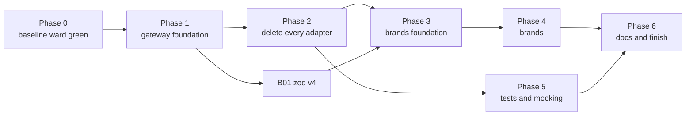

# Brands and gateways: the epic

This file is the operator's run sheet. It lists every work item, the order they run in, which can run
side by side, and what state each is in. Each item is its own file under `items/`. An operator hands an
agent one item's link plus `agent-brief.md`, and nothing else.

Two source docs feed this epic. Neither is edited by the epic; they stay as the record of why.

| Source | What it holds |
|---|---|
| `scrolls/gateway/followup-sustainability.md` | Open work on the four gateway packages under `packages/@gateway/`, and the deletion of every `adapters/` folder |
| `scrolls/brands-types-tests-rules.md` | The rules for brands, library types, returns, tests and mocking, and the lint rules that enforce them |

Every command runs from this worktree's root, `worktrees/gateway-pivot`, on the branch `gateway-pivot`.

## What this epic is trying to do

This epic bridges two large new systems into one. The gateway decides how code reaches anything outside
the repo. The brand rules decide how our own data is typed, checked and tested. The two docs were written
separately, and this epic is a best stab at linking them into one order of work.

The goals:

1. Every object contract, every object nested in it, and every string and number field in it is branded.
   Brand texts are derived, never chosen.
2. The gateway file structure is used as it stands: four packages, `#gateway/<kind>/<subpath>` imports,
   `{subpath}.ts` barrels, one folder per wrapper. The one change is the user's: there are no `_test_`
   barrels. A test imports each stub and proxy from its own file (brands doc C6), in the gateway and in
   workspace packages alike. Item G26 makes that change.
3. Everything works in a consumer repo that `dungeonmaster init` touched, not only here.

As items land, a build error, a type error or a Node, TypeScript or Jest disagreement may show that the
layout planned here does not work. When that happens, the operator tweaks the plan so the whole epic can
succeed. **Every such change is written into "Concessions" below**, with what the plan said, what we did
instead, and why. A concession nobody wrote down is a silent rewrite of the rules, and is not allowed.

Decide by clean architecture. When two designs both work, pick the one with fewer places to keep in step,
and the one that works unchanged in a consumer repo.

## How to operate — the user's standing instructions

1. **At most FIVE sub-agents at a time.** The user raised the cap from three to five this session.
2. **A heartbeat every 30 minutes.** Use `CronCreate` with `13,43 * * * *` (recurring). Do NOT use `/loop` or
   `ScheduleWakeup`; the user asked for cron. It fires only while the session is idle, and dies with the session.
3. **The operator owns builds and commits. A dispatched agent does neither.** Agents also never run `git add` or
   `git mv`: the git index is shared, and one agent's `git mv` was swept into another unit's commit this session.
   Before every commit, run `git diff --cached --stat` and stage explicit paths, never a whole package another
   agent is still editing.
4. **FIX EVERY PRE-EXISTING FAILURE YOU FIND.** The user's words: *"any pre-existing needs to be fixed... we're
   trying to get to a good state with this slew of changes."* A full `npm run ward` must exit 0. A failure an agent
   reports but leaves standing becomes a unit.
5. **Commit on the branch you are on, `gateway-pivot`.** The operator may branch off it when that helps,
   such as giving a large item or a group of agents its own worktree through
   `mcp__dungeonmaster__create-worktree`, so they stop sharing one git index. Every such branch merges
   back into `gateway-pivot` when its work is done, and the operator deletes it and its worktree after
   the merge. Nothing merges anywhere else. Agents still never create branches themselves.

More rules for the operator:

6. **The user gives no input until the epic is marked finished.** When an item is blocked, make a real
   effort to clear it: dispatch an agent to explore the Node, TypeScript, Jest or config disagreement
   behind it. If it still will not clear, mark it `blocked` in the status table with the reason, and move
   on to any item that does not depend on it. Never stop working because one item is stuck.
7. **Use sub-agents for everything that is not coordination:** planning an item's split, implementing,
   writing tests, fixing build errors, and exploring disagreements. The operator reads reports, builds,
   commits and updates this file.
8. **Hand each agent one item file and `agent-brief.md`.** When an item says "operator splits", the
   operator dispatches it as several agents, each given 1 to 3 files for cleanup work or 2 to 4 files for
   migration work, and names the files in the prompt. Use `model: "sonnet"` for large mechanical fan-outs.
9. **Two agents never edit the same package at once** unless the operator has named disjoint file lists
   for them. An item marked "runs alone" runs with no other agent editing its package.
10. **After each item lands:** the operator runs `npm run ward -- --uncommitted` until it exits 0, commits
    the item's paths, then sets the item's row below to `done` with the commit SHA. Build only when
    the `<dungeonmaster-buildDiscipline>` snippet's table, or repo `CLAUDE.md`'s build table, says the
    next thing to run needs compiled output.
11. **Update this file as you go.** Status, blockers and concessions live here, so a fresh session can
    pick up from this file alone.
12. **`create-worktree` branches from the main checkout's HEAD (`master`), not from `gateway-pivot`.** After carving one, run `git reset --hard gateway-pivot` inside it before anything else, then `npm run build:clean` there, because it arrives with no `dist`.
13. **Keep the consumer suite growing.** Once G27 lands, any item that changes what `init` writes, what a
    package publishes, or how a consumer resolves, loads or tests code adds its assertions to the
    consumer suite in the same item. Before committing such an item, the operator runs
    `npm run build:clean`, then `npm run check:consumer`. G27 lists the items known to need this.
## Concessions

Each row is a place where this epic departs from a source doc. The first rows were decided while the epic
was planned. Add a row whenever execution forces another.

| # | Source doc said | We do instead | Why |
|---|---|---|---|
| 1 | Gateway follow-ups, "Gateway standards as built" and item 45: every package has a `./_test_/*` export and a `<subpath>.proxy.ts` test barrel, and callers import `#gateway/<kind>/_test_/<subpath>`. | The brands doc wins (C6), by the user's decision on 2026-09-26: no `_test_` barrel and no `_test_` import path anywhere. A test imports each stub and proxy from its own file: `#gateway/node/fs__promises/read-file-if-exists/read-file-if-exists.proxy`, or `@dungeonmaster/orchestrator/startup/start-orchestrator.proxy`. Each package's `exports` holds three keys: `"./*.proxy": "./src/*.proxy.ts"`, `"./*.stub": "./src/*.stub.ts"` and the barrel key `"./*": "./src/*/*.ts"`, each with the usual conditions. G26 makes the change in the gateway; B03 makes it in workspace packages. | No barrel of test support to keep current. A probe on 2026-09-26 showed Node and TypeScript (`node16`, `source` condition) resolve all three key forms from one package: a more specific pattern key beats `./*`. Jest's resolver and the proxy-mock hoister are not proven yet; G26 proves them first. |
| 2 | Brands doc T6 builds each workspace package's own proxy in step 10, near the end. | Orchestrator's own proxy (`startOrchestratorProxy`) is built in Phase 2, item A00, before the forwarder adapters are deleted. The lint rule `ban-workspace-export-mocks` still lands in Phase 5. | Server and mcp have 65 adapters that only forward into orchestrator. Deleting them leaves their callers' tests nothing to mock except orchestrator's exports, which T6 forbids. The proxy has to exist first. |
| 3 | Gateway follow-up item 45 (every workspace package's `exports`) and brands doc C6 (stubs and proxies out of production barrels, imported per file) are two separate pieces of work. | One item, B03, does both, using row 1's three-key `exports` form. | They move the same barrels and rewrite the same import lines. Two passes would touch every file twice. |
| 4 | Gateway follow-up item 25 is one item. | Split three ways: G16 (the colocation rule, recorded-failure stubs and Node library stubs), G17 (AST, rule-context and TypeScript stubs), G18 (a stub for every remaining subpath). | Each part is a different kind of work, and G17 alone is large. |
| 5 | Gateway follow-ups, "Gateway standards as built": each gateway's `exports` targets carry the conditions `gateway-dist`, `source`, `import`, `require` and `types`. | Each gateway also carries a `<kind>-own-source` condition first (`npm-own-source`, `node-own-source` and so on), and only that gateway's own `tsconfig.build.json` activates it. `init`'s gateway scaffold writes it too. Commit 9bf4bf74d. | A gateway's build reached itself through `testing` and `shared` (for example `#gateway/npm/zod`), resolved that to its own `dist` under `gateway-dist`, and then failed every warm build with TS5055. TypeScript's conditions are active for the whole program, so no shared condition can tell a self-reference from a cross-gateway one; `paths` cannot express the folder-named layout (TS5062). |
| 6 | `scrolls/adapters-to-one-place.md` direction 8, and item A02: workspace packages call each other directly, with no wrapper. The folder config lets `responders/` import no other workspace package. | `responders/` may import `@dungeonmaster/orchestrator` directly, as `brokers/`, `contracts/` and `bindings/` already may. | Every caller of a forwarder adapter in `server` and `mcp` is a responder. Once the adapters go (A02, then A19 removes the folder type), a responder has no other legal way to reach `orchestrator`. Calling a lower-level orchestrator broker instead would skip the orchestrator responder's own logic; `guild remove`'s process cleanup is the proven case. |

## Status key

| Status | Meaning |
|---|---|
| `todo` | Not started |
| `ready` | Every dependency is `done`, so it can be dispatched now |
| `active` | An agent is working on it; the Notes column names the agent |
| `review` | The agent reported; the operator is checking ward and the diff |
| `done` | Committed; the Notes column holds the SHA |
| `blocked` | Tried and stuck; the Notes column says why and what was tried |

## The order of work

Phases run roughly in order, but an item may start as soon as every item in its "Needs" column is
`done`. Items in the same phase with no link between them run side by side, up to five at once.

Phase 0 must finish before an item's own ward run means anything, but Phase 1 items that touch only
tooling may start while Phase 0's fixes are in flight.

Each item that adds or changes a lint rule also: tags it `'pre-edit'` in
`packages/shared/src/statics/dungeonmaster-rule-enforce-on-statics.ts` only when the item file says it can
run pre-edit; updates the teaching text rows the item file names; and runs the rule as a scan over the
whole repo before switching it on, hand-checking a sample of what it flags and what it lets through.

### Phase 0 — a green baseline

| ID | Item | Needs | Runs with | Status | Notes |
|---|---|---|---|---|---|
| P0-1 | [Full `npm run ward` exits 0, including the slow `cli` install test](items/p0-1-baseline-ward.md) | — | any Phase 1 item outside the failing packages | done | Full ward on `a72edb985` exited 0 (run `1790490064405-d32d`, 783s). The `cli` slow-test gate did not trip on that run; Z07 rechecks it. |

### Phase 1 — gateway foundation

Mostly tooling and the gateway packages themselves. Most items here are independent.

| ID | Item | Needs | Runs with | Status | Notes |
|---|---|---|---|---|---|
| G01 | [One list of gateway folder names](items/g01-gateway-folder-names-one-list.md) | — | any | done | 090d01fdd. It also removed a sixth hand-typed copy in `packageScaffoldConfigStatics`; `create-package` now calls `gatewayImportsFieldTransformer`. |
| G02 | [Build order ignores `devDependencies`](items/g02-build-order-ignores-dev-deps.md) | — | any | done | b8132dee1. Ward has no check type for root `scripts/`, so none ran. The build proof rides on the next operator build. |
| G03 | [Publish `@dungeonmaster/testing` publicly](items/g03-publish-testing-public.md) | — | any | done | b09a13acc. Found: the published `jest-config-base.js` wires only `jest.setup.js`, so a consumer gets no sandboxed `HOME`. That gap is T07's job. |
| G04 | [Delete the hand-written MCP SDK types](items/g04-delete-hand-written-mcp-sdk-types.md) | — | any | done | b6b79b1f4. The real SDK types mark the bare `Server` constructor deprecated, so the server is now built as `new McpServer(...).server` through a new subpath, `#gateway/npm/modelcontextprotocol__sdk__server__mcp`. G18 must stub that subpath. |
| G05 | [Error classes live in `.error.ts` files](items/g05-error-classes-in-error-files.md) | — | any outside `@gateway/bin`, `@gateway/node` | todo | |
| G06 | [A per-name `type` import is not a value](items/g06-type-import-specifiers-skipped.md) | — | any | done | e78c7936b. The transformer parses with a regex, not an AST, so the fix reads the `type ` prefix text. Whole `import type` lines were also mishandled, and are fixed too. |
| G07 | [Turn on `@typescript-eslint/no-shadow`](items/g07-no-shadow.md) | — | runs alone per package | done | d537e51ca. The rule was already `error`, every package has 0 shadows, and it is now tagged `pre-edit`. |
| G08 | [`node16` in the published base tsconfig; one ts-jest options entry](items/g08-node16-base-tsconfig-and-ts-jest.md) | — | any not editing jest or tsconfig files | done | Done: 7dcaf21ec, 07152b725, 27af89b4c, 8f31f0b56. Every package and `create-package`'s templates require `testing/ts-jest/options.js`, which derives from `published-options.js`. `@gateway/npm/jest.config.js` too (a7e9572a7). `web` keeps its own ts-jest config: it points at a real `tsconfig.test.json` for JSX and names only the proxy-mock transformer. `testing` has no `./ts-jest/*` export, yet its `transformers.js` header says consumers can require it; G25 checks this. |
| G09 | [Tool tests use the current gateway layout as sample data](items/g09-tool-test-fixtures-current-layout.md) | — | any | done | 85205d640. `is-proxy-import-guard` dropped its `_test_` branch. Some `_test_` strings remain on purpose: generic key-matching tests, and comments that name the barrels still on disk until G26 step 4. |
| G10 | [Ward's `lint` runs the platform and dedupe checks](items/g10-platform-and-dedupe-into-ward-lint.md) | — | any outside `ward` | done | b6231e81b; ward rebuilt. `npm run ward -- platform` and `-- dedupe` are gone. Z06 must fix the scrolls that still name them. |
| G11 | [Per-package tests for the gateway layout](items/g11-gateway-layout-package-tests.md) | G01 | any | done | d3f170e5a. The tests are `*.integration.test.ts`, because `enforce-test-colocation` refuses a package-root `.test.ts`. The gateway tests inline their small lists, because `gateway-import-boundary` bans importing `shared`. |
| G12 | [The `gateway` key in `.dungeonmaster.json` and its lint rules](items/g12-gateway-config-key-and-rules.md) | — | any | done | cff56a3c5, ebbe3122b. `gatewayLintConfigContract` lives once, in `shared`, and `shared` is rebuilt. Keep this in mind: a contract that `eslint.config.js` reaches through another package needs that package rebuilt before lint sees it. |
| G13 | [The Mantine-wrapped `render` moves to `@dungeonmaster/testing`](items/g13-mantine-render-to-testing.md) | G12, G26 | any outside `web`, `testing` | done | 562a2d6a7, with the lockfile updated for `testing`'s new dependencies. `web`'s own `mantineRenderAdapter` remains for A17. |
| G14 | [Lint rules that keep gateway barrels honest](items/g14-gateway-barrel-lint-rules.md) | G05, G26 | any | todo | |
| G15 | [A gateway function returns a real type or `unknown`](items/g15-gateway-returns-unknown-not-caller-type.md) | — | any | done | eda4a46fe. `gateway-return-unknown-not-caller-type` runs in the gateway config only (type-aware), so it has no enforce-on entry, the same as the other gateway-shape rules. `fetchJson` and `dynamicImport` return `unknown`, and nothing outside the gateway calls them. |
| G16 | [Gateway stubs: the colocation rule, recorded failures, Node library types](items/g16-gateway-stubs-node-and-failures.md) | G26 | any | done | 870d29f24, which also swept in T01's `@gateway/node/jest.config.js` edit. Recorded failures come from really failing (ECONNREFUSED, EADDRINUSE, ENOTFOUND, ESRCH, ENOENT). `gateway-colocation` takes `requireStub`, off until G18 turns it on in config. |
| G17 | [Gateway stubs: AST nodes, rule context, TypeScript source file](items/g17-gateway-stubs-ast-and-typescript.md) | G26 | any | done | 26f7286ed. `parseAndFindNode` plus 14 AST-node stubs, `RuleContextStub` and `SourceFileStub`, all imported per file. It adds `@typescript-eslint/typescript-estree` to `@gateway/npm` `dependencies`; the operator must update the lockfile (`npm install --package-lock-only`) at a quiet point. |
| G18 | [A stub for every remaining gateway subpath](items/g18-gateway-stub-every-subpath.md) | G16, G17 | any | ready | G16 and G17 are done. Waits for G19 to leave the gateway proxies. |
| G19 | [Gateway proxies use recorded failures and drop catch-all defaults](items/g19-gateway-proxies-recorded-failures-no-catch-all.md) | G16, G26 | any | done | 7fbf2d6ce. No catch-all defaults remain. fs__promises proxies offer named recorded failures; fetchJson offers `setupConnectionRefused`; `@gateway/browser` depends on `@gateway/node` for the stub. Still open: the write-side fs__promises proxies take a typed `rejects({error: FsError})`, which T05 judges. It also cleared 2 of F1's 5 hits (`stat`, `stat-if-exists`). |
| G20 | [Gateway schemas branded `#Gateway<Type>`](items/g20-gateway-schemas-gateway-brand.md) | G16 | any | ready | G16 is done. Waits for `@gateway/node` to free up. |
| G21 | [Gateway proxies offer loose addressing and call read-back](items/g21-gateway-proxy-addressing-read-back.md) | G19, G26 | any | active | node done in 7467c0cf7 (`*MatchingPath`, `throwsMatchingPath`, `getCallsFor`; `net` and `readline` stay real-I/O by design). bin and browser are with agent g21-bin-browser, which also fixes browser's build-config TS6059. |
| G22 | [Jest goes through the gateway](items/g22-jest-through-gateway.md) | G02, G03 | any outside `testing` | todo | |
| G23 | [The discovery tools show the gateway as `#gateway`](items/g23-discovery-tools-show-gateway.md) | G12 | any | done | 3977a3251, 2e1fae51d. `shared`, `mcp` and `hooks` are rebuilt; a live session needs an MCP reconnect and a new session to see it. The literal `@gateway` group-folder name is written in two places, the `hooks` responder and `architecture-gateway-inventory-broker`; fold it into `gatewayLocationsStatics` when either is next touched. `shared`'s `gatewayLintConfigReadBroker` and eslint-plugin's `configGatewayLintConfigBroker` both read the `gateway` key. |
| G24 | [Tell a consumer's agent how to add an npm or bin wrapper](items/g24-consumer-npm-bin-wrapper-snippet.md) | — | any | review | b6ce9b203, and init regenerated in c03a24d4f. Still to do: add `src` to `files` in `@gateway/npm` and `@gateway/bin` (the new snippet already says they ship `src`); move `@gateway/browser/__mocks__/jsdom-polyfills.cjs` into `testing` and repoint its references in `cli`. |
| G25 | [`init` works end to end in a scratch consumer](items/g25-consumer-init-end-to-end.md) | G03, G08 | any | done | 62de99da9, merged in b430a2100. Two scratch consumers under `/tmp` ran `init`, typecheck, test and build green. Fixes: - `packageDiscoverBroker` scans `node_modules` in a consumer - `siegelense` joins `devDependenciesStatics` - the published Jest base transforms `@dungeonmaster/testing` - the published ts-jest options set `diagnostics: false` (see G27) - the scaffolded `eslint.config.js` wires the gateway carve-out - four `@gateway/node` fixes for newer tool versions  Left for unit **F1**: a consumer's newer `@typescript-eslint` (8.70.1 against the repo's 8.45.0) fails lint on `@gateway/node`: 5 proxies report `no-unused-vars` on types used in `as unknown as X`, and `fetch-ok.ts` reports `no-deprecated` on `util.types.isNativeError`. |
| G26 | [Stubs and proxies are imported from their own files; the gateway's `_test_` barrels go](items/g26-per-file-proxy-and-stub-imports.md) | — | any outside `@gateway/*` and `testing` | done | 3e8d30de1, 55b993cfa, f8eab6107, fdca16800, c7409c6b5, 4b0728ba0, d3f170e5a. No `_test_` key or barrel exists; the 22 barrels are deleted. G23 removes the dead `gatewayLocationsStatics.testSubpath`. Concession 1 is realised. |
| G27 | [A test suite proves a fresh consumer repo is bootstrapped correctly](items/g27-consumer-repo-test-suite.md) | G25, G26 | any | done | a5ecf226e, merged in 7a5f7517f. `npm run check:consumer` (after `build:clean`) lives in `scripts/consumer-check/`, outside ward by design. The last run had 43 passing and 13 failing checks, each traced to F1, F5 to F9. `hooks`, `mcp` and `ward` gained `publishConfig`, and the published Jest base transforms every `node_modules` ESM file. |

### Phase 2 — delete every adapter

The biggest phase. Each package's item moves its callers onto gateway exports and turns what is left into
brokers, transformers or statics, then deletes every adapter with its proxy, test and stub.

A package item may start once A00 to A02 are `done` and every Phase 1 item in its own "Needs" is `done`.
Package items run side by side, one agent group per package. Each is split by the operator into agents of
2 to 4 adapters each.

| ID | Item | Needs | Runs with | Status | Notes |
|---|---|---|---|---|---|
| A00 | [Orchestrator ships its own proxy](items/a00-orchestrator-own-proxy.md) | P0-1, G26 | any outside `orchestrator` | done | 6a8898f2b. `StartOrchestratorProxy` is PascalCase. `enforce-implementation-colocation` allows a startup proxy. `enforce-proxy-child-creation` recognises bare workspace-root imports, taking the scope from the real workspace. `orchestrator` and `config` are rebuilt. Note: `find-workspace-root-layer-broker` is now copied in two rule folders (follow-up F4). |
| A01 | [Delete the adapters the trials left without callers](items/a01-dead-adapters.md) | P0-1 | any | done | 7751fb471, d52d180cb. The `testing` row was a false positive: `web`'s claude-mock and ward-mock harnesses import `fs-queue-metadata-read-adapter`, so it stays for A14 (row FS-2). Tell A02: server has 46 orchestrator forwarders, not 47. Tell A03: orchestrator's `process-kill-by-port` adapter was dead and is gone. |
| A02 | [Delete the forwarder adapters](items/a02-forwarder-adapters.md) | A00 | any outside `mcp`, `server` | active | Split by caller file; see the item's "Operator's split" section. S1 found that `responders/` may not import `@dungeonmaster/orchestrator` (concession 6); an agent is adding it to `folderConfigStatics`, then the operator builds `shared`. Every S and M group waits for that. |
| A03 | [One broker lists what is on a port and kills it](items/a03-port-kill-broker.md) | G21 | any outside `orchestrator`, `ward` | todo | |
| A04 | [Adapters: `cli`](items/a04-adapters-cli.md) | G05, G15, G19, G21 | other A items | todo | operator splits |
| A05 | [Adapters: `config`](items/a05-adapters-config.md) | G05, G15, G19, G21 | other A items | todo | |
| A06 | [Adapters: `eslint-plugin`](items/a06-adapters-eslint-plugin.md) | G05, G15, G19, G21 | other A items | todo | operator splits |
| A07 | [Adapters: `hooks`](items/a07-adapters-hooks.md) | G05, G15, G19, G21 | other A items | todo | operator splits |
| A08 | [Adapters: `hydration` and `hydration-recipes`](items/a08-adapters-hydration.md) | G05, G15, G19, G21 | other A items | todo | operator splits |
| A09 | [Adapters: `mcp`](items/a09-adapters-mcp.md) | A02, G05, G15, G19, G21 | other A items | todo | operator splits |
| A10 | [Adapters: `orchestrator`](items/a10-adapters-orchestrator.md) | A03, G05, G15, G19, G21 | other A items | todo | operator splits |
| A11 | [Adapters: `server`](items/a11-adapters-server.md) | A02, G05, G15, G19, G21 | other A items | todo | operator splits |
| A12 | [Adapters: `shared`](items/a12-adapters-shared.md) | G05, G15, G19, G21 | other A items | todo | do early. `shared` exports its adapters publicly: 249 files in 11 other packages import `@dungeonmaster/shared/adapters` (census 2026-09-26). Operator splits per consuming package, and those agents follow rule 9 against that package's own A item. |
| A13 | [Adapters: `siegelense`](items/a13-adapters-siegelense.md) | G05, G15, G19, G21 | other A items | todo | operator splits |
| A14 | [Adapters: `testing`](items/a14-adapters-testing.md) | G22 | other A items | todo | operator splits |
| A15 | [Adapters: `tooling`](items/a15-adapters-tooling.md) | G05, G15, G19, G21 | other A items | todo | |
| A16 | [Adapters: `ward`](items/a16-adapters-ward.md) | A03, G05, G15, G19, G21 | other A items | todo | operator splits |
| A17 | [Adapters: `web`](items/a17-adapters-web.md) | G05, G13, G15, G19, G21 | other A items | todo | operator splits |
| A18 | [Raw outside calls that never had an adapter; drop duplicate package deps](items/a18-raw-calls-and-dependency-cleanup.md) | A04–A17 | — | todo | operator splits per package |
| A19 | [`adapters` stops being a folder type; caller-facing lint rules on](items/a19-adapters-folder-type-gone-caller-rules-on.md) | A18 | — | todo | runs alone |

### Phase 3 — brands foundation

| ID | Item | Needs | Runs with | Status | Notes |
|---|---|---|---|---|---|
| B01 | [Upgrade zod to v4](items/b01-zod-v4.md) | G15 | Phase 2 items whose files it does not touch | ready | G15 is done. Needs an operator `npm install` after the agent edits `package.json`; plan a quiet window. |
| B02 | [The contract index, and unused contracts deleted](items/b02-contract-index-and-unused-contracts.md) | A19 | B01, B07 | todo | |
| B03 | [Package `exports` serve barrels and per-file stubs and proxies; stubs and proxies out of production barrels](items/b03-package-exports-and-per-file-test-imports.md) | B02 | B04, B05 | todo | concessions 1 and 3; operator splits per package |
| B04 | [Lint rules use the real `TSESTree` and the gateway's AST stubs](items/b04-eslint-rules-on-real-tsestree.md) | G17, A06 | B05 | todo | operator splits per rule folder |
| B05 | [Every other copied library type goes](items/b05-other-library-type-copies.md) | G16, A07, A14 | B04 | todo | |
| B06 | [Contract fields of outside types use the gateway's schemas](items/b06-gateway-schema-fields-in-contracts.md) | G20, B01 | any | todo | |
| B07 | [Layer files in four more folder types; regex allowed in statics](items/b07-layers-and-statics-regex.md) | P0-1 | any | done | 2a9e3537e. It missed two `enforce-project-structure` layer tests, which agent fix-b07-g07 is fixing. Build `shared` before lint outside ward, or the MCP server, sees the new folder config. |

### Phase 4 — brands

| ID | Item | Needs | Runs with | Status | Notes |
|---|---|---|---|---|---|
| B10 | [The owner index for B4, C8 and the indexed brand checks](items/b10-owner-index.md) | B02 | B14, B17, B18 | todo | |
| B11 | [A contract name is unique across packages](items/b11-unique-contract-names.md) | B10, B03 | B14, B17, B18 | todo | fixes the `FolderType` bug |
| B12 | [`require-object-contract-brands` and its autofix](items/b12-require-object-contract-brands.md) | B01, B10 | B13, B14 | todo | |
| B13 | [A field that holds another object's field reuses it](items/b13-owner-field-reuse.md) | B10 | B12, B14 | todo | |
| B14 | [No field-type aliases; object types that leave a function are contracts](items/b14-type-alias-and-adhoc-type-rules.md) | A19 | any | todo | operator splits the shape fixes per package |
| B15 | [Brand the repo](items/b15-brand-migration.md) | B06, B07, B11, B12, B13, B14 | — | todo | operator splits per package; the largest item in the epic |
| B16 | [An owner is a real object; an id is never re-branded](items/b16-real-owner-and-id-rebrand.md) | B15 | T-items | todo | |
| B17 | [No type predicate onto our types; parsed JSON goes straight into a parse](items/b17-predicates-and-json-parse.md) | G15, B01 | any | todo | |
| B18 | [A function returns what its calls told it](items/b18-returns-say-what-happened.md) | A19 | any | todo | |

### Phase 5 — tests and mocking

| ID | Item | Needs | Runs with | Status | Notes |
|---|---|---|---|---|---|
| T01 | [MSW loads in every package and fails on anything unhandled](items/t01-msw-everywhere.md) | G08 | any | done | 02176f3c5. MSW loads through the base configs; 11 redundant per-package `setupFilesAfterEnv` overrides that hid it are gone. `testing`'s own `jest.config.js` does not spread the base, so it keeps its own entry. The WebSocket catch-all `ws.link('*')` would also close a connection that a future test mocks itself; see T02/T03. |
| T02 | [The I/O trap covers every way out of the process](items/t02-io-trap-every-way-out.md) | T01 | any | done | 7134a7159. Network modules are trapped by mutating them in place, because a `jest.mock` factory loses to msw's static `node:net` import. Still open, as the item says: `fs` and `child_process` classes pass through, and a late call can drain against the wrong test. |
| T03 | [MSW handlers are checked against the server's contracts](items/t03-contract-checked-handlers.md) | T01 | any | ready | T01 is done, and T02 has left `testing`. It waits for the integration-regression fix in `testing`. |
| T04 | [No test mocks another workspace package's exports](items/t04-workspace-export-mocks-ban.md) | A02 | any | todo | |
| T05 | [No catch-all proxy defaults; no invented failures](items/t05-proxy-catch-all-and-invented-failures.md) | G19 | any | todo | operator splits the fixes per package |
| T06 | [A proxy composes the proxy beside each wrapper it calls](items/t06-proxy-child-creation.md) | B03 | any | todo | |
| T07 | [Consumers get the Jest home sandbox](items/t07-home-sandbox-for-consumers.md) | P0-1 | any | done | 9844987fa. The published `jest-config-base` wires `jest.setup-global.js` and its teardown, and `ban-bare-os-home-tmp` is deleted. A comment at `web/test/harnesses/claude-mock/bin/claude:232` still names the deleted rule; Z06 fixes it. |
| T08 | [Read every catch-everything implementation](items/t08-catch-everything-implementations.md) | T05 | any | todo | operator splits |
| T09 | [A generated catalog of the test infrastructure](items/t09-test-infrastructure-catalog.md) | B03, T05, T06 | any | todo | |
| T10 | [JSX only in `widgets/` and `flows/`](items/t10-jsx-only-in-widgets-and-flows.md) | A17 | any | todo | |

### Phase 6 — docs and the finish line

Do this phase last. Every code item above may still change the layout the docs describe.

| ID | Item | Needs | Runs with | Status | Notes |
|---|---|---|---|---|---|
| Z01 | [The `gateway` folder-type doc](items/z01-gateway-folder-type-doc.md) | every A, B, G, T item | Z02–Z06 | todo | |
| Z02 | [`get-architecture` and the session snippets](items/z02-architecture-and-snippet-text.md) | every A, B, G, T item | Z01, Z03–Z06 | todo | |
| Z03 | [`get-folder-detail` and `get-testing-patterns`](items/z03-folder-type-and-testing-docs.md) | every A, B, G, T item | Z01, Z02, Z04–Z06 | todo | |
| Z04 | [Every `CLAUDE.md` and `AGENTS.md`](items/z04-claude-md-and-agents-md.md) | every A, B, G, T item | Z01–Z03, Z05, Z06 | todo | operator splits |
| Z05 | [Every `PURPOSE` header in `packages/@gateway`](items/z05-gateway-purpose-headers.md) | every A, B, G, T item | Z01–Z04, Z06 | todo | operator splits per subpath |
| Z06 | [Pointers in the older scrolls](items/z06-scrolls-pointers.md) | every A, B, G, T item | Z01–Z05 | todo | |
| Z07 | [The finish line](items/z07-finish-line.md) | Z01–Z06, G27 | — | todo | runs alone |

## Follow-up units

Work that execution found and no item file owns. Each runs like an item.

| ID | What | Found by | Status | Notes |
|---|---|---|---|---|
| F1 | Consumer lint of `@gateway/node` fails under the newer `@typescript-eslint` (8.70.1) a consumer installs. Five proxies report `no-unused-vars` on types used only in `as unknown as X`, and `fetch-ok.ts` reports `no-deprecated` on `util.types.isNativeError`. | G25 | todo | Consider upgrading this repo to the version consumers get, so dogfood sees the same rules. G19 cleared `stat` and `stat-if-exists`. G27 adds `jest/unbound-method` on `timeout.stub.test.ts`, plus TS6133 in the consumer's `tsc` build. |
| F2 | `init` writes `package.json` and `.dungeonmaster.json` with no trailing newline, and reorders `devDependencies`. | operator, c03a24d4f | done | e1fec0c5c. `shared`'s `jsonFileContentsTransformer` serialises every install-time JSON write; `add-dev-deps` sorts. The next `npm run init` rewrites the root `package.json` correctly. |
| F4 | `find-workspace-root-layer-broker` exists twice, in `enforce-gateway-config-names-exist` and `enforce-proxy-child-creation`, because a layer file cannot be imported across folders. Promote it to one ordinary broker that both rules import. | operator, 6a8898f2b | todo | |
| F5 | `cli`'s `workspaceScopeDetectTransformer` reads only the root `dependencies` for a `"*"`-versioned `@scope/name`, but `init` writes `@dungeonmaster/*` into `devDependencies`. Every package `create-package` scaffolds after `init` gets a broken `#gateway/*` imports field. | G27 | active | agent f5-f7 |
| F6 | `create-package`'s scaffolded `jest.config.js` requires `../../jest.config.base.js`, which exists only in this monorepo, so every fresh consumer package's Jest crashes. | G27 | active | agent f5-f7 |
| F7 | `create-package --type frontend-react` seeds a package that does not typecheck or build (`@types/react` and `@types/react-dom` missing). | G27 | active | agent f5-f7 |
| F8 | `packages/hydration-recipes`, scaffolded by `siegelense`'s `StartInstall` during `init`, never gets its `#gateway/*` imports merged: the gateway-setup step scans packages before `siegelense` creates it. | G27 | todo | |
| F9 | G27's own sample fixture files in `scripts/consumer-check` (`io-trap-probe.ts`, `msw-trap-probe.ts`, `read-config-or-default.ts`, `pre-edit-probe-broker.ts`) are not lint-clean against the consumer's rules, so they cost 13 red checks. `--mode=global` was not re-hardened. | G27 | todo | |
| F10 | `packages/testing/ts-jest/published-options.js` sets `diagnostics: false`, so a consumer's test run reports no type errors (their `tsc` still does). Test whether `moduleResolution: node16` there keeps diagnostics on and still works with the proxy-mock hoister; keep whichever works. | G25, G27 | todo | |
| F11 | Integration and unit regressions from a full run (1790505592400-0bd9): T01's MSW fails five `hydration`/`hydration-recipes` integration tests that make real requests, and `cli-entry.integration.test.ts`'s 15 `siegelense --help` cases time out. T02's trap also fails six `@gateway/node` unit tests that use real sockets and processes by design. T01 left two TS2379 errors in `testing` that only the build config sees. | T02 | active | agent f11 |
| F12 | G21's node part declared `type PathMatcher` separately in 17 proxies. Fold it into one file per gateway. The agent also clears F1's remaining `@gateway/node` hits. | operator, 7467c0cf7 | active | agent f12 |
| F3 | Ward's `typecheck` uses `tsconfig.json`, not `tsconfig.build.json`, so a build-only failure (TS6059 in ed13c2901, TS2379 in G15) passes ward. Consider a build-config `--noEmit` check in ward. | operator | done | a8369332a; ward rebuilt. Typecheck runs a second pass against `tsconfig.build.json`. It found TS2379 in `testing` (F11 fixing) and TS6059 in `@gateway/browser` (G21 fixing). |

## Blocked items

When an item is marked `blocked`, add a row here. Clear the row when the item unblocks.

| ID | What blocks it | What was tried | What else it holds up |
|---|---|---|---|

## Log

One line per session: the date, what landed, and where the next session starts.

| Date | What happened |
|---|---|
| 2026-09-26 | Epic planned. Item files written. Nothing executed yet. |
