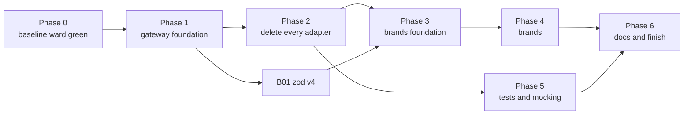

# Brands and gateways: the epic

This file is the operator's run sheet. It lists every work item, the order they run in, which can run
side by side, and what state each is in. Each item is its own file under `items/`. An operator hands an
agent one item's link plus `agent-brief.md`, and nothing else.

Two source docs feed this epic. Neither is edited by the epic; they stay as the record of why.

| Source | What it holds |
|---|---|
| `scrolls/gateway/followup-sustainability.md` | Open work on the four gateway packages under `packages/@gateway/`, and the deletion of every `adapters/` folder |
| `scrolls/brands-types-tests-rules.md` | The rules for brands, library types, returns, tests and mocking, and the lint rules that enforce them |

Every command runs from this worktree's root, `worktrees/gateway-pivot`, on the branch `gateway-pivot`.

## What this epic is trying to do

This epic bridges two large new systems into one. The gateway decides how code reaches anything outside
the repo. The brand rules decide how our own data is typed, checked and tested. The two docs were written
separately, and this epic is a best stab at linking them into one order of work.

The goals:

1. Every object contract, every object nested in it, and every string and number field in it is branded.
   Brand texts are derived, never chosen.
2. The gateway file structure is used as it stands: four packages, `#gateway/<kind>/<subpath>` imports,
   `{subpath}.ts` barrels, one folder per wrapper. The one change is the user's: there are no `_test_`
   barrels. A test imports each stub and proxy from its own file (brands doc C6), in the gateway and in
   workspace packages alike. Item G26 makes that change.
3. Everything works in a consumer repo that `dungeonmaster init` touched, not only here.

As items land, a build error, a type error or a Node, TypeScript or Jest disagreement may show that the
layout planned here does not work. When that happens, the operator tweaks the plan so the whole epic can
succeed. **Every such change is written into "Concessions" below**, with what the plan said, what we did
instead, and why. A concession nobody wrote down is a silent rewrite of the rules, and is not allowed.

Decide by clean architecture. When two designs both work, pick the one with fewer places to keep in step,
and the one that works unchanged in a consumer repo.

## How to operate — the user's standing instructions

1. **At most FIVE sub-agents at a time.** The user raised the cap from three to five this session.
2. **A heartbeat every 30 minutes.** Use `CronCreate` with `13,43 * * * *` (recurring). Do NOT use `/loop` or
   `ScheduleWakeup`; the user asked for cron. It fires only while the session is idle, and dies with the session.
3. **The operator owns builds and commits. A dispatched agent does neither.** Agents also never run `git add` or
   `git mv`: the git index is shared, and one agent's `git mv` was swept into another unit's commit this session.
   Before every commit, run `git diff --cached --stat` and stage explicit paths, never a whole package another
   agent is still editing.
4. **FIX EVERY PRE-EXISTING FAILURE YOU FIND.** The user's words: *"any pre-existing needs to be fixed... we're
   trying to get to a good state with this slew of changes."* A full `npm run ward` must exit 0. A failure an agent
   reports but leaves standing becomes a unit.
5. **Commit on the branch you are on, `gateway-pivot`.** The operator may branch off it when that helps,
   such as giving a large item or a group of agents its own worktree through
   `mcp__dungeonmaster__create-worktree`, so they stop sharing one git index. Every such branch merges
   back into `gateway-pivot` when its work is done, and the operator deletes it and its worktree after
   the merge. Nothing merges anywhere else. Agents still never create branches themselves.

More rules for the operator:

6. **The user gives no input until the epic is marked finished.** When an item is blocked, make a real
   effort to clear it: dispatch an agent to explore the Node, TypeScript, Jest or config disagreement
   behind it. If it still will not clear, mark it `blocked` in the status table with the reason, and move
   on to any item that does not depend on it. Never stop working because one item is stuck.
7. **Use sub-agents for everything that is not coordination:** planning an item's split, implementing,
   writing tests, fixing build errors, and exploring disagreements. The operator reads reports, builds,
   commits and updates this file.
8. **Hand each agent one item file and `agent-brief.md`.** When an item says "operator splits", the
   operator dispatches it as several agents, each given 1 to 3 files for cleanup work or 2 to 4 files for
   migration work, and names the files in the prompt. Use `model: "sonnet"` for large mechanical fan-outs.
9. **Two agents never edit the same package at once** unless the operator has named disjoint file lists
   for them. An item marked "runs alone" runs with no other agent editing its package.
10. **After each item lands:** the operator runs `npm run ward -- --uncommitted` until it exits 0, commits
    the item's paths, then sets the item's row below to `done` with the commit SHA. Build only when
    the `<dungeonmaster-buildDiscipline>` snippet's table, or repo `CLAUDE.md`'s build table, says the
    next thing to run needs compiled output.
11. **Update this file as you go.** Status, blockers and concessions live here, so a fresh session can
    pick up from this file alone.
12. **`create-worktree` branches from the main checkout's HEAD (`master`), not from `gateway-pivot`.** After carving one, run `git merge --ff-only gateway-pivot` inside it before anything else (the pre-bash hook blocks `git reset --hard`), then `npm run build:clean` there, because it arrives with no `dist`.
13. **Keep the consumer suite growing.** Once G27 lands, any item that changes what `init` writes, what a
    package publishes, or how a consumer resolves, loads or tests code adds its assertions to the
    consumer suite in the same item. Before committing such an item, the operator runs
    `npm run build:clean`, then `npm run check:consumer`. G27 lists the items known to need this.
## Machine-wide side effects

**`npm link --workspaces` in this worktree moves every global `@dungeonmaster/*` link onto it.** G24's regeneration step (build, `npm link --workspaces`, `npm run init`, per `CLAUDE.md`'s "Regenerating `.claude/settings.json` Here") was run from `worktrees/gateway-pivot` on 2026-09-27 at 02:33 local. After it, the global npm folder resolved `@dungeonmaster/cli`, `ward`, `mcp`, `shared` and every other workspace package to this mid-migration branch, for every repo on the machine. The user pointed the links back to the main checkout. Before running that step again from a worktree, say so to the user, or run `npm link --workspaces` from the main checkout afterwards. Ward and tests here never need the global links; they resolve through the workspace.

**Master's scan pile-up fix is merged here (e8d789075) and built.** The user fixed the rate-limits poller on master (3e59959e7: one usage-ledger scan per process, stamped at start). The operator merged it, ran ward on its files, and built this checkout's `shared`, `@gateway/*`, `orchestrator` and `mcp`. The whole-repo build stopped at `ward` on W3's half-edited `check-run-lint-broker.ts`, so `server`, `siegelense` and `cli` output is older; the MCP server needs only `mcp` and `orchestrator`. The follow-up in `scrolls/usage-ledger-scan-pileup.md` (one scanner per home, merging writes) touches the ledger write broker this branch changed, so do it on this branch or after it lands.

**Master's MCP caller hook is merged here (7d5b32b90) and built.** Two resolutions: `resolve-caller-session-layer` keeps the hook check first, then `cwd()`; `resolve-subagent-identity-layer`'s hook branch calls `cwd()`. `.claude/settings.json` was regenerated with this checkout's own `node packages/cli/dist/bin/dungeonmaster.js init`, never `npm link`. Built here: `shared`, `config`, `hooks`, `orchestrator`, `mcp`, `cli`. Open: master's c8d7631ed removed siegelense's "THE VERBS YOU CAN SUBMIT TODAY" docs section, but two `docs-statics.test.ts` tests (the ladder, DEF-29) still expect it; red on master too, waiting on the user.

**Build freeze while the user profiles memory (from 2026-09-27, a couple of hours).** The user restarted the MCP servers to profile memory. Building `mcp`, `orchestrator`, `shared` or `hooks` in this checkout rewrites the running server's `dist` and kills it. Queue every build (F29's `@gateway/node`, the stale `ward`, `server`, `siegelense`, `cli`) until the user says profiling is over. Tell every dispatched agent not to build (they never do anyway).

## Using Antigravity (`agy`) agents

The user can lend Antigravity slots on top of the Claude sub-agents. This section records what the operator learns about driving them, and grows as the epic uses them more.

| What | What we learned |
|---|---|
| Slot count | Paused: the user said to start no new `agy` runs until they say otherwise; the three already running (SV2, M3, SV3) finish. When resumed, the general cap is 2 at once, because `agy`'s five-hour usage limit is smaller than Claude's. (History: 5 slots at first, then 3 while the user ran `agy` elsewhere.) |
| The CLI | `agy` is at `~/.local/bin/agy`. `agy -p "<prompt>"` runs one prompt non-interactively and prints the final answer. `agy models` lists the models. |
| The model | The user asked for Gemini 3.8 Flash. Pass `--model gemini-3.8-flash-high`. |
| Permissions | Pass `--dangerously-skip-permissions`, or the run stalls on the first tool prompt, because nobody is there to answer it. |
| Launching | Run it through the Bash tool with `run_in_background: true`. The harness notifies the operator when the command exits. The launcher is `tmp/agy/run.sh <group>`. It joins `tmp/agy/common.md` with `tmp/agy/<group>.md`, and writes the answer to `tmp/agy/<group>.out`. |
| MCP tools | The dungeonmaster MCP tools are available inside `agy` (`discover` confirmed). |
| Repo rules | A quiz with no file reads showed it already knows the core rules: `npm run ward -- -- <files>`, `registerMock` rather than `jest.mock`, the banned matchers, no builds, and `discover` rather than grep. It could not name most snippet tags. So the shared prompt restates the hard bans (no git staging or commits, no builds or installs, only scoped ward) and points at `session-snippet-statics.ts`. |
| The prompt | It gets no agent brief automatically. `common.md` carries the brief, the recipe, the ban list and the report format, and each group file adds only the file list and who else is in the package. |
| Watching progress | Print mode writes nothing until the turn ends, apart from a stray fragment or two. Watch progress through `git status` on the group's files, and `ps -eo pid,etime,args | grep 'agy -p'` for elapsed time. After 5 minutes, all five had read files but edited none. |
| The trust dialog, once per directory | Antigravity asks the user to trust `agy` in each new directory, in the app, and `--dangerously-skip-permissions` does not skip it. A worktree is a new directory, so an `agy` agent launched in a fresh worktree waits on that dialog until the user answers it. Ask the user to trust the directory before launching there, or launch `agy` agents only in directories already trusted. Early runs here hit the dialog in this checkout. Before it was cleared, a quiz showed only the core rules. After, a second quiz answered from `<dungeonmaster-buildDiscipline>`, `<dungeonmaster-generatedConfig>` and the ward flags (`--uncommitted`), and listed every dungeonmaster MCP tool. It still names only two snippet tags when asked for all of them, so ask about rule CONTENT, not tag names. It knows grep, find and sed are blocked by a hook, but not that `git reset` is. Keep passing `--dangerously-skip-permissions` either way. |
| Reports and status | The operator reads each `agy` final report (`tmp/agy/<group>.out`) directly, like a Claude sub-agent's report. The operator never reads a worker's raw transcript to learn its status. When status is needed and the agent cannot be messaged through its shell, a sonnet sub-agent looks and answers in a few lines. Reviewing a finished group's diff in depth also goes to a sonnet sub-agent, in a sixth slot kept for review and status checks. |
| The first finished run (H1) | About 30 minutes for four small caller files. The final answer held the report in the requested sections, preceded by a few lines of its own progress chatter ("I will wait for the ward task…"), so read the tail of the `.out` file. It ran scoped ward and a whole-package run, and reported a sibling group's red as not its own, as told. Its mutations only broke return values, never the line it migrated, so the migration itself went unproven; the sonnet reviewer checks that. Ask for a mutation on the migrated line in the prompt. |
| Rule slips seen | HR1 broke a stated ban: it added `registerMock({ fn: mkdir })` on raw `fs/promises` to read calls back, although the prompt forbids a raw mock on the `fs` module. Scan every `agy` diff for `from 'fs`, `'path'`, `'os'`, `onceFor([])`, `calledWith([])` and `as unknown as` before committing. Commit the clean files and send the rest to a fix run. A fix run is a fresh `agy -p` with the defect named and the file list; `agy` print mode cannot be messaged after it exits. |
| Stopping when told | HR1-FIX met the prompt's "if the gateway offers no way, stop and report" clause and stopped cleanly, with no workaround. Write that escape hatch into every fix prompt. |
| Real process state in tests | M1 made two tests build expected paths from the real `process.cwd()` rather than staging `cwd`. The ban list named raw module mocks but not reading real process state, so say it: "never read the real cwd, home or env in a test or proxy; stage it". |
| Good runs | H2 and HR2 followed every rule, proved their tests bite on the migrated line, and needed no fixes. H2 staged `cwd` on its gateway import exactly as the recipe says. |
| Hit rate so far | Of 13 `agy` runs, 9 were clean on the first pass (H2, HR2, C1, C2, C3, C4, M2, GW-ENSURE, M1-FIX). Two needed a fix run (HR1: raw fs mock; M1: real cwd in tests). One stopped correctly when its prompt's escape hatch applied (HR1-FIX). Typical run: 10 to 30 minutes for 2 to 5 caller files. Reports were accurate every time the operator checked them against the diff. |
| Concurrent-edit noise | `agy` agents correctly report reds in files another agent is mid-editing as not theirs. The operator must still re-run those packages once the other agent lands, and must gate each commit on ward's exit code, not on reading its summary: one commit here went in while a transient typecheck red (another agent's half-written file) showed. |
| Quota exhaustion | SV3 died mid-run when `agy` hit its usage limit: the `.out` ends with `AGY_ERROR ... RESOURCE_EXHAUSTED (code 429): Individual quota reached ... Resets in 3h20m` and the launcher's `AGY-DONE <group> exit=3`. It wrote no report and left its files half-edited. A non-zero exit means: read the tail for `AGY_ERROR`, treat the diff as unreviewed work in progress, and hand the group to a Claude agent to finish from where it stopped. |

## Concessions

Each row is a place where this epic departs from a source doc. The first rows were decided while the epic
was planned. Add a row whenever execution forces another.

| # | Source doc said | We do instead | Why |
|---|---|---|---|
| 1 | Gateway follow-ups, "Gateway standards as built" and item 45: every package has a `./_test_/*` export and a `<subpath>.proxy.ts` test barrel, and callers import `#gateway/<kind>/_test_/<subpath>`. | The brands doc wins (C6), by the user's decision on 2026-09-26: no `_test_` barrel and no `_test_` import path anywhere. A test imports each stub and proxy from its own file: `#gateway/node/fs__promises/read-file-if-exists/read-file-if-exists.proxy`, or `@dungeonmaster/orchestrator/startup/start-orchestrator.proxy`. Each package's `exports` holds three keys: `"./*.proxy": "./src/*.proxy.ts"`, `"./*.stub": "./src/*.stub.ts"` and the barrel key `"./*": "./src/*/*.ts"`, each with the usual conditions. G26 makes the change in the gateway; B03 makes it in workspace packages. | No barrel of test support to keep current. A probe on 2026-09-26 showed Node and TypeScript (`node16`, `source` condition) resolve all three key forms from one package: a more specific pattern key beats `./*`. Jest's resolver and the proxy-mock hoister are not proven yet; G26 proves them first. |
| 2 | Brands doc T6 builds each workspace package's own proxy in step 10, near the end. | Orchestrator's own proxy (`startOrchestratorProxy`) is built in Phase 2, item A00, before the forwarder adapters are deleted. The lint rule `ban-workspace-export-mocks` still lands in Phase 5. | Server and mcp have 65 adapters that only forward into orchestrator. Deleting them leaves their callers' tests nothing to mock except orchestrator's exports, which T6 forbids. The proxy has to exist first. |
| 3 | Gateway follow-up item 45 (every workspace package's `exports`) and brands doc C6 (stubs and proxies out of production barrels, imported per file) are two separate pieces of work. | One item, B03, does both, using row 1's three-key `exports` form. | They move the same barrels and rewrite the same import lines. Two passes would touch every file twice. |
| 4 | Gateway follow-up item 25 is one item. | Split three ways: G16 (the colocation rule, recorded-failure stubs and Node library stubs), G17 (AST, rule-context and TypeScript stubs), G18 (a stub for every remaining subpath). | Each part is a different kind of work, and G17 alone is large. |
| 5 | Gateway follow-ups, "Gateway standards as built": each gateway's `exports` targets carry the conditions `gateway-dist`, `source`, `import`, `require` and `types`. | Each gateway also carries a `<kind>-own-source` condition first (`npm-own-source`, `node-own-source` and so on), and only that gateway's own `tsconfig.build.json` activates it. `init`'s gateway scaffold writes it too. Commit 9bf4bf74d. | A gateway's build reached itself through `testing` and `shared` (for example `#gateway/npm/zod`), resolved that to its own `dist` under `gateway-dist`, and then failed every warm build with TS5055. TypeScript's conditions are active for the whole program, so no shared condition can tell a self-reference from a cross-gateway one; `paths` cannot express the folder-named layout (TS5062). |
| 6 | `scrolls/adapters-to-one-place.md` direction 8, and item A02: workspace packages call each other directly, with no wrapper. The folder config lets `responders/` import no other workspace package. | `responders/` may import `@dungeonmaster/orchestrator` directly, as `brokers/`, `contracts/` and `bindings/` already may. | Every caller of a forwarder adapter in `server` and `mcp` is a responder. Once the adapters go (A02, then A19 removes the folder type), a responder has no other legal way to reach `orchestrator`. Calling a lower-level orchestrator broker instead would skip the orchestrator responder's own logic; `guild remove`'s process cleanup is the proven case. |

## Status key

| Status | Meaning |
|---|---|
| `todo` | Not started |
| `ready` | Every dependency is `done`, so it can be dispatched now |
| `active` | An agent is working on it; the Notes column names the agent |
| `review` | The agent reported; the operator is checking ward and the diff |
| `done` | Committed; the Notes column holds the SHA |
| `blocked` | Tried and stuck; the Notes column says why and what was tried |

## The order of work

Phases run roughly in order, but an item may start as soon as every item in its "Needs" column is
`done`. Items in the same phase with no link between them run side by side, up to five at once.

Phase 0 must finish before an item's own ward run means anything, but Phase 1 items that touch only
tooling may start while Phase 0's fixes are in flight.

Each item that adds or changes a lint rule also: tags it `'pre-edit'` in
`packages/shared/src/statics/dungeonmaster-rule-enforce-on-statics.ts` only when the item file says it can
run pre-edit; updates the teaching text rows the item file names; and runs the rule as a scan over the
whole repo before switching it on, hand-checking a sample of what it flags and what it lets through.

### Phase 0 — a green baseline

| ID | Item | Needs | Runs with | Status | Notes |
|---|---|---|---|---|---|
| P0-1 | [Full `npm run ward` exits 0, including the slow `cli` install test](items/p0-1-baseline-ward.md) | — | any Phase 1 item outside the failing packages | done | Full ward on `a72edb985` exited 0 (run `1790490064405-d32d`, 783s). The `cli` slow-test gate did not trip on that run; Z07 rechecks it. |

### Phase 1 — gateway foundation

Mostly tooling and the gateway packages themselves. Most items here are independent.

| ID | Item | Needs | Runs with | Status | Notes |
|---|---|---|---|---|---|
| G01 | [One list of gateway folder names](items/g01-gateway-folder-names-one-list.md) | — | any | done | 090d01fdd. It also removed a sixth hand-typed copy in `packageScaffoldConfigStatics`; `create-package` now calls `gatewayImportsFieldTransformer`. |
| G02 | [Build order ignores `devDependencies`](items/g02-build-order-ignores-dev-deps.md) | — | any | done | b8132dee1. Ward has no check type for root `scripts/`, so none ran. The build proof rides on the next operator build. |
| G03 | [Publish `@dungeonmaster/testing` publicly](items/g03-publish-testing-public.md) | — | any | done | b09a13acc. Found: the published `jest-config-base.js` wires only `jest.setup.js`, so a consumer gets no sandboxed `HOME`. That gap is T07's job. |
| G04 | [Delete the hand-written MCP SDK types](items/g04-delete-hand-written-mcp-sdk-types.md) | — | any | done | b6b79b1f4. The real SDK types mark the bare `Server` constructor deprecated, so the server is now built as `new McpServer(...).server` through a new subpath, `#gateway/npm/modelcontextprotocol__sdk__server__mcp`. G18 must stub that subpath. |
| G05 | [Error classes live in `.error.ts` files](items/g05-error-classes-in-error-files.md) | — | any outside `@gateway/bin`, `@gateway/node` | done | a44b74c6f; bin and node rebuilt. Error classes live in `<name>.error.ts` beside their wrapper, and `lsof` gains `lsofRun`. A flake remains: ward on the bare `gateway-colocation` directory sometimes trips the I/O trap on a RuleTester or esbuild worker cold start (see F16). |
| G06 | [A per-name `type` import is not a value](items/g06-type-import-specifiers-skipped.md) | — | any | done | e78c7936b. The transformer parses with a regex, not an AST, so the fix reads the `type ` prefix text. Whole `import type` lines were also mishandled, and are fixed too. |
| G07 | [Turn on `@typescript-eslint/no-shadow`](items/g07-no-shadow.md) | — | runs alone per package | done | d537e51ca. The rule was already `error`, every package has 0 shadows, and it is now tagged `pre-edit`. |
| G08 | [`node16` in the published base tsconfig; one ts-jest options entry](items/g08-node16-base-tsconfig-and-ts-jest.md) | — | any not editing jest or tsconfig files | done | Done: 7dcaf21ec, 07152b725, 27af89b4c, 8f31f0b56. Every package and `create-package`'s templates require `testing/ts-jest/options.js`, which derives from `published-options.js`. `@gateway/npm/jest.config.js` too (a7e9572a7). `web` keeps its own ts-jest config: it points at a real `tsconfig.test.json` for JSX and names only the proxy-mock transformer. `testing` has no `./ts-jest/*` export, yet its `transformers.js` header says consumers can require it; G25 checks this. |
| G09 | [Tool tests use the current gateway layout as sample data](items/g09-tool-test-fixtures-current-layout.md) | — | any | done | 85205d640. `is-proxy-import-guard` dropped its `_test_` branch. Some `_test_` strings remain on purpose: generic key-matching tests, and comments that name the barrels still on disk until G26 step 4. |
| G10 | [Ward's `lint` runs the platform and dedupe checks](items/g10-platform-and-dedupe-into-ward-lint.md) | — | any outside `ward` | done | b6231e81b; ward rebuilt. `npm run ward -- platform` and `-- dedupe` are gone. Z06 must fix the scrolls that still name them. |
| G11 | [Per-package tests for the gateway layout](items/g11-gateway-layout-package-tests.md) | G01 | any | done | d3f170e5a. The tests are `*.integration.test.ts`, because `enforce-test-colocation` refuses a package-root `.test.ts`. The gateway tests inline their small lists, because `gateway-import-boundary` bans importing `shared`. |
| G12 | [The `gateway` key in `.dungeonmaster.json` and its lint rules](items/g12-gateway-config-key-and-rules.md) | — | any | done | cff56a3c5, ebbe3122b. `gatewayLintConfigContract` lives once, in `shared`, and `shared` is rebuilt. Keep this in mind: a contract that `eslint.config.js` reaches through another package needs that package rebuilt before lint sees it. |
| G13 | [The Mantine-wrapped `render` moves to `@dungeonmaster/testing`](items/g13-mantine-render-to-testing.md) | G12, G26 | any outside `web`, `testing` | done | 562a2d6a7, with the lockfile updated for `testing`'s new dependencies. `web`'s own `mantineRenderAdapter` remains for A17. |
| G14 | [Lint rules that keep gateway barrels honest](items/g14-gateway-barrel-lint-rules.md) | G05, G26 | any | done | 0d3b984cf, e20ca3f51. Four barrel checks. Each gateway keeps test support in one reserved folder, `src/gateway-test-support/` (npm now included). `enforce-proxy-*` judge block-bodied and implicit-return proxies alike. |
| G15 | [A gateway function returns a real type or `unknown`](items/g15-gateway-returns-unknown-not-caller-type.md) | — | any | done | eda4a46fe. `gateway-return-unknown-not-caller-type` runs in the gateway config only (type-aware), so it has no enforce-on entry, the same as the other gateway-shape rules. `fetchJson` and `dynamicImport` return `unknown`, and nothing outside the gateway calls them. |
| G16 | [Gateway stubs: the colocation rule, recorded failures, Node library types](items/g16-gateway-stubs-node-and-failures.md) | G26 | any | done | 870d29f24, which also swept in T01's `@gateway/node/jest.config.js` edit. Recorded failures come from really failing (ECONNREFUSED, EADDRINUSE, ENOTFOUND, ESRCH, ENOENT). `gateway-colocation` takes `requireStub`, off until G18 turns it on in config. |
| G17 | [Gateway stubs: AST nodes, rule context, TypeScript source file](items/g17-gateway-stubs-ast-and-typescript.md) | G26 | any | done | 26f7286ed. `parseAndFindNode` plus 14 AST-node stubs, `RuleContextStub` and `SourceFileStub`, all imported per file. It adds `@typescript-eslint/typescript-estree` to `@gateway/npm` `dependencies`; the operator must update the lockfile (`npm install --package-lock-only`) at a quiet point. |
| G18 | [A stub for every remaining gateway subpath](items/g18-gateway-stub-every-subpath.md) | G16, G17 | any | done | c543e1e18, 181bffbcf, 009a9a80f, and the requireStub switch-on after 3c4cd720a. For T05 and T08 to review: npm's `ServerStub` opens a real port; `MatcherAugmentedStub` returns `true`; node's fetch-json and fetch-ok proxies build `Response` with casts, where `FetchResponseStub` exists. |
| G19 | [Gateway proxies use recorded failures and drop catch-all defaults](items/g19-gateway-proxies-recorded-failures-no-catch-all.md) | G16, G26 | any | done | 7fbf2d6ce. No catch-all defaults remain. fs__promises proxies offer named recorded failures; fetchJson offers `setupConnectionRefused`; `@gateway/browser` depends on `@gateway/node` for the stub. Still open: the write-side fs__promises proxies take a typed `rejects({error: FsError})`, which T05 judges. It also cleared 2 of F1's 5 hits (`stat`, `stat-if-exists`). |
| G20 | [Gateway schemas branded `#Gateway<Type>`](items/g20-gateway-schemas-gateway-brand.md) | G16 | any | done | 23f562ee2 (lockfile updated; node rebuilt). `childProcessSchema` and `walkedFileSchema` exist; the rule is `gateway-schema-brand`, gateway config only. No `Stats` schema yet, because no contract holds `fs.Stats`; add one when B06 needs it. |
| G21 | [Gateway proxies offer loose addressing and call read-back](items/g21-gateway-proxy-addressing-read-back.md) | G19, G26 | any | done | 7467c0cf7 (node), 5b893896f (bin, browser). Each package has one matcher type file (`bin/src/arg-matcher`, `browser/src/value-matcher`, `node/src/fs__promises/path-matcher`). A proxy whose fake has no argument to key on records calls only. Lesson: a cross-gateway import typechecks against the target gateway's `dist`, so rebuild the target after adding a file another gateway imports. |
| G22 | [Jest goes through the gateway](items/g22-jest-through-gateway.md) | G02, G03 | any outside `testing` | todo | |
| G23 | [The discovery tools show the gateway as `#gateway`](items/g23-discovery-tools-show-gateway.md) | G12 | any | done | 3977a3251, 2e1fae51d. `shared`, `mcp` and `hooks` are rebuilt; a live session needs an MCP reconnect and a new session to see it. The literal `@gateway` group-folder name is written in two places, the `hooks` responder and `architecture-gateway-inventory-broker`; fold it into `gatewayLocationsStatics` when either is next touched. `shared`'s `gatewayLintConfigReadBroker` and eslint-plugin's `configGatewayLintConfigBroker` both read the `gateway` key. |
| G24 | [Tell a consumer's agent how to add an npm or bin wrapper](items/g24-consumer-npm-bin-wrapper-snippet.md) | — | any | review | b6ce9b203, c03a24d4f, 64f3206f2 (npm and bin ship `src`). Still to do: move `@gateway/browser/__mocks__/jsdom-polyfills.cjs` into `testing` and repoint `cli`'s gateway template and tests; it waits for `packages/testing` to be free. |
| G25 | [`init` works end to end in a scratch consumer](items/g25-consumer-init-end-to-end.md) | G03, G08 | any | done | 62de99da9, merged in b430a2100. Two scratch consumers under `/tmp` ran `init`, typecheck, test and build green. Fixes: - `packageDiscoverBroker` scans `node_modules` in a consumer - `siegelense` joins `devDependenciesStatics` - the published Jest base transforms `@dungeonmaster/testing` - the published ts-jest options set `diagnostics: false` (see G27) - the scaffolded `eslint.config.js` wires the gateway carve-out - four `@gateway/node` fixes for newer tool versions  Left for unit **F1**: a consumer's newer `@typescript-eslint` (8.70.1 against the repo's 8.45.0) fails lint on `@gateway/node`: 5 proxies report `no-unused-vars` on types used in `as unknown as X`, and `fetch-ok.ts` reports `no-deprecated` on `util.types.isNativeError`. |
| G26 | [Stubs and proxies are imported from their own files; the gateway's `_test_` barrels go](items/g26-per-file-proxy-and-stub-imports.md) | — | any outside `@gateway/*` and `testing` | done | 3e8d30de1, 55b993cfa, f8eab6107, fdca16800, c7409c6b5, 4b0728ba0, d3f170e5a. No `_test_` key or barrel exists; the 22 barrels are deleted. G23 removes the dead `gatewayLocationsStatics.testSubpath`. Concession 1 is realised. |
| G27 | [A test suite proves a fresh consumer repo is bootstrapped correctly](items/g27-consumer-repo-test-suite.md) | G25, G26 | any | done | a5ecf226e, merged in 7a5f7517f. `npm run check:consumer` (after `build:clean`) lives in `scripts/consumer-check/`, outside ward by design. The last run had 43 passing and 13 failing checks, each traced to F1, F5 to F9. `hooks`, `mcp` and `ward` gained `publishConfig`, and the published Jest base transforms every `node_modules` ESM file. |

### Phase 2 — delete every adapter

The biggest phase. Each package's item moves its callers onto gateway exports and turns what is left into
brokers, transformers or statics, then deletes every adapter with its proxy, test and stub.

A package item may start once A00 to A02 are `done` and every Phase 1 item in its own "Needs" is `done`. The operator also holds each package's own A item until A12's sweep of that package is done, because both would edit the same import lines (A12's Traps).
Package items run side by side, one agent group per package. Each is split by the operator into agents of
2 to 4 adapters each.

| ID | Item | Needs | Runs with | Status | Notes |
|---|---|---|---|---|---|
| A00 | [Orchestrator ships its own proxy](items/a00-orchestrator-own-proxy.md) | P0-1, G26 | any outside `orchestrator` | done | 6a8898f2b. `StartOrchestratorProxy` is PascalCase. `enforce-implementation-colocation` allows a startup proxy. `enforce-proxy-child-creation` recognises bare workspace-root imports, taking the scope from the real workspace. `orchestrator` and `config` are rebuilt. Note: `find-workspace-root-layer-broker` is now copied in two rule folders (follow-up F4). |
| A01 | [Delete the adapters the trials left without callers](items/a01-dead-adapters.md) | P0-1 | any | done | 7751fb471, d52d180cb. The `testing` row was a false positive: `web`'s claude-mock and ward-mock harnesses import `fs-queue-metadata-read-adapter`, so it stays for A14 (row FS-2). Tell A02: server has 46 orchestrator forwarders, not 47. Tell A03: orchestrator's `process-kill-by-port` adapter was dead and is gone. |
| A02 | [Delete the forwarder adapters](items/a02-forwarder-adapters.md) | A00 | any outside `mcp`, `server` | done | Every forwarder deleted in 3747a95c0; every caller calls orchestrator or config directly. It becomes `done` once F19 (hoister property-access mocks and removing the proxy workarounds) and F18 (config's black-box proxy) land and the server, mcp and orchestrator unit suites run green whole. Four A02 proxies still import stubs from `@dungeonmaster/orchestrator/testing` (the `quest-handle`, `quest-resume`, `quest-start` and `dispatch-play` proxies); B03 moves them to per-file stubs. | Closed: F21 (50b65c0cd), F22 (c2f89acad) and F27 (4863ee390) cleared every whole-package red.
| A03 | [One broker lists what is on a port and kills it](items/a03-port-kill-broker.md) | G21 | any outside `orchestrator`, `ward` | todo | |
| A04 | [Adapters: `cli`](items/a04-adapters-cli.md) | G05, G15, G19, G21 | other A items | todo | operator splits |
| A05 | [Adapters: `config`](items/a05-adapters-config.md) | G05, G15, G19, G21 | other A items | todo | |
| A06 | [Adapters: `eslint-plugin`](items/a06-adapters-eslint-plugin.md) | G05, G15, G19, G21 | other A items | todo | operator splits |
| A07 | [Adapters: `hooks`](items/a07-adapters-hooks.md) | G05, G15, G19, G21 | other A items | todo | operator splits |
| A08 | [Adapters: `hydration` and `hydration-recipes`](items/a08-adapters-hydration.md) | G05, G15, G19, G21 | other A items | todo | operator splits |
| A09 | [Adapters: `mcp`](items/a09-adapters-mcp.md) | A02, G05, G15, G19, G21 | other A items | todo | A02 is done enough: mcp's forwarders are gone. It waits for A12's sweep of mcp. |
| A10 | [Adapters: `orchestrator`](items/a10-adapters-orchestrator.md) | A03, G05, G15, G19, G21 | other A items | todo | operator splits |
| A11 | [Adapters: `server`](items/a11-adapters-server.md) | A02, G05, G15, G19, G21 | other A items | todo | A02 is done enough: server's forwarders are gone. It waits for A12's sweep of server. |
| A12 | [Adapters: `shared`](items/a12-adapters-shared.md) | G05, G15, G19, G21 | other A items | active | Done: SH1 to SH8 (last: SH7 in 1f8cfe731). The recipe in the item now covers `parseXml`, `pathExists`, `ensureDir`, `join`/`dirname` and `homedir`: mock them through the `#gateway/*` specifier the broker imports, and address each stage by its exact argument tuple. SH9 is done in 4dce6cc19 and SH10 in fcf7f0ae0. SH9 4dce6cc19, SH10 fcf7f0ae0, SH11 78b69a20c. SH12 is done: five folders landed inside 78b69a20c (the operator's SH11 commit swept them in), the rest in 95d781003. Phase 1 is complete. Phase 2 started: group O1 (orchestrator `quest/{get,modify,find-quest-path}`, plus the followup-chat-start red F21 left) is active (agent o1). Group W1 (ward's fs and cwd callers: source-condition, bin-resolve, path-check-layer, install-write-scripts, start-ward) is active (agent w1). Group SL1 (siegelense `locations/{root,boot-lock,registry-lock,registry,repo-link}-path-find`) is active (agent sl1). W1 is done in 7894c2420. W2 (ward git brokers, the first `childProcessSpawnCaptureAdapter` to `run` move) is done in 40b6641d5. SV1 (server's web-bundle-package-resolve, quest-driven-watchers bootstrap and smoketest-run responders, plus tooling's one caller) is active (agent sv1). The user opened five Antigravity slots (model gemini-3.8-flash-high, launched by `tmp/agy/run.sh <group>`, prompts in `tmp/agy/`): H1 and H2 (hooks), HR1 and HR2 (hydration-recipes), M1 (mcp cwd callers) are active there. H1 finished; a sonnet reviewer checks it before commit. C1 (cli gateway and package brokers) took H1's slot. HR2 is done in 7135886cb (its mutations hit the migrated lines; operator's pattern scan clean). C2 (cli install responders: create-jest, add-dev-deps, create-playwright, create-tsconfig) took HR2's slot. HR1 is part-committed in c2457c4e9 (ward-result-detail-write, the dependency, the lockfile). Its quest and guild write-route proxies mocked `fs/promises` `mkdir` raw, HR1-FIX correctly stopped: `ensureDirProxy` offers no call read-back. GW-ENSURE (Antigravity) adds one to `@gateway/node`; the operator then builds `@gateway/node` and re-runs the HR1 fix. H2 is done in ddb10a50b. M1 is part-committed in 86e281125; its discover and file-scanner tests read the real `process.cwd()`, so M1-FIX stages cwd. M2 (mcp's four homedir callers) is active. C1 done in da5bb1a4f, C2 in f05db7c9b. GW-ENSURE added `ensureDirProxy.getCallsFor` (002611db0); `@gateway/node` rebuilt; HR1-FIX2 now removes the raw mkdir mock. C3 (cli scaffold-write, rate-limits, http-backend-package) and C4 (cli create-package, setup-gateway) are active. M1 is fully done (a1f3dcb15). SV2 (server image, pasted-image, local-image, web-bundle-response) is active. HR1 fully done (3b5f2cd8f), M2 done (49625a4c1), C3 and C4 done (819ce9edc). M3 done. SV3 (server session-list, ward-detail, riftcarver-detail) died on `agy`'s quota with its six files half-edited; agent sv3fin finishes it, and also stages cwd in SV1's quest-driven-watchers bootstrap and tooling duplicate-detection responders, which let the real cwd through. H1 done (f43b2a96b, with the reviewer's no-cwd tests). SV1 part-committed (1995bc77a). SL2 done (d33440a81); SL3 done (b7e788e2b): every siegelense locations folder is migrated. C5 (cli's three dynamic-import callers) is active. C5 done (c10ac3245): every cli caller is off the adapters. O2 done (68c4a2d5b). O4 (orchestrator quest work-record, pre-stamp-in-progress, resolve-quests-path, outbox-watch, outbox-append, human-verdict-record) is active. O3 done (9337a0bbd). O5 (orchestrator chat history-replay, main-session-tail, subagent-tail, directory browse) is active. SF1 (all of session-forensics) is active. SL4 done (ccbdac615), drain mechanism deleted. SL5 (siegelense machine rss-by-pgid and oom-count, registry write, orphan read, profile read and boot-record; removes SL4's two transitional rss-by-pgid proxy methods) is active. O1 and SV2 landed with F27 (4863ee390). O2 (orchestrator quest pause, delete, list, get-summary, get-projection, get-work-plan) is active. SV3 and SV1's rest done (a281c978d). W3 part-committed (aa9d1bb46); F29 finished its four blocked files (c8ba43246), so ward is fully migrated. def-39 (siegelense capacity accounts for CPU; adds `cpuAllows` to the capacity-suggestion contract) merged into this branch at the user's request (393f53a9a); B01 was told to merge it into its zod v4 worktree. F25 is done, so the `childProcessSpawnCapture` callers are unblocked. M3 done (cfa8fc73b). W3 (ward check-run, bundle-build, multi-package stream) is active. Blocked on a `dynamicImport` gateway export: cli install-execute, cli-serve, cli-siegelense, siegelense recipe loaders. SL1 done (397ca9e8c); the remaining siegelense locations folders are unblocked. Check after M2: M1-FIX's whole mcp run showed reds in resolve-caller-session-layer (`osUserHomedirA…` ReferenceError) and architecture-handle, most likely M2 mid-edit. Remaining importers outside shared: cli 17, ward 11 after W1, mcp 11, server 11, hooks 8, hydration-recipes 6, tooling 1, orchestrator 77 (15 are its own git adapters, A10's), siegelense. Lesson: a proxy other packages compose must be checked with those packages' whole unit runs; SH7 broke siegelense (F23) and SH10 broke orchestrator (F21). Then the cross-package sweep, then the deletions. Behaviour change: fs-access became `pathExists`, so a permission error now surfaces instead of reading as "not found". |
| A13 | [Adapters: `siegelense`](items/a13-adapters-siegelense.md) | G05, G15, G19, G21 | other A items | todo | operator splits |
| A14 | [Adapters: `testing`](items/a14-adapters-testing.md) | G22 | other A items | todo | operator splits |
| A15 | [Adapters: `tooling`](items/a15-adapters-tooling.md) | G05, G15, G19, G21 | other A items | todo | |
| A16 | [Adapters: `ward`](items/a16-adapters-ward.md) | A03, G05, G15, G19, G21 | other A items | todo | operator splits |
| A17 | [Adapters: `web`](items/a17-adapters-web.md) | G05, G13, G15, G19, G21 | other A items | todo | operator splits |
| A18 | [Raw outside calls that never had an adapter; drop duplicate package deps](items/a18-raw-calls-and-dependency-cleanup.md) | A04–A17 | — | todo | operator splits per package |
| A19 | [`adapters` stops being a folder type; caller-facing lint rules on](items/a19-adapters-folder-type-gone-caller-rules-on.md) | A18 | — | todo | runs alone |

### Phase 3 — brands foundation

| ID | Item | Needs | Runs with | Status | Notes |
|---|---|---|---|---|---|
| B01 | [Upgrade zod to v4](items/b01-zod-v4.md) | G15 | Phase 2 items whose files it does not touch | active | The first agent ran out of context after about 6.5 hours and wrote `scrolls/brands-gateways-epic/b01-handoff.md` in its worktree; the operator snapshotted it as 0e46e2dd8 on `gp-b01-zod4`. Agent b01b continues from the handoff: config (8 tests), hooks (5), one session-forensics integration test, a green check on server and web, then `git merge gateway-pivot`. |
| B02 | [The contract index, and unused contracts deleted](items/b02-contract-index-and-unused-contracts.md) | A19 | B01, B07 | todo | |
| B03 | [Package `exports` serve barrels and per-file stubs and proxies; stubs and proxies out of production barrels](items/b03-package-exports-and-per-file-test-imports.md) | B02 | B04, B05 | todo | concessions 1 and 3; operator splits per package. Also: define one sanctioned home for a package's caller-facing proxy (F18's `config-resolve-caller.proxy.ts`, and orchestrator's `startup/start-orchestrator.proxy.ts`), and move A02's four `@dungeonmaster/orchestrator/testing` stub imports to per-file imports. |
| B04 | [Lint rules use the real `TSESTree` and the gateway's AST stubs](items/b04-eslint-rules-on-real-tsestree.md) | G17, A06 | B05 | todo | operator splits per rule folder |
| B05 | [Every other copied library type goes](items/b05-other-library-type-copies.md) | G16, A07, A14 | B04 | todo | |
| B06 | [Contract fields of outside types use the gateway's schemas](items/b06-gateway-schema-fields-in-contracts.md) | G20, B01 | any | todo | G20 is done. It still needs B01 (zod v4). |
| B07 | [Layer files in four more folder types; regex allowed in statics](items/b07-layers-and-statics-regex.md) | P0-1 | any | done | 2a9e3537e. It missed two `enforce-project-structure` layer tests, which agent fix-b07-g07 is fixing. Build `shared` before lint outside ward, or the MCP server, sees the new folder config. |

### Phase 4 — brands

| ID | Item | Needs | Runs with | Status | Notes |
|---|---|---|---|---|---|
| B10 | [The owner index for B4, C8 and the indexed brand checks](items/b10-owner-index.md) | B02 | B14, B17, B18 | todo | |
| B11 | [A contract name is unique across packages](items/b11-unique-contract-names.md) | B10, B03 | B14, B17, B18 | todo | fixes the `FolderType` bug |
| B12 | [`require-object-contract-brands` and its autofix](items/b12-require-object-contract-brands.md) | B01, B10 | B13, B14 | todo | |
| B13 | [A field that holds another object's field reuses it](items/b13-owner-field-reuse.md) | B10 | B12, B14 | todo | |
| B14 | [No field-type aliases; object types that leave a function are contracts](items/b14-type-alias-and-adhoc-type-rules.md) | A19 | any | todo | operator splits the shape fixes per package |
| B15 | [Brand the repo](items/b15-brand-migration.md) | B06, B07, B11, B12, B13, B14 | — | todo | operator splits per package; the largest item in the epic |
| B16 | [An owner is a real object; an id is never re-branded](items/b16-real-owner-and-id-rebrand.md) | B15 | T-items | todo | |
| B17 | [No type predicate onto our types; parsed JSON goes straight into a parse](items/b17-predicates-and-json-parse.md) | G15, B01 | any | todo | |
| B18 | [A function returns what its calls told it](items/b18-returns-say-what-happened.md) | A19 | any | todo | |

### Phase 5 — tests and mocking

| ID | Item | Needs | Runs with | Status | Notes |
|---|---|---|---|---|---|
| T01 | [MSW loads in every package and fails on anything unhandled](items/t01-msw-everywhere.md) | G08 | any | done | 02176f3c5. MSW loads through the base configs; 11 redundant per-package `setupFilesAfterEnv` overrides that hid it are gone. `testing`'s own `jest.config.js` does not spread the base, so it keeps its own entry. The WebSocket catch-all `ws.link('*')` would also close a connection that a future test mocks itself; see T02/T03. |
| T02 | [The I/O trap covers every way out of the process](items/t02-io-trap-every-way-out.md) | T01 | any | done | 7134a7159. Network modules are trapped by mutating them in place, because a `jest.mock` factory loses to msw's static `node:net` import. Still open, as the item says: `fs` and `child_process` classes pass through, and a late call can drain against the wrong test. |
| T03 | [MSW handlers are checked against the server's contracts](items/t03-contract-checked-handlers.md) | T01 | any | ready | T01 and F11 are done, and `testing` is free. |
| T04 | [No test mocks another workspace package's exports](items/t04-workspace-export-mocks-ban.md) | A02 | any | review | Committed in f00173ccf, together with T05. The rule `ban-workspace-export-mocks` is written and off, and it is committed together with T05, because they share registration files. The scan found 57 violations: hydration-recipes 17 (orchestrator brokers), orchestrator 29 (shared adapters and brokers, many of which go away with A12), server 11 (StartOrchestrator and orchestrator brokers, many of which F19 removes), mcp 0. web, ward, siegelense and the gateways were unscanned (T05's WIP crashed lint). The fixes are split after F19 and A12. |
| T05 | [No catch-all proxy defaults; no invented failures](items/t05-proxy-catch-all-and-invented-failures.md) | G19 | any | review | Committed in f00173ccf. `ban-proxy-catch-all-defaults` and `ban-invented-failures` are off and tagged `pre-edit`. `ban-proxy-empty-called-with` is registered but commented out of the config. The scan found 476 violations: invented-error 223, empty-calledWith 251, catch-all 2. The fix sweeps are split per package after A12. |
| T06 | [A proxy composes the proxy beside each wrapper it calls](items/t06-proxy-child-creation.md) | B03 | any | todo | |
| T07 | [Consumers get the Jest home sandbox](items/t07-home-sandbox-for-consumers.md) | P0-1 | any | done | 9844987fa. The published `jest-config-base` wires `jest.setup-global.js` and its teardown, and `ban-bare-os-home-tmp` is deleted. A comment at `web/test/harnesses/claude-mock/bin/claude:232` still names the deleted rule; Z06 fixes it. |
| T08 | [Read every catch-everything implementation](items/t08-catch-everything-implementations.md) | T05 | any | todo | operator splits |
| T09 | [A generated catalog of the test infrastructure](items/t09-test-infrastructure-catalog.md) | B03, T05, T06 | any | todo | |
| T10 | [JSX only in `widgets/` and `flows/`](items/t10-jsx-only-in-widgets-and-flows.md) | A17 | any | todo | |

### Phase 6 — docs and the finish line

Do this phase last. Every code item above may still change the layout the docs describe.

| ID | Item | Needs | Runs with | Status | Notes |
|---|---|---|---|---|---|
| Z01 | [The `gateway` folder-type doc](items/z01-gateway-folder-type-doc.md) | every A, B, G, T item | Z02–Z06 | todo | |
| Z02 | [`get-architecture` and the session snippets](items/z02-architecture-and-snippet-text.md) | every A, B, G, T item | Z01, Z03–Z06 | todo | |
| Z03 | [`get-folder-detail` and `get-testing-patterns`](items/z03-folder-type-and-testing-docs.md) | every A, B, G, T item | Z01, Z02, Z04–Z06 | todo | `get-testing-patterns` calls `Reflect.set` sanctioned in proxies, but the pre-edit hook allows it only in guards and contracts. Make the doc and the rule agree. |
| Z04 | [Every `CLAUDE.md` and `AGENTS.md`](items/z04-claude-md-and-agents-md.md) | every A, B, G, T item | Z01–Z03, Z05, Z06 | todo | operator splits |
| Z05 | [Every `PURPOSE` header in `packages/@gateway`](items/z05-gateway-purpose-headers.md) | every A, B, G, T item | Z01–Z04, Z06 | todo | operator splits per subpath |
| Z06 | [Pointers in the older scrolls](items/z06-scrolls-pointers.md) | every A, B, G, T item | Z01–Z05 | todo | |
| Z07 | [The finish line](items/z07-finish-line.md) | Z01–Z06, G27 | — | todo | runs alone |

## Follow-up units

Work that execution found and no item file owns. Each runs like an item.

| ID | What | Found by | Status | Notes |
|---|---|---|---|---|
| F1 | Consumer lint of `@gateway/node` fails under the newer `@typescript-eslint` (8.70.1) a consumer installs. Five proxies report `no-unused-vars` on types used only in `as unknown as X`, and `fetch-ok.ts` reports `no-deprecated` on `util.types.isNativeError`. | G25 | done | Proven green by F20's `check:consumer` pass (a779e4422). Every named hit is fixed (7fbf2d6ce, b0bf92f54). It is proven only after a `build:clean` and a `check:consumer` run shows node's lint green. |
| F2 | `init` writes `package.json` and `.dungeonmaster.json` with no trailing newline, and reorders `devDependencies`. | operator, c03a24d4f | done | e1fec0c5c. `shared`'s `jsonFileContentsTransformer` serialises every install-time JSON write; `add-dev-deps` sorts. The next `npm run init` rewrites the root `package.json` correctly. |
| F4 | `find-workspace-root-layer-broker` exists twice, in `enforce-gateway-config-names-exist` and `enforce-proxy-child-creation`, because a layer file cannot be imported across folders. Promote it to one ordinary broker that both rules import. Same for the root-name-to-scope derivation, which now exists in `cli` (`gatewayScopeDetectTransformer`), `eslint-plugin` (`workspaceScopeFromRootNameTransformer`) and soon `siegelense` (F8): move one copy into `shared`, which all three depend on. | operator, 6a8898f2b | done | 3c565a66e; `shared` rebuilt |
| F5 | `cli`'s `workspaceScopeDetectTransformer` reads only the root `dependencies` for a `"*"`-versioned `@scope/name`, but `init` writes `@dungeonmaster/*` into `devDependencies`. Every package `create-package` scaffolds after `init` gets a broken `#gateway/*` imports field. | G27 | done | 7c5c6351f. Scope comes from the root `name`. `siegelense`'s own `workspace-scope-detect-transformer` has the same bug (see F8). |
| F6 | `create-package`'s scaffolded `jest.config.js` requires `../../jest.config.base.js`, which exists only in this monorepo, so every fresh consumer package's Jest crashes. | G27 | done | 7c5c6351f. The template is chosen by context. |
| F7 | `create-package --type frontend-react` seeds a package that does not typecheck or build (`@types/react` and `@types/react-dom` missing). | G27 | done | 7c5c6351f |
| F8 | `packages/hydration-recipes`, scaffolded by `siegelense`'s `StartInstall` during `init`, never gets its `#gateway/*` imports merged: the gateway-setup step scans packages before `siegelense` creates it. Also, `siegelense`'s `workspace-scope-detect-transformer` reads only root `dependencies` (the F5 bug); switch it to the root `name`, like `cli`'s `gatewayScopeDetectTransformer`. | G27 | done | 60c0d71ad; `shared` rebuilt. `gatewayImportsFieldTransformer` moved from `cli` into `shared`. F5 had left `cli-flow.integration.test.ts`'s create-package case stale; fixed in b01a6024b. |
| F9 | G27's own sample fixture files in `scripts/consumer-check` (`io-trap-probe.ts`, `msw-trap-probe.ts`, `read-config-or-default.ts`, `pre-edit-probe-broker.ts`) are not lint-clean against the consumer's rules, so they cost 13 red checks. `--mode=global` was not re-hardened. | G27 | done | ec21ed98b and the next commit (the probe gets its own package). It is proved only by `build:clean` plus `check:consumer` at the next quiet point, together with F1, F5 to F8, F10, F14 and T01's consumer checks. | F20's full pass (a779e4422) proves it.
| F10 | `packages/testing/ts-jest/published-options.js` sets `diagnostics: false`, so a consumer's test run reports no type errors (their `tsc` still does). Test whether `moduleResolution: node16` there keeps diagnostics on and still works with the proxy-mock hoister; keep whichever works. | G25, G27 | todo | |
| F11 | Integration and unit regressions from a full run (1790505592400-0bd9): T01's MSW fails five `hydration`/`hydration-recipes` integration tests that make real requests, and `cli-entry.integration.test.ts`'s 15 `siegelense --help` cases time out. T02's trap also fails six `@gateway/node` unit tests that use real sockets and processes by design. T01 left two TS2379 errors in `testing` that only the build config sees. | T02 | done | ed8c28d38. MSW is a no-op in `*.integration.test.ts` and `*.e2e.*`, and the unit I/O trap skips `packages/@gateway/*`. The CLI spawns were slow under contention, not hung. Two other gateway failures it found: `dynamic-import.test.ts` (agent f-dynimport) and `XMLHttpRequest.test.ts` (given to the G21 bin/browser agent). |
| F12 | G21's node part declared `type PathMatcher` separately in 17 proxies. Fold it into one file per gateway. The agent also clears F1's remaining `@gateway/node` hits. | operator, 7467c0cf7 | done | b0bf92f54. Node's matcher sits at `fs__promises/path-matcher`, because a folder directly under `src/` must name a Node builtin; bin put its at `src/arg-matcher`. |
| F13 | `create-package`'s repo-internal Jest templates (`jestConfigNode`, `jestConfigNodeIntegration`) restate `setupFilesAfterEnv`, which drops T01's `start-endpoint-mock-setup.ts`. A package scaffolded in this monorepo gets no MSW. Also: eslint-plugin's `workspaceScopeFromPackageNamesTransformer` (A00) derives scope from package names; check it cannot pick `@dungeonmaster` in a consumer, and switch it to the root `name` if it can. | F5 to F7 agent | done | see the F13 commit after cdf22d643 |
| F14 | An unanchored `.js` ts-jest transform silently repairs a real `.js` fixture's syntax errors (`transpileModule`), as it did to `@gateway/node`'s `dynamic-import` test (fixed in the commit after ed8c28d38). T01 widened the same kind of transform in `shared`, `server`, `@gateway/bin` and `@gateway/browser`, and G27 made the published `jest-config-base` transform every `node_modules` `.js`/`.mjs`/`.cjs`. Audit each, and scope `.js` transforms to the ESM packages that need them; the published base must still work in a consumer (`check:consumer`). | operator | done | 05faf8d4f. Also made the I/O trap treat `testing`'s own `ts-jest/` glue as infrastructure (part of F16). The G11 browser-globals test is broken by G21's `value-matcher` (given to the G14 agent), and `testing`'s endpoint-mock-flow integration test conflicts with F11 (given to the hoister agent). |
| F15 | `resolveRepoScopeLayerBroker` is copied in three eslint-plugin rule folders (`raw-import-ban`, `gateway-import-boundary`, `bin-program-spawn-ban`). Make it one ordinary broker, as F4 did for the workspace-root finder. Also, `scripts/consumer-check` comments still name the deleted `gatewayScopeDetectTransformer`. | F4 | done | see the commit after 1f8cfe731. Three comments still name the deleted `resolveRepoScopeLayerBroker`: `config-gateway-lint-config-broker.ts:6`, and `gateway-dependency-declared/find-nearest-package-json-layer-broker.ts:5` and `find-package-json-dir-layer-broker.ts:4`. Fix them when those files are next touched. |
| F16 | The I/O trap (T02) catches test-tool internals as if they were a test's own I/O: `new Worker(esbuild/lib/main.js)` in eslint-plugin RuleTester runs, and possibly `net.createConnection('/tmp/tsx-1001/<pid>.pipe')` (tsx's IPC). Allow calls whose caller frame is test infrastructure (esbuild, tsx, ts-jest, typescript-estree), the same way `READ_ONLY_FUNCTIONS` already honours a compiler caller frame. | G05, A02 S4 | done | ts-jest glue (05faf8d4f) and tsx/ts-jest/esbuild toolchain frames (8befb0baf) count as test infrastructure. |
| F17 | Through the barrel `@dungeonmaster/shared/testing`, the proxy-mock hoister collects `registerMock` calls from EVERY re-exported proxy, not just those a test uses. Old adapter proxies such as `path-join-adapter.proxy.ts` therefore silently turn `path.join` into an unconfigured `jest.fn()`. SH8 (62fefd16d) worked around it with per-proxy real passthroughs. | A12 SH8 | done | 8befb0baf. Through a barrel, the hoister follows only the used names; SH8's `join` passthroughs are removed. |
| F18 | `@dungeonmaster/config` has no black-box proxy for `configResolveBroker`. Its existing proxy mocks the broker's internals file-wide (`configRootFindBroker`), which broke siblings' real path resolution. So C1 (6bc846ad5) mocks `configResolveBroker` directly in each caller's proxy, which T04 will refuse. Give `config` a caller-level proxy like `StartOrchestratorProxy`, then move the three callers onto it. | A02 C1 | done | see the commit after 41093b9d9. The shape is awkward: a bare re-export anchor file, `config-resolve-caller.ts`, exists only so lint can pair the proxy with it, and two modules now export `configResolveBrokerProxy`. B03 should define one sanctioned place for a package's caller-facing proxies (concession 2 has orchestrator's beside its startup file) and move this one there. |
| F19 | A property-access `registerMock({ fn: X.method })` auto-mocks the WHOLE module, zod contracts and state included. That forced workarounds in 4474ac997 and 2b1896cf6: broker proxies self-wiring their barrel export, direct bare-export mocks, `registerSpyOn` on contracts, and proxies composed only to satisfy lint. The fix is to record `X` as the identifier, so only that object is auto-mocked, then undo the workarounds. | A02 S11 | done | 8befb0baf. A property-access mock auto-mocks only object X, as a spread-real factory. Removed: the quest-list, find-quest-path and outbox-watch self-barrel wiring, and server-init's isoTimestamp spy. The I/O trap also treats tsx/ts-jest/esbuild frames as toolchain (F16). |
| F20 | The operator's `check:consumer` run on 3c4cd720a had 64 passing and 17 failing checks. `app` (react seed) fails typecheck and build on missing React/JSX types. Clean-fixture lint fails in `lib`'s proxy and `app`'s `playwright.config.ts`. F1 drifted (F12's `is-native-error.ts`). The copied gateways fail typecheck and a browser suite. Consumer ward fails in `hydration-recipes`, `app` and `lib`. Global mode never ran `init`, and its MCP server timed out. | operator | done a779e4422 | `check:consumer` passes 88 of 88 (local 62, global 26) on the branch. The frontend-react seed now ships its own copy of the jsdom polyfills; G24 must point that seed at the shared copy once it moves into `testing`. The operator replaced a new `as unknown as StatsFs` with a spread (65eb4d85e). Worktree and branch deleted. |
| F21 | Whole-package `server` unit run: 33 tests in 6 files fail together but pass alone, because address-less `join`/`fs`/`homedir` FIFO staging in composed proxies collides. Stage by exact argument tuple, then drop server-init's direct broker mocks. | F17/F19 agent | done 50b65c0cd | Server whole-package unit is green. One orchestrator red remains, `followup-chat-start` "spawn completes", from the address-less `pathJoinAdapterProxy` FIFO; it moves to A12 group O1, which takes those brokers off the FIFO adapter. |
| F22 | `orchestration-events-state.proxy.ts` auto-mocks the whole event bus under F19, and self-imports the barrel; 4 orchestrator tests fail in the whole-package run. Redesign it: a real bus by default, handler capture opt-in. | F17/F19 agent | done c2f89acad | The bus is real by default; `captureHandlers()` is the opt-in, used only by server-init. Two orchestrator reds it found (chat-history-replay homedir, followup-chat-start join FIFO) moved to F21. |
| F23 | Whole-package `siegelense` unit: 33 tests in 6 files fail with an unstaged `homedir()`. SH7 (1f8cfe731) moved `dungeonmasterHomeFindBroker` to `#gateway/node/os`, and siegelense's proxies never followed. | operator's run 1790530107333-8b4e | done a66f5bc69 | Siegelense proxies stage home through a new `setupHomeOnly` on the shared home-find chain. Left: `instance-start-broker.proxy.ts` still mocks raw `os` homedir; it passes only because a sibling proxy stages home. A13 or SL groups pick it up. |
| F24 | Orchestrator `usage-ledger-write` fails typecheck and 9 tests: its proxy staged the write at a token-less tmp path that only the old catch-all join produced. SH12's exact staging (landed in 78b69a20c) exposed it. | operator | done c141d1a58 | The proxy computes the same pid-and-nowMs token the broker does. |
| F26 | Siegelense proxy leftovers: `instance-start-broker.proxy.ts` mocks raw `os` homedir; `instance-kill-broker.proxy.ts` carries a dead `registerMock` on raw `process` cwd; `repo-link-path-find`'s proxy (SL1, 397ca9e8c) passes unstaged `cwd()` through to the real one for `instanceReserveBroker`, which reads real process state. Stage cwd in `instance-start`'s test instead and drop the passthrough. | SL1 | done da90895ba | No raw os or process mocks and no real cwd in siegelense helpers; the driver responder's expected socket path is an independent literal. The drain mechanism in the driver responder proxy may be vestigial; SL4 checks it. |
| F27 | O1 (orchestrator quest get, modify, find-quest-path) and SV2 (server image, pasted-image, local-image, web-bundle-response) finished but stay uncommitted: together they leave 8 orchestrator reds (route-scope and riftcarver proxies still `registerModuleMock` shared adapters; guild-config-read's proxy stages a second home) and 5 server pasted-image reds. F27 fixes them on top of both diffs, then all three commit together. | O1, SV2 | done 4863ee390 | Committed together with O1 and SV2. Whole orchestrator, server, mcp and hydration-recipes unit green (1063 files). |
| F28 | Two wrong values no test can see in `server`: `glob-find-adapter.proxy.ts` addresses by pattern only, so session-list's home directory is unchecked; reconcile-watchers-layer's `?? projectDir` fallback looks unreachable. | SV3 finisher | done 9ecfdb733 | glob-find proxy addresses by cwd; reconcile-watchers throws on the map miss it can never hit. |
| F29 | `@gateway/node` test-support gaps: `runProxy` cannot read back spawn `env`; `streamProxy` reads back only the last call; `freePortPairProxy` cannot hand back fixed ports. They block ward's check-run unit, integration and e2e brokers and the multi-package layer, which F29 then migrates. | W3 | done c8ba43246 | runProxy getOptionsFor, streamProxy getCallsFor, freePortPairProxy returns. Ward has no adapter imports left. `@gateway/node` needs a rebuild once the build freeze lifts. |
| F30 | Orchestrator test files lean on `as never` casts heavily: `quest-get-quest-work-broker.test.ts` holds 55, `quest-get-blight-checklist-broker.test.ts` 37, `ward-rows-layer-broker.test.ts` 19 (counted at 9337a0bbd). They predate the pivot; A12 agents only add them when copying the local pattern. Replace them with the matching stubs, split per file. Belongs with the T items' cast rules. | O3 review | open | |
| F25 | `@gateway/node`'s `run`: `runProxy()` addresses a call by `command` alone, and `RunNotFoundError` has no proxy, so `enforce-proxy-child-creation` blocks any caller that catches it. W2 (40b6641d5) mocked `run` directly and let a missing `git` reject where the old adapter resolved `exitCode: 1`. F25 fixes the gateway, then restores that fallback in ward's git brokers. Every other `childProcessSpawnCaptureAdapter` group waits for F25. | W2 | done 5b3a16ede | `runProxy` stages by `command`, `args` and `cwd`; `RunNotFoundErrorProxy` exists; ward git brokers restored. `@gateway/node` rebuilt. The `run` recipe is in the A12 item. |
| F3 | Ward's `typecheck` uses `tsconfig.json`, not `tsconfig.build.json`, so a build-only failure (TS6059 in ed13c2901, TS2379 in G15) passes ward. Consider a build-config `--noEmit` check in ward. | operator | done | a8369332a; ward rebuilt. Typecheck runs a second pass against `tsconfig.build.json`. It found TS2379 in `testing` (F11 fixing) and TS6059 in `@gateway/browser` (G21 fixing). |

## Blocked items

When an item is marked `blocked`, add a row here. Clear the row when the item unblocks.

| ID | What blocks it | What was tried | What else it holds up |
|---|---|---|---|

## Log

One line per session: the date, what landed, and where the next session starts.

| Date | What happened |
|---|---|
| 2026-09-26 | Epic planned. Item files written. Nothing executed yet. |
