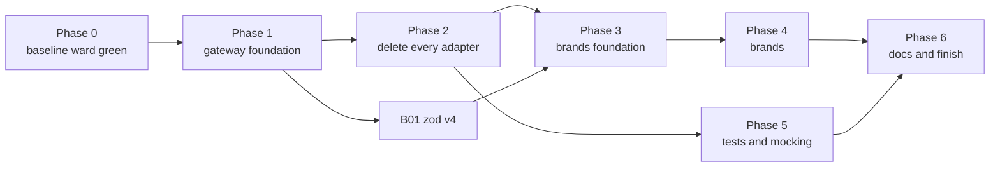

# Brands and gateways: the epic

This file is the operator's run sheet. It lists every work item, the order they run in, which can run
side by side, and what state each is in. Each item is its own file under `items/`. An operator hands an
agent one item's link plus `agent-brief.md`, and nothing else.

Two source docs feed this epic. Neither is edited by the epic; they stay as the record of why.

| Source | What it holds |
|---|---|
| `scrolls/gateway/followup-sustainability.md` | Open work on the four gateway packages under `packages/@gateway/`, and the deletion of every `adapters/` folder |
| `scrolls/brands-types-tests-rules.md` | The rules for brands, library types, returns, tests and mocking, and the lint rules that enforce them |

Every command runs from this worktree's root, `worktrees/gateway-pivot`, on the branch `gateway-pivot`.

## What this epic is trying to do

This epic bridges two large new systems into one. The gateway decides how code reaches anything outside
the repo. The brand rules decide how our own data is typed, checked and tested. The two docs were written
separately, and this epic is a best stab at linking them into one order of work.

The goals:

1. Every object contract, every object nested in it, and every string and number field in it is branded.
   Brand texts are derived, never chosen.
2. The gateway file structure is used as it stands: four packages, `#gateway/<kind>/<subpath>` imports,
   `{subpath}.ts` barrels, one folder per wrapper. The one change is the user's: there are no `_test_`
   barrels. A test imports each stub and proxy from its own file (brands doc C6), in the gateway and in
   workspace packages alike. Item G26 makes that change.
3. Everything works in a consumer repo that `dungeonmaster init` touched, not only here.

As items land, a build error, a type error or a Node, TypeScript or Jest disagreement may show that the
layout planned here does not work. When that happens, the operator tweaks the plan so the whole epic can
succeed. **Every such change is written into "Concessions" below**, with what the plan said, what we did
instead, and why. A concession nobody wrote down is a silent rewrite of the rules, and is not allowed.

Decide by clean architecture. When two designs both work, pick the one with fewer places to keep in step,
and the one that works unchanged in a consumer repo.

## How to operate — the user's standing instructions

1. **At most FIVE sub-agents at a time.** The user raised the cap from three to five this session.
2. **A heartbeat every 30 minutes.** Use `CronCreate` with `13,43 * * * *` (recurring). Do NOT use `/loop` or
   `ScheduleWakeup`; the user asked for cron. It fires only while the session is idle, and dies with the session.
3. **The operator owns builds and commits. A dispatched agent does neither.** Agents also never run `git add` or
   `git mv`: the git index is shared, and one agent's `git mv` was swept into another unit's commit this session.
   Before every commit, run `git diff --cached --stat` and stage explicit paths, never a whole package another
   agent is still editing.
4. **FIX EVERY PRE-EXISTING FAILURE YOU FIND.** The user's words: *"any pre-existing needs to be fixed... we're
   trying to get to a good state with this slew of changes."* A full `npm run ward` must exit 0. A failure an agent
   reports but leaves standing becomes a unit.
5. **Commit on the branch you are on, `gateway-pivot`.** The operator may branch off it when that helps,
   such as giving a large item or a group of agents its own worktree through
   `mcp__dungeonmaster__create-worktree`, so they stop sharing one git index. Every such branch merges
   back into `gateway-pivot` when its work is done, and the operator deletes it and its worktree after
   the merge. Nothing merges anywhere else. Agents still never create branches themselves.

More rules for the operator:

6. **The user gives no input until the epic is marked finished.** When an item is blocked, make a real
   effort to clear it: dispatch an agent to explore the Node, TypeScript, Jest or config disagreement
   behind it. If it still will not clear, mark it `blocked` in the status table with the reason, and move
   on to any item that does not depend on it. Never stop working because one item is stuck.
7. **Use sub-agents for everything that is not coordination:** planning an item's split, implementing,
   writing tests, fixing build errors, and exploring disagreements. The operator reads reports, builds,
   commits and updates this file.
8. **Hand each agent one item file and `agent-brief.md`.** When an item says "operator splits", the
   operator dispatches it as several agents, each given 1 to 3 files for cleanup work or 2 to 4 files for
   migration work, and names the files in the prompt. Use `model: "sonnet"` for large mechanical fan-outs.
9. **Two agents never edit the same package at once** unless the operator has named disjoint file lists
   for them. An item marked "runs alone" runs with no other agent editing its package.
10. **After each item lands:** the operator runs `npm run ward -- --uncommitted` until it exits 0, commits
    the item's paths, then sets the item's row below to `done` with the commit SHA. Build only when
    the `<dungeonmaster-buildDiscipline>` snippet's table, or repo `CLAUDE.md`'s build table, says the
    next thing to run needs compiled output.
11. **Update this file as you go.** Status, blockers and concessions live here, so a fresh session can
    pick up from this file alone.
12. **`create-worktree` branches from the main checkout's HEAD (`master`), not from `gateway-pivot`.** After carving one, run `git merge --ff-only gateway-pivot` inside it before anything else (the pre-bash hook blocks `git reset --hard`), then `npm run build:clean` there, because it arrives with no `dist`.
13. **Keep the consumer suite growing.** Once G27 lands, any item that changes what `init` writes, what a
    package publishes, or how a consumer resolves, loads or tests code adds its assertions to the
    consumer suite in the same item. Before committing such an item, the operator runs
    `npm run build:clean`, then `npm run check:consumer`. G27 lists the items known to need this.
14. **No item is dispatched without a plan that names its files.** Every remaining item's file under
    `items/` carries a `## Plan` section before any agent implements it. The section lists every file
    the item creates, edits or deletes, by full path, grouped into the agent-sized batches of rule 8.
    The operator sizes the job from that list: how many agents, how many waves, and which items can run
    side by side without two agents touching one file. The list is also each agent's complete scope.
    - Not "the adapters in `packages/server`". Write each path.
    - Not "and their callers". Name each caller.
    - Not "about 40 files". Give the list itself.

    An item with no named-file plan gets a planning agent first. That agent reads the code, writes the
    `## Plan` section into the item file, and changes nothing else. Only then is the item implemented.
    A file an implementing agent finds it must touch that is not on the list is reported back to the
    operator, who adds it to the plan before the agent proceeds. The agent never widens its own scope.
## Operator session 2026-09-28 day — agents running

A new operator took over from the morning handoff below. Heartbeat cron `13,43 * * * *` is set. Each agent was told never to commit; commit only its own files when it reports.

| Agent | Chunk | Scope (package) | Status |
|---|---|---|---|
| — | Landed this session | — | See `git log`. **No `adapters/` left in orchestrator (A10 done), web (A17 done), ward, eslint-plugin, shared, hydration-recipes** (plus cli, config, hooks, hydration, mcp, server, tooling from before). Left: siegelense (the SL-MISC2 run), testing (`typescript/mock-calls-to-statements`, `typescript/source-file-getter`, `jest/*`, `msw/*`, `mantine/render`, `child-process/mocker`). Web e2e green at every web commit, last 1790639032876-dda2. |
| a13-pw2 (opus) + agy SL-MISC | A13: playwright facade becomes `browserSessionLaunchBroker` on `chromiumProxy`; misc adapters part 1 | `siegelense` | finished, gate green 1790638393980-31f2; commit waits for SL-MISC2 (same package, still editing) |
| agy SL-MISC2 | A13: the 19 siegelense adapters left | `siegelense` | running |
| t04-orch (sonnet) | T04: orchestrator proxy methods | `orchestrator`, `server`, `hydration-recipes` | done f59076a76: server, hydration-recipes, mcp at 0 |
| a14-ts2 (opus) | A14: last two typescript adapters; ts-jest cache key | `testing` (disjoint) | running |
| a14-msw (sonnet) | A14: `msw/*` adapters; F68 `holdsOpen` raw body | `testing` (disjoint) | running |
| t04-orch2 (sonnet) | T04: orchestrator's own 5; census of other packages | `orchestrator` | running |
| t05-smt (sonnet) | T05: server, mcp, tooling | `server`, `mcp`, `tooling` tests and proxies | running |

Open follow-ups found this session and not yet dispatched: F68 (testing `holdsOpen` raw body), F71 (web stylesheet home, with A19), F72 (T05 rules ignore `registerSpyOn`), F63 (repo jest bump), F10, F30, F47-style checks; T04 remainder (hydration-recipes 5, server 11) needs new orchestrator proxy methods (table in the T04 item); T05 sweeps per package (ward 46c51491c, cli/config/hooks 8e56d3290 all at 0; a combined scan of many packages ran out of memory, so scan one package at a time with `node tmp/t05-scan-pkgs.js <pkg>`).

Still to do in Phase 2: orchestrator misc/timer/spawn (7 adapters), siegelense `read-file` (61 callers), misc singles and playwright session, testing jest/msw/typescript/playwright/misc, web canvas/DOM/IndexedDB/misc/rxjs/testing-library/xyflow and `directory-browse`, hydration-recipes `dm-jsonl/append` (G-J's enforce-folder-return-types test anchors on it). Then A18, A19.

**User decision, 2026-09-28 afternoon: no mutation checks.** Agents no longer break code on purpose to prove a test goes red; the step and the MUTATIONS report section are gone from `agent-brief.md` and `tmp/agy/impl-common.md`. Tests must still assert real values. Script-making (the scripting-opportunities scroll) is tabled.

## Handoff (operator, 2026-09-28 morning) — START HERE

The previous operator stopped here so a fresh session can take over with a small context. Read this section, then "Operator session 2026-09-27 night" below it, then the status tables. Older handoff sections further down are history.

### State at handoff

- No agent is running, and everything is committed. Nothing was branched: every agent worked in this checkout on `gateway-pivot`; no worktree or `gp-*` branch exists.
- **Full `npm run ward` is green**: run 1790620960022-58d3 (lint, typecheck, unit, integration, e2e across 21 packages) on the tree committed last.
- `npm run build:clean` passes. `npm run check:consumer` passes 87 of 89; the two failures are intermittent, show on a cold first run after a fresh install, and are recorded as F59 and F60. Fix those first.
- G24 and T03 are committed with the consumer fix that made T03's probe pass (the published jest base now loads the MSW setup from `dist`, so a consumer runs one MSW server, not two).

### What landed this session (2026-09-27 night to 2026-09-28 morning)

- Adapter items done: A03, A04 (cli), A05 (config), A07 (hooks), A08 (hydration), A09 (mcp), A11 (server), A15 (tooling). `packages/*/src/adapters/` is gone in those packages.
- A12 phase 2 is nearly done: only orchestrator's seven remaining git adapters (A10's GIT-3 and GIT-4) still call shared's `childProcessSpawnCaptureAdapter`. Then re-run the census and start phase 3 (delete `packages/shared/src/adapters/`).
- B06, B17 (B17-1 to B17-9), B18 split (a), G22, F-series fixes (F34 to F57, see the Follow-up table).
- Gateway test support grew a lot: `@gateway/node` proxies read back calls (F29, F43, F44, F46, F51, F55, F57), `streamLinesProxy` and `runProxy` stage by args and cwd, `@gateway/bin` proxies stage through `runProxy`, the browser fetch proxies stage through MSW (F56), and hono has gateway proxies (F49).

### Next dispatch, in order

1. F59 and F60 (intermittent `check:consumer` failures), then `build:clean` + `check:consumer` twice to prove them gone.
2. A10: orchestrator git adapters GIT-3 and GIT-4 (seven left; `## Plan — G-T` in the A10 item lists them), then A10's FS, MISC, TIMER and SPAWN batches (G-CC).
3. A12 phase 3: census, then delete shared's adapters, `adapters.ts`, the "Adapter Proxies" block of `testing.ts` and the `./adapters` export.
4. A16 ward: five `fs/read-file` callers (listed under `### G-BB-1e`), `crypto/hash-files` (F50 landed, so it is unblocked), MISC (`fs/write-file`, `os/tmpdir`) and TS-SHAPE.
5. A06 eslint-plugin: G-I-d part 2 (two callers with raw `existsSync` catch-alls), G-I-c (`eslint/rule-tester`, 76 rule tests plus local-eslint; a mechanical path sweep), G-J (the `eslint/typed-*` adapters, including `typed-return-is-void-like`, into `transformers/`).
6. A13 siegelense: SL-FS1 is unblocked by F57 (re-run `tmp/agy/sl-fs1.md`); then its other fs adapters, misc singles and the playwright/session facade. `closeSyncProxy` still lacks cross-function call ordering for `lane-teardown-broker.proxy.ts:143` (noted in F57's plan).
7. A17 web: F56 landed, so the fetch batch continues (`fetch/get`, `patch`, `post`, `post-with-status`), then canvas/DOM/file, IndexedDB, misc, rxjs, testing-library, xyflow; e2e after xyflow.
8. A14 testing (G22 done), after G24 and T03 commit.
9. F53: two violations left (siegelense `instance-start-broker.ts:355`, web `subagent-chain-widget.tsx:201`), then switch `ban-contract-type-predicates` to `error`.
10. B18 split (b), B02, B14, B04/B05 as `triage-other.md` orders them; T04/T05 fix sweeps per package.
11. Open gateway follow-ups: F45 (eslint proxy), F47, F52, F35, F10, F30, F38-style checks; the F57 census of read-shaped and non-fs proxies.

### Rules this session added (also in the sections below)

- A dispatched agent never forks: a fork carries the parent's whole task and redoes it (F54 measured it; repo `CLAUDE.md` "Dispatching Sub-Agents" has the rule and numbers).
- Never mock a gateway wrapper that has a real body with `registerMock({ fn })`; stage through its proxy (A12 item, `### G-V` Trap sections).
- An eslint-plugin rule mutation is live for every agent's lint while it is on disk: revert it after one test run.
- `agy` gives about a dozen runs per quota window; a run that dies on quota leaves half-edited files for a Claude agent to finish.
- `create-worktree` carves from master, which lacks this branch's zod v4, so verification builds run in this checkout at a quiet point.

## Operator session 2026-09-27 night

- Two read-only triages replace the status table's order of work: `triage-phase2.md` (A rows, dispatch groups G-A to G-DD in waves) and `triage-other.md` (every other open row, with real dependencies). Dispatch from them; re-run a triage when they and the code disagree.
- Rule 14 in practice: planners write `## Plan` for B, G and T items. For a Phase 2 group, the implementer's first step writes the named-file plan for its own group into the item file, and that list is its scope. The shared implementer prompt is `tmp/agy/impl-common.md`; the planner prompt is `tmp/agy/plan-common.md` (launcher `tmp/agy/run-plan.sh`).
- A batch-size exception: when a plan's batches form one chain of return types (B18-1 to B18-10), one agent takes the chain, because split landings leave typecheck red in between.
- **A verification worktree does not work while master has moved past this branch.** `create-worktree` carves from master's HEAD and mirrors master's `node_modules` (no zod v4), and `git merge --ff-only gateway-pivot` fails. Build and `check:consumer` run in this checkout at a quiet point instead: no agent with half-edited files in a package the build compiles.
- `agy` launchers: `tmp/agy/run-plan.sh` (planner), `tmp/agy/run-impl.sh` (implementer, joins `impl-common.md`). `tmp/agy/run.sh` is the old A12-only prompt; do not use it for other items.

## Handoff (operator, 2026-09-27 late)

The operator stopped dispatching here because its context grew large. A fresh operator picks up from this section. Read it first, then the status table below.

### Agents still running at handoff

Each was told never to commit. Commit each one's files, and only its files, when it reports.

| Agent | Scope (files it may edit) | Commit notes |
|---|---|---|
| G22 | `packages/@gateway/npm` (new `jest__globals` subpath), `packages/testing` | Touches `registerMock`'s foundation: run the wide unit regression before committing, then build `@gateway/npm` and `testing`. | todo | Dispatched once and stopped by the user before it changed anything. Its needs, G02 and G03, are done. |

If an agent's notification never arrives (the operator lost track), look for uncommitted files in its scope with `git status`, send a sonnet sub-agent to review them, and commit what is green.

O12 (841b050e7), SL9 (4712d1667) and O10 (c9e2915d9) finished after this handoff was written and are committed. Master merged again (56edcf26a) and hydration-recipes rebuilt. No agent is running. B01 is merged, `npm install` has run, and the four steps below are done.

### A12 (shared adapters) remaining after the running agents

- siegelense (group SL10, todo: dispatched once and stopped by the user before it changed anything): `src/brokers/{recipe/seed-run,recipes/read,step/seed}` (dynamicImport), `src/adapters/process/is-alive/*.test.ts`, `src/brokers/prune/run/*.integration.test.ts`, `test/harnesses/{driver-fleet,seed-home}`.
- orchestrator: `adapters/git/*` (15 folders; the orchestrator's own git adapters on `childProcessSpawnCaptureAdapter`, which move to `run` or to `@gateway/bin`'s git) and `brokers/step-handler/riftcarver/step-handler-riftcarver-broker.ts` (streamLines; do it with or after O12).
- F34 (open): `@gateway/node`'s `streamLinesProxy` cannot read back a call's cwd or command, so O12's two step-handler proxies mock `streamLines` directly by command. Add a `getOptionsFor`-style read-back like F29 gave `run`, then move those proxies onto it.
- shared: three type-only imports in `brokers/architecture/orphan-detect/*.test.ts`.
- Then phase 3: delete `packages/shared/src/adapters/`, `packages/shared/adapters.ts`, the "Adapter Proxies" block of `packages/shared/testing.ts`, and the `./adapters` export. Re-run the census first (the A12 item's "Phase 2 census" gives the method).

### Ready items nobody has started

These rows are `todo` or `ready` with every dependency met; the operator never dispatched them while A12 filled the slots. G22 was one; the user caught it.

- T03 (`ready`, needs T01).
- A03 to A08, A13, A15 (each needs only gateway items that are done). A09 (mcp's own adapters), A11 (server's own) and A10 (orchestrator's own, needs A03) overlap A12's phase 2: A12 moved callers of `shared`'s adapters; these items delete each package's OWN adapters. Check each package's `src/adapters/` before dispatching.
- G22 (todo; its needs are done). A14 needs G22. A16 needs A03, A17 needs G13.
- Items in `review` to close: B01 (above), G24, T04, T05.

### Before the next operator dispatches anything

- **Do not trust the status table's order as the order of work.** The rows and their "Needs" columns are not granular enough to rely on, and things changed during this session that the table does not show (A12's phase 2 ran across every package and overlapped A09 to A13; G22 sat at `todo` with its needs met; new follow-ups F21 to F35 appeared). Send one or two planner agents first, read-only, to check each open row against the code: what is really done, what is really blocked, what the next small chunks are, and which rows overlap. Rebuild the dispatch order from their findings.
- **Watch every sub-agent's run time. Anything past one hour needs attention.** This work is meant to come in small chunks, so an hour-long run means the chunk was too big or the agent is off track. Check its status through a sonnet sub-agent (never by reading the transcript yourself), and split, redirect or stop it. O10 ran 82 minutes and B01's first agent about 6.5 hours; both should have been caught sooner.

### Operator lessons from this stretch

- Stage an agent's own file list only; never `git add` a whole folder that another agent is editing (SH11's commit swept SH12's files).
- Gate every commit on ward's exit code, not its printed summary.
- Run the whole unit suite of every package that composes a changed proxy, not only the changed package; most cross-package reds this session came from that.
- Scan every diff for `as never`, `as unknown as`, `as boolean`, `calledWith([])`, `onceFor([])`, accept-all predicates (`path: () => true` when staging), raw `'fs'`, `'path'`, `'os'` and `'process'` imports, and real `process.cwd()` or `homedir()` in tests.
- A far-off passthrough `join` hides wrong paths (the A12 item's "Trap" section has the fix).
- Agents must not dispatch their own sub-agents (brief rule 6).
- A migration that removes a shared adapter's catch-all breaks every composing proxy that leaned on it, including ones in other agents' uncommitted folders. O10 spent 34 of its 82 minutes (41%) redesigning `step-handler-riftcarver-broker.proxy.ts` for that reason. Before dispatching, list the proxies that compose the brokers in scope, and give those to the same agent or finish the other agent first.
- **A mutation in an eslint-plugin rule file is live for every agent's lint at once.** `eslint.config.js` loads the rules from source, so while a rule is mutated, any package's lint run reports false violations (G-I-b's mutation pass made a sibling agent see 66 missing-stub reports). Mutate an eslint-plugin rule only for the length of one test run, and re-read a lint red that another package reports while an eslint-plugin agent is mutating before acting on it.
- Antigravity (`agy`) is resumed (user, 2026-09-27 night): at most 2 `agy` runs at once, on top of the Claude sub-agents (see "Using Antigravity" below).

## Converting the next repo

One other repo needs the same adapter-to-gateway and brand pivot. It is a consumer: it gets every lint rule this epic ships and everything `dungeonmaster init` scaffolds, so it does not rebuild the tooling. It does have to move its own code. This is the operator's plan for that run. Everything in "How to operate" and the handoff's lessons applies there too.

### What the consumer gets for free, and what it must do itself

| Comes from dungeonmaster | The consumer's operator does |
|---|---|
| The lint rules (gateway rules, `ban-workspace-export-mocks`, `ban-proxy-catch-all-defaults`, `ban-invented-failures`, `ban-proxy-empty-called-with`, and the rest), tagged `pre-edit` and off until switched on | Move its own callers so the rules can be switched on |
| `init` scaffolding: `packages/@gateway/{node,browser}` with real source, empty `packages/@gateway/{npm,bin}`, the `#gateway/*` imports map, node16 tsconfig, per-package jest configs, the I/O trap | Write its own `npm` and `bin` wrappers (the `<dungeonmaster-consumerGatewayWrapper>` snippet says how) |
| The `testing` package: `registerMock`, the proxy-mock hoister, stubs | Replace its own `jest.mock` and adapter proxies with gateway proxies |
| The recipes and traps in `items/a12-adapters-shared.md` | Follow them |

This epic's items that build tooling (the G items that write rules and scaffolding, T01, T02, T04, T05's rule-writing half, F2 to F20's tooling fixes) do not repeat there. Its items that move code (A, B, and T05's fix sweeps) do, in the consumer's own packages.

### Execution plan

1. **Precheck.** The repo must be an npm-workspaces monorepo with packages under `packages/*`. Upgrade `dungeonmaster` to a release carrying this epic, run `dungeonmaster init`, and commit what it writes. Record a baseline full `ward` and keep it: it is the "was it already red" answer later.
2. **Plan with planner agents, read-only, before any edit.** One planner per few packages writes a census like A12's "Phase 2 census": every import of an npm package, a Node builtin and a program (`child_process` calls) per package, every `adapters/` folder, every `jest.mock` and `as never` or `as unknown as`, and what each outside call maps to. Its output is a split into small groups (2 to 6 caller files each) with a dependency order, including which proxies compose which (see the O10 lesson). The operator turns that into an EPIC.md-style status table in the consumer's own `scrolls/`.
3. **Wrappers first.** One small group per outside dependency writes the consumer's `packages/@gateway/npm/src/<package>/` or `packages/@gateway/bin/src/<program>/` folder: wrapper, `.proxy.ts`, `.stub.ts`, with read-back and exact staging in the proxy from the start (so the F25, F29 and F34 gaps never appear). Build the gateway packages after each group lands; other packages typecheck against their compiled output.
   - Every proxy whose wrapper takes an argument ships a `getCallsFor` read-back returning each call's full argument tuple in call order. Here the missing read-back stopped callers one proxy at a time (F43, F44, F46, F55) until F57 swept the whole of `@gateway/node`.
   - A wrapper that spawns a program stages by command, args and cwd (`runProxy`, `streamLinesProxy` since F51), so two calls to one binary can be told apart.
   - A wrapper that wraps another wrapper (every `@gateway/bin` program) stages through the inner wrapper's proxy (`runProxy`), never by mocking the inner function (A03: the two levels cannot share a test).
   - A write-side proxy offers predicate staging for a path minted at run time (a fresh uuid folder), so no caller has to mock the wrapper directly (F52).
   - A browser `fetch` wrapper stages through MSW endpoint handlers, not a spy on `globalThis.fetch`, or it breaks every MSW-staged caller in the same test file (F56).
4. **Move callers, package by package, in small groups.** Same recipe as A12: gateway call in the code, gateway proxy composed and staged by exact argument tuple in the `.proxy.ts`, mutations proving each migrated line. After each group, run the whole unit suite of every package that composes a changed proxy. Scan every diff for the banned shapes listed in the handoff.
   - Never mock a gateway wrapper that has a real body (`run`, `streamLines`, `ensureDir`, a bin wrapper) with `registerMock({ fn })`. It replaces the wrapper for the whole test file and breaks every other composed proxy that needs its body (the A12 item's `### G-V` Trap sections). If the gateway proxy cannot say what a caller needs, the agent stops and the gateway proxy gains it.
   - Import a gateway function only from its barrel (`#gateway/node/fs__promises`); import its proxy or stub from its own file. `#gateway/node/fs__promises/read-file/read-file` does not resolve (G-O).
   - A `.filter((x): x is OurType => ...)` becomes a plain `.filter((x) => x !== null)`: TypeScript 5.8 infers the narrowing, and `ban-contract-type-predicates` refuses the hand-written form (B17).
   - Deleting a package's adapters can change how dungeonmaster classifies it: package-type detection read "HTTP backend" from an adapter folder until the wrap-up added a flow-content check. After deleting a backend package's adapters, run `get-project-map` and confirm the package's type; F58 (the edge-graph grouping) is still open.
5. **Delete the consumer's adapters** once a census shows no caller left (the equivalent of A03 to A17 and A12's phase 3).
6. **Brands.** Follow this epic's B items as they close here (B01 zod v4 first; then B02 onward once A19 lands here). Their item files describe the rules and the order; re-plan them against the consumer's own contracts with a planner agent.
7. **Switch the rules on.** Turn each `pre-edit` rule from off to error one at a time, run its scan, and send the reds out in small fix groups (this epic's T04 and T05 sweeps are the pattern). A rule switched on at `error` must scan clean first; a scan that finds violations registers the rule `off` and lists them (B06 and B17-1 both found violations their planners missed).
8. **Prove it.** A full `ward` green, and the consumer's own e2e run (the browser is the verdict, per CLAUDE.md).

### Operating rules carried over

- At most five sub-agents, small chunks, and any sub-agent past one hour gets checked through a sonnet sub-agent and split or redirected.
- Planner agents before dispatch, again whenever the table and the code disagree.
- Stage only an agent's own files; commit only on ward's exit code; the operator owns builds and commits.
- A migration that removes a catch-all breaks every proxy that leaned on it: give composing proxies to the same agent.
- Agents never dispatch sub-agents of their own, and never fork. A fork carries its parent's whole task and redoes it beside the parent (F54 measured it; this repo's `CLAUDE.md` "Dispatching Sub-Agents" has the numbers). A consumer's `CLAUDE.md` does not carry that section, so every dispatch prompt says it.
- `agy` gives about a dozen runs per quota window; a run that dies on quota leaves half-edited files for a Claude agent to finish from the diff.
- A verification worktree carved by `create-worktree` comes from the main checkout's HEAD; if the consumer's working branch has moved past it (new dependencies), build and `check`-type runs happen in the working checkout at a quiet point instead.

## Machine-wide side effects

**`npm link --workspaces` in this worktree moves every global `@dungeonmaster/*` link onto it.** G24's regeneration step (build, `npm link --workspaces`, `npm run init`, per `CLAUDE.md`'s "Regenerating `.claude/settings.json` Here") was run from `worktrees/gateway-pivot` on 2026-09-27 at 02:33 local. After it, the global npm folder resolved `@dungeonmaster/cli`, `ward`, `mcp`, `shared` and every other workspace package to this mid-migration branch, for every repo on the machine. The user pointed the links back to the main checkout. Before running that step again from a worktree, say so to the user, or run `npm link --workspaces` from the main checkout afterwards. Ward and tests here never need the global links; they resolve through the workspace.

**Master's scan pile-up fix is merged here (e8d789075) and built.** The user fixed the rate-limits poller on master (3e59959e7: one usage-ledger scan per process, stamped at start). The operator merged it, ran ward on its files, and built this checkout's `shared`, `@gateway/*`, `orchestrator` and `mcp`. The whole-repo build stopped at `ward` on W3's half-edited `check-run-lint-broker.ts`, so `server`, `siegelense` and `cli` output is older; the MCP server needs only `mcp` and `orchestrator`. The follow-up in `scrolls/usage-ledger-scan-pileup.md` (one scanner per home, merging writes) touches the ledger write broker this branch changed, so do it on this branch or after it lands.

**Master's MCP caller hook is merged here (7d5b32b90) and built.** Two resolutions: `resolve-caller-session-layer` keeps the hook check first, then `cwd()`; `resolve-subagent-identity-layer`'s hook branch calls `cwd()`. `.claude/settings.json` was regenerated with this checkout's own `node packages/cli/dist/bin/dungeonmaster.js init`, never `npm link`. Built here: `shared`, `config`, `hooks`, `orchestrator`, `mcp`, `cli`. Open: master's c8d7631ed removed siegelense's "THE VERBS YOU CAN SUBMIT TODAY" docs section, but two `docs-statics.test.ts` tests (the ladder, DEF-29) still expect it; red on master too, waiting on the user.

**Build freeze lifted (2026-09-27 evening): the user said a build does not affect the profiling. Whole-repo `npm run build` green at d1c34c095 plus the agents' in-flight source.** Earlier note: The user restarted the MCP servers to profile memory. Building `mcp`, `orchestrator`, `shared` or `hooks` in this checkout rewrites the running server's `dist` and kills it. Queue every build (F29's `@gateway/node`, the stale `ward`, `server`, `siegelense`, `cli`) until the user says profiling is over. Tell every dispatched agent not to build (they never do anyway).

**Master merged again (dac9d876f):** siegelense DEF-43 to DEF-63, the docs-statics test fixes (the verbs-section question is closed), and hydration-recipes' recipe retirement. The status-read conflicts kept master's MEMORY rename and driver-log rows on top of this branch's gateway `join`.

## Using Antigravity (`agy`) agents

The user can lend Antigravity slots on top of the Claude sub-agents. This section records what the operator learns about driving them, and grows as the epic uses them more.

| What | What we learned |
|---|---|
| Slot count | 2026-09-28 afternoon: the user's `agy` status line read 7% of the 5-hour window and 31% of the 7-day window, so both slots are in use. Resumed on 2026-09-27 night: at most 2 at once, because `agy`'s five-hour usage limit is smaller than Claude's. (History: 5 slots at first, then 3 while the user ran `agy` elsewhere.) |
| The CLI | `agy` is at `~/.local/bin/agy`. `agy -p "<prompt>"` runs one prompt non-interactively and prints the final answer. `agy models` lists the models. |
| The model | The user asked for Gemini 3.8 Flash. Pass `--model gemini-3.8-flash-high`. |
| Permissions | Pass `--dangerously-skip-permissions`, or the run stalls on the first tool prompt, because nobody is there to answer it. |
| Launching | Run it through the Bash tool with `run_in_background: true`. The harness notifies the operator when the command exits. The launcher is `tmp/agy/run.sh <group>`. It joins `tmp/agy/common.md` with `tmp/agy/<group>.md`, and writes the answer to `tmp/agy/<group>.out`. |
| MCP tools | The dungeonmaster MCP tools are available inside `agy` (`discover` confirmed). |
| Repo rules | A quiz with no file reads showed it already knows the core rules: `npm run ward -- -- <files>`, `registerMock` rather than `jest.mock`, the banned matchers, no builds, and `discover` rather than grep. It could not name most snippet tags. So the shared prompt restates the hard bans (no git staging or commits, no builds or installs, only scoped ward) and points at `session-snippet-statics.ts`. |
| The prompt | It gets no agent brief automatically. `common.md` carries the brief, the recipe, the ban list and the report format, and each group file adds only the file list and who else is in the package. |
| Watching progress | Print mode writes nothing until the turn ends, apart from a stray fragment or two. Watch progress through `git status` on the group's files, and `ps -eo pid,etime,args | grep 'agy -p'` for elapsed time. After 5 minutes, all five had read files but edited none. |
| The trust dialog, once per directory | Antigravity asks the user to trust `agy` in each new directory, in the app, and `--dangerously-skip-permissions` does not skip it. A worktree is a new directory, so an `agy` agent launched in a fresh worktree waits on that dialog until the user answers it. Ask the user to trust the directory before launching there, or launch `agy` agents only in directories already trusted. Early runs here hit the dialog in this checkout. Before it was cleared, a quiz showed only the core rules. After, a second quiz answered from `<dungeonmaster-buildDiscipline>`, `<dungeonmaster-generatedConfig>` and the ward flags (`--uncommitted`), and listed every dungeonmaster MCP tool. It still names only two snippet tags when asked for all of them, so ask about rule CONTENT, not tag names. It knows grep, find and sed are blocked by a hook, but not that `git reset` is. Keep passing `--dangerously-skip-permissions` either way. |
| Reports and status | The operator reads each `agy` final report (`tmp/agy/<group>.out`) directly, like a Claude sub-agent's report. The operator never reads a worker's raw transcript to learn its status. When status is needed and the agent cannot be messaged through its shell, a sonnet sub-agent looks and answers in a few lines. Reviewing a finished group's diff in depth also goes to a sonnet sub-agent, in a sixth slot kept for review and status checks. |
| The first finished run (H1) | About 30 minutes for four small caller files. The final answer held the report in the requested sections, preceded by a few lines of its own progress chatter ("I will wait for the ward task…"), so read the tail of the `.out` file. It ran scoped ward and a whole-package run, and reported a sibling group's red as not its own, as told. Its mutations only broke return values, never the line it migrated, so the migration itself went unproven; the sonnet reviewer checks that. Ask for a mutation on the migrated line in the prompt. |
| Rule slips seen | HR1 broke a stated ban: it added `registerMock({ fn: mkdir })` on raw `fs/promises` to read calls back, although the prompt forbids a raw mock on the `fs` module. Scan every `agy` diff for `from 'fs`, `'path'`, `'os'`, `onceFor([])`, `calledWith([])` and `as unknown as` before committing. Commit the clean files and send the rest to a fix run. A fix run is a fresh `agy -p` with the defect named and the file list; `agy` print mode cannot be messaged after it exits. |
| Stopping when told | HR1-FIX met the prompt's "if the gateway offers no way, stop and report" clause and stopped cleanly, with no workaround. Write that escape hatch into every fix prompt. |
| Real process state in tests | M1 made two tests build expected paths from the real `process.cwd()` rather than staging `cwd`. The ban list named raw module mocks but not reading real process state, so say it: "never read the real cwd, home or env in a test or proxy; stage it". |
| Good runs | H2 and HR2 followed every rule, proved their tests bite on the migrated line, and needed no fixes. H2 staged `cwd` on its gateway import exactly as the recipe says. |
| Hit rate so far | Of 13 `agy` runs, 9 were clean on the first pass (H2, HR2, C1, C2, C3, C4, M2, GW-ENSURE, M1-FIX). Two needed a fix run (HR1: raw fs mock; M1: real cwd in tests). One stopped correctly when its prompt's escape hatch applied (HR1-FIX). Typical run: 10 to 30 minutes for 2 to 5 caller files. Reports were accurate every time the operator checked them against the diff. |
| Concurrent-edit noise | `agy` agents correctly report reds in files another agent is mid-editing as not theirs. The operator must still re-run those packages once the other agent lands, and must gate each commit on ward's exit code, not on reading its summary: one commit here went in while a transient typecheck red (another agent's half-written file) showed. |
| Agents spawning their own forks | SL7 dispatched two read-only forks that instead redid its whole migration in the same checkout, so its files changed under it mid-run. The three copies converged, but the brief now bans an agent from dispatching sub-agents of its own (50b189a09). |
| Quota exhaustion | SV3 died mid-run when `agy` hit its usage limit: the `.out` ends with `AGY_ERROR ... RESOURCE_EXHAUSTED (code 429): Individual quota reached ... Resets in 3h20m` and the launcher's `AGY-DONE <group> exit=3`. It wrote no report and left its files half-edited. A non-zero exit means: read the tail for `AGY_ERROR`, treat the diff as unreviewed work in progress, and hand the group to a Claude agent to finish from where it stopped. |
| Quota, second time | On 2026-09-28 about 02:55, `agy` hit its individual quota again after about 12 runs this session (reset in 1h14m). The web-fetch run died before changing a file; G-L was mid-ward. Plan for roughly a dozen runs per quota window. |

## Concessions

Each row is a place where this epic departs from a source doc. The first rows were decided while the epic
was planned. Add a row whenever execution forces another.

| # | Source doc said | We do instead | Why |
|---|---|---|---|
| 1 | Gateway follow-ups, "Gateway standards as built" and item 45: every package has a `./_test_/*` export and a `<subpath>.proxy.ts` test barrel, and callers import `#gateway/<kind>/_test_/<subpath>`. | The brands doc wins (C6), by the user's decision on 2026-09-26: no `_test_` barrel and no `_test_` import path anywhere. A test imports each stub and proxy from its own file: `#gateway/node/fs__promises/read-file-if-exists/read-file-if-exists.proxy`, or `@dungeonmaster/orchestrator/startup/start-orchestrator.proxy`. Each package's `exports` holds three keys: `"./*.proxy": "./src/*.proxy.ts"`, `"./*.stub": "./src/*.stub.ts"` and the barrel key `"./*": "./src/*/*.ts"`, each with the usual conditions. G26 makes the change in the gateway; B03 makes it in workspace packages. | No barrel of test support to keep current. A probe on 2026-09-26 showed Node and TypeScript (`node16`, `source` condition) resolve all three key forms from one package: a more specific pattern key beats `./*`. Jest's resolver and the proxy-mock hoister are not proven yet; G26 proves them first. |
| 2 | Brands doc T6 builds each workspace package's own proxy in step 10, near the end. | Orchestrator's own proxy (`startOrchestratorProxy`) is built in Phase 2, item A00, before the forwarder adapters are deleted. The lint rule `ban-workspace-export-mocks` still lands in Phase 5. | Server and mcp have 65 adapters that only forward into orchestrator. Deleting them leaves their callers' tests nothing to mock except orchestrator's exports, which T6 forbids. The proxy has to exist first. |
| 3 | Gateway follow-up item 45 (every workspace package's `exports`) and brands doc C6 (stubs and proxies out of production barrels, imported per file) are two separate pieces of work. | One item, B03, does both, using row 1's three-key `exports` form. | They move the same barrels and rewrite the same import lines. Two passes would touch every file twice. |
| 4 | Gateway follow-up item 25 is one item. | Split three ways: G16 (the colocation rule, recorded-failure stubs and Node library stubs), G17 (AST, rule-context and TypeScript stubs), G18 (a stub for every remaining subpath). | Each part is a different kind of work, and G17 alone is large. |
| 5 | Gateway follow-ups, "Gateway standards as built": each gateway's `exports` targets carry the conditions `gateway-dist`, `source`, `import`, `require` and `types`. | Each gateway also carries a `<kind>-own-source` condition first (`npm-own-source`, `node-own-source` and so on), and only that gateway's own `tsconfig.build.json` activates it. `init`'s gateway scaffold writes it too. Commit 9bf4bf74d. | A gateway's build reached itself through `testing` and `shared` (for example `#gateway/npm/zod`), resolved that to its own `dist` under `gateway-dist`, and then failed every warm build with TS5055. TypeScript's conditions are active for the whole program, so no shared condition can tell a self-reference from a cross-gateway one; `paths` cannot express the folder-named layout (TS5062). |
| 6 | `scrolls/adapters-to-one-place.md` direction 8, and item A02: workspace packages call each other directly, with no wrapper. The folder config lets `responders/` import no other workspace package. | `responders/` may import `@dungeonmaster/orchestrator` directly, as `brokers/`, `contracts/` and `bindings/` already may. | Every caller of a forwarder adapter in `server` and `mcp` is a responder. Once the adapters go (A02, then A19 removes the folder type), a responder has no other legal way to reach `orchestrator`. Calling a lower-level orchestrator broker instead would skip the orchestrator responder's own logic; `guild remove`'s process cleanup is the proven case. |
| 7 | G22 item: every bare `jest.*` call in production test support goes through `#gateway/npm/jest__globals`. | A `registerModuleMock` factory keeps the bare `jest.requireActual` (and `jest.fn`) global. Four orchestrator proxies did this; F35 (63d807fa7) removed it from `quest-route-scope`, `quest-run-step` and `step-handler-riftcarver`, and a10-fs3 from `quest-node-dispatch-loop`. None remain, so the concession is historical once a10-fs3 commits. | The proxy-mock hoister re-parses the factory as standalone text and prepends it above every import in the file that loads the proxy. An imported wrapper is not initialised there; the trial failed with `ReferenceError: gatewayRequireActual is not defined`. Only a Jest-injected global survives the hoist. |
| 8 | Concession 1: a package's test support is imported per file through `"./*.proxy"`, `"./*.stub"` export keys. | eslint-plugin's rule-tester harness is exported under one explicit key, `"./rule-tester.harness"`, with only a `source` condition, pointing at `test/harnesses/rule-tester/rule-tester.harness.ts`. | `local-eslint`'s rule tests need the harness, and `test/**` is outside the build and `files`, so no `dist` target exists. Ward's Jest and tsc set `source`. Commit 235a64368. Check that `check:published` accepts a source-only key at the next build. |
| 9 | Folder types hold all code; external package imports go through `#gateway/*` and are refused in `widgets/`, `startup/`, `responders/`, and `assets/` may not import npm packages. | Web's global stylesheet imports (`@mantine/core/styles.css`, `@mantine/notifications/styles.css`, `@xyflow/react/dist/style.css`) live in `packages/web/src/main.ts`, the Vite entry `index.html` loads. | CSS side-effect imports are not code a gateway can wrap, and no folder type allows them; the Vite entry is the one file outside the folder types that the bundler loads first. F71, commit pending with W-LAST. |

## Status key

| Status | Meaning |
|---|---|
| `todo` | Not started |
| `ready` | Every dependency is `done`, so it can be dispatched now |
| `active` | An agent is working on it; the Notes column names the agent |
| `review` | The agent reported; the operator is checking ward and the diff |
| `done` | Committed; the Notes column holds the SHA |
| `blocked` | Tried and stuck; the Notes column says why and what was tried |

## The order of work

Phases run roughly in order, but an item may start as soon as every item in its "Needs" column is
`done`. Items in the same phase with no link between them run side by side, up to five at once.

Phase 0 must finish before an item's own ward run means anything, but Phase 1 items that touch only
tooling may start while Phase 0's fixes are in flight.

Each item that adds or changes a lint rule also: tags it `'pre-edit'` in
`packages/shared/src/statics/dungeonmaster-rule-enforce-on-statics.ts` only when the item file says it can
run pre-edit; updates the teaching text rows the item file names; and runs the rule as a scan over the
whole repo before switching it on, hand-checking a sample of what it flags and what it lets through.

### Phase 0 — a green baseline

| ID | Item | Needs | Runs with | Status | Notes |
|---|---|---|---|---|---|
| P0-1 | [Full `npm run ward` exits 0, including the slow `cli` install test](items/p0-1-baseline-ward.md) | — | any Phase 1 item outside the failing packages | done | Full ward on `a72edb985` exited 0 (run `1790490064405-d32d`, 783s). The `cli` slow-test gate did not trip on that run; Z07 rechecks it. |

### Phase 1 — gateway foundation

Mostly tooling and the gateway packages themselves. Most items here are independent.

| ID | Item | Needs | Runs with | Status | Notes |
|---|---|---|---|---|---|
| G01 | [One list of gateway folder names](items/g01-gateway-folder-names-one-list.md) | — | any | done | 090d01fdd. It also removed a sixth hand-typed copy in `packageScaffoldConfigStatics`; `create-package` now calls `gatewayImportsFieldTransformer`. |
| G02 | [Build order ignores `devDependencies`](items/g02-build-order-ignores-dev-deps.md) | — | any | done | b8132dee1. Ward has no check type for root `scripts/`, so none ran. The build proof rides on the next operator build. |
| G03 | [Publish `@dungeonmaster/testing` publicly](items/g03-publish-testing-public.md) | — | any | done | b09a13acc. Found: the published `jest-config-base.js` wires only `jest.setup.js`, so a consumer gets no sandboxed `HOME`. That gap is T07's job. |
| G04 | [Delete the hand-written MCP SDK types](items/g04-delete-hand-written-mcp-sdk-types.md) | — | any | done | b6b79b1f4. The real SDK types mark the bare `Server` constructor deprecated, so the server is now built as `new McpServer(...).server` through a new subpath, `#gateway/npm/modelcontextprotocol__sdk__server__mcp`. G18 must stub that subpath. |
| G05 | [Error classes live in `.error.ts` files](items/g05-error-classes-in-error-files.md) | — | any outside `@gateway/bin`, `@gateway/node` | done | a44b74c6f; bin and node rebuilt. Error classes live in `<name>.error.ts` beside their wrapper, and `lsof` gains `lsofRun`. A flake remains: ward on the bare `gateway-colocation` directory sometimes trips the I/O trap on a RuleTester or esbuild worker cold start (see F16). |
| G06 | [A per-name `type` import is not a value](items/g06-type-import-specifiers-skipped.md) | — | any | done | e78c7936b. The transformer parses with a regex, not an AST, so the fix reads the `type ` prefix text. Whole `import type` lines were also mishandled, and are fixed too. |
| G07 | [Turn on `@typescript-eslint/no-shadow`](items/g07-no-shadow.md) | — | runs alone per package | done | d537e51ca. The rule was already `error`, every package has 0 shadows, and it is now tagged `pre-edit`. |
| G08 | [`node16` in the published base tsconfig; one ts-jest options entry](items/g08-node16-base-tsconfig-and-ts-jest.md) | — | any not editing jest or tsconfig files | done | Done: 7dcaf21ec, 07152b725, 27af89b4c, 8f31f0b56. Every package and `create-package`'s templates require `testing/ts-jest/options.js`, which derives from `published-options.js`. `@gateway/npm/jest.config.js` too (a7e9572a7). `web` keeps its own ts-jest config: it points at a real `tsconfig.test.json` for JSX and names only the proxy-mock transformer. `testing` has no `./ts-jest/*` export, yet its `transformers.js` header says consumers can require it; G25 checks this. |
| G09 | [Tool tests use the current gateway layout as sample data](items/g09-tool-test-fixtures-current-layout.md) | — | any | done | 85205d640. `is-proxy-import-guard` dropped its `_test_` branch. Some `_test_` strings remain on purpose: generic key-matching tests, and comments that name the barrels still on disk until G26 step 4. |
| G10 | [Ward's `lint` runs the platform and dedupe checks](items/g10-platform-and-dedupe-into-ward-lint.md) | — | any outside `ward` | done | b6231e81b; ward rebuilt. `npm run ward -- platform` and `-- dedupe` are gone. Z06 must fix the scrolls that still name them. |
| G11 | [Per-package tests for the gateway layout](items/g11-gateway-layout-package-tests.md) | G01 | any | done | d3f170e5a. The tests are `*.integration.test.ts`, because `enforce-test-colocation` refuses a package-root `.test.ts`. The gateway tests inline their small lists, because `gateway-import-boundary` bans importing `shared`. |
| G12 | [The `gateway` key in `.dungeonmaster.json` and its lint rules](items/g12-gateway-config-key-and-rules.md) | — | any | done | cff56a3c5, ebbe3122b. `gatewayLintConfigContract` lives once, in `shared`, and `shared` is rebuilt. Keep this in mind: a contract that `eslint.config.js` reaches through another package needs that package rebuilt before lint sees it. |
| G13 | [The Mantine-wrapped `render` moves to `@dungeonmaster/testing`](items/g13-mantine-render-to-testing.md) | G12, G26 | any outside `web`, `testing` | done | 562a2d6a7, with the lockfile updated for `testing`'s new dependencies. `web`'s own `mantineRenderAdapter` remains for A17. |
| G14 | [Lint rules that keep gateway barrels honest](items/g14-gateway-barrel-lint-rules.md) | G05, G26 | any | done | 0d3b984cf, e20ca3f51. Four barrel checks. Each gateway keeps test support in one reserved folder, `src/gateway-test-support/` (npm now included). `enforce-proxy-*` judge block-bodied and implicit-return proxies alike. |
| G15 | [A gateway function returns a real type or `unknown`](items/g15-gateway-returns-unknown-not-caller-type.md) | — | any | done | eda4a46fe. `gateway-return-unknown-not-caller-type` runs in the gateway config only (type-aware), so it has no enforce-on entry, the same as the other gateway-shape rules. `fetchJson` and `dynamicImport` return `unknown`, and nothing outside the gateway calls them. |
| G16 | [Gateway stubs: the colocation rule, recorded failures, Node library types](items/g16-gateway-stubs-node-and-failures.md) | G26 | any | done | 870d29f24, which also swept in T01's `@gateway/node/jest.config.js` edit. Recorded failures come from really failing (ECONNREFUSED, EADDRINUSE, ENOTFOUND, ESRCH, ENOENT). `gateway-colocation` takes `requireStub`, off until G18 turns it on in config. |
| G17 | [Gateway stubs: AST nodes, rule context, TypeScript source file](items/g17-gateway-stubs-ast-and-typescript.md) | G26 | any | done | 26f7286ed. `parseAndFindNode` plus 14 AST-node stubs, `RuleContextStub` and `SourceFileStub`, all imported per file. It adds `@typescript-eslint/typescript-estree` to `@gateway/npm` `dependencies`; the operator must update the lockfile (`npm install --package-lock-only`) at a quiet point. |
| G18 | [A stub for every remaining gateway subpath](items/g18-gateway-stub-every-subpath.md) | G16, G17 | any | done | c543e1e18, 181bffbcf, 009a9a80f, and the requireStub switch-on after 3c4cd720a. For T05 and T08 to review: npm's `ServerStub` opens a real port; `MatcherAugmentedStub` returns `true`; node's fetch-json and fetch-ok proxies build `Response` with casts, where `FetchResponseStub` exists. |
| G19 | [Gateway proxies use recorded failures and drop catch-all defaults](items/g19-gateway-proxies-recorded-failures-no-catch-all.md) | G16, G26 | any | done | 7fbf2d6ce. No catch-all defaults remain. fs__promises proxies offer named recorded failures; fetchJson offers `setupConnectionRefused`; `@gateway/browser` depends on `@gateway/node` for the stub. Still open: the write-side fs__promises proxies take a typed `rejects({error: FsError})`, which T05 judges. It also cleared 2 of F1's 5 hits (`stat`, `stat-if-exists`). |
| G20 | [Gateway schemas branded `#Gateway<Type>`](items/g20-gateway-schemas-gateway-brand.md) | G16 | any | done | 23f562ee2 (lockfile updated; node rebuilt). `childProcessSchema` and `walkedFileSchema` exist; the rule is `gateway-schema-brand`, gateway config only. No `Stats` schema yet, because no contract holds `fs.Stats`; add one when B06 needs it. |
| G21 | [Gateway proxies offer loose addressing and call read-back](items/g21-gateway-proxy-addressing-read-back.md) | G19, G26 | any | done | 7467c0cf7 (node), 5b893896f (bin, browser). Each package has one matcher type file (`bin/src/arg-matcher`, `browser/src/value-matcher`, `node/src/fs__promises/path-matcher`). A proxy whose fake has no argument to key on records calls only. Lesson: a cross-gateway import typechecks against the target gateway's `dist`, so rebuild the target after adding a file another gateway imports. |
| G22 | [Jest goes through the gateway](items/g22-jest-through-gateway.md) | G02, G03 | any outside `testing` | done | 6873a3fb6 (`#gateway/npm/jest__globals`, built), 5f9837295 (spy-on, require-actual, isolate-modules adapters), and the G22-12 commit (child-process mocker). G22-13 is concession 7. |
| G23 | [The discovery tools show the gateway as `#gateway`](items/g23-discovery-tools-show-gateway.md) | G12 | any | done | 3977a3251, 2e1fae51d. `shared`, `mcp` and `hooks` are rebuilt; a live session needs an MCP reconnect and a new session to see it. The literal `@gateway` group-folder name is written in two places, the `hooks` responder and `architecture-gateway-inventory-broker`; fold it into `gatewayLocationsStatics` when either is next touched. `shared`'s `gatewayLintConfigReadBroker` and eslint-plugin's `configGatewayLintConfigBroker` both read the `gateway` key. |
| G24 | [Tell a consumer's agent how to add an npm or bin wrapper](items/g24-consumer-npm-bin-wrapper-snippet.md) | — | any | done | b6ce9b203, c03a24d4f, 64f3206f2, and the wrap-up commit: the jsdom polyfills live in `testing` (`./jsdom-polyfills`), and every jest config, the gateway scaffold and the frontend-react seed point at it; `init` no longer copies `__mocks__`. `web` keeps its own copy (it also stubs `performance.markResourceTiming`). |
| G25 | [`init` works end to end in a scratch consumer](items/g25-consumer-init-end-to-end.md) | G03, G08 | any | done | 62de99da9, merged in b430a2100. Two scratch consumers under `/tmp` ran `init`, typecheck, test and build green. Fixes: - `packageDiscoverBroker` scans `node_modules` in a consumer - `siegelense` joins `devDependenciesStatics` - the published Jest base transforms `@dungeonmaster/testing` - the published ts-jest options set `diagnostics: false` (see G27) - the scaffolded `eslint.config.js` wires the gateway carve-out - four `@gateway/node` fixes for newer tool versions  Left for unit **F1**: a consumer's newer `@typescript-eslint` (8.70.1 against the repo's 8.45.0) fails lint on `@gateway/node`: 5 proxies report `no-unused-vars` on types used in `as unknown as X`, and `fetch-ok.ts` reports `no-deprecated` on `util.types.isNativeError`. |
| G26 | [Stubs and proxies are imported from their own files; the gateway's `_test_` barrels go](items/g26-per-file-proxy-and-stub-imports.md) | — | any outside `@gateway/*` and `testing` | done | 3e8d30de1, 55b993cfa, f8eab6107, fdca16800, c7409c6b5, 4b0728ba0, d3f170e5a. No `_test_` key or barrel exists; the 22 barrels are deleted. G23 removes the dead `gatewayLocationsStatics.testSubpath`. Concession 1 is realised. |
| G27 | [A test suite proves a fresh consumer repo is bootstrapped correctly](items/g27-consumer-repo-test-suite.md) | G25, G26 | any | done | a5ecf226e, merged in 7a5f7517f. `npm run check:consumer` (after `build:clean`) lives in `scripts/consumer-check/`, outside ward by design. The last run had 43 passing and 13 failing checks, each traced to F1, F5 to F9. `hooks`, `mcp` and `ward` gained `publishConfig`, and the published Jest base transforms every `node_modules` ESM file. |

### Phase 2 — delete every adapter

The biggest phase. Each package's item moves its callers onto gateway exports and turns what is left into
brokers, transformers or statics, then deletes every adapter with its proxy, test and stub.

A package item may start once A00 to A02 are `done` and every Phase 1 item in its own "Needs" is `done`. The operator also holds each package's own A item until A12's sweep of that package is done, because both would edit the same import lines (A12's Traps).
Package items run side by side, one agent group per package. Each is split by the operator into agents of
2 to 4 adapters each.

| ID | Item | Needs | Runs with | Status | Notes |
|---|---|---|---|---|---|
| A00 | [Orchestrator ships its own proxy](items/a00-orchestrator-own-proxy.md) | P0-1, G26 | any outside `orchestrator` | done | 6a8898f2b. `StartOrchestratorProxy` is PascalCase. `enforce-implementation-colocation` allows a startup proxy. `enforce-proxy-child-creation` recognises bare workspace-root imports, taking the scope from the real workspace. `orchestrator` and `config` are rebuilt. Note: `find-workspace-root-layer-broker` is now copied in two rule folders (follow-up F4). |
| A01 | [Delete the adapters the trials left without callers](items/a01-dead-adapters.md) | P0-1 | any | done | 7751fb471, d52d180cb. The `testing` row was a false positive: `web`'s claude-mock and ward-mock harnesses import `fs-queue-metadata-read-adapter`, so it stays for A14 (row FS-2). Tell A02: server has 46 orchestrator forwarders, not 47. Tell A03: orchestrator's `process-kill-by-port` adapter was dead and is gone. |
| A02 | [Delete the forwarder adapters](items/a02-forwarder-adapters.md) | A00 | any outside `mcp`, `server` | done | Every forwarder deleted in 3747a95c0; every caller calls orchestrator or config directly. It becomes `done` once F19 (hoister property-access mocks and removing the proxy workarounds) and F18 (config's black-box proxy) land and the server, mcp and orchestrator unit suites run green whole. Four A02 proxies still import stubs from `@dungeonmaster/orchestrator/testing` (the `quest-handle`, `quest-resume`, `quest-start` and `dispatch-play` proxies); B03 moves them to per-file stubs. | Closed: F21 (50b65c0cd), F22 (c2f89acad) and F27 (4863ee390) cleared every whole-package red.
| A03 | [One broker lists what is on a port and kills it](items/a03-port-kill-broker.md) | G21 | any outside `orchestrator`, `ward` | done | The A03 commit: `portKillListenersBroker` in shared over `#gateway/bin` lsof and kill; ward's net adapters gone; every `@gateway/bin` wrapper proxy stages through `runProxy`. Ward's e2e teardown now throws if `lsof` or `kill` is missing. A10 and A16 are unblocked. |
| A04 | [Adapters: `cli`](items/a04-adapters-cli.md) | G05, G15, G19, G21 | other A items | done | G-E 970811fea, G-F cebe0acb2. `packages/cli/src/adapters/` is gone. cli now depends on `@dungeonmaster/npm`. |
| A05 | [Adapters: `config`](items/a05-adapters-config.md) | G05, G15, G19, G21 | other A items | done | ef06670a6. `packages/config/src/adapters/` is gone. `dirname` and `join` run for real (no mock), because `configRootFindBrokerProxy` already stages that singleton. Only orchestrator and siegelense compose `config-resolve-caller.proxy.ts`. |
| A06 | [Adapters: `eslint-plugin`](items/a06-adapters-eslint-plugin.md) | G05, G15, G19, G21 | other A items | active | G-I-a done (7da827a23, eslint-plugin rebuilt). F48 done; G-I-b done for exists-sync and write-file-sync (the G-I-b commit, eslint-plugin rebuilt); G-I-d part 1 done (e1ac7a47f): ten `read-file-sync` callers moved; part 2 is two callers whose proxies also carry a raw `existsSync` catch-all (`find-nearest-package-json-layer-broker`, `resolve-gateway-scope-layer-broker`); G-I-c (`eslint/rule-tester`, 76 rule tests plus local-eslint) a mechanical sweep; G-J (with `typed-return-is-void-like`) after. G-I-a keeps one raw `registerMock({ fn: readFileSync })` in enforce-proxy-child-creation's proxy, under the per-path exception the A12 item's Trap documents. |
| A07 | [Adapters: `hooks`](items/a07-adapters-hooks.md) | G05, G15, G19, G21 | other A items | done | G-K1 e5947b88a, G-K2 66b93f775, G-L f13f77134 (shared and hooks rebuilt). `packages/hooks/src/adapters/` is gone. The pre-edit rule names come from shared's `preEditRuleNamesExtractTransformer`; `preEditLintConfigContract` stays in hooks, which uses it widely (the item's own escape hatch). F45 (a gateway eslint proxy) remains. |
| A08 | [Adapters: `hydration` and `hydration-recipes`](items/a08-adapters-hydration.md) | G05, G15, G19, G21 | other A items | done | G-M 38b5eb777, G-N 39ecde862, G-O 852830806. Neither `hydration` nor `hydration-recipes` has an `adapters/` folder. hydration-recipes' three shared-adapter callers are A12's group G-P (on agy). |
| A09 | [Adapters: `mcp`](items/a09-adapters-mcp.md) | A02, G05, G15, G19, G21 | other A items | done | G-A f641316fe, G-B (the A09 G-B commit). `packages/mcp/src/adapters/` is gone. Two real-file checks moved to F39. |
| A10 | [Adapters: `orchestrator`](items/a10-adapters-orchestrator.md) | A03, G05, G15, G19, G21 | other A items | done | `packages/orchestrator/src/adapters/` is gone (2026-09-28 afternoon). Earlier: | G-T done (596bbd1e3): `adapters/git/` is gone. FS, MISC, TIMER and SPAWN batches (G-CC) next. |
| A11 | [Adapters: `server`](items/a11-adapters-server.md) | A02, G05, G15, G19, G21 | other A items | done | G-C fc74b4ea9, G-D 39daffdbf, F44 callers (the A11-done commit). `packages/server/src/adapters/` is gone. F49 (hono proxies) and F51 (quest-new's direct `rm` mock) remain. |
| A12 | [Adapters: `shared`](items/a12-adapters-shared.md) | G05, G15, G19, G21 | other A items | active | Phase 2 (callers outside shared) is down to orchestrator: G-T (its git adapters onto `#gateway/bin/git`, agy) and G-U (six quest brokers, agy). Done this session: G-P 17f50bd7e, G-Q in dfab97eed, G-S 5ff40971b, G-V 9dfbba5ca. Then phase 3 deletes `packages/shared/src/adapters/` after a fresh census. Earlier history: see the A12 item file. |
| A13 | [Adapters: `siegelense`](items/a13-adapters-siegelense.md) | G05, G15, G19, G21 | other A items | active | A12's G-S done (5ff40971b), so A13 is unblocked. SL-FS1 (fs append-file, close-fd, copy-file, cp) planned and stopped, no files changed: all four gateway proxies lack call read-back (F57, active). It re-runs after F57. The other 12 fs adapters, 18 misc singles and the 13-file playwright/session facade follow. |
| A14 | [Adapters: `testing`](items/a14-adapters-testing.md) | G22 | other A items | ready | G22 is done. Group G-Y in `triage-phase2.md` (A14's batches plus `msw/ws` and `typescript/ast-to-local-export-names`). |
| A15 | [Adapters: `tooling`](items/a15-adapters-tooling.md) | G05, G15, G19, G21 | other A items | done | 5f4dcd0af. Only `typescript/parse` was left (the rest went in 7751fb471); its AST walk is now `typescriptParseBroker`. `packages/tooling/src/adapters/` is gone. |
| A16 | [Adapters: `ward`](items/a16-adapters-ward.md) | A03, G05, G15, G19, G21 | other A items | done | e43c1c424, 7f79340c8: `packages/ward/src/adapters/` is gone. Earlier: | `## Plan — G-BB-1` written (11 adapters, 24 callers, 48 files with proxies) and split by adapter: G-BB-1a done (c833d4923, ward rebuilt); G-BB-1b done for mkdir, read-json-sync, readdir-dirs, readdir (the G-BB-1b commit, ward rebuilt); `fs/read-file` (18 callers) and `fs/unlink`'s check-run callers are G-BB-1e; G-BB-1c done for rename, rm, stat (the G-BB-1c commit, ward rebuilt); `fs/unlink` waits for F55; G-BB-1d (`crypto/hash-files` into `bundle-hash-files-broker`) waits for F50. MISC and TS-SHAPE after. |
| A17 | [Adapters: `web`](items/a17-adapters-web.md) | G05, G13, G15, G19, G21 | other A items | done | `packages/web/src/adapters/` is gone (the W-LAST commit). Earlier: | F56 and F61 cleared the block. fetch/post and fetch/get mostly done (b30627b03, e1076c324, ace08af85); F65 has the last five. Earlier: | Fetch batch blocked, nothing changed: `@gateway/browser`'s fetch proxies spy on `globalThis.fetch` and throw on any unmatched call, so one migrated broker breaks every MSW-staged caller in the same test file (write-up in the item). F56 (active) moves those proxies onto MSW endpoint handlers and proves it on quest-delete and comment-batch. The other batches wait for F56. |
| A18 | [Raw outside calls that never had an adapter; drop duplicate package deps](items/a18-raw-calls-and-dependency-cleanup.md) | A04–A17 | — | todo | operator splits per package |
| A19 | [`adapters` stops being a folder type; caller-facing lint rules on](items/a19-adapters-folder-type-gone-caller-rules-on.md) | A18 | — | todo | runs alone |

### Phase 3 — brands foundation

| ID | Item | Needs | Runs with | Status | Notes |
|---|---|---|---|---|---|
| B01 | [Upgrade zod to v4](items/b01-zod-v4.md) | G15 | Phase 2 items whose files it does not touch | done bf8e0d2f6 | Merged into gateway-pivot; `npm install` run, zod 4.6.5 resolves. The worktree `worktrees/gp-b01-zod4` and branch `gp-b01-zod4` still exist; delete them once the steps below are green. |
| B02 | [The contract index, and unused contracts deleted](items/b02-contract-index-and-unused-contracts.md) | A19 | B01, B07 | todo | |
| B03 | [Package `exports` serve barrels and per-file stubs and proxies; stubs and proxies out of production barrels](items/b03-package-exports-and-per-file-test-imports.md) | B02 | B04, B05 | todo | concessions 1 and 3; operator splits per package. Also: define one sanctioned home for a package's caller-facing proxy (F18's `config-resolve-caller.proxy.ts`, and orchestrator's `startup/start-orchestrator.proxy.ts`), and move A02's four `@dungeonmaster/orchestrator/testing` stub imports to per-file imports. |
| B04 | [Lint rules use the real `TSESTree` and the gateway's AST stubs](items/b04-eslint-rules-on-real-tsestree.md) | G17, A06 | B05 | todo | operator splits per rule folder |
| B05 | [Every other copied library type goes](items/b05-other-library-type-copies.md) | G16, A07, A14 | B04 | todo | |
| B06 | [Contract fields of outside types use the gateway's schemas](items/b06-gateway-schema-fields-in-contracts.md) | G20, B01 | any | done | dd2d7332d; `shared` and `eslint-plugin` rebuilt. `enforce-gateway-schema-fields` reports a `z.custom<T>`/`z.instanceof(X)` field only when the type is imported from outside the repo; language globals and our own types pass. Scan: 0 of 1125 contract files. Not dead after all, so B02 must drop them from its list: `eslint-context-contract.ts` (every rule imports its type) and tooling `exec-error-contract.ts` (a harness uses its stub). |
| B07 | [Layer files in four more folder types; regex allowed in statics](items/b07-layers-and-statics-regex.md) | P0-1 | any | done | 2a9e3537e. It missed two `enforce-project-structure` layer tests, which agent fix-b07-g07 is fixing. Build `shared` before lint outside ward, or the MCP server, sees the new folder config. |

### Phase 4 — brands

| ID | Item | Needs | Runs with | Status | Notes |
|---|---|---|---|---|---|
| B10 | [The owner index for B4, C8 and the indexed brand checks](items/b10-owner-index.md) | B02 | B14, B17, B18 | todo | |
| B11 | [A contract name is unique across packages](items/b11-unique-contract-names.md) | B10, B03 | B14, B17, B18 | todo | fixes the `FolderType` bug |
| B12 | [`require-object-contract-brands` and its autofix](items/b12-require-object-contract-brands.md) | B01, B10 | B13, B14 | todo | |
| B13 | [A field that holds another object's field reuses it](items/b13-owner-field-reuse.md) | B10 | B12, B14 | todo | |
| B14 | [No field-type aliases; object types that leave a function are contracts](items/b14-type-alias-and-adhoc-type-rules.md) | A19 | any | todo | operator splits the shape fixes per package |
| B15 | [Brand the repo](items/b15-brand-migration.md) | B06, B07, B11, B12, B13, B14 | — | todo | operator splits per package; the largest item in the epic |
| B16 | [An owner is a real object; an id is never re-branded](items/b16-real-owner-and-id-rebrand.md) | B15 | T-items | todo | |
| B17 | [No type predicate onto our types; parsed JSON goes straight into a parse](items/b17-predicates-and-json-parse.md) | G15, B01 | any | active | Plan written (32 batches). Done: B17-2 to B17-9 (96d32bdf3, d27b3cb19, 621f587a4, and B17-6 in the A11-done commit). B17-1 (the rule) active, agent b17-rule; then B17-10 onward. |
| B18 | [A function returns what its calls told it](items/b18-returns-say-what-happened.md) | A19 | any | active | Split (a) done: B18-11 to B18-13 52686cc4a (the rule is ward-only and allows `void` unless an informative result is discarded), B18-1 to B18-10 7af5d71a7 (every bootstrap returns `void`, orchestrator rebuilt). Split (b), the broad census of `{ success: true }` returns and `adapterResultContract`, is next; its plan defers packages that still have `src/adapters/`. |

### Phase 5 — tests and mocking

| ID | Item | Needs | Runs with | Status | Notes |
|---|---|---|---|---|---|
| T01 | [MSW loads in every package and fails on anything unhandled](items/t01-msw-everywhere.md) | G08 | any | done | 02176f3c5. MSW loads through the base configs; 11 redundant per-package `setupFilesAfterEnv` overrides that hid it are gone. `testing`'s own `jest.config.js` does not spread the base, so it keeps its own entry. The WebSocket catch-all `ws.link('*')` would also close a connection that a future test mocks itself; see T02/T03. |
| T02 | [The I/O trap covers every way out of the process](items/t02-io-trap-every-way-out.md) | T01 | any | done | 7134a7159. Network modules are trapped by mutating them in place, because a `jest.mock` factory loses to msw's static `node:net` import. Still open, as the item says: `fs` and `child_process` classes pass through, and a late call can drain against the wrong test. |
| T03 | [MSW handlers are checked against the server's contracts](items/t03-contract-checked-handlers.md) | T01 | any | done | The wrap-up commit. `StartEndpointMock.listen` takes an optional `contract`; quest-comment-batch's proxy has `httpEndpoint()`. `check:consumer` proves it in a real install. Open: `.responds()` and `.respondRaw()` are not contract-checked; T05 judges the contract re-export through `comment-batch-response.stub.ts`. |
| T04 | [No test mocks another workspace package's exports](items/t04-workspace-export-mocks-ban.md) | A02 | any | review | Committed in f00173ccf, together with T05. The rule `ban-workspace-export-mocks` is written and off, and it is committed together with T05, because they share registration files. The scan found 57 violations: hydration-recipes 17 (orchestrator brokers), orchestrator 29 (shared adapters and brokers, many of which go away with A12), server 11 (StartOrchestrator and orchestrator brokers, many of which F19 removes), mcp 0. web, ward, siegelense and the gateways were unscanned (T05's WIP crashed lint). The fixes are split after F19 and A12. |
| T05 | [No catch-all proxy defaults; no invented failures](items/t05-proxy-catch-all-and-invented-failures.md) | G19 | any | review | Committed in f00173ccf. `ban-proxy-catch-all-defaults` and `ban-invented-failures` are off and tagged `pre-edit`. `ban-proxy-empty-called-with` is registered but commented out of the config. The scan found 476 violations: invented-error 223, empty-calledWith 251, catch-all 2. The fix sweeps are split per package after A12. |
| T06 | [A proxy composes the proxy beside each wrapper it calls](items/t06-proxy-child-creation.md) | B03 | any | todo | |
| T07 | [Consumers get the Jest home sandbox](items/t07-home-sandbox-for-consumers.md) | P0-1 | any | done | 9844987fa. The published `jest-config-base` wires `jest.setup-global.js` and its teardown, and `ban-bare-os-home-tmp` is deleted. A comment at `web/test/harnesses/claude-mock/bin/claude:232` still names the deleted rule; Z06 fixes it. |
| T08 | [Read every catch-everything implementation](items/t08-catch-everything-implementations.md) | T05 | any | todo | operator splits |
| T09 | [A generated catalog of the test infrastructure](items/t09-test-infrastructure-catalog.md) | B03, T05, T06 | any | todo | |
| T10 | [JSX only in `widgets/` and `flows/`](items/t10-jsx-only-in-widgets-and-flows.md) | A17 | any | todo | |

### Phase 6 — docs and the finish line

Do this phase last. Every code item above may still change the layout the docs describe.

| ID | Item | Needs | Runs with | Status | Notes |
|---|---|---|---|---|---|
| Z01 | [The `gateway` folder-type doc](items/z01-gateway-folder-type-doc.md) | every A, B, G, T item | Z02–Z06 | todo | |
| Z02 | [`get-architecture` and the session snippets](items/z02-architecture-and-snippet-text.md) | every A, B, G, T item | Z01, Z03–Z06 | todo | |
| Z03 | [`get-folder-detail` and `get-testing-patterns`](items/z03-folder-type-and-testing-docs.md) | every A, B, G, T item | Z01, Z02, Z04–Z06 | todo | `get-testing-patterns` calls `Reflect.set` sanctioned in proxies, but the pre-edit hook allows it only in guards and contracts. Make the doc and the rule agree. |
| Z04 | [Every `CLAUDE.md` and `AGENTS.md`](items/z04-claude-md-and-agents-md.md) | every A, B, G, T item | Z01–Z03, Z05, Z06 | todo | operator splits |
| Z05 | [Every `PURPOSE` header in `packages/@gateway`](items/z05-gateway-purpose-headers.md) | every A, B, G, T item | Z01–Z04, Z06 | todo | operator splits per subpath |
| Z06 | [Pointers in the older scrolls](items/z06-scrolls-pointers.md) | every A, B, G, T item | Z01–Z05 | todo | |
| Z07 | [The finish line](items/z07-finish-line.md) | Z01–Z06, G27 | — | todo | runs alone |

## Follow-up units

Work that execution found and no item file owns. Each runs like an item.

| ID | What | Found by | Status | Notes |
|---|---|---|---|---|
| F1 | Consumer lint of `@gateway/node` fails under the newer `@typescript-eslint` (8.70.1) a consumer installs. Five proxies report `no-unused-vars` on types used only in `as unknown as X`, and `fetch-ok.ts` reports `no-deprecated` on `util.types.isNativeError`. | G25 | done | Proven green by F20's `check:consumer` pass (a779e4422). Every named hit is fixed (7fbf2d6ce, b0bf92f54). It is proven only after a `build:clean` and a `check:consumer` run shows node's lint green. |
| F2 | `init` writes `package.json` and `.dungeonmaster.json` with no trailing newline, and reorders `devDependencies`. | operator, c03a24d4f | done | e1fec0c5c. `shared`'s `jsonFileContentsTransformer` serialises every install-time JSON write; `add-dev-deps` sorts. The next `npm run init` rewrites the root `package.json` correctly. |
| F4 | `find-workspace-root-layer-broker` exists twice, in `enforce-gateway-config-names-exist` and `enforce-proxy-child-creation`, because a layer file cannot be imported across folders. Promote it to one ordinary broker that both rules import. Same for the root-name-to-scope derivation, which now exists in `cli` (`gatewayScopeDetectTransformer`), `eslint-plugin` (`workspaceScopeFromRootNameTransformer`) and soon `siegelense` (F8): move one copy into `shared`, which all three depend on. | operator, 6a8898f2b | done | 3c565a66e; `shared` rebuilt |
| F5 | `cli`'s `workspaceScopeDetectTransformer` reads only the root `dependencies` for a `"*"`-versioned `@scope/name`, but `init` writes `@dungeonmaster/*` into `devDependencies`. Every package `create-package` scaffolds after `init` gets a broken `#gateway/*` imports field. | G27 | done | 7c5c6351f. Scope comes from the root `name`. `siegelense`'s own `workspace-scope-detect-transformer` has the same bug (see F8). |
| F6 | `create-package`'s scaffolded `jest.config.js` requires `../../jest.config.base.js`, which exists only in this monorepo, so every fresh consumer package's Jest crashes. | G27 | done | 7c5c6351f. The template is chosen by context. |
| F7 | `create-package --type frontend-react` seeds a package that does not typecheck or build (`@types/react` and `@types/react-dom` missing). | G27 | done | 7c5c6351f |
| F8 | `packages/hydration-recipes`, scaffolded by `siegelense`'s `StartInstall` during `init`, never gets its `#gateway/*` imports merged: the gateway-setup step scans packages before `siegelense` creates it. Also, `siegelense`'s `workspace-scope-detect-transformer` reads only root `dependencies` (the F5 bug); switch it to the root `name`, like `cli`'s `gatewayScopeDetectTransformer`. | G27 | done | 60c0d71ad; `shared` rebuilt. `gatewayImportsFieldTransformer` moved from `cli` into `shared`. F5 had left `cli-flow.integration.test.ts`'s create-package case stale; fixed in b01a6024b. |
| F9 | G27's own sample fixture files in `scripts/consumer-check` (`io-trap-probe.ts`, `msw-trap-probe.ts`, `read-config-or-default.ts`, `pre-edit-probe-broker.ts`) are not lint-clean against the consumer's rules, so they cost 13 red checks. `--mode=global` was not re-hardened. | G27 | done | ec21ed98b and the next commit (the probe gets its own package). It is proved only by `build:clean` plus `check:consumer` at the next quiet point, together with F1, F5 to F8, F10, F14 and T01's consumer checks. | F20's full pass (a779e4422) proves it.
| F10 | `packages/testing/ts-jest/published-options.js` sets `diagnostics: false`, so a consumer's test run reports no type errors (their `tsc` still does). Test whether `moduleResolution: node16` there keeps diagnostics on and still works with the proxy-mock hoister; keep whichever works. | G25, G27 | todo | |
| F11 | Integration and unit regressions from a full run (1790505592400-0bd9): T01's MSW fails five `hydration`/`hydration-recipes` integration tests that make real requests, and `cli-entry.integration.test.ts`'s 15 `siegelense --help` cases time out. T02's trap also fails six `@gateway/node` unit tests that use real sockets and processes by design. T01 left two TS2379 errors in `testing` that only the build config sees. | T02 | done | ed8c28d38. MSW is a no-op in `*.integration.test.ts` and `*.e2e.*`, and the unit I/O trap skips `packages/@gateway/*`. The CLI spawns were slow under contention, not hung. Two other gateway failures it found: `dynamic-import.test.ts` (agent f-dynimport) and `XMLHttpRequest.test.ts` (given to the G21 bin/browser agent). |
| F12 | G21's node part declared `type PathMatcher` separately in 17 proxies. Fold it into one file per gateway. The agent also clears F1's remaining `@gateway/node` hits. | operator, 7467c0cf7 | done | b0bf92f54. Node's matcher sits at `fs__promises/path-matcher`, because a folder directly under `src/` must name a Node builtin; bin put its at `src/arg-matcher`. |
| F13 | `create-package`'s repo-internal Jest templates (`jestConfigNode`, `jestConfigNodeIntegration`) restate `setupFilesAfterEnv`, which drops T01's `start-endpoint-mock-setup.ts`. A package scaffolded in this monorepo gets no MSW. Also: eslint-plugin's `workspaceScopeFromPackageNamesTransformer` (A00) derives scope from package names; check it cannot pick `@dungeonmaster` in a consumer, and switch it to the root `name` if it can. | F5 to F7 agent | done | see the F13 commit after cdf22d643 |
| F14 | An unanchored `.js` ts-jest transform silently repairs a real `.js` fixture's syntax errors (`transpileModule`), as it did to `@gateway/node`'s `dynamic-import` test (fixed in the commit after ed8c28d38). T01 widened the same kind of transform in `shared`, `server`, `@gateway/bin` and `@gateway/browser`, and G27 made the published `jest-config-base` transform every `node_modules` `.js`/`.mjs`/`.cjs`. Audit each, and scope `.js` transforms to the ESM packages that need them; the published base must still work in a consumer (`check:consumer`). | operator | done | 05faf8d4f. Also made the I/O trap treat `testing`'s own `ts-jest/` glue as infrastructure (part of F16). The G11 browser-globals test is broken by G21's `value-matcher` (given to the G14 agent), and `testing`'s endpoint-mock-flow integration test conflicts with F11 (given to the hoister agent). |
| F15 | `resolveRepoScopeLayerBroker` is copied in three eslint-plugin rule folders (`raw-import-ban`, `gateway-import-boundary`, `bin-program-spawn-ban`). Make it one ordinary broker, as F4 did for the workspace-root finder. Also, `scripts/consumer-check` comments still name the deleted `gatewayScopeDetectTransformer`. | F4 | done | see the commit after 1f8cfe731. Three comments still name the deleted `resolveRepoScopeLayerBroker`: `config-gateway-lint-config-broker.ts:6`, and `gateway-dependency-declared/find-nearest-package-json-layer-broker.ts:5` and `find-package-json-dir-layer-broker.ts:4`. Fix them when those files are next touched. |
| F16 | The I/O trap (T02) catches test-tool internals as if they were a test's own I/O: `new Worker(esbuild/lib/main.js)` in eslint-plugin RuleTester runs, and possibly `net.createConnection('/tmp/tsx-1001/<pid>.pipe')` (tsx's IPC). Allow calls whose caller frame is test infrastructure (esbuild, tsx, ts-jest, typescript-estree), the same way `READ_ONLY_FUNCTIONS` already honours a compiler caller frame. | G05, A02 S4 | done | ts-jest glue (05faf8d4f) and tsx/ts-jest/esbuild toolchain frames (8befb0baf) count as test infrastructure. |
| F17 | Through the barrel `@dungeonmaster/shared/testing`, the proxy-mock hoister collects `registerMock` calls from EVERY re-exported proxy, not just those a test uses. Old adapter proxies such as `path-join-adapter.proxy.ts` therefore silently turn `path.join` into an unconfigured `jest.fn()`. SH8 (62fefd16d) worked around it with per-proxy real passthroughs. | A12 SH8 | done | 8befb0baf. Through a barrel, the hoister follows only the used names; SH8's `join` passthroughs are removed. |
| F18 | `@dungeonmaster/config` has no black-box proxy for `configResolveBroker`. Its existing proxy mocks the broker's internals file-wide (`configRootFindBroker`), which broke siblings' real path resolution. So C1 (6bc846ad5) mocks `configResolveBroker` directly in each caller's proxy, which T04 will refuse. Give `config` a caller-level proxy like `StartOrchestratorProxy`, then move the three callers onto it. | A02 C1 | done | see the commit after 41093b9d9. The shape is awkward: a bare re-export anchor file, `config-resolve-caller.ts`, exists only so lint can pair the proxy with it, and two modules now export `configResolveBrokerProxy`. B03 should define one sanctioned place for a package's caller-facing proxies (concession 2 has orchestrator's beside its startup file) and move this one there. |
| F19 | A property-access `registerMock({ fn: X.method })` auto-mocks the WHOLE module, zod contracts and state included. That forced workarounds in 4474ac997 and 2b1896cf6: broker proxies self-wiring their barrel export, direct bare-export mocks, `registerSpyOn` on contracts, and proxies composed only to satisfy lint. The fix is to record `X` as the identifier, so only that object is auto-mocked, then undo the workarounds. | A02 S11 | done | 8befb0baf. A property-access mock auto-mocks only object X, as a spread-real factory. Removed: the quest-list, find-quest-path and outbox-watch self-barrel wiring, and server-init's isoTimestamp spy. The I/O trap also treats tsx/ts-jest/esbuild frames as toolchain (F16). |
| F20 | The operator's `check:consumer` run on 3c4cd720a had 64 passing and 17 failing checks. `app` (react seed) fails typecheck and build on missing React/JSX types. Clean-fixture lint fails in `lib`'s proxy and `app`'s `playwright.config.ts`. F1 drifted (F12's `is-native-error.ts`). The copied gateways fail typecheck and a browser suite. Consumer ward fails in `hydration-recipes`, `app` and `lib`. Global mode never ran `init`, and its MCP server timed out. | operator | done a779e4422 | `check:consumer` passes 88 of 88 (local 62, global 26) on the branch. The frontend-react seed now ships its own copy of the jsdom polyfills; G24 must point that seed at the shared copy once it moves into `testing`. The operator replaced a new `as unknown as StatsFs` with a spread (65eb4d85e). Worktree and branch deleted. |
| F21 | Whole-package `server` unit run: 33 tests in 6 files fail together but pass alone, because address-less `join`/`fs`/`homedir` FIFO staging in composed proxies collides. Stage by exact argument tuple, then drop server-init's direct broker mocks. | F17/F19 agent | done 50b65c0cd | Server whole-package unit is green. One orchestrator red remains, `followup-chat-start` "spawn completes", from the address-less `pathJoinAdapterProxy` FIFO; it moves to A12 group O1, which takes those brokers off the FIFO adapter. |
| F22 | `orchestration-events-state.proxy.ts` auto-mocks the whole event bus under F19, and self-imports the barrel; 4 orchestrator tests fail in the whole-package run. Redesign it: a real bus by default, handler capture opt-in. | F17/F19 agent | done c2f89acad | The bus is real by default; `captureHandlers()` is the opt-in, used only by server-init. Two orchestrator reds it found (chat-history-replay homedir, followup-chat-start join FIFO) moved to F21. |
| F23 | Whole-package `siegelense` unit: 33 tests in 6 files fail with an unstaged `homedir()`. SH7 (1f8cfe731) moved `dungeonmasterHomeFindBroker` to `#gateway/node/os`, and siegelense's proxies never followed. | operator's run 1790530107333-8b4e | done a66f5bc69 | Siegelense proxies stage home through a new `setupHomeOnly` on the shared home-find chain. Left: `instance-start-broker.proxy.ts` still mocks raw `os` homedir; it passes only because a sibling proxy stages home. A13 or SL groups pick it up. |
| F24 | Orchestrator `usage-ledger-write` fails typecheck and 9 tests: its proxy staged the write at a token-less tmp path that only the old catch-all join produced. SH12's exact staging (landed in 78b69a20c) exposed it. | operator | done c141d1a58 | The proxy computes the same pid-and-nowMs token the broker does. |
| F26 | Siegelense proxy leftovers: `instance-start-broker.proxy.ts` mocks raw `os` homedir; `instance-kill-broker.proxy.ts` carries a dead `registerMock` on raw `process` cwd; `repo-link-path-find`'s proxy (SL1, 397ca9e8c) passes unstaged `cwd()` through to the real one for `instanceReserveBroker`, which reads real process state. Stage cwd in `instance-start`'s test instead and drop the passthrough. | SL1 | done da90895ba | No raw os or process mocks and no real cwd in siegelense helpers; the driver responder's expected socket path is an independent literal. The drain mechanism in the driver responder proxy may be vestigial; SL4 checks it. |
| F27 | O1 (orchestrator quest get, modify, find-quest-path) and SV2 (server image, pasted-image, local-image, web-bundle-response) finished but stay uncommitted: together they leave 8 orchestrator reds (route-scope and riftcarver proxies still `registerModuleMock` shared adapters; guild-config-read's proxy stages a second home) and 5 server pasted-image reds. F27 fixes them on top of both diffs, then all three commit together. | O1, SV2 | done 4863ee390 | Committed together with O1 and SV2. Whole orchestrator, server, mcp and hydration-recipes unit green (1063 files). |
| F28 | Two wrong values no test can see in `server`: `glob-find-adapter.proxy.ts` addresses by pattern only, so session-list's home directory is unchecked; reconcile-watchers-layer's `?? projectDir` fallback looks unreachable. | SV3 finisher | done 9ecfdb733 | glob-find proxy addresses by cwd; reconcile-watchers throws on the map miss it can never hit. |
| F29 | `@gateway/node` test-support gaps: `runProxy` cannot read back spawn `env`; `streamProxy` reads back only the last call; `freePortPairProxy` cannot hand back fixed ports. They block ward's check-run unit, integration and e2e brokers and the multi-package layer, which F29 then migrates. | W3 | done c8ba43246 | runProxy getOptionsFor, streamProxy getCallsFor, freePortPairProxy returns. Ward has no adapter imports left. `@gateway/node` needs a rebuild once the build freeze lifts. |
| F30 | Orchestrator test files lean on `as never` casts heavily: `quest-get-quest-work-broker.test.ts` holds 55, `quest-get-blight-checklist-broker.test.ts` 37, `ward-rows-layer-broker.test.ts` 19 (counted at 9337a0bbd). They predate the pivot; A12 agents only add them when copying the local pattern. Replace them with the matching stubs, split per file. Belongs with the T items' cast rules. | O3 review | open | |
| F31 | Two integration reds found by B01 and confirmed on this branch: cli `start-install.integration.test.ts` (five playwright-template tests, after F20 rewrote the template) and shared `architecture-project-map-broker.integration.test.ts` (expects an adapter A02 deleted). | B01 | done a5d68b885 (shared part b626580fa) | Real product bug fixed: `init` now writes the playwright scaffold's two companion files. The content-diagnostics adapter uses eslint-plugin's real tsconfig and checks only the scaffold file with `types: ['node']`; the VALID test went from 16-19s to about 5s. |
| F32 | Accept-all predicates put the catch-all back on the gateway's no-catch-all fs proxies (`returnsMatchingPath({ path: () => true, exists: false })`), so a broker checking the wrong path still passes. Five staging uses: session-forensics transcript-resolve and subagent-roster-load, shared gateway-inventory and imports-in-folder-type-find (three), server web-bundle-response. Read-back uses (`getCallsFor({ path: () => true })`) are fine. T05's `ban-proxy-catch-all-defaults` should also catch this shape. | SF1 review | done 8e960d50c | shared and session-forensics committed; server's web-bundle-response part lands with X1. Concession: `imports-in-folder-type-find`'s `setupImplementation` keeps one accept-all for the five boot-tree proxies that drive a virtual tree by suffix. Found: server's own `web-bundle-dist-path-adapter` imports raw `fs` and its proxy has an accept-all `calledWith([]).returns(true)` (A11's). |
| F33 | `@gateway/node/src/path/path.ts` uses `import mod = require('path'); export = mod;`, legal only under a CommonJS target, so web's ESNext typecheck fails (TS1202, TS1203) once its graph reaches `#gateway/node/path` through hydration-recipes. B01 saw it too. The fix must keep `registerMock({ fn: join })` intercepting in every consumer. | X1, B01 | done 81c433a8f | `path.ts` re-exports `default` and a named list from `path`, like `module.ts`. web typecheck green; `join` mocks still intercept everywhere. `@gateway/node` rebuilt. |
| F34 | `streamLinesProxy` (`@gateway/node`) cannot read back a spawned call's cwd or command; O12 (841b050e7) mocks `streamLines` directly by command in the cleanup and ward step-handler proxies. Add a read-back like F29's `run.getOptionsFor`, then switch those proxies to it. | O12 | done | cbbe03451 and the F51 commit. |
| F35 | `step-handler-riftcarver-broker.proxy.ts` mocks raw `spawn` for `cp` and adds two `as never` casts on `.implement(...)` (O10, c9e2915d9), because its broker is still on the shared adapters. Migrate `step-handler-riftcarver-broker.ts` itself (streamLines, run, ensureDir, readdirEntriesSync, join) and drop both. | O10 | done 63d807fa7 | Broker migrated (the A12 G-V commit). Proxy still mocks raw `spawn` (for `cp`) and `mkdir`: those calls are in `populateOneRootLayerBroker`, several layers down, so the fix is for riftcarver's proxy to compose that broker's proxy chain (T06's rule) rather than gateway proxies directly. |
| F36 | Five siegelense install integration tests (`start-install`, `install-flow`) pin the old small recipes scaffold; F20 rewrote it richer and SL9 moved it onto the gateway. Found by the second master merge's resolver. | merge 56edcf26a | done | The richer scaffold is intended; the tests now assert it. |
| F37 | Reds in B01's full ward run (1790565795209-c4f2), reproduced on the rebuilt tree (1790567188706-0679), plus two it had not listed: lint in `eslint-plugin`'s `gateway-imports-target-transformer.ts` (4) and `testing`'s `workspace-package-{export-source,imports-target}-transformer.ts` (5, `no-unnecessary-condition`); unit in `session-forensics`'s `digest-run-responder.test.ts` (11) and `siegelense`'s `instance-start-broker.test.ts` (1), both a `homedir` stage on `#gateway/node/os` against Jest's sandboxed `$HOME`; unit in `hydration`'s `registry-create-broker.test.ts` (1, new); and a slow test in `cli`'s `start-install.integration.test.ts` (11.2s against the 10s bar, new). | B01 | done, uncommitted | Lint: dropped the `?.` the contract types make dead. `homedir`: `homedir()` takes no argument, so every proxy stages it at one address and the latest wins; `dungeonmasterHomeFindBrokerProxy` stages a real passthrough in its constructor. `transcriptResolveBrokerProxy`'s setup methods and `stageBootLockAcquireFailsWithReadError` now re-stage `/home/user` themselves. Hydration: TypeScript cuts the message off at a length that includes the absolute checkout path, so the regex now matches each truncated type only up to `Ingredient<{`. Slow test: the config-run harness spawns `tsx`'s CLI under `node` instead of `npx tsx`, and the happy-path test starts that child before its in-process typecheck. Run alone, the slowest test fell from 3.1s to 1.7s. Full ward 1790568891949-552e exited 0. |
| F38 | `npm run build:clean` prints 4 esbuild warnings: `packages/@gateway/node/package.json` lists the `types` export condition after `import` and `require`, so `types` is never used. Move `types` first. | post-B01 build | done | `types` now precedes `import`/`require` (after `source` and the own-source conditions) in every package's `exports` and in cli's gateway scaffold. `build:clean` prints no esbuild warning; `check:consumer` 88 of 88. |
| F39 | Two mcp unit tests used to read real files through an adapter's real-disk passthrough: `folder-constraints-init-broker` read the 14 constraint markdown files, and `shared-package-resolve-adapter` proved `@dungeonmaster/shared` resolves to a real path ending in `/shared`. Both are now staged. Add `*.integration.test.ts` files that read the real constraint files and resolve the real package root. | A09 G-A, G-B | done | the F58 commit|
| F40 | `gateway-dependency-declared` treats only `.proxy`, `.stub` and `.harness` files as test support, so a test-only helper under a package's `test/` folder (hydration's `test/type-fixtures/typescript-program-diagnostics.ts`) must list its gateway in `dependencies`. `test/` never ships, so the rule should accept `devDependencies` for everything under it; then move hydration's `@dungeonmaster/node` and `@dungeonmaster/npm` to `devDependencies`. | A08 G-M review | done 6643c2062 | |
| F41 | `package-lock.json` holds changes from several in-flight `package.json` edits (G24's `undici`, G22's `@jest/globals`, hydration's gateway deps). Commit it with the last of those items, after `npm install --package-lock-only` on the final tree. | operator | done 6643c2062 | |
| F42 | `@gateway/node`'s `readStdinToEndProxy` is empty, so cli's `cli-statusline-tap-responder.proxy.ts` swaps `process.stdin` with `Object.defineProperty` itself. Give the gateway proxy a staging method (`returns({ contents })`) that owns the swap, and move the cli proxy onto it. | A04 G-E | done | cbbe03451 (gateway), 52053038e (cli) |
| F43 | `@gateway/node`'s `fs__promises/rename` proxy has no call read-back (`getCallsFor`), unlike its sibling fs proxies. Add one; cli's `rate-limits-snapshot-write` test dropped its rename read-back for lack of it (the exact `{from, to}` stage still catches a swap). | A04 G-E | done | cbbe03451 (gateway), 52053038e (cli) |
| F44 | `@gateway/node`: (a) the `fs__promises/rm` proxy has no call read-back, which server's `quest-new-responder` test needs to assert `[path, {recursive, force}]`; (b) `stat`/`statIfExists` return no creation time, which server's `session-list-broker` needs for `startedAt`. Blocks server's `fs/stat` and `fs/rm` adapters (A11). | A11 G-C | done | done: gateway cbbe03451, server callers in the A11-done commit. |
| F45 | `@gateway/npm`'s `eslint` subpath ships no proxy, so hooks' eslint brokers' proxies mock the whole module and spy on `ESLint.prototype` themselves (G-K1, e5947b88a). Give the gateway an `ESLint` proxy that stages `lintText`, `lintFiles`, `outputFixes`, `isPathIgnored` and `calculateConfigForFile` by argument, and move hooks' proxies onto it. | A07 G-K1 | done 2b75def09 | |
| F46 | Two more `@gateway/node` proxies stage nothing and read nothing back: `readline`'s `questionProxy` (cli's create-package proxy mocks `question` directly and re-implements its empty-answer fallback) and `child_process`'s `runFireAndForgetProxy` (no call read-back; cli-serve's tests now assert only the return value). Give both a staging method and a read-back, then move cli's two proxies onto them. | A04 G-F | done | c462a595f; `@gateway/node` built. |
| F47 | `@gateway/bin` wrapper proxies (A03): `setupResult`/`returnsMatchingArgs` still accept `timedOut`, which staging at the spawn level cannot produce, so it is silently ignored; drop it from the signature. `setupNotFound`/`throwsMatchingArgs` build an ENOENT `Error` by hand; use a recorded failure (G16) instead. Also: ward's deleted `net-kill-port` integration test killed a real server, and nothing replaces it. | A03 | open | |
| F48 | `dungeonmaster-rule-enforce-on.integration.test.ts`'s pre-edit and post-edit fs checks build a wrong rule path, throw ENOENT and swallow it in an empty `catch`, so they check nothing. Fixing the path exposes a comment-text false positive (`ban-gateway-export`) and rules whose fs work lives in layer files the check never reads. Decide from each rule folder's real imports instead. | A06 G-I-a | done | the F48 commit. Proved by retagging `gateway-dependency-declared` pre-edit: red on its layer files' fs imports. |
| F49 | `@gateway/npm`'s `hono__node-server` (`serve`) and `hono__node-ws` (`createNodeWebSocket`) ship no proxies, so server's `server-init-responder.proxy.ts` stages them with address-less `calledWith([])` and `as never` / `as unknown as` casts carried over from the deleted adapter. Give both gateway subpaths a proxy and stub, and move that proxy onto them. | A11 G-D | done | the F49 commit. |
| F50 | `@gateway/node/fs` has no synchronous raw-bytes read: its `readFileSync` always returns UTF-8 text. Ward's file hash (A16's `crypto/hash-files`) hashes raw bytes and their byte length, so moving it onto `readFileSync` would silently change digests for non-UTF-8 files. Add a `readFileBytesSync` (Buffer) with proxy, stub and test, mirroring the async `readFileBytes`. | A16 G-BB-1 | done | cb135adfc. `@gateway/node` build waits for F46 (its half-edited `question.proxy.ts` fails tsc). Ward's G-BB-1d is unblocked. |
| F51 | Mocking a gateway wrapper that has a real body (`run`, `streamLines`, `ensureDir`) with `registerMock({ fn })` replaces it for the whole test file, which breaks every other composed proxy that needs its body to reach the `spawn` or `mkdir` staging underneath (write-up: the A12 item's two G-V Trap sections). So a caller must always stage through the gateway proxy, and the proxy must be able to say everything a caller needs. `streamLinesProxy().setupSuccess` has no `args` or `cwd` match (unlike `runProxy`), so the ward step handler, whose `streamLines` and `run` calls share one binary, cannot stage through it and mocks `streamLines` directly. Fix: give `streamLinesProxy` staging by args and cwd; then move orchestrator's cleanup, ward and riftcarver step-handler proxies onto the gateway proxies and drop their raw `spawn` and `mkdir` mocks. Same shape: server's `quest-new-responder.proxy.ts` mocks the gateway's `rm` directly, because `rmProxy` stages the raw `fs/promises` `rm` underneath. | A12 G-V | done | the F51 commit, `@gateway/node` built. Ward and cleanup step handlers moved; riftcarver's raw mocks stay (F35). Server's quest-new `rm` mock is still open (F52). |
| F52 | Server's `quest-new-responder.proxy.ts` mocks the gateway's `rm` directly (`registerMock({ fn: rm })` on the barrel export) because `rmProxy` stages the raw `fs/promises` `rm` underneath and cannot address the folder by predicate. Give `rmProxy` predicate staging (like `ensureDirProxy` and the read proxies) and move quest-new onto it; same for `pasted-image-persist`'s direct `ensureDir`/`writeFileFromBase64` mocks (G-C). | A11 | open | |
| F53 | `ban-contract-type-predicates` (B17-1, 668d77666) is `off` because its scan found 8 violations: eslint-plugin `resolve-workspace-glob-layer-broker.ts:62` (`PackageName`) and `rule-bin-program-spawn-ban-broker.ts:156` (`Tsestree`); orchestrator `smoketest-ensure-guild-broker.ts:54` (`GuildListItem`) and `recover-guild-layer-responder.ts:137` (`Quest`); siegelense `instance-start-broker.ts:355` (`LaneProcessName`); ward `platform-crossing-check-broker.ts:98` (`GatewayPackageName`) and `workspace-manifest-entries-verify-broker.ts:45` (`ManifestEntryDeclaration`); web `subagent-chain-widget.tsx:201` (`SingleGroup`). Fix each with a plain null check or a contract parse, then switch the rule to `error`. | B17-1 | open | eslint-plugin's two hits fixed (80c10bd6d, e1ac7a47f); orchestrator's two with f54. |
| F54 | Reds a full ward would hit, found by B17-1's scan: `enforce-folder-return-types` on orchestrator `quest-advance-broker.ts:51`, `spawn-one-agent-layer-broker.ts:63`, `quest-orchestration-loop-broker.ts:48`, `quest-session-record-broker.ts:37`, `quest-work-item-insert-broker.ts:16` (new since B18's rewrite; each discards an informative result or returns a disguised void); `@typescript-eslint/no-unnecessary-type-conversion` in five eslint-plugin rule tests (`enforce-hydration-recipes-structure`, `enforce-implementation-colocation`, `enforce-proxy-patterns`, `enforce-test-colocation`, `gateway-colocation`; recheck after G-I-b lands); and ward's slow-test gate on `rule-platform-globals-ban-broker.integration.test.ts` (10.1s slowest test). | B17-1 | active | orchestrator part with agent f54 |
| F55 | `@gateway/node`'s `fs__promises/unlink` proxy has no call read-back, so ward's `storage-prune-broker` (whose test asserts the deleted paths) still uses its own `fs/unlink` adapter. Add `getCallsFor({ path })` like `rm` and `rename` have, then move storage-prune and delete ward's `fs/unlink` adapter. | A16 G-BB-1c | done | the F55 commit; `@gateway/node` and ward rebuilt. ward's `fs/unlink` adapter stays for the check-run brokers (G-BB-1e). |
| F56 | `@gateway/browser`'s `fetchJson` and `fetchWithStatus` proxies `registerSpyOn` `globalThis.fetch` and throw on unmatched calls, so they cannot coexist with web's MSW staging (`StartEndpointMock`). Operator decision: stage them through MSW endpoint handlers (with T03's optional contract check) and read back the requests each endpoint received. Proof: web's quest-delete and comment-batch brokers move onto `fetchJson`. | A17 | active | agent f56 |
| F57 | Many `@gateway/node` proxies stage calls but cannot read them back, so callers stop one proxy at a time (F29, F43, F44, F46, F55 each closed one). SL-FS1 found four more: `copy-file`, `copy-dir-contents`, `append-file` (only the last chunk), `close-sync` (needs a specific fd). Census every `@gateway/node` proxy and give each one with an argument to key on a `getCallsFor` read-back. | A13 SL-FS1 | active | agent f57 |
| F58 | `shared`'s `resolve-package-groups-layer-broker.ts` (edge graph) still decides "HTTP backend" from `hasHonoOrExpressAdapterGuard({ adapterDirNames })` alone; with server's adapters gone it likely buckets `server` wrongly. `detect-package-type-layer-broker` got the content fallback (`flowCreatesHonoOrExpressAppGuard`) in the final wrap-up; give the edge graph the same, with a test on the real tree. | wrap-up | done | the F58 commit|
| F59 | Intermittent `check:consumer` failure: a `PIPEWRAP` open handle from `@gateway/node`'s `read-stdin-to-end.test.ts` (rewritten for F42). The stdin staging likely leaves a pipe open; `readStdinToEndProxy().restore()` or the test must close it. Showed on a cold run; 2 of 2 warm reruns clean. | wrap-up | done 3b25ecb7a | The test read the real `process.stdin`, which makes Node open stdin; when jest's stdin is a pipe, the pipe stays open. The test now compares property descriptors. Reproduced with `sleep 60 \| npm run ward ...`. |
| F60 | Intermittent `check:consumer` failure in T03's contract-check probe (`toStrictEqual` "serializes to the same string"). | wrap-up | done (the F60 commit) | Never intermittent, and not the recorder. One run grades the probe twice: the T03 assertion under the consumer's jest 30.5.2 (passes: it compares cross-realm plain objects), and ward's sweep, which found this checkout's jest 30.2.0 first on `PATH` (always fails). `scripts/consumer-check` now strips this checkout's `node_modules/.bin` from `PATH` and puts the consumer's first. |
| F62 | `packages/ward/src/brokers/bin/resolve/bin-resolve-broker.ts` looks for `jest`, `eslint` and `tsc` only in the package's own `node_modules/.bin`, then falls back to a bare name on `PATH`; it never walks up to the workspace root. A consumer running ward outside `npm run` gets whatever its shell `PATH` holds. Walk up to the root `node_modules/.bin` before the bare fallback. | F60 | done | the F62 commit|
| F63 | This repo pins jest 30.2.0, whose `toStrictEqual` rejects Node-realm objects such as `response.json()`'s result; consumers get 30.5.2, which accepts them. Bump the repo's jest so repo and consumer grade tests the same way. | F60 | open | |
| F69 | `#gateway/browser/createImageBitmap` is a load-time global read with no proxy (undefined in jsdom), and canvas `getContext`/`toDataURL` have no gateway proxy, so web's `canvas/image-measure` and `canvas/image-rescale` cannot move. | A17 W-MISC | done 403c3e76e | |
| F70 | `@gateway/browser/indexedDB` has no clear-and-replace in one transaction, `getAll` returns no keys, and the `openStore`/`getAll`/`put` proxies each hand out a separate fake database. Web's `indexed-db/*` adapters cannot move. | A17 W-MISC | done 403c3e76e | |
| F71 | Web's global stylesheet imports (`@mantine/core/styles.css`, `@mantine/notifications/styles.css`, `@xyflow/react/dist/style.css`) live in `adapters/react-dom/mount/react-dom-mount-adapter.ts`, because lint refuses external package imports in `widgets/`, `startup/` and `responders/`. When that adapter goes, they need a sanctioned home (for example the Vite entry or a statics/asset file the lint allows). Decide with A19. | A17 W-MISC | done | done (the W-LAST commit); concession 9|
| F73 | `@gateway/npm/src/playwright__test/` has no proxy, so siegelense's browser session facade (`adapters/playwright/session/`: the facade and seven page layers) cannot move; its proxy hand-builds the fake Playwright surface with `registerModuleMock({ module: '@playwright/test' })`. Spec in A13 `## Plan — SL-PW`. | A13 SL-PW | done aae7c9c27 | |
| F75 | `packages/shared`'s edge graph finds file-bus edges by matching the literal `fsWatchTailAdapter(` (and likely `fsAppendFileAdapter(`) text; both adapters were deleted (299278ad5), so the real tree yields no file-bus edges. Match the gateway `tailFile`/`appendFile` calls by import source. | A10 part 6 | done 3b950e819 | done 3b950e819; `fileBusEdgesLayerBroker` is recreated but not yet wired into `architectureEdgeGraphBroker` |
| F74 | `canvasEncodeProxy` answers per (mediaType, quality), but web's downscale ladder asks for jpeg at the same quality several times and expects a different answer each time; web's `image-rescale-broker.proxy.ts` therefore mocks the gateway `canvasEncode` directly with `onceFor`. Give the proxy one-shot staging and move the broker proxy onto it. | A17 W-MISC2 | done | done (the W-LAST commit)|
| F72 | T05's rules (`ban-proxy-catch-all-defaults`, `ban-proxy-empty-called-with`) inspect only `registerMock({ fn })` handles, not `registerSpyOn`, so a `registerSpyOn(...).calledWith([])` on a method that takes arguments (ward's `process.stderr.write` spy) is not flagged. | T05 ward | open | |
| F68 | `packages/testing/src/responders/endpoint-mock/listen/endpoint-mock-listen-responder.ts`: `holdsOpen` always answers with `HttpResponse.json(data)`, so a held response cannot carry raw text. F67 works around it in `@gateway/browser` (JSON text only). Give `holdsOpen` a raw-body option, then drop the workaround. | F66/F67 | open | |
| F66 | `#gateway/browser/XMLHttpRequest` exports only the raw global (no wrapper, proxy or stub), so web's `xhr/post-with-progress` (callers quest-chat, quest-followup, quest-new brokers) cannot move. | A17 W-NET | done (the F66 commit) | Web's three xhr brokers move next. |
| F67 | `fetchWithStatusProxy.setupHeld` passes `bodyText` into `holdsOpen({ data })`, so a released held body comes out JSON-encoded as a string; `quest-human-verdict-broker`'s parse fails after release (its widget test only checks the controls re-enable). | A17 W-NET | done (the F66 commit) | Works around F68. |
| F65 | Five web brokers stay on their fetch adapters because a widget fetches them on mount, and moving them makes every widget test that does not stage that endpoint fail on an unhandled request: `directory/browse` (fetch/post), `quest/list`, `quest/queue`, `orchestration/dispatch-get`, `rate-limits/get` (fetch/get; 14 to 22 tests each in app-widget, home-content, quest-queue-bar). Design the staging: each composing widget proxy stages what its widget fetches on mount through a named setup method the tests call (no constructor default, which would be a catch-all). Then move the five and delete `adapters/fetch/get` and `adapters/fetch/post`. | A17 W-GET | done 803ecbee3 | |
| F64 | `@gateway/node` gaps that stop orchestrator's `read-jsonl`, `readdir` and `watch-tail` adapters (A10 `### G-CC fs`): `readNonEmptyLinesProxy` has no one-shot rejection; the sync readdir wrapper's proxy has no one-shot; `tailFile` returns no `initialDrain` and `tailFileProxy` stages every call as `calledWith([])`. | A10 G-CC fs | done c0b2972f1 | |
| F61 | `@gateway/browser`'s `fetchJsonProxy` and `fetchWithStatusProxy` offer no request count, so seven web `fetch/post` brokers whose tests assert `getRequestCount()` cannot move (`orchestration-dispatch-pause`, `orchestration-dispatch-play`, `quest-clarify`, `quest-followup-stop`, `quest-merge`, `quest-pause`, `quest-resume`). Also: `directory-browse-broker` is called on mount by `DirectoryBrowserModalWidget`, so migrating it makes every widget test that does not stage that endpoint fail on an unhandled request. | A17 W-POST | done c7b81850d | Seven brokers moved in e1076c324. `directory-browse` stays open. |
| F25 | `@gateway/node`'s `run`: `runProxy()` addresses a call by `command` alone, and `RunNotFoundError` has no proxy, so `enforce-proxy-child-creation` blocks any caller that catches it. W2 (40b6641d5) mocked `run` directly and let a missing `git` reject where the old adapter resolved `exitCode: 1`. F25 fixes the gateway, then restores that fallback in ward's git brokers. Every other `childProcessSpawnCaptureAdapter` group waits for F25. | W2 | done 5b3a16ede | `runProxy` stages by `command`, `args` and `cwd`; `RunNotFoundErrorProxy` exists; ward git brokers restored. `@gateway/node` rebuilt. The `run` recipe is in the A12 item. |
| F3 | Ward's `typecheck` uses `tsconfig.json`, not `tsconfig.build.json`, so a build-only failure (TS6059 in ed13c2901, TS2379 in G15) passes ward. Consider a build-config `--noEmit` check in ward. | operator | done | a8369332a; ward rebuilt. Typecheck runs a second pass against `tsconfig.build.json`. It found TS2379 in `testing` (F11 fixing) and TS6059 in `@gateway/browser` (G21 fixing). |

## Blocked items

When an item is marked `blocked`, add a row here. Clear the row when the item unblocks.

| ID | What blocks it | What was tried | What else it holds up |
|---|---|---|---|

## Log

One line per session: the date, what landed, and where the next session starts.

| Date | What happened |
|---|---|
| 2026-09-26 | Epic planned. Item files written. Nothing executed yet. |
| 2026-09-27 | After B01: clean build, full ward, `gp-b01-zod4` removed, MCP reconnected. F37 fixed (uncommitted), full ward exit 0. F38 opened. Next: commit F37, then the "Before the next operator dispatches anything" section. |
| 2026-09-28 | 02:59: every Claude sub-agent died on the weekly limit and `agy` on its quota, leaving G-I-b, B17-1, G-S, G-L and web fetch half done. 09:03: the user reported the limit reset; all five were resumed with their context, and `agy` took G-BB-1c and G-T. |
| 2026-09-28 | Wrap-up for the operator handoff: every agent committed (last: orchestrator 49dfcd262). `build:clean` passed. `check:consumer` 86 of 89 (three failures, fix agent dispatched). Full ward 1790618403822-2d41: lint, typecheck, unit and e2e green; integration red in shared's project-map test (it reads the real tree, whose adapters this session deleted) and `@gateway/npm`'s dependency test (`jest-mock` has no wrapper folder); fix agent dispatched. |
| 2026-09-28 | Handoff: all agents committed; F56 fix-ups; consumer fix (jest base loads MSW from `dist`); shared project-map and `@gateway/npm` jest-mock integration reds fixed. `build:clean` green, full ward 1790620960022-58d3 green, `check:consumer` 87 of 89 (F59, F60 intermittent). Next: this file's top Handoff section. |
