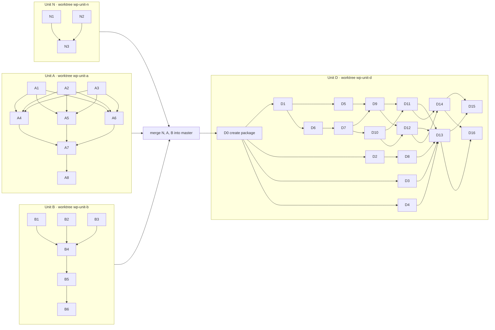

# Ward Parallelization & Machine Load Balancing

Status: high-level plan revised 2026-10-02, with a file-by-file execution plan in §8. Awaiting approval.

---

## 1. Goal

Make a full `npm run ward` faster on every run, and stop ward runs from failing on CPU contention when several agents run at once. The speedup must not cost correctness: every check still runs every time, so a pass always means "the tree passes now".

## 2. What we measured

### 2.1 Where the time goes

The last full run, `.ward/run-1790901309167-9740.json`, took **980s**. All packages together hold about
**1,940s** of work.

| Package                        | Total            | Biggest parts                |
|--------------------------------|------------------|------------------------------|
| `@dungeonmaster/web`           | 451s             | e2e 336s, lint 54s, unit 43s |
| `@dungeonmaster/orchestrator`  | 215s             | lint 106s, unit 73s          |
| `@dungeonmaster/eslint-plugin` | 151s             | unit 56s, lint 48s           |
| `@dungeonmaster/siegelense`    | 142s             | integration 55s, lint 53s    |
| `@dungeonmaster/shared`        | 123s             | lint 63s                     |
| every other package            | 24s to 106s each |                              |

### 2.2 How ward schedules today

| Fact                                                                                                                                                    | Evidence                                                                                                                                                 |
|---------------------------------------------------------------------------------------------------------------------------------------------------------|----------------------------------------------------------------------------------------------------------------------------------------------------------|
| The parent ward spawns one child ward process per package. The child runs that package's check types one after another.                                 | `packages/ward/src/brokers/command/run/multi-package-layer-broker.ts:142` ("const spawnResult = await stream({") and `single-package-layer-broker.ts:65` |
| The number of packages in flight is `ward.concurrency` from `.dungeonmaster.json`, default 4, range 1 to 10.                                            | `multi-package-layer-broker.ts:91`, `packages/config/src/statics/config-defaults/config-defaults-statics.ts:29`                                          |
| Packages run in discovery order. Nothing sorts them.                                                                                                    | `packages/ward/src/brokers/workspace/discover/pattern-resolve-layer-broker.ts:29`                                                                        |
| **The pool deals packages out round-robin before anything runs.** A worker that finishes early sits idle; it never takes another worker's next package. | `packages/shared/src/transformers/promise-pool/promise-pool-transformer.ts:28` — "itemIndex % workerCount === workerIndex"                               |
| Jest runs with `--maxWorkers=25%`, sized for about 4 packages in flight.                                                                                | `packages/ward/src/statics/check-commands/check-commands-statics.ts:50`                                                                                  |
| A run exits 1 when any test is over its slow-test limit, even if every check passed. This is the gate CPU contention trips.                             | `packages/ward/src/statics/slow-file-threshold/slow-file-threshold-statics.ts`, `command-run-broker.ts:234`                                              |
| Per-package, per-check durations are already in `.ward/run-*.json`. But those files are deleted after 2 days, and one can reach about 290 MB.           | `packages/ward/src/statics/ttl/ttl-statics.ts:17`                                                                                                        |
| The parent already stamps each child's per-check wall clock onto that package's `ProjectResult.durationMs`.                                             | `multi-package-layer-broker.ts:213-219`                                                                                                                  |
| `storagePruneBroker` deletes only `run-*.json` files, so anything else under `.ward/` survives pruning.                                                 | `packages/ward/src/brokers/storage/prune/storage-prune-broker.ts:28`                                                                                     |

### 2.3 How web's e2e runs today

| Fact                                                                                                         | Evidence                                                                                                         |
|--------------------------------------------------------------------------------------------------------------|------------------------------------------------------------------------------------------------------------------|
| One Playwright process, `workers: 1`, `fullyParallel: false`.                                                | `packages/web/playwright.config.ts:218-219`                                                                      |
| One API server and one `vite preview` server serve the whole suite, from one home: `<tmpdir>/dm-e2e-<pid>`.  | `packages/web/playwright.config.ts:19`, `.dungeonmaster.json` `devServer.e2e.processes`                          |
| The API server holds an in-memory dispatcher for the whole run.                                              | `packages/web/test/harnesses/e2e-fixtures.ts:57` — "The dispatcher is ONE in-memory singleton for the whole run" |
| Ward picks a free port pair per e2e run and passes it in. The report path and `outputDir` are named by port. | `packages/ward/src/brokers/check-run/e2e/check-run-e2e-broker.ts:158`, `playwright.config.ts:217`                |
| Ward builds the UI bundle once per e2e run, before Playwright starts.                                        | `check-run-e2e-broker.ts:139` — `bundleBuildBroker({ packageRoot })`                                             |
| web is the only package with Playwright e2e: 132 spec files, 489 tests in the last run.                      | `packages/web/playwright.config.ts` is the only Playwright config in the repo                                    |

### 2.4 How siegelense balances load today

| Fact                                                                                                                                                                                        | Evidence                                                                                             |
|---------------------------------------------------------------------------------------------------------------------------------------------------------------------------------------------|------------------------------------------------------------------------------------------------------|
| The machine readers (load average, free memory, cores, RSS by process group, OOM count) take no siegelense types. `machineReadBroker` reads the dungeonmaster home only to statfs its disk. | `packages/siegelense/src/brokers/machine/{read,rss-by-pgid,oom-count}/`, `machine-read-broker.ts:34` |
| The registry is tied to lanes: SiegeInstance id, quest and guild ids, socket path, ports, spec hash.                                                                                        | `packages/siegelense/src/contracts/registry-entry/registry-entry-contract.ts:55-91`                  |
| The registry lives under `<DUNGEONMASTER_HOME>/siegelense/`. Dogfood prod, dev, every e2e home and every siege lane have different homes, so they never see each other's rows.              | `packages/shared/src/brokers/dungeonmaster-home/find/dungeonmaster-home-find-broker.ts:17`           |
| The orchestrator loads siegelense's `capacityReadBroker` at runtime to cap lanes.                                                                                                           | `packages/orchestrator/src/brokers/lane/provision-batch/lane-provision-batch-broker.ts:82`           |
| The capacity math (CPU, memory and ceiling limits) is a pure transformer.                                                                                                                   | `packages/siegelense/src/transformers/capacity-suggest/capacity-suggest-transformer.ts`              |

### 2.5 Node and SQLite on this machine

| Fact                                                                                                                                                        | Evidence                                                                          |
|-------------------------------------------------------------------------------------------------------------------------------------------------------------|-----------------------------------------------------------------------------------|
| Only the root `package.json` declares `engines`, and it says `>=14.0.0`. No workspace package declares one.                                                 | `package.json`                                                                    |
| This machine runs Node 22.17.0.                                                                                                                             | `node --version`                                                                  |
| `node:sqlite` opens a file with a `timeout` (busy wait) option on 22.17, and prints `ExperimentalWarning: SQLite is an experimental feature` on first load. | measured 2026-10-02 with `new DatabaseSync(':memory:', { timeout: 100 })`         |
| Jest 30.2.0's resolver treats `node:sqlite` as a core module, so tests can load it.                                                                         | measured 2026-10-02: `jest-resolve` `isCoreModule('node:sqlite')` returned `true` |
| `@types/node` 24.0.15 ships `sqlite.d.ts`.                                                                                                                  | `node_modules/@types/node/sqlite.d.ts`                                            |
| npm only warns on an `engines` mismatch unless the user sets `engine-strict`.                                                                               | npm's documented behaviour                                                        |

## 3. Decisions

| Question                                | Decision                                                                                                                                                                                                      | Why                                                                                                                                                                                    |
|-----------------------------------------|---------------------------------------------------------------------------------------------------------------------------------------------------------------------------------------------------------------|----------------------------------------------------------------------------------------------------------------------------------------------------------------------------------------|
| Order of work                           | N, A and B in parallel, then D (§4). C is dropped (§5).                                                                                                                                                       | N, A and B touch different files. D needs N's Node floor and SQLite gateway, A's pool and history, and B's shard count.                                                                |
| Node floor                              | Unit N raises `engines` to `>=22.16.0` itself. Nothing waits on another project.                                                                                                                              | `node:sqlite` with its busy-wait option needs Node 22.16. The bump is small and ward owns the need.                                                                                    |
| Where `engines` is declared             | The root `package.json`, plus every package that itself imports `node:sqlite`: `@dungeonmaster/node` and `@dungeonmaster/load-balancer`.                                                                      | npm checks `engines` on each installed package, so a standalone install of a package that reaches SQLite warns too.                                                                    |
| What an old Node does at runtime        | The SQLite gateway throws an error naming Node 22.16 as the minimum before it opens anything.                                                                                                                 | npm only warns on `engines`. A clear refusal beats a `TypeError` from deep inside `node:sqlite`.                                                                                       |
| The SQLite experimental warning         | The SQLite gateway drops that one warning and no other.                                                                                                                                                       | Every ward child forwards stderr to the terminal, so the warning would print once per package per run.                                                                                 |
| The pool                                | Fix `promisePoolTransformer` in place: same name, same signature, a shared queue inside. Unit D adds an optional dynamic limit to it.                                                                         | Both callers (ward's `multiPackageLayerBroker` and `scanRunBroker`) want the new behaviour. A second pool would leave the broken one for the next caller.                              |
| Result order after sorting              | The parent dispatches longest first, then puts the results back in discovery order before merging.                                                                                                            | The summary and `ward list` print packages in the order they are merged. Sorting must not reorder what the user reads.                                                                 |
| How web's e2e runs in parallel          | Ward-level sharding: ward starts N `playwright test --shard=i/N` processes.                                                                                                                                   | Each shard is its own process, so it already gets its own `dm-e2e-<pid>` home, servers and dispatcher. No harness changes.                                                             |
| Shards and `--onlyTests`                | A run with `--onlyTests` uses 1 shard. Every run with more than 1 shard passes `--pass-with-no-tests` to each shard.                                                                                          | Playwright filters by `--grep` before it shards, so a shard can end up with no tests and would exit 1 on its own. The discovery-mismatch check still catches a spec file no shard ran. |
| Package granularity                     | Keep one child ward process per package. Web's e2e shards run inside web's child.                                                                                                                             | Splitting checks into separate jobs adds children and Jest contention for little gain once e2e is sharded.                                                                             |
| Where duration and memory history lives | Per repo, in the main checkout's `.ward/history/durations.json`, found through `git rev-parse --git-common-dir`. Every worktree of the repo shares it. Outside git, it falls back to the run root's `.ward/`. | History is about this repo's packages, and it means nothing in another repo. Deleting `.ward/` resets one repo only. `storagePruneBroker` never touches it.                            |
| Writing history safely                  | Read, merge, then `writeFileAtomic`. Two parents finishing together means the last writer wins.                                                                                                               | Losing one run's timings costs nothing. A half-written JSON file would cost every later run its ordering.                                                                              |
| Where the live registry lives           | `<os.homedir()>/.dungeonmaster/load/`, ignoring `DUNGEONMASTER_HOME`. `DUNGEONMASTER_LOAD_DIR` overrides it, and the Jest global setup sets that variable for every test.                                     | CPU and memory are shared by every repo, home and agent of this user. A registry per home lets two agents each see an idle machine.                                                    |
| Registry file format                    | SQLite through `node:sqlite`, in WAL mode, with the format version in the file name: `registry-v1.db`.                                                                                                        | SQLite's built-in busy wait replaces siegelense's lock file. A newer format writes a new file instead of corrupting an older version's file.                                           |
| Dropping dead leases                    | A lease drops when its owner pid is gone, or when its heartbeat is older than 30s.                                                                                                                            | A pid check frees a SIGKILLed run's lease at once. The heartbeat covers a pid the OS reused.                                                                                           |
| Siegelense's own registry               | It stays in siegelense, per home, with its lane fields. Siegelense also takes one generic lease per running instance in the machine-wide registry.                                                            | Lane fields mean nothing to ward. The orchestrator's lane code keeps working unchanged.                                                                                                |
| Jest's worker share under D             | The parent tells each child its Jest share as a percentage: `max(10, floor(100 / concurrency))`. It replaces the fixed `25%`.                                                                                 | At 6 packages in flight, a fixed 25% each asks for 150% of the cores.                                                                                                                  |
| Slow-test limits                        | They stay fixed. The governor (§4, D) throttles concurrency to keep tests under them.                                                                                                                         | The limits exist to catch slow tests. Raising them under load hides real slowness.                                                                                                     |
| New package name                        | `@dungeonmaster/load-balancer`, package type `library`.                                                                                                                                                       | The name the original proposal chose.                                                                                                                                                  |

## 4. The units

### Unit N — Node 22.16 floor and the SQLite gateway

**Before:** the root `package.json` declares `engines.node` `>=14.0.0`. Nothing in the repo opens SQLite.

**After:**

1. `engines.node` is `>=22.16.0` in the root `package.json`, `packages/@gateway/node/package.json`, and (once Unit D creates it) `packages/load-balancer/package.json`.
2. A new gateway wrapper, `#gateway/node/sqlite`, opens a database file with a busy wait. It refuses a Node older than 22.16 with an error naming that version, and it drops SQLite's experimental warning.
3. Any doc that states a minimum Node version says 22.16.

### Unit A — Shared work queue and longest-job-first

**Before:** the pool deals packages round-robin in discovery order. Web starts late and runs alone at the end.

**After:**

1. `promisePoolTransformer` keeps its name and signature. Every worker pulls the next item from one shared queue, and results keep input order.
2. After each run, the parent ward writes each package's duration per check type into
   `.ward/history/durations.json` in the main checkout.
3. Before dispatching, the parent sorts packages by predicted total duration, longest first, for the check types this run will execute. A package with no history for any of those check types goes first, since it could be the longest. Ties keep discovery order.
4. The parent merges results in discovery order, so the summary reads the same as before.
5. Only whole-package child runs update history. A child handed a file list, or run with `--onlyTests`, never writes it, because its times are not the package's real cost. A crashed child writes nothing.

**Expected
result:** a full run drops from 980s to about 485s. That is 1,940s of work over 4 workers, with web started at second 0.

### Unit B — Web e2e sharding

**Before:** one Playwright process runs all 132 spec files on one worker, in 336s.

**After:**

1. `check-run-e2e-broker` starts N Playwright processes at once, each with `--shard=i/N`, its own free port pair, its own JSON report, its own open-handle report and its own output folder.
2. All shards use the one prebuilt UI bundle. Ward builds it once, before the shards start, as it does today.
3. Ward merges the shard results into one `ProjectResult`: failures, passing tests, per-file timings, open handles and the processed-file list.
4. N comes from a new `.dungeonmaster.json` key, `ward.e2eShards`, default 3, range 1 to 8, in `packages/config`. N is never more than the number of spec files in the run, and it is 1 when `--onlyTests` is set.
5. Each shard's servers are killed and its Vite cache removed when that shard ends.

**Expected
result:** web's longest path drops from 451s to about 227s (115s of other checks plus 336s ÷ 3). The full run drops to about 430s.

**Risks to watch:**

- 3 shards mean 3 browsers and 6 servers at once. The e2e slow-test limit is 20s. Unit B's manual tests must show no new slow-test failures at the default shard count.
- Playwright balances shards by test count, not by duration, so one shard can run much longer than the others. Unit B's manual tests record each shard's wall clock. If the slowest shard is more than 1.5 times the fastest, file a follow-up to split spec files by Unit A's per-file history instead.
- A spec that only passed because an earlier file left state behind fails once its file lands in a different shard. Task B5 finds and fixes those.

### Unit D — Machine-wide load balancing

**Before:** ward runs a fixed number of packages no matter what else the machine is doing. Two agents running ward together trip the slow-test gate.

**After:**

1. **New package `@dungeonmaster/load-balancer`.** It holds:
   - the machine readers, moved from siegelense. `machineReadBroker` takes the path to statfs as a parameter.
   - the live registry at `<homedir>/.dungeonmaster/load/registry-v1.db`
   - a lease API: take a lease, heartbeat it, release it, and list live leases, dropping dead ones
   - a capacity suggestion, generalised from siegelense's capacity transformer. It takes the machine reading, the live leases, and the caller's estimate of one job's memory.
2. **Ward:**
   - Each child ward runs as its own process group, so the parent can sample its memory.
   - The parent takes a lease for each package child it starts, heartbeats it, and releases it when the child ends.
   - Before each dispatch, the parent asks for capacity, so concurrency can change during the run. It never drops below 1 package in flight.
   - The parent hands each child its Jest worker share.
   - Unit B's shard count is capped by the same capacity answer.
   - History adds peak memory (RSS) per package and check type, next to Unit A's durations.
3. **Siegelense:**
    - imports the machine readers from the new package
   - takes a lease per running instance, and releases it on kill
   - debits other tools' starting leases when it computes capacity
    - keeps its own registry, profiles and snapshots unchanged
4.
**Orchestrator:** no change. It still calls siegelense's capacity. The Claude agents it spawns take no leases. Ward sees their load only through the machine reading: load average and free memory.

**Expected
result:** two agents running ward at once both pass without slow-test failures. A full run on an idle machine can use more than 4 workers when history shows they fit. On this 12-core machine that is an estimated 300s at 6 workers, to confirm by measurement.

## 5. Not doing, and why

### Check result caching (the proposal's "check result fingerprint snapshotting")

The proposal skipped a package's check when a hash of its inputs matched an earlier pass. It is dropped:

| Reason                                                                                                          | Measurement or evidence                                                                                                                                  |
|-----------------------------------------------------------------------------------------------------------------|----------------------------------------------------------------------------------------------------------------------------------------------------------|
| Full runs are rare, and scoped runs are already fast.                                                           | Of the 96 run files in `.ward/` from the last 2 days, 2 were bare full runs.                                                                             |
| A shared edit invalidates almost everything anyway.                                                             | Since 2026-09-01, 327 of 1,683 commits touched `packages/shared`, which nearly every package depends on. Another 283 commits touched 3 or more packages. |
| The cache key is never complete, and each gap is a stale pass.                                                  | web's e2e boots `packages/server`, which web does not depend on. Integration tests spawn other packages' programs.                                       |
| It hides flaky tests.                                                                                           | A test that passes 1 time in 3 is cached on a lucky run and stays green until its inputs change.                                                         |
| Cached packages are never re-timed, so the slow-test gate goes blind to them.                                   |                                                                                                                                                          |
| The pre-merge regression pass is the run the cache would help most, and it is where a skip is least acceptable. |                                                                                                                                                          |

It can come back as its own proposal if full runs become frequent.

### Per-worker homes with snapshot-restore resets for e2e

The proposal gave each Playwright worker its own home and reset it from a snapshot before each test. It is dropped:

- Each worker would need its own API and Vite servers. Playwright's `webServer` starts once per run, not once per worker.
- A file restore does not reset the server's in-memory dispatcher.

Sharding (Unit B) gets the same parallelism with none of these problems.

## 6. Acceptance criteria

| Unit | Criterion                                                                                                         |
|------|-------------------------------------------------------------------------------------------------------------------|
| N    | `engines.node` reads `>=22.16.0` in the root and `@dungeonmaster/node` `package.json`.                            |
| N    | Opening a database through `#gateway/node/sqlite` prints no `ExperimentalWarning` on Node 22.17.                  |
| N    | Two connections writing one file at once both succeed, because the second waits on the busy timeout.              |
| A    | A full `npm run ward` passes, and web's child starts in the first dispatch wave.                                  |
| A    | A worker that finishes early takes the next package; no worker is idle while packages are still queued.           |
| A    | The summary lists packages in the same order as before Unit A.                                                    |
| A    | `.ward/history/durations.json` exists in the main checkout after a full run, and a worktree's run reads it.       |
| A    | A full run is under 600s on this machine. The estimate is about 485s.                                             |
| B    | A full web e2e passes with 3 shards and no new slow-test failures.                                                |
| B    | A file-scoped e2e run of one spec starts exactly one Playwright process.                                          |
| B    | An `--onlyTests` e2e run starts exactly one Playwright process.                                                   |
| B    | A failing test in shard 2 shows up in ward's output and `detail` exactly as a failure does today.                 |
| B    | No server is left listening on any shard's ports after the run.                                                   |
| D    | Two `npm run ward` runs started together both pass. While they run, the registry shows both runs' leases.         |
| D    | A siegelense lane and a ward run started together see each other's leases.                                        |
| D    | `DUNGEONMASTER_LOAD_DIR` keeps every test away from `~/.dungeonmaster/load/`.                                     |
| D    | Killing a ward run with SIGKILL leaves leases that drop out at the next capacity read, because their pid is gone. |

## 7. What this revision changed

| Before (2026-10-01)                                                                   | After (2026-10-02)                                                                                                                                             |
|---------------------------------------------------------------------------------------|----------------------------------------------------------------------------------------------------------------------------------------------------------------|
| Unit D waited for chronicle-llm to raise `engines` to Node 22.16.                     | Unit N raises it, with no dependency on any other project.                                                                                                     |
| "A new queue-based pool" in shared.                                                   | `promisePoolTransformer` is fixed in place, because both of its callers move.                                                                                  |
| Sorting packages had no rule for result order.                                        | The parent restores discovery order before merging, so the summary does not reshuffle.                                                                         |
| "Only full-package runs update history."                                              | Defined per child: no file list, no `--onlyTests`, not crashed.                                                                                                |
| History writes had no concurrency rule.                                               | Read, merge, atomic write. Last writer wins.                                                                                                                   |
| Shards with `--onlyTests` were unaddressed.                                           | `--onlyTests` uses 1 shard; every multi-shard run passes `--pass-with-no-tests`.                                                                               |
| Shard balance was assumed even.                                                       | Playwright balances by test count, so B measures each shard's wall clock and names a follow-up.                                                                |
| Specs that depend on an earlier file's state were not considered.                     | Task B5 hunts them.                                                                                                                                            |
| Dead leases dropped only on a stale heartbeat.                                        | A dead pid drops a lease at once; the heartbeat covers pid reuse.                                                                                              |
| Jest's `--maxWorkers=25%` stayed fixed while D raised concurrency.                    | The parent hands each child a share sized to the live concurrency.                                                                                             |
| D's peak memory and CPU history had no measuring method.                              | Each child runs as its own process group and the parent samples its RSS. CPU is left to the load average, because sampled CPU time misses exited Jest workers. |
| `machineReadBroker` would have carried siegelense's home lookup into the new package. | It takes the path to statfs as a parameter.                                                                                                                    |
| Nothing handled SQLite's experimental warning on Node 22.                             | The gateway drops it.                                                                                                                                          |
| §5 cited chronicle-llm's home-to-SQLite plan against per-worker homes.                | Removed. The other two reasons stand on their own.                                                                                                             |

## 8. Execution plan for an orchestrator

This section is written for a Sonnet-class orchestrator that dispatches Sonnet-class workers. Read all of it before dispatching anything.

### 8.1 Rules for the orchestrator

1. **Only the orchestrator builds, creates worktrees, creates packages, merges and runs a bare `npm run ward`.**
   Workers do none of these.
2. **Work each unit in its own worktree.** Call `mcp__dungeonmaster__create-worktree({ name })` with the names
   `wp-unit-n`, `wp-unit-a`, `wp-unit-b`, and later `wp-unit-d`. A worker's brief names the worktree path, and the worker works only there.
3. **Dispatch a fresh agent per task, with `model: "sonnet"`.** Never fork. Never let a worker dispatch.
4. **Run tasks marked parallel at the same time only if their file lists do not
   overlap.** The task cards below already satisfy this. Do not add files to a running task.
5. **Wait for every task in a step before starting the next step.**
6. **After each task, read the worker's
   report.** Check it names the ward command it ran and the exit code. A report with no ward output is not done: send it back.
7. **Commit after each
   task**, inside that unit's worktree, on the worktree's branch. One commit per task. End the message with the attribution line the session gives you.
8. **Gate each unit before merging
   it.** In the unit's worktree: `npm run ward -- --committed --uncommitted` until it exits 0, then one bare `npm run ward` (with `timeout: 600000`), then the unit's manual checks (§8.8).
9. **Merge units into `master` in this order: N, A,
   B.** A and B both edit `packages/ward/CLAUDE.md`; resolve that conflict by keeping both sections. Then create `wp-unit-d` from the merged `master`.
10. **Stop and ask the user** if a gate fails twice on the same cause, or if a task needs a file not on its card.

### 8.2 Brief template for every worker

Paste this, filled in, as the whole prompt. The card text goes where it says.

```
You are implementing one task of scrolls/ward-parallelization-and-load-balancer.md in the worktree at <PATH>.
Work only inside <PATH>. Read §3 and the section for Unit <X> of that file before starting.

Your task card:
<PASTE THE CARD>

Rules:
- Before writing code, call get-architecture, get-testing-patterns, and get-folder-detail for every folder type you
  will write into. Their rules override your defaults.
- Search with the discover MCP tool. Grep, find and Glob are blocked.
- Touch only the files on your card, plus each one's companions (.test.ts, .proxy.ts, .stub.ts) and the folder
  barrel the architecture says must export a new file. If you need another file, stop and report why.
- Do not build. Do not create worktrees. Do not fork or dispatch agents. Do not commit.
- Never edit .claude/settings.json, .mcp.json, or any .env file.
- Comments state why, in present tense. No history, no counts of things that grow.
- Tests assert real values with toStrictEqual or toBe. A test that only checks "was called" does not count.
- Run: npm run ward -- -- <every file you touched>   (timeout: 600000). Fix every failure in your files.
  A typecheck failure in a file you did not touch: report it, do not fix it.

Report back in this shape:
DONE or BLOCKED — one line
FILES — each path you created or changed
WARD — the exact command and its last 15 lines of output, including the exit code
NOTES — anything the orchestrator must know (a decision you made, a file you needed but did not touch)
```

### 8.3 Order at a glance



Units N, A and B start together. Inside a unit, tasks joined by `&` run in parallel.

### 8.4 Unit N tasks (worktree `wp-unit-n`)

**Step N-1 — run N1 and N2 in parallel.**

**N1 — Raise the Node floor.**

- Files: `package.json` (root), `packages/@gateway/node/package.json`.
- Set `"engines": { "node": ">=22.16.0" }` in both. The gateway package has no `engines` key yet; add one.
- Then use `discover` with grep `node >=|Node 1[0-9]|Node 2[0-9]|engines` over `*.md` and `packages/cli/**`. List every hit that states a minimum Node version in your NOTES. Do not edit them; N3 does.
- Ward: `npm run ward -- --only lint -- package.json packages/@gateway/node/package.json` may report no files processed. That is expected for JSON; report it.

**N2 — SQLite gateway wrapper.**

- Create `packages/@gateway/node/src/sqlite/sqlite.ts` with its `.proxy.ts`, `.test.ts` and an
  `.integration.test.ts`. Look at `packages/@gateway/node/src/os/os.ts` and
  `packages/@gateway/node/src/child_process/spawn-detached/` for the gateway's file shape.
- Export one function, `openSqliteDatabase({ filePath, busyTimeoutMs })`, returning the `DatabaseSync` from
  `node:sqlite` opened with `{ timeout: busyTimeoutMs }`. Also export `NodeVersionUnsupportedError` from
  `packages/@gateway/node/src/sqlite/node-version-unsupported.error.ts`.
- Before importing `node:sqlite`, compare `process.versions.node` against 22.16.0. Below it, throw
  `NodeVersionUnsupportedError` with a message that says "node:sqlite needs Node 22.16 or newer" and names the running version.
- Load `node:sqlite` with `require` inside the function, the first time it is called. Around that first load, filter
  `process.emitWarning`: drop a warning whose type is `ExperimentalWarning` and whose message starts with `SQLite`, and pass every other warning through. Restore the original `emitWarning` afterwards, even if the load throws.
- Run `PRAGMA journal_mode=WAL` on every open.
- If `packages/@gateway/node/src/gateway-node-exports-shape.integration.test.ts` lists every subpath, add `sqlite`.
- Unit tests: the version refusal at 22.15.0, a pass at 22.16.0, the warning filter passing a non-SQLite warning through.
- Integration test, in an OS temp dir from `installTestbedCreateBroker`: open one file twice; start a write transaction (`BEGIN IMMEDIATE`) on the first connection; on the second, insert a row with a 2000ms busy timeout while a `setTimeout` commits the first after 200ms. Assert the second insert succeeds and both rows exist. Capture stderr during the open and assert it holds no `ExperimentalWarning`.

**Step N-2 — after N1 and N2.**

**N3 — Docs.**

- Files: the docs N1 listed, plus `packages/@gateway/node/CLAUDE.md` if it exists.
- Change every stated Node minimum to 22.16. Add one sentence to the gateway's docs saying `#gateway/node/sqlite`
  is the only way to open SQLite, and why it filters the warning.

### 8.5 Unit A tasks (worktree `wp-unit-a`)

**Step A-1 — run A1, A2 and A3 in parallel.**

**A1 — Shared-queue pool.**

- Files: `packages/shared/src/transformers/promise-pool/promise-pool-transformer.ts` and its `.test.ts`.
- Keep the exported name and the parameter object `{ items, concurrency, handler }`.
- Replace the round-robin with a shared index: each of `min(concurrency, items.length)` workers loops by recursion, taking the next unclaimed index, awaiting `handler`, writing `results[index]`, and recursing until no index is left. No `while (true)`.
- A rejected handler rejects the whole call, as today.
- Tests, each built on manually resolved promises so the order is deterministic:
   1. With concurrency 2 and items `[long, short, short, short]`, the worker that ran the first `short` also runs the third and fourth while `long` is still pending. Assert the start order.
   2. The highest number of handlers in flight at once equals `concurrency`, never more.
   3. Results come back in input order.
   4. Concurrency larger than the item count; an empty item list.
   5. A rejecting handler rejects the call with that error.

**A2 — `git rev-parse --git-common-dir` wrapper.**

- Files: create `packages/@gateway/bin/src/git/common-dir/common-dir.ts` with `.proxy.ts` and `.test.ts`; add one export line to `packages/@gateway/bin/src/git/git.ts`.
- Copy the shape of `packages/@gateway/bin/src/git/head-sha/`. Arguments: `['rev-parse', '--git-common-dir']`.
- Return an absolute path. Git prints a relative path (often `.git`) in the main checkout, so resolve the output against `cwd`. Return `null` on a non-zero exit or empty output. Let `GitNotInstalledError` propagate as the other wrappers do.
- Tests: relative output resolved against cwd; absolute output kept; exit 128 is `null`; empty output is `null`.

**A3 — History contract and statics.**

- Files: create `packages/ward/src/contracts/duration-history/duration-history-contract.ts` with `.stub.ts` and
  `.test.ts`; create `packages/ward/src/statics/duration-history/duration-history-statics.ts` with `.test.ts`.
- Contract shape: `{ version: 1, packages: record of package name → partial record of CheckType → { durationMs,
  recordedAtMs } }`. Reuse the existing `CheckType` contract for the keys. Use the existing `projectFolder` name type for the package key if one exists.
- Statics: `{ version: 1, dirName: '.ward', subDir: 'history', fileName: 'durations.json' }`.

**Step A-2 — after A-1, run A4, A5 and A6 in parallel.**

**A4 — Find where history lives.**

- Files: create `packages/ward/src/brokers/history/root-find/history-root-find-broker.ts` with `.proxy.ts` and
  `.test.ts`.
- Input `{ rootPath }`. Call `commonDir` from `#gateway/bin/git` with `cwd: rootPath`. If it returns a path whose last segment is `.git`, return that path's parent. Otherwise return `rootPath`. If git is missing (`GitNotInstalledError`), return `rootPath`.
- Tests: main checkout (`/repo/.git` → `/repo`); worktree (`/repo/.git` returned while cwd is `/repo/worktrees/x` →
  `/repo`); not a repo (`null` → rootPath); git missing → rootPath; a bare-repo path not ending in `.git` → rootPath.

**A5 — Read and write history.**

- Files: create `packages/ward/src/brokers/history/read/history-read-broker.ts` and
  `packages/ward/src/brokers/history/write/history-write-broker.ts`, each with `.proxy.ts` and `.test.ts`.
- Read: input `{ historyRoot }`. Read `<historyRoot>/.ward/history/durations.json` with `readJsonFileIfExists` from
  `#gateway/node/fs__promises`. Missing file, a parse failure, or a version other than 1 all return
  `{ version: 1, packages: {} }`. Use `safeParse`; the architecture bans a silent catch.
- Write: input `{ historyRoot, history }`. `ensureDir` the history folder, then `writeFileAtomic` the JSON.
- Tests: missing file; valid file; wrong version; invalid JSON; write path and content.

**A6 — Ordering and merging transformers.**

- Files: create `packages/ward/src/transformers/package-dispatch-order/package-dispatch-order-transformer.ts` and
  `packages/ward/src/transformers/duration-history-merge/duration-history-merge-transformer.ts`, each with `.test.ts`.
- `packageDispatchOrderTransformer({ projectFolders, history, checkTypes })` returns the folders sorted for dispatch. A folder missing history for any of `checkTypes` comes first. The rest sort by the sum of their durations over
  `checkTypes`, largest first. Ties and unknowns keep their input order (stable sort).
- `durationHistoryMergeTransformer({ history, checks, wholePackageNames, nowMs })` returns a new history. For each
  `CheckResult` in `checks`, for each `ProjectResult` whose `projectFolder.name` is in `wholePackageNames` and which is not crashed (use `isCrashedProjectResultGuard`), set `packages[name][checkType] = { durationMs, recordedAtMs:
  nowMs }`. Leave every other entry as it was.
- Tests: unknown first; longest first; only the requested check types count; stable ties; merge overwrites only the measured entries; a crashed result and a non-whole package are skipped.

**Step A-3 — after A-2.**

**A7 — Wire it into the parent.**

- Files: `packages/ward/src/brokers/command/run/multi-package-layer-broker.ts`, its `.proxy.ts` and `.test.ts`.
- Before the pool: `historyRoot = await historyRootFindBroker({ rootPath })`, then `historyReadBroker`, then
  `packageDispatchOrderTransformer` over `filteredFolders` and `checkTypes`.
- Pass the sorted folders to `promisePoolTransformer`. Inside the handler, record whether this child is whole-package:
  `matchingArgs` is empty (or there is no passthrough) and `config.onlyTests` is unset.
- After the pool, rebuild `subResults` in `filteredFolders` order before the existing merge loop.
- After the merge and before `storageSaveBroker`, call `durationHistoryMergeTransformer` with the whole-package names and `historyWriteBroker`. Skip both when the set is empty.
- Tests to add: a package with the longest history is spawned first; the merged summary order matches discovery order; a file-scoped run leaves the history file untouched; an `--onlyTests` run leaves it untouched; a full run writes the measured durations.
- Run `npm run ward -- -- packages/ward/src/brokers/command/run/multi-package-layer-broker.ts
  packages/ward/src/brokers/command/run/multi-package-layer-broker.test.ts
  packages/ward/src/brokers/scan/run/scan-run-broker.test.ts`. The scan test covers the pool's other caller.

**Step A-4 — after A7.**

**A8 — Docs.**

- Files: `packages/ward/CLAUDE.md`.
- Where it says "up to 4 concurrently, via a promise pool", say instead that the pool is a shared queue, packages are dispatched longest-first from `.ward/history/durations.json` in the main checkout, and results merge in discovery order. Say which runs write history and why.

### 8.6 Unit B tasks (worktree `wp-unit-b`)

**Step B-1 — run B1, B2 and B3 in parallel.**

**B1 — Config key `ward.e2eShards`.**

- Files: `packages/config/src/statics/config-defaults/config-defaults-statics.ts` and its `.test.ts`;
  `packages/config/src/contracts/dungeonmaster-config/dungeonmaster-config-contract.ts` and its `.test.ts`.
- Add `ward.e2eShards: { min: 1, max: 8, default: 3 }` beside `ward.concurrency`, and the matching zod field with a brand `DungeonmasterConfigWardE2eShards`, built exactly like `concurrency`.
- Tests: copy the five `concurrency` cases (valid, default, min, max, out of range) for `e2eShards`.

**B2 — Shard count transformer.**

- Files: create `packages/ward/src/transformers/e2e-shard-count/e2e-shard-count-transformer.ts` with `.test.ts`.
- Input `{ requested, specFileCount, testNamePattern }`. Return 1 when `testNamePattern` is set. Otherwise
  `max(1, min(requested, specFileCount))`.
- Tests: grep set → 1; 1 spec → 1; 2 specs, 3 requested → 2; 132 specs, 3 requested → 3; 0 specs → 1.

**B3 — Shard result merge transformer.**

- Files: create `packages/ward/src/transformers/e2e-shard-outputs-merge/e2e-shard-outputs-merge-transformer.ts` with
  `.test.ts`, and a contract `packages/ward/src/contracts/e2e-shard-output/e2e-shard-output-contract.ts` with
  `.stub.ts` and `.test.ts`.
- One shard output is `{ shardIndex, shardCount, output, exitCode, signal, passingTests, openHandles }`.
- Merged result: `output` is each shard's output in shard order, each preceded by a line `--- e2e shard i/N ---`
  when N > 1; `exitCode` is the first non-zero exit code, else 0; `signal` is the first non-null signal, else `null`;
  `passingTests` and `openHandles` are concatenated in shard order.
- Tests: one shard is passed through unchanged with no header; three shards with shard 2 failing; a signal in shard 3.

**Step B-2 — after B-1.**

**B4 — Run shards in the e2e broker.**

- Files: create `packages/ward/src/brokers/check-run/e2e/run-shard-layer-broker.ts` with `.proxy.ts` and `.test.ts`; change `packages/ward/src/brokers/check-run/e2e/check-run-e2e-broker.ts`, its `.proxy.ts` and `.test.ts`.
- Move everything in `checkRunE2eBroker` from `freePortPair()` to `e2eArtifactsRemoveBroker(...)` into
  `runShardLayerBroker({ projectFolder, runner, finalArgs, bundleDir, shardIndex, shardCount })`. It returns one
  `E2eShardOutput`. When `shardCount > 1`, it appends `--shard=<i>/<N>` and `--pass-with-no-tests` to the args. Keep every existing comment that explains a per-run name.
- In `checkRunE2eBroker`: read `ward.e2eShards` with `configResolveBroker({ filePath:
  `${projectFolder.path}/package.json` })`, falling back to `configDefaultsStatics.ward.e2eShards.default`. Compute N with B2, where `specFileCount` is `e2eFiles.length` for a scoped run and `discoveredCount` otherwise. Start every shard with `Promise.all`. Merge with B3. Then build `testFailures`, `processedFiles` and the rest from the merged output exactly as today. `extractPlaywrightLineFilesTransformer` must run on the merged output, which holds every shard's lines.
- Tests to add: N=3 starts three runs with `--shard=1/3`, `2/3`, `3/3` and three different port pairs; a scoped run of one spec starts one run with no `--shard`; `--onlyTests` starts one run; a failure in shard 2 lands in
  `testFailures`; the union of shard files equals `discoveredCount` with no mismatch; each shard's ports are killed.

**Step B-3 — after B4. The orchestrator runs this step itself, or dispatches one worker with the whole step.**

**B5 — Find specs that depend on run order.**

- Run `npm run ward -- --only e2e -- packages/web` in `wp-unit-b` (timeout 600000).
- For each failing spec, run it alone: `npm run ward -- --only e2e -- <spec file>`. A spec that passes alone but fails in its shard depends on state another file left behind. Fix the spec so it sets up its own state, using the existing harnesses in `packages/web/test/harnesses/`. One worker per 1 to 3 failing spec files.
- Repeat until a sharded run passes twice in a row.

**Step B-4 — after B5.**

**B6 — Docs.**

- Files: `packages/ward/CLAUDE.md`, root `CLAUDE.md`.
- Ward: add the shard to the per-run isolation table (each shard gets its own ports, report, handle report and output folder), and state the `--onlyTests` and `--pass-with-no-tests` rules.
- Root: the "Test isolation" paragraph says four browser walks is a sensible cap. Restate that cap in shards: each ward e2e run now starts `ward.e2eShards` Playwright processes, each with its own API server, Vite server and browser.

### 8.7 Unit D tasks (worktree `wp-unit-d`, created from `master` after N, A and B merge)

**Step D-0 — the orchestrator.**

**D0 — Create the package.**

- Run `dungeonmaster create-package --name load-balancer --type library` in `wp-unit-d`.
- Add `"engines": { "node": ">=22.16.0" }` to `packages/load-balancer/package.json`, and add
  `"@dungeonmaster/node": "*"` and `"@dungeonmaster/shared": "*"` to its dependencies if the scaffold did not.
- Run `npm install` in the worktree so the workspace link exists. Commit.

**Step D-1 — run D1, D2, D3 and D4 in parallel.**

**D1 — Load-balancer statics and lease contract.**

- Files: create `packages/load-balancer/src/statics/load-balancer/load-balancer-statics.ts` with `.test.ts`; create
  `packages/load-balancer/src/contracts/lease/lease-contract.ts` with `.stub.ts` and `.test.ts`.
- Statics: `{ registry: { dirEnvVar: 'DUNGEONMASTER_LOAD_DIR', homeRelativeDir: '.dungeonmaster/load', fileName:
  'registry-v1.db', busyTimeoutMs: 5000 }, lease: { heartbeatIntervalMs: 5000, staleAfterMs: 30000 }, memory:
  { headroomMB: <copy siegelense capacityStatics.memory.headroomMB> }, cpu: { minAllowed: 1 } }`.
- Lease: `{ leaseId, tool: 'ward' | 'siegelense', label, ownerPid, state: 'starting' | 'running', expectedPeakMB:
  number | null, startedAtMs, lastBeatMs }`.

**D2 — Move the machine readers.**

- Files: create in `packages/load-balancer/src/`: `brokers/machine/read/`, `brokers/machine/rss-by-pgid/`,
  `brokers/machine/oom-count/` (each broker with `.proxy.ts` and `.test.ts`), `contracts/machine-reading/` (with
  `.stub.ts`), and `statics/machine/`. Copy them from `packages/siegelense/src/`. Export them from the package's barrels.
- Change one thing while copying: `machineReadBroker({ diskPath })` statfs's `diskPath` and no longer calls
  `dungeonmasterHomeFindBroker`. Update its test and proxy to match.
- Do not delete the siegelense copies; D10 does that.

**D3 — Child wards as their own process group.**

- Files: the `stream` wrapper in `packages/@gateway/node/src/child_process/` (find it with `discover`), its
  `.proxy.ts` and `.test.ts`.
- Add an optional `processGroup?: boolean` parameter. When true, spawn with `detached: true` and still pipe and await output exactly as today. Return the child's `pid` in the result. Add an `onSpawn?: ({ pid }) => void` callback called as soon as the pid exists, because the parent must sample memory while the child runs.
- Tests: `detached` is passed only when `processGroup` is true; `onSpawn` receives the pid; output handling is unchanged.

**D4 — Jest share flag.**

- Files: `packages/ward/src/statics/ward-spawn-command/ward-spawn-command-statics.ts`,
  `packages/ward/src/transformers/cli-args-parse/cli-args-parse-transformer.ts`, and the unit and integration check-run brokers' argument building (`packages/ward/src/brokers/check-run/unit/` and `.../integration/`), with their tests. That is 4 production files; if the check-run brokers build args in one shared place, change that one place.
- Add `jestWorkersFlag: '--jestWorkers'` to the statics, parent-to-child only, documented like `parentScopedFlag`.
- The CLI parser reads `--jestWorkers <percent>` as a local value, never a `WardConfig` field, absent from the user-facing flag list.
- When set, the unit and integration commands use `--maxWorkers=<percent>%` instead of `--maxWorkers=25%`.
- Tests: absent flag keeps `25%`; `--jestWorkers 17` gives `--maxWorkers=17%`; the flag is not in the printed flag list.

**Step D-2 — after D-1.**

Run D5, D6 and D8 in parallel (they need D1 or D2, and their files do not overlap).

**D5 — Generalised capacity transformer.**

- Files: create `packages/load-balancer/src/transformers/capacity-suggest/capacity-suggest-transformer.ts` with
  `.test.ts`, and its result contract `packages/load-balancer/src/contracts/capacity-suggestion/` with `.stub.ts`.
- Input `{ machine, liveLeases, job: { peakMB: number | null }, ceiling }`. Copy siegelense's arithmetic: CPU allows
  `max(minAllowed, floor(cores - loadAvg1))`; memory debits `expectedPeakMB` of every `starting` lease plus the headroom; with no `job.peakMB`, memory allows the ceiling; the answer is the minimum of the CPU, memory and
  `ceiling - running leases` limits, never below 0. Return each limit separately so a caller can say which one bound.
- Tests: copy the spirit of siegelense's `capacity-suggest-transformer.test.ts` cases, adapted to leases.

**D6 — Registry open.**

- Files: create `packages/load-balancer/src/brokers/registry/open/registry-open-broker.ts` with `.proxy.ts`,
  `.test.ts` and `.integration.test.ts`.
- Resolve the folder: the env var from D1 if set, else `<homedir()>/<homeRelativeDir>`. `ensureDir` it. Open
  `registry-v1.db` through `openSqliteDatabase` from `#gateway/node/sqlite`. Create table `leases` with one column per lease field, `IF NOT EXISTS`. Return the database.
- Integration test: env var set to a testbed dir → the file is created there and the table exists.

**D8 — Memory sampling broker.**

- Files: create `packages/load-balancer/src/brokers/memory/peak-sample/memory-peak-sample-broker.ts` with `.proxy.ts`
  and `.test.ts`.
- `memoryPeakSampleBroker({ pgid, intervalMs })` returns `{ stop: () => Promise<number | null> }`. It calls
  `machineRssByPgidBroker({ pgids: [pgid] })` every `intervalMs` using `#gateway/node/setTimeout` recursion, keeps the highest value, and `stop` returns it. A failed sample is skipped, not fatal.
- Tests with fake timers: the peak of three samples; a rejecting sample is skipped; `stop` with no sample is `null`.

**Step D-3 — after D6.**

**D7 — Lease brokers.**

- Files: create `packages/load-balancer/src/brokers/lease/take/`, `.../beat/`, `.../release/`, `.../list-live/`, each a broker with `.proxy.ts` and `.test.ts`. Dispatch as two workers: one for take and release, one for beat and list-live.
- `leaseTakeBroker({ tool, label, expectedPeakMB })` inserts a `starting` lease owned by `process.pid` and returns it. `leaseBeatBroker({ leaseId, state })` updates `lastBeatMs` and `state`. `leaseReleaseBroker({ leaseId })`
  deletes the row. `leaseListLiveBroker()` deletes rows whose `ownerPid` is not alive (use the existing process-alive check; find it with `discover`, siegelense has `processIsAliveBroker`) or whose `lastBeatMs` is older than
  `staleAfterMs`, then returns the rest.
- Each test uses its own `DUNGEONMASTER_LOAD_DIR` testbed through the D6 proxy. Add one integration test that takes a lease, kills nothing, sets a fake dead pid on a second lease, and asserts `leaseListLiveBroker` returns only the first.

**Step D-4 — after D5, D7 and D2.**

**D9 — Capacity read broker.**

- Files: create `packages/load-balancer/src/brokers/capacity/read/capacity-read-broker.ts` with `.proxy.ts` and
  `.test.ts`.
- `capacityReadBroker({ diskPath, job, ceiling })`: `machineReadBroker`, then `leaseListLiveBroker`, then D5. Return the D5 answer plus the measured inputs.

**Step D-5 — run D10 alongside D9 (it needs only D2 and D7).**

**D10 — Siegelense switches to the shared readers and takes leases.**

- Files, dispatched as three workers:
   1. `packages/siegelense/src/brokers/capacity/read/capacity-read-broker.ts`,
      `packages/siegelense/src/brokers/status/read/status-read-broker.ts`, and their proxies and tests: import
      `machineReadBroker` from `@dungeonmaster/load-balancer/brokers`, passing the dungeonmaster home path as
      `diskPath`. In capacity-read, also call `leaseListLiveBroker`, filter to leases whose `tool` is not
      `'siegelense'`, and add the sum of their `starting` leases' `expectedPeakMB` to the memory debit. Do this by adding one optional `otherToolsStartingPeakMB` input to siegelense's own `capacitySuggestTransformer`, default 0.
   2. `packages/siegelense/src/brokers/heartbeat/write/heartbeat-write-broker.ts` and
      `packages/siegelense/src/brokers/status/read/instance-entry-layer-broker.ts`, with proxies and tests: import
      `machineRssByPgidBroker` from the new package. The heartbeat also calls `leaseBeatBroker` for the instance's lease with `state: 'running'`.
   3. The instance start and kill brokers in `packages/siegelense/src/brokers/instance/start/` and `.../kill/`: start takes a lease (`tool: 'siegelense'`, `label: <instance id>`, `expectedPeakMB: <the profile peak or null>`) and stores its id on the registry row; kill releases it. Then delete
      `packages/siegelense/src/brokers/machine/`, `contracts/machine-reading/` and `statics/machine/`, and add
      `"@dungeonmaster/load-balancer": "*"` to `packages/siegelense/package.json`.
- Worker 3 runs after workers 1 and 2, because it deletes files they stop importing.

**Step D-6 — after D9 and D10. Run D11 and D12 in parallel.**

**D11 — Dynamic pool limit.**

- Files: `packages/shared/src/transformers/promise-pool/promise-pool-transformer.ts` and its `.test.ts`.
- Add an optional `limit?: () => Promise<number>`. When given, the pool asks it before each dispatch, and starts the next item only while the in-flight count is below `max(1, await limit())`. When an item finishes, the pool asks again. Without `limit`, behaviour is exactly A1's.
- Tests: a limit that drops from 3 to 1 mid-run; a limit of 0 still runs one at a time; a limit that rises lets more start at the next completion.

**D12 — History adds peak memory.**

- Files: `packages/ward/src/contracts/duration-history/duration-history-contract.ts` and stub,
  `packages/ward/src/transformers/duration-history-merge/duration-history-merge-transformer.ts`, their tests, and
  `packages/ward/src/statics/duration-history/duration-history-statics.ts`.
- Each entry gains `peakRssMB: number | null`. Bump the version to 2. The reader returns an empty history for version 1, which is fine: one full run refills it.
- The merge takes `peakRssByPackage` and writes it onto every check type of that package, since the parent samples the whole child.

**Step D-7 — after D11 and D12.**

**D13 — The governor in the parent.**

- Files: `packages/ward/src/brokers/command/run/multi-package-layer-broker.ts`, its `.proxy.ts` and `.test.ts`, and
  `packages/ward/package.json` (add `"@dungeonmaster/load-balancer": "*"`).
- Spawn each child with `processGroup: true`. In `onSpawn`, start `memoryPeakSampleBroker` on the child's pid and take a lease with `tool: 'ward'`, `label: <package name>`, and `expectedPeakMB` from history (the max over its check types, or `null`). Beat the lease every `heartbeatIntervalMs` while the child runs. When the child ends, stop the sampler, release the lease, and keep the peak for D12's merge. Release in a `finally`, so a thrown error still releases.
- Pass the pool a `limit` that calls the load-balancer `capacityReadBroker` with the rootPath as `diskPath`, the largest expected peak among the queued packages as `job.peakMB`, and `ward.concurrency` as the ceiling.
- Compute each child's Jest share at dispatch as `max(10, floor(100 / inFlight))` and pass `--jestWorkers`.
- Tests: a lease is taken and released per child, including when the child crashes; a limit of 1 runs packages one at a time; the Jest flag value; the peak lands in history.

**D14 — Shard count respects capacity.**

- Files: `packages/ward/src/brokers/check-run/e2e/check-run-e2e-broker.ts` and its tests.
- Before B2, read capacity with `job.peakMB` set to web's history peak divided by the configured shard count, and pass `min(ward.e2eShards, suggested)` as `requested`. A capacity read that throws falls back to `ward.e2eShards`
  and writes one line to stderr naming why.

**Step D-8 — after D13 and D14.**

**D15 — Test isolation.**

- Files: `packages/testing/src/jest.setup-global.js`.
- Set `DUNGEONMASTER_LOAD_DIR` to a folder inside the sandbox home it already creates, so no test reaches the real registry.
- Verify by running `npm run ward -- --only integration -- packages/load-balancer` and confirming
  `~/.dungeonmaster/load/` did not change (`ls -la --time-style=full-iso`).

**D16 — Docs.**

- Files: `packages/load-balancer/CLAUDE.md` (new), `packages/ward/CLAUDE.md`, `packages/siegelense/CLAUDE.md`, root
  `CLAUDE.md` (env var table).
- Load-balancer: what a lease is, who takes them, the registry path and its override, why the pid check and the heartbeat both exist. Ward: the governor, the Jest share, process-group children. Siegelense: the readers live in load-balancer. Root: add `DUNGEONMASTER_LOAD_DIR` to the env var list.

### 8.8 Manual checks per unit gate

| Unit | What the orchestrator runs                                                            | Pass when                                                                                                                                                |
|------|---------------------------------------------------------------------------------------|----------------------------------------------------------------------------------------------------------------------------------------------------------|
| N    | The gate's bare `npm run ward`                                                        | N2's integration test ran and passed in it, including the assertion that stderr holds no `ExperimentalWarning`                                           |
| A    | Two bare `npm run ward` runs, one after the other, in `wp-unit-a`                     | The second run's stderr shows web's lines in the first wave; durations file exists in the main checkout's `.ward/history/`; the second run is under 600s |
| A    | `npm run ward -- --only unit -- packages/ward/src/statics/ttl/ttl-statics.test.ts`    | The history file's modification time does not change                                                                                                     |
| B    | `npm run ward -- --only e2e -- packages/web`                                          | Pass; ward output shows 3 shards; no new slow files; `ss -ltnp` shows nothing on the shard ports afterwards; record each shard's wall clock              |
| B    | `npm run ward -- --only e2e -- <one .e2e.ts file>`                                    | One Playwright process (check with `ps` during the run)                                                                                                  |
| B    | Break one assertion in a spec that lands in shard 2, run e2e, then revert             | The failure appears in the summary and in `ward detail` with its file and message                                                                        |
| D    | Two bare `npm run ward` runs started at the same moment, from two worktrees           | Both exit 0; `sqlite3 ~/.dungeonmaster/load/registry-v1.db 'select tool, label from leases'` during the run shows both runs                              |
| D    | Start a ward run, `kill -9` the parent and its children, then call D9's capacity read | The dead run's leases are gone from the next read                                                                                                        |
| D    | A siegelense lane started (`dungeonmaster siegelense start`) during a ward run        | Each side's capacity read counts the other's lease                                                                                                       |
