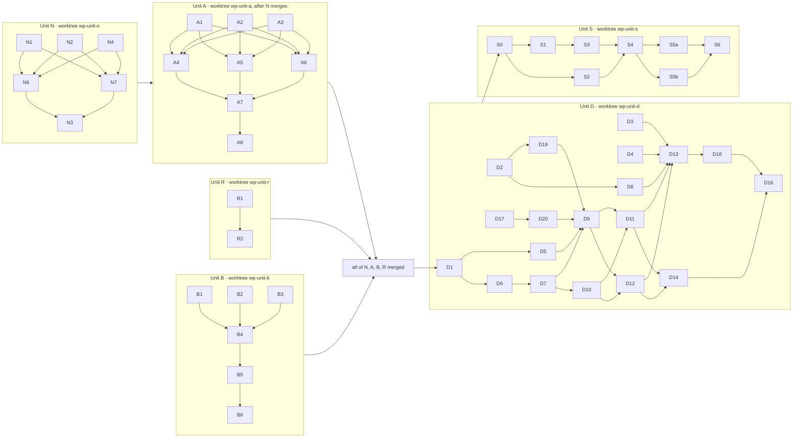

# Ward Parallelization & Machine Load Balancing

Status: high-level plan revised 2026-10-02, with a file-by-file execution plan in §8. Awaiting approval.

---

## 1. Goal

Make a full `npm run ward` faster on every run, and stop ward runs from failing on CPU contention when several agents run at once. The speedup must not cost correctness: every check still runs every time, so a pass always means "the tree passes now".

## 2. What we measured

### 2.1 Where the time goes

The last full run, `.ward/run-1790901309167-9740.json`, took **980s**. All packages together hold about
**1,940s** of work.

| Package                        | Total            | Biggest parts                |
|--------------------------------|------------------|------------------------------|
| `@dungeonmaster/web`           | 451s             | e2e 336s, lint 54s, unit 43s |
| `@dungeonmaster/orchestrator`  | 215s             | lint 106s, unit 73s          |
| `@dungeonmaster/eslint-plugin` | 151s             | unit 56s, lint 48s           |
| `@dungeonmaster/siegelense`    | 142s             | integration 55s, lint 53s    |
| `@dungeonmaster/shared`        | 123s             | lint 63s                     |
| every other package            | 24s to 106s each |                              |

### 2.2 How ward schedules today

| Fact                                                                                                                                                    | Evidence                                                                                                                                                 |
|---------------------------------------------------------------------------------------------------------------------------------------------------------|----------------------------------------------------------------------------------------------------------------------------------------------------------|
| The parent ward spawns one child ward process per package. The child runs that package's check types one after another.                                 | `packages/ward/src/brokers/command/run/multi-package-layer-broker.ts:142` ("const spawnResult = await stream({") and `single-package-layer-broker.ts:65` |
| The number of packages in flight is `ward.concurrency` from `.dungeonmaster.json`, default 4, range 1 to 10.                                            | `multi-package-layer-broker.ts:91`, `packages/config/src/statics/config-defaults/config-defaults-statics.ts:29`                                          |
| Packages run in discovery order. Nothing sorts them.                                                                                                    | `packages/ward/src/brokers/workspace/discover/pattern-resolve-layer-broker.ts:29`                                                                        |
| **The pool deals packages out round-robin before anything runs.** A worker that finishes early sits idle; it never takes another worker's next package. | `packages/shared/src/transformers/promise-pool/promise-pool-transformer.ts:28` — "itemIndex % workerCount === workerIndex"                               |
| Jest runs with `--maxWorkers=25%`, sized for about 4 packages in flight.                                                                                | `packages/ward/src/statics/check-commands/check-commands-statics.ts:50`                                                                                  |
| A run exits 1 when any test is over its slow-test limit, even if every check passed. This is the gate CPU contention trips.                             | `packages/ward/src/statics/slow-file-threshold/slow-file-threshold-statics.ts`, `command-run-broker.ts:234`                                              |
| Per-package, per-check durations are already in `.ward/run-*.json`. But those files are deleted after 2 days, and one can reach about 290 MB.           | `packages/ward/src/statics/ttl/ttl-statics.ts:17`                                                                                                        |
| The parent already stamps each child's per-check wall clock onto that package's `ProjectResult.durationMs`.                                             | `multi-package-layer-broker.ts:213-219`                                                                                                                  |
| `storagePruneBroker` deletes only `run-*.json` files, so anything else under `.ward/` survives pruning.                                                 | `packages/ward/src/brokers/storage/prune/storage-prune-broker.ts:28`                                                                                     |

### 2.3 How web's e2e runs today

| Fact                                                                                                         | Evidence                                                                                                         |
|--------------------------------------------------------------------------------------------------------------|------------------------------------------------------------------------------------------------------------------|
| One Playwright process, `workers: 1`, `fullyParallel: false`.                                                | `packages/web/playwright.config.ts:218-219`                                                                      |
| One API server and one `vite preview` server serve the whole suite, from one home: `<tmpdir>/dm-e2e-<pid>`.  | `packages/web/playwright.config.ts:19`, `.dungeonmaster.json` `devServer.e2e.processes`                          |
| The API server holds an in-memory dispatcher for the whole run.                                              | `packages/web/test/harnesses/e2e-fixtures.ts:57` — "The dispatcher is ONE in-memory singleton for the whole run" |
| Ward picks a free port pair per e2e run and passes it in. The report path and `outputDir` are named by port. | `packages/ward/src/brokers/check-run/e2e/check-run-e2e-broker.ts:158`, `playwright.config.ts:217`                |
| Ward builds the UI bundle once per e2e run, before Playwright starts.                                        | `check-run-e2e-broker.ts:139` — `bundleBuildBroker({ packageRoot })`                                             |
| web is the only package with Playwright e2e: 132 spec files, 489 tests in the last run.                      | `packages/web/playwright.config.ts` is the only Playwright config in the repo                                    |

### 2.4 How siegelense balances load today

| Fact                                                                                                                                                                                        | Evidence                                                                                             |
|---------------------------------------------------------------------------------------------------------------------------------------------------------------------------------------------|------------------------------------------------------------------------------------------------------|
| The machine readers (load average, free memory, cores, RSS by process group, OOM count) take no siegelense types. `machineReadBroker` reads the dungeonmaster home only to statfs its disk. | `packages/siegelense/src/brokers/machine/{read,rss-by-pgid,oom-count}/`, `machine-read-broker.ts:34` |
| The registry is tied to lanes: SiegeInstance id, quest and guild ids, socket path, ports, spec hash.                                                                                        | `packages/siegelense/src/contracts/registry-entry/registry-entry-contract.ts:55-91`                  |
| The registry lives under `<DUNGEONMASTER_HOME>/siegelense/`. Dogfood prod, dev, every e2e home and every siege lane have different homes, so they never see each other's rows.              | `packages/shared/src/brokers/dungeonmaster-home/find/dungeonmaster-home-find-broker.ts:17`           |
| The orchestrator loads siegelense's `capacityReadBroker` at runtime to cap lanes.                                                                                                           | `packages/orchestrator/src/brokers/lane/provision-batch/lane-provision-batch-broker.ts:82`           |
| The capacity math (CPU, memory and ceiling limits) is a pure transformer.                                                                                                                   | `packages/siegelense/src/transformers/capacity-suggest/capacity-suggest-transformer.ts`              |

### 2.5 Node and SQLite on this machine

| Fact                                                                                                                                                        | Evidence                                                                          |
|-------------------------------------------------------------------------------------------------------------------------------------------------------------|-----------------------------------------------------------------------------------|
| Only the root `package.json` declares `engines`, and it says `>=14.0.0`. No workspace package declares one.                                                 | `package.json`                                                                    |
| This machine runs Node 22.17.0.                                                                                                                             | `node --version`                                                                  |
| `node:sqlite` opens a file with a `timeout` (busy wait) option on 22.17, and prints `ExperimentalWarning: SQLite is an experimental feature` on first load. | measured 2026-10-02 with `new DatabaseSync(':memory:', { timeout: 100 })`         |
| Jest 30.2.0's resolver treats `node:sqlite` as a core module, so tests can load it.                                                                         | measured 2026-10-02: `jest-resolve` `isCoreModule('node:sqlite')` returned `true` |
| `@types/node` 24.0.15 ships `sqlite.d.ts`.                                                                                                                  | `node_modules/@types/node/sqlite.d.ts`                                            |
| npm only warns on an `engines` mismatch unless the user sets `engine-strict`.                                                                               | npm's documented behaviour                                                        |

## 3. Decisions

| Question                                        | Decision                                                                                                                                                                                                                                                                                                                                                                                                                                                                                                                  | Why                                                                                                                                                                                                                                                                                                                                                                                                                                                  |
|-------------------------------------------------|---------------------------------------------------------------------------------------------------------------------------------------------------------------------------------------------------------------------------------------------------------------------------------------------------------------------------------------------------------------------------------------------------------------------------------------------------------------------------------------------------------------------------|------------------------------------------------------------------------------------------------------------------------------------------------------------------------------------------------------------------------------------------------------------------------------------------------------------------------------------------------------------------------------------------------------------------------------------------------------|
| Order of work                                   | N, B and R in parallel; A once N merges; then D, then S (§4). C is dropped (§5).                                                                                                                                                                                                                                                                                                                                                                                                                                          | N, B and R touch different files. A writes history into N's registry. D needs A's pool and history, B's sharding, and R's renamed contract. S needs D's limits reader.                                                                                                                                                                                                                                                                               |
| Node floor                                      | Unit N raises `engines` to `>=22.16.0` itself. Nothing waits on another project.                                                                                                                                                                                                                                                                                                                                                                                                                                          | `node:sqlite` with its busy-wait option needs Node 22.16. The bump is small and ward owns the need.                                                                                                                                                                                                                                                                                                                                                  |
| Where `engines` is declared                     | The root `package.json`, plus every package that itself imports `node:sqlite`: `@dungeonmaster/node` and `@dungeonmaster/load-balancer`.                                                                                                                                                                                                                                                                                                                                                                                  | npm checks `engines` on each installed package, so a standalone install of a package that reaches SQLite warns too.                                                                                                                                                                                                                                                                                                                                  |
| What an old Node does at runtime                | The SQLite gateway throws an error naming Node 22.16 as the minimum before it opens anything.                                                                                                                                                                                                                                                                                                                                                                                                                             | npm only warns on `engines`. A clear refusal beats a `TypeError` from deep inside `node:sqlite`.                                                                                                                                                                                                                                                                                                                                                     |
| The SQLite experimental warning                 | The SQLite gateway drops that one warning and no other.                                                                                                                                                                                                                                                                                                                                                                                                                                                                   | Every ward child forwards stderr to the terminal, so the warning would print once per package per run.                                                                                                                                                                                                                                                                                                                                               |
| The pool                                        | Fix `promisePoolTransformer` in place: same name, same signature, a shared queue inside. Unit D adds an optional dynamic limit to it.                                                                                                                                                                                                                                                                                                                                                                                     | Both callers (ward's `multiPackageLayerBroker` and `scanRunBroker`) want the new behaviour. A second pool would leave the broken one for the next caller.                                                                                                                                                                                                                                                                                            |
| Result order after sorting                      | The parent dispatches longest first, then puts the results back in discovery order before merging.                                                                                                                                                                                                                                                                                                                                                                                                                        | The summary and `ward list` print packages in the order they are merged. Sorting must not reorder what the user reads.                                                                                                                                                                                                                                                                                                                               |
| How web's e2e runs in parallel                  | Ward-level sharding: ward starts N `playwright test --shard=i/N` processes.                                                                                                                                                                                                                                                                                                                                                                                                                                               | Each shard is its own process, so it already gets its own `dm-e2e-<pid>` home, servers and dispatcher. No harness changes.                                                                                                                                                                                                                                                                                                                           |
| Shards and `--onlyTests`                        | A run with `--onlyTests` uses 1 shard. Every run with more than 1 shard passes `--pass-with-no-tests` to each shard.                                                                                                                                                                                                                                                                                                                                                                                                      | Playwright filters by `--grep` before it shards, so a shard can end up with no tests and would exit 1 on its own. The discovery-mismatch check still catches a spec file no shard ran.                                                                                                                                                                                                                                                               |
| Package granularity                             | Keep one child ward process per package. Web's e2e shards run inside web's child.                                                                                                                                                                                                                                                                                                                                                                                                                                         | Splitting checks into separate jobs adds children and Jest contention for little gain once e2e is sharded.                                                                                                                                                                                                                                                                                                                                           |
| Where duration and memory history lives         | A `durations` table in the machine registry (`registry-v1.db`), one row per sample: repo root, package, check type, duration, peak RSS, shard count, time. The repo root is the main checkout, found through `git rev-parse --git-common-dir`, so every worktree of a repo shares its rows. Outside git, the key is the run root.                                                                                                                                                                                         | One store instead of two. SQLite queues concurrent writers, so two runs finishing together both keep their samples, where a JSON file keeps only the last writer's. Unit D's memory peaks live in the same rows. A repo moved to a new path starts fresh history, which costs one run.                                                                                                                                                               |
| How history predicts                            | Keep the newest 5 samples per repo, package and check type, in one transaction that inserts the run's samples and deletes older ones. Predict from the median.                                                                                                                                                                                                                                                                                                                                                            | One slow run under load must not reorder the next run. Five samples bound the table.                                                                                                                                                                                                                                                                                                                                                                 |
| Where the live registry lives                   | `<os.homedir()>/.dungeonmaster/load/`, ignoring `DUNGEONMASTER_HOME`. `DUNGEONMASTER_LOAD_DIR` overrides it, and the Jest global setup sets that variable for every test.                                                                                                                                                                                                                                                                                                                                                 | CPU and memory are shared by every repo, home and agent of this user. A registry per home lets two agents each see an idle machine.                                                                                                                                                                                                                                                                                                                  |
| Registry file format                            | SQLite through `node:sqlite`, in WAL mode, with the format version in the file name: `registry-v1.db`.                                                                                                                                                                                                                                                                                                                                                                                                                    | SQLite's built-in busy wait replaces siegelense's lock file. A newer format writes a new file instead of corrupting an older version's file.                                                                                                                                                                                                                                                                                                         |
| Dropping dead leases                            | A lease drops when its owner pid is gone, or when its heartbeat is older than 30s.                                                                                                                                                                                                                                                                                                                                                                                                                                        | A pid check frees a SIGKILLed run's lease at once. The heartbeat covers a pid the OS reused.                                                                                                                                                                                                                                                                                                                                                         |
| Siegelense's own registry                       | It stays in siegelense, per home, with its lane fields. Siegelense also takes one generic lease per running instance in the machine-wide registry.                                                                                                                                                                                                                                                                                                                                                                        | Lane fields mean nothing to ward. The orchestrator's lane code keeps working unchanged.                                                                                                                                                                                                                                                                                                                                                              |
| Jest's worker share under D                     | The parent tells each child its Jest share as a percentage: `max(10, floor(100 / packages in flight))`. It replaces the fixed `25%`.                                                                                                                                                                                                                                                                                                                                                                                      | At 6 packages in flight, a fixed 25% each asks for 150% of the cores.                                                                                                                                                                                                                                                                                                                                                                                |
| History that cannot be read or written          | It never changes the run's verdict. Ward prints one stderr line, `ward: duration history unavailable: <reason>`, and dispatches in discovery order.                                                                                                                                                                                                                                                                                                                                                                       | History is an optimisation. An unreadable registry must not turn a green run red.                                                                                                                                                                                                                                                                                                                                                                    |
| Whether a repo shards e2e                       | A repo key, `ward.e2eSharding` (true or false, default false). This repo sets true. The repo decides only WHETHER; the machine decides how many (Unit D). Until D lands, ward uses a fixed count of 3 from its own statics.                                                                                                                                                                                                                                                                                               | Whether sharding works is a property of the repo: a consumer's Playwright config may hardcode its ports or its home instead of reading ward's env vars, and shards of it would collide. How many shards fit is a property of the machine.                                                                                                                                                                                                            |
| How many packages run at once                   | Unit D removes `ward.concurrency`. No config sets a count: the governor takes CPU from the core count and load average, and memory from history, free memory and the machine's memory cap.                                                                                                                                                                                                                                                                                                                                | A count in a committed file is right on one machine and wrong on the rest. The history and the machine reading already say what fits. An old `.dungeonmaster.json` that still sets the key loads fine: the `ward` object is a plain zod object, so the key is dropped.                                                                                                                                                                               |
| Where machine limits live                       | `resources` in the user's own `~/.dungeonmaster/config.json`, found through `os.homedir()`, ignoring `DUNGEONMASTER_HOME`. Two keys: `maxMemoryPercent` (whole number 10 to 100, default 80) and `maxDiskMB` (whole number, at least 1024, default 4096).                                                                                                                                                                                                                                                                 | Machines differ, so these are per machine and never committed. `DUNGEONMASTER_HOME` is repo-local in this repo's `npm run prod` and a temp folder under e2e, so it cannot be the source of a machine setting.                                                                                                                                                                                                                                        |
| The home config's contract                      | Unit R renames `guildConfigContract` to `homeConfigContract` (type `HomeConfig`), and the orchestrator's `guildConfigReadBroker` and `guildConfigWriteBroker` to `homeConfigReadBroker` and `homeConfigWriteBroker`. Unit D adds `resources` to it, optional. The file's own keys do not change, so every existing `config.json` still loads.                                                                                                                                                                             | That file is written back whole whenever a guild is added. The contract is a plain zod object, which drops unknown keys, so a `resources` key it did not know would be wiped on the next guild save.                                                                                                                                                                                                                                                 |
| What the memory cap measures                    | Memory the machine's dungeonmaster work holds: the sum of every live lease's current RSS. The governor starts a job only if that sum plus the job's expected peak stays under `maxMemoryPercent` of total memory, and only if free memory minus headroom also covers the peak.                                                                                                                                                                                                                                            | The cap bounds dungeonmaster, not the user's other programs. Free memory still guards against those.                                                                                                                                                                                                                                                                                                                                                 |
| Containers and CI                               | The machine reading takes total memory and cores as the smaller of the host's figure and the cgroup v2 limit (`/sys/fs/cgroup/memory.max`, `/sys/fs/cgroup/cpu.max`), when those files exist and are not `max`.                                                                                                                                                                                                                                                                                                           | Inside a container Node reports the host. A 4 GB container on a 64 GB host would otherwise look 16 times bigger than it is.                                                                                                                                                                                                                                                                                                                          |
| When the governor cannot use part of its inputs | No `/proc` (macOS): no memory samples, so history holds durations only and memory is judged on free memory alone. An unreadable or corrupt registry, or a full disk: no leases, so the governor works from the machine reading alone. An invalid `resources` block: defaults. Each case prints one stderr line naming the cause, once per run. If even the machine reading throws, ward runs one package at a time. `NodeVersionUnsupportedError` is the exception: it still stops the run.                               | Load balancing is an optimisation, so losing part of it must not stop a run. Node's `os` module reports cores, load and memory on every platform, so the machine reading itself is the last thing to fail. The Node floor is a decision, and quietly running on an older Node would hide it.                                                                                                                                                         |
| How ward measures a child's memory              | The parent samples the RSS of the child's whole process tree: the child and every descendant, found through the parent pid in `/proc/<pid>/stat`. Children stay in the parent's process group.                                                                                                                                                                                                                                                                                                                            | Playwright starts its browsers and web servers in process groups of their own, so a process-group sample misses most of web's memory. Keeping children in the parent's group also keeps Ctrl-C reaching every child.                                                                                                                                                                                                                                 |
| A lease's owner pid                             | The pid of the child ward the lease is for, not the parent's.                                                                                                                                                                                                                                                                                                                                                                                                                                                             | If the parent dies and its children run on, the work is still using the machine and the lease should stay. When the child dies, the lease drops.                                                                                                                                                                                                                                                                                                     |
| Disk budget (Unit S)                            | Dungeonmaster keeps the total size of its own stores under `maxDiskMB` (default 4 GB) by deleting the oldest items first, across the repo the current run is in and every guild path in `~/.dungeonmaster/config.json`. A repo that is neither is never touched. A guild path that no longer exists is skipped. It never deletes an item a live process is using, the newest ward result of each repo, or anything outside the stores it knows. Each store's own pruning (TTLs, `storageBudgetStatics`) still runs first. | The user asked for a cap on the disk dungeonmaster itself uses, not a free-space floor. The guild list already names the user's repos, so no second list is kept. Measured 2026-10-02 on this machine, the stores found so far hold about 200 MB (`.ward` 142 MB, the two homes about 30 MB each), so the 4 GB default deletes nothing here; a machine already over 4 GB loses its oldest items on the first run after upgrade, and the run says so. |
| Slow-test limits                                | They stay fixed. The governor (§4, D) throttles concurrency to keep tests under them.                                                                                                                                                                                                                                                                                                                                                                                                                                     | The limits exist to catch slow tests. Raising them under load hides real slowness.                                                                                                                                                                                                                                                                                                                                                                   |
| New package name                                | `@dungeonmaster/load-balancer`, package type `library`.                                                                                                                                                                                                                                                                                                                                                                                                                                                                   | The name the original proposal chose.                                                                                                                                                                                                                                                                                                                                                                                                                |

## 4. The units

### Unit N — Node 22.16 floor and the SQLite gateway

**Before:** the root `package.json` declares `engines.node` `>=14.0.0`. Nothing in the repo opens SQLite.

**After:**

1. `engines.node` is `>=22.16.0` in the root `package.json`, `packages/@gateway/node/package.json`, and (once Unit D creates it) `packages/load-balancer/package.json`.
2. A new gateway wrapper, `#gateway/node/sqlite`, opens a database file with a busy wait. It refuses a Node older than 22.16 with an error naming that version, and it drops SQLite's experimental warning.
3. Any doc that states a minimum Node version says 22.16.
4. The new `@dungeonmaster/load-balancer` package exists, with one broker that opens the machine registry and creates its tables. Unit N creates the `durations` table that Unit A writes; Unit D adds `leases`; Unit S adds
   `meta`.
5. Every Jest run points `DUNGEONMASTER_LOAD_DIR` at its own sandbox, so no test reaches the real registry.

### Unit A — Shared work queue and longest-job-first

**Before:** the pool deals packages round-robin in discovery order. Web starts late and runs alone at the end.

**After:**

1. `promisePoolTransformer` keeps its name and signature. Every worker pulls the next item from one shared queue, and results keep input order.
2. After each run, the parent ward adds one sample per package and check type to a `durations` table in the machine registry (`~/.dungeonmaster/load/registry-v1.db`, created by Unit N), keyed by the main checkout's path. Every worktree of a repo shares those rows. The table keeps the newest 5 samples per package and check type.
3. Before dispatching, the parent predicts each package's cost as the median of its samples, summed over the check types this run will execute, and sorts longest first. A package with no samples for any of those check types goes first, since it could be the longest. Ties keep discovery order. The median keeps one slow run under load from reordering the next one.
4. The parent merges results in discovery order, so the summary reads the same as before.
5. Only whole-package child runs add samples. A child handed a file list, or run with `--onlyTests`, never does, because its times are not the package's real cost. A crashed child adds nothing.

**Expected
result:** a full run drops from 980s to about 485s. That is 1,940s of work over 4 workers, with web started at second 0.

### Unit B — Web e2e sharding

**Before:** one Playwright process runs all 132 spec files on one worker, in 336s.

**After:**

1. `check-run-e2e-broker` starts N Playwright processes at once, each with `--shard=i/N`, its own free port pair, its own JSON report, its own open-handle report and its own output folder.
2. All shards use the one prebuilt UI bundle. Ward builds it once, before the shards start, as it does today.
3. Ward merges the shard results into one `ProjectResult`: failures, passing tests, per-file timings, open handles and the processed-file list.
4. A new `.dungeonmaster.json` key, `ward.e2eSharding` (default false), says whether the repo can be sharded. This repo sets it to true. When it is true, N is 3 (a ward statics value) until Unit D replaces it with the machine's answer. N is never more than the number of spec files in the run, and it is 1 when `--onlyTests` is set or sharding is off. N = 1 runs exactly the command ward runs today.
5. Each shard's servers are killed and its Vite cache removed when that shard ends.

**Expected
result:** web's longest path drops from 451s to about 227s (115s of other checks plus 336s ÷ 3). The full run drops to about 430s.

**Risks to watch:**

- 3 shards mean 3 browsers and 6 servers at once. The e2e slow-test limit is 20s. Unit B's manual tests must show no new slow-test failures at 3 shards.
- Playwright balances shards by test count, not by duration, so one shard can run much longer than the others. Unit B's manual tests record each shard's wall clock. If the slowest shard is more than 1.5 times the fastest, file a follow-up to split spec files by Unit A's per-file history instead.
- A spec that only passed because an earlier file left state behind fails once its file lands in a different shard. Task B5 finds and fixes those.

### Unit D — Machine-wide load balancing

**Before:** ward runs a fixed number of packages no matter what else the machine is doing. Two agents running ward together trip the slow-test gate.

**After:**

1. **Machine
   limits** in `~/.dungeonmaster/config.json`: `resources.maxMemoryPercent` and `resources.maxDiskMB`. The machine reading also honours cgroup v2 limits.
2. **New package `@dungeonmaster/load-balancer`.** It holds:
   - the machine readers, moved from siegelense. `machineReadBroker` takes the path to statfs as a parameter.
   - the live registry at `<homedir>/.dungeonmaster/load/registry-v1.db`
   - a lease API: take a lease, heartbeat it, release it, and list live leases, dropping dead ones
   - a capacity suggestion, generalised from siegelense's capacity transformer. It takes the machine reading, the live leases, and the caller's estimate of one job's memory.
3. **Ward:**
    - The parent samples each child's process-tree memory while it runs.
    - The parent takes a lease for each package child it starts, owned by that child's pid, heartbeats it, and releases it when the child ends.
    - Before each dispatch, the parent asks for capacity, so concurrency can change during the run. It never drops below 1 package in flight. No config sets a count: `ward.concurrency` is removed.
    - When part of the governor's input is missing (no `/proc`, no registry), it works from what is left and says so on one stderr line.
   - The parent hands each child its Jest worker share.
   - Unit B's shard count is capped by the same capacity answer.
   - History adds peak memory (RSS) per package and check type, next to Unit A's durations.
4. **Siegelense:**
    - imports the machine readers from the new package
   - takes a lease per running instance, and releases it on kill
   - debits other tools' starting leases when it computes capacity
    - keeps its own registry, profiles and snapshots unchanged
4.
**Orchestrator:** no change. It still calls siegelense's capacity. The Claude agents it spawns take no leases. Ward sees their load only through the machine reading: load average and free memory.

**Expected
result:** two agents running ward at once both pass without slow-test failures. A full run on an idle machine can use more than 4 workers when history shows they fit. On this 12-core machine that is an estimated 300s at 6 workers, to confirm by measurement.

### Unit R — Rename the home config's contract

**Before:** `~/.dungeonmaster/config.json` is read and written through `guildConfigContract`, `GuildConfigStub`,
`guildConfigReadBroker` and `guildConfigWriteBroker`. The names say "guilds", but Unit D adds machine limits to the same file.

**After:** the contract is `homeConfigContract` with type `HomeConfig` and stub `HomeConfigStub`, in
`packages/shared/src/contracts/home-config/`. The brokers are `homeConfigReadBroker` and `homeConfigWriteBroker`, in
`packages/orchestrator/src/brokers/home-config/{read,write}/`. Nothing about the file on disk changes.

### Unit S — Disk budget

**Before:** each store prunes itself by its own rule. `.ward/` keeps run files for 2 days within a byte budget; the Jest cache and e2e artifacts have their own sweeps; siegelense has its own `prune`. Nothing bounds the total, and one
`.ward/` run file reached about 290 MB.

**After:**

1. A disk-budget pass keeps the total size of dungeonmaster's stores under `resources.maxDiskMB`, default 4096 MB.
2. The stores are a fixed list in load-balancer statics: per repo, ward's run files, Playwright `test-results` folders and siegelense's assets; per user, the Jest cache, leftover `dm-e2e-*` homes and siegelense evidence. Task S0 confirms each location from the existing pruners before anything is written.
3. The repos it covers are the one the current run is in, plus every guild path in `~/.dungeonmaster/config.json`. A guild path that no longer exists is skipped.
4. The pass deletes the oldest items first, across all stores. It never deletes:
    - an item a live process is using (an e2e home whose owner pid is alive, a lane's evidence while its instance runs)
    - the newest ward run file of each repo
    - anything younger than 10 minutes
    - anything outside a known store, and it never follows a symlink out of one
5. The pass runs at the end of a ward run, after the existing prunes, at most once every 10 minutes per machine (a timestamp row in the registry). It never changes a run's verdict; a failure prints one stderr line.

**Expected
result:** the stores' total stays under `maxDiskMB` after each pass. On a machine under the cap, nothing beyond today's pruning is deleted.

## 5. Not doing, and why

### Check result caching (the proposal's "check result fingerprint snapshotting")

The proposal skipped a package's check when a hash of its inputs matched an earlier pass. It is dropped:

| Reason                                                                                                          | Measurement or evidence                                                                                                                                  |
|-----------------------------------------------------------------------------------------------------------------|----------------------------------------------------------------------------------------------------------------------------------------------------------|
| Full runs are rare, and scoped runs are already fast.                                                           | Of the 96 run files in `.ward/` from the last 2 days, 2 were bare full runs.                                                                             |
| A shared edit invalidates almost everything anyway.                                                             | Since 2026-09-01, 327 of 1,683 commits touched `packages/shared`, which nearly every package depends on. Another 283 commits touched 3 or more packages. |
| The cache key is never complete, and each gap is a stale pass.                                                  | web's e2e boots `packages/server`, which web does not depend on. Integration tests spawn other packages' programs.                                       |
| It hides flaky tests.                                                                                           | A test that passes 1 time in 3 is cached on a lucky run and stays green until its inputs change.                                                         |
| Cached packages are never re-timed, so the slow-test gate goes blind to them.                                   |                                                                                                                                                          |
| The pre-merge regression pass is the run the cache would help most, and it is where a skip is least acceptable. |                                                                                                                                                          |

It can come back as its own proposal if full runs become frequent.

### Per-worker homes with snapshot-restore resets for e2e

The proposal gave each Playwright worker its own home and reset it from a snapshot before each test. It is dropped:

- Each worker would need its own API and Vite servers. Playwright's `webServer` starts once per run, not once per worker.
- A file restore does not reset the server's in-memory dispatcher.

Sharding (Unit B) gets the same parallelism with none of these problems.

## 6. Acceptance criteria

| Unit | Criterion                                                                                                                                                                            |
|------|--------------------------------------------------------------------------------------------------------------------------------------------------------------------------------------|
| N    | `engines.node` reads `>=22.16.0` in the root and `@dungeonmaster/node` `package.json`.                                                                                               |
| N    | Opening a database through `#gateway/node/sqlite` prints no `ExperimentalWarning` on Node 22.17.                                                                                     |
| N    | Two connections writing one file at once both succeed, because the second waits on the busy timeout.                                                                                 |
| A    | A full `npm run ward` passes, and web's child starts in the first dispatch wave.                                                                                                     |
| A    | A worker that finishes early takes the next package; no worker is idle while packages are still queued.                                                                              |
| A    | The summary lists packages in the same order as before Unit A.                                                                                                                       |
| A    | After a full run, the registry's `durations` table holds one new sample per package and check type, keyed by the main checkout; a worktree's run reads and adds to the same rows.    |
| N    | The registry file and its `durations` table are created on first open, and no test writes to `~/.dungeonmaster/load/`.                                                               |
| A    | A full run is under 600s on this machine. The estimate is about 485s.                                                                                                                |
| B    | A full web e2e passes with 3 shards and no new slow-test failures.                                                                                                                   |
| B    | A file-scoped e2e run of one spec starts exactly one Playwright process.                                                                                                             |
| B    | An `--onlyTests` e2e run starts exactly one Playwright process.                                                                                                                      |
| B    | A failing test in shard 2 shows up in ward's output and `detail` exactly as a failure does today.                                                                                    |
| B    | No server is left listening on any shard's ports after the run.                                                                                                                      |
| D    | Two `npm run ward` runs started together both pass. While they run, the registry shows both runs' leases.                                                                            |
| D    | A siegelense lane and a ward run started together see each other's leases.                                                                                                           |
| D    | `DUNGEONMASTER_LOAD_DIR` keeps every test away from `~/.dungeonmaster/load/`.                                                                                                        |
| D    | Killing a ward run with SIGKILL leaves leases that drop out at the next capacity read, because their pid is gone.                                                                    |
| D    | With `resources.maxMemoryPercent` at 20, the summed RSS of dungeonmaster's work stays under 20% of total memory through a full run.                                                  |
| D    | Inside a cgroup limited to 4 GB and 4 CPUs, ward plans against 4 GB and 4 cores.                                                                                                     |
| D    | Adding a guild leaves `resources` in `~/.dungeonmaster/config.json` unchanged.                                                                                                       |
| D    | No config key sets a package count; an old `.dungeonmaster.json` holding `ward.concurrency` still loads.                                                                             |
| S    | With `maxDiskMB` below current usage, one ward run brings the stores under it, oldest first, and deletes nothing protected.                                                          |
| S    | With the stores under `maxDiskMB`, a run deletes nothing beyond what each store's own pruner already deletes.                                                                        |
| R    | No source file outside `scrolls/` mentions `guildConfigContract`, `GuildConfig`, `guildConfigReadBroker` or `guildConfigWriteBroker`, and an existing `config.json` loads unchanged. |

## 7. What this revision changed

| Before (2026-10-01)                                                                                      | After (2026-10-02)                                                                                                                                                                                           |
|----------------------------------------------------------------------------------------------------------|--------------------------------------------------------------------------------------------------------------------------------------------------------------------------------------------------------------|
| Unit D waited for chronicle-llm to raise `engines` to Node 22.16.                                        | Unit N raises it, with no dependency on any other project.                                                                                                                                                   |
| "A new queue-based pool" in shared.                                                                      | `promisePoolTransformer` is fixed in place, because both of its callers move.                                                                                                                                |
| Sorting packages had no rule for result order.                                                           | The parent restores discovery order before merging, so the summary does not reshuffle.                                                                                                                       |
| "Only full-package runs update history."                                                                 | Defined per child: no file list, no `--onlyTests`, not crashed.                                                                                                                                              |
| History writes had no concurrency rule.                                                                  | Read, merge, atomic write. Last writer wins.                                                                                                                                                                 |
| Shards with `--onlyTests` were unaddressed.                                                              | `--onlyTests` uses 1 shard; every multi-shard run passes `--pass-with-no-tests`.                                                                                                                             |
| Shard balance was assumed even.                                                                          | Playwright balances by test count, so B measures each shard's wall clock and names a follow-up.                                                                                                              |
| Specs that depend on an earlier file's state were not considered.                                        | Task B5 hunts them.                                                                                                                                                                                          |
| Dead leases dropped only on a stale heartbeat.                                                           | A dead pid drops a lease at once; the heartbeat covers pid reuse.                                                                                                                                            |
| Jest's `--maxWorkers=25%` stayed fixed while D raised concurrency.                                       | The parent hands each child a share sized to the live concurrency.                                                                                                                                           |
| D's peak memory and CPU history had no measuring method.                                                 | The parent samples the RSS of each child's process tree. CPU is left to the load average, because sampled CPU time misses exited Jest workers.                                                               |
| `machineReadBroker` would have carried siegelense's home lookup into the new package.                    | It takes the path to statfs as a parameter.                                                                                                                                                                  |
| Nothing handled SQLite's experimental warning on Node 22.                                                | The gateway drops it.                                                                                                                                                                                        |
| §5 cited chronicle-llm's home-to-SQLite plan against per-worker homes.                                   | Removed. The other two reasons stand on their own.                                                                                                                                                           |
| `ward.e2eShards` defaulted to 3 for every consumer.                                                      | It defaults to 1, and this repo opts in with 3. Found while writing the manual tests.                                                                                                                        |
| Child wards were to run as their own process groups so the parent could sample memory.                   | Children stay in the parent's group, and the parent samples their process tree. A separate group stops Ctrl-C reaching them, and misses the browsers and servers Playwright starts in groups of their own.   |
| The governor's ceiling was `ward.concurrency`, default 4.                                                | No count at all. `ward.concurrency` is removed in Unit D; the machine reading, history and the home config's memory cap decide. (An intermediate draft added `ward.maxConcurrency`; it is dropped.)          |
| Machine limits would have lived in the committed `.dungeonmaster.json`.                                  | They live in `~/.dungeonmaster/config.json`, because machines differ.                                                                                                                                        |
| `ward.e2eShards` set a shard count per repo.                                                             | `ward.e2eSharding` says only whether the repo can be sharded; the machine picks the count.                                                                                                                   |
| Nothing bounded the disk dungeonmaster's own files take.                                                 | Unit S, driven by `resources.maxDiskMB`, default 4 GB, over the current repo and the guild list.                                                                                                             |
| Unit S kept its own list of repos in the registry.                                                       | It reads the guild list, which already names the user's repos.                                                                                                                                               |
| History lived in `.ward/history/durations.json`, one value per package and check type, last writer wins. | It lives in the registry's `durations` table: 5 samples each, median prediction, concurrent writers queued. The load-balancer package and the registry move from Unit D into Unit N, and Unit A waits for N. |
| The home config's contract was named for guilds.                                                         | Unit R renames it `homeConfigContract`.                                                                                                                                                                      |
| Containers looked like their host.                                                                       | The machine reading honours cgroup v2 limits.                                                                                                                                                                |
| A lease was owned by the parent's pid.                                                                   | It is owned by the child's pid.                                                                                                                                                                              |
| Nothing said what ward does without `/proc`, or with a broken registry or history file.                  | Each falls back to what is left, with one stderr line. None changes the verdict.                                                                                                                             |

## 8. Execution plan for an orchestrator

This section is written for a Sonnet-class orchestrator that dispatches Sonnet-class workers. Read all of it before dispatching anything.

### 8.1 Rules for the orchestrator

1. **Only the orchestrator builds, creates worktrees, creates packages, merges and runs a bare `npm run ward`.**
   Workers do none of these.
2. **Work each unit in its own worktree.** Call `mcp__dungeonmaster__create-worktree({ name })` with the names
   `wp-unit-n`, `wp-unit-a`, `wp-unit-b`, `wp-unit-r`, and later `wp-unit-d` and `wp-unit-s`. A worker's brief names the worktree path, and the worker works only there.
3. **Dispatch a fresh agent per task, with `model: "sonnet"`.** Never fork. Never let a worker dispatch.
4. **Run tasks marked parallel at the same time only if their file lists do not
   overlap.** The task cards below already satisfy this. Do not add files to a running task.
5. **Wait for every task in a step before starting the next step.**
6. **After each task, read the worker's
   report.** Check it names the ward command it ran and the exit code. A report with no ward output is not done: send it back.
7. **Commit after each
   task**, inside that unit's worktree, on the worktree's branch. One commit per task. End the message with the attribution line the session gives you.
8. **Gate each unit before merging
   it.** In the unit's worktree: `npm run ward -- --committed --uncommitted` until it exits 0, then one bare `npm run ward` (with `timeout: 600000`), then the unit's manual checks (§8.9).
9. **Merge N first, and create `wp-unit-a` from `master` only after N
   merges**, because A writes into N's registry. Merge B and R whenever their gates pass. Start D once N, A, B and R are all merged; S after D. A and B both edit `packages/ward/CLAUDE.md`; resolve that conflict by keeping both sections. Then create `wp-unit-d` from `master`. After D merges, create `wp-unit-s` from `master`.
10. **Stop and ask the user** if a gate fails twice on the same cause, or if a task needs a file not on its card.

### 8.2 Brief template for every worker

Paste this, filled in, as the whole prompt. The card text goes where it says.

```
You are implementing one task of scrolls/ward-parallelization-and-load-balancer.md in the worktree at <PATH>.
Work only inside <PATH>. Read §3 and the section for Unit <X> of that file before starting.

Your task card:
<PASTE THE CARD>

Rules:
- Before writing code, call get-architecture, get-testing-patterns, and get-folder-detail for every folder type you
  will write into. Their rules override your defaults.
- Search with the discover MCP tool. Grep, find and Glob are blocked.
- Touch only the files on your card, plus each one's companions (.test.ts, .proxy.ts, .stub.ts) and the folder
  barrel the architecture says must export a new file. If you need another file, stop and report why.
- Do not build. Do not create worktrees. Do not fork or dispatch agents. Do not commit.
- Never edit .claude/settings.json, .mcp.json, or any .env file.
- Comments state why, in present tense. No history, no counts of things that grow.
- Tests assert real values with toStrictEqual or toBe. A test that only checks "was called" does not count.
- Run: npm run ward -- -- <every file you touched>   (timeout: 600000). Fix every failure in your files.
  A typecheck failure in a file you did not touch: report it, do not fix it.

Report back in this shape:
DONE or BLOCKED — one line
FILES — each path you created or changed
WARD — the exact command and its last 15 lines of output, including the exit code
NOTES — anything the orchestrator must know (a decision you made, a file you needed but did not touch)
```

### 8.3 Order at a glance



Units N, B and R start together; A starts when N merges. Inside a unit, tasks joined by `&` run in parallel.

### 8.3a Execution Progress Tracker

```text
Unit N (Node Floor & SQLite Gateway · worktree wp-unit-n) — [MERGED TO MASTER]
  #1   N1 [✓]  N2 [✓]  N4 [✓]
  #2   N6 [✓]  N7 [✓]
  #3   N3 [✓]

Unit R (Rename Home Config · worktree wp-unit-r) — [MERGED TO MASTER]
  #1   R1 [✓]
  #2   R2 [✓]

Unit B (E2E Sharding · worktree wp-unit-b) — [MERGED TO MASTER]
  #1   B1 [✓]  B2 [✓]  B3 [✓]
  #2   B4 [✓]
  #3   B5 [✓]
  #4   B6 [✓]

Unit A (Duration History & Shared-Queue Pool · worktree wp-unit-a) — [MERGED TO MASTER]
  #1   A1 [✓]  A2 [✓]  A3 [✓]
  #2   A4 [✓]  A5 [✓]  A6 [✓]
  #3   A7 [✓]
  #4   A8 [✓]

Unit D (Load Balancer & Dynamic Concurrency · worktree wp-unit-d) — [MERGED]
  #1   D1 [✓]  D2 [✓]  D3 [✓]  D4 [✓]  D17 [✓]
  #2   D5 [✓]  D6 [✓]  D8 [✓]  D19 [✓] D20 [✓]
  #3   D7 [✓]
  #4   D9 [✓]  D10 [✓]
  #5   D11 [✓] D12 [✓]
  #6   D13 [✓] D14 [✓]
  #7   D18 [✓]
  #8   D16 [✓]

Unit S (Disk Budget · worktree wp-unit-s) — [IN PROGRESS]
  #1   S0 [ ]
  #2   S1 [ ]  S2 [ ]
  #3   S3 [ ]
  #4   S4 [ ]
  #5   S5a [ ] S5b [ ]
  #6   S6 [ ]
```

### 8.4 Unit N tasks (worktree `wp-unit-n`)

**Step N-1 — run N1 and N2 in parallel. The orchestrator does N4 at the same time.**

**N1 — Raise the Node floor.**

- Files: `package.json` (root), `packages/@gateway/node/package.json`.
- Set `"engines": { "node": ">=22.16.0" }` in both. The gateway package has no `engines` key yet; add one.
- Then use `discover` with grep `node >=|Node 1[0-9]|Node 2[0-9]|engines` over `*.md` and `packages/cli/**`. List every hit that states a minimum Node version in your NOTES. Do not edit them; N3 does.
- Ward: `npm run ward -- --only lint -- package.json packages/@gateway/node/package.json` may report no files processed. That is expected for JSON; report it.

**N2 — SQLite gateway wrapper.**

- Create `packages/@gateway/node/src/sqlite/sqlite.ts` with its `.proxy.ts`, `.test.ts` and an
  `.integration.test.ts`. Look at `packages/@gateway/node/src/os/os.ts` and
  `packages/@gateway/node/src/child_process/spawn-detached/` for the gateway's file shape.
- Export one function, `openSqliteDatabase({ filePath, busyTimeoutMs })`, returning the `DatabaseSync` from
  `node:sqlite` opened with `{ timeout: busyTimeoutMs }`. Also export `NodeVersionUnsupportedError` from
  `packages/@gateway/node/src/sqlite/node-version-unsupported.error.ts`.
- Before importing `node:sqlite`, compare `process.versions.node` against 22.16.0. Below it, throw
  `NodeVersionUnsupportedError` with a message that says "node:sqlite needs Node 22.16 or newer" and names the running version.
- Load `node:sqlite` with `require` inside the function, the first time it is called. Around that first load, filter
  `process.emitWarning`: drop a warning whose type is `ExperimentalWarning` and whose message starts with `SQLite`, and pass every other warning through. Restore the original `emitWarning` afterwards, even if the load throws.
- Run `PRAGMA journal_mode=WAL` on every open.
- If `packages/@gateway/node/src/gateway-node-exports-shape.integration.test.ts` lists every subpath, add `sqlite`.
- Unit tests: the version refusal at 22.15.0, a pass at 22.16.0, the warning filter passing a non-SQLite warning through.
- Integration test, in an OS temp dir from `installTestbedCreateBroker`: open one file twice; start a write transaction (`BEGIN IMMEDIATE`) on the first connection; on the second, insert a row with a 2000ms busy timeout while a `setTimeout` commits the first after 200ms. Assert the second insert succeeds and both rows exist. Capture stderr during the open and assert it holds no `ExperimentalWarning`.

**Step N-2 — after N1 and N2.**

**N4 — Create the load-balancer package.** (orchestrator only)

- Run `dungeonmaster create-package --name load-balancer --type library` in `wp-unit-n`.
- Add `"engines": { "node": ">=22.16.0" }` to `packages/load-balancer/package.json`, and add
  `"@dungeonmaster/node": "*"` and `"@dungeonmaster/shared": "*"` to its dependencies if the scaffold did not.
- Run `npm install` in the worktree so the workspace link exists. Commit.

**Step N-2 — after N2 and N4, run N6 and N7 in parallel.**

**N6 — Registry statics and open broker.**

- Files: create `packages/load-balancer/src/statics/load-balancer/load-balancer-statics.ts` with `.test.ts`; create
  `packages/load-balancer/src/brokers/registry/open/registry-open-broker.ts` with `.proxy.ts`, `.test.ts` and
  `.integration.test.ts`.
- Statics: `{ registry: { dirEnvVar: 'DUNGEONMASTER_LOAD_DIR', homeRelativeDir: '.dungeonmaster/load', fileName:
  'registry-v1.db', busyTimeoutMs: 5000 } }`. Unit D adds more sections.
- Broker: resolve the folder (the env var if set, else `<homedir()>/<homeRelativeDir>`), `ensureDir` it, open
  `registry-v1.db` through `openSqliteDatabase` from `#gateway/node/sqlite`, and create, `IF NOT EXISTS`:
    - table `durations`: `repo_root TEXT, package TEXT, check_type TEXT, duration_ms INTEGER, peak_rss_mb INTEGER NULL,
    shards INTEGER NULL, recorded_at_ms INTEGER`
    - an index on `(repo_root, package, check_type, recorded_at_ms)`
      Return the database.
- Integration test: env var set to a testbed dir → the file is created there and the table and index exist; a second open of the same file succeeds and keeps existing rows.

**N7 — Test isolation.**

- Files: `packages/testing/src/jest.setup-global.js`.
- Set `DUNGEONMASTER_LOAD_DIR` to a folder inside the sandbox home it already creates, so no test reaches the real registry.
- Verify by running `npm run ward -- --only integration -- packages/load-balancer` and confirming
  `~/.dungeonmaster/load/` did not change (`ls -la --time-style=full-iso`).

**Step N-3 — after N-2.**

**N3 — Docs.**

- Files: the docs N1 listed, plus `packages/@gateway/node/CLAUDE.md` if it exists, and a new
  `packages/load-balancer/CLAUDE.md`.
- Change every stated Node minimum to 22.16. Add one sentence to the gateway's docs saying `#gateway/node/sqlite`
  is the only way to open SQLite, and why it filters the warning. In the load-balancer's docs: where the registry lives, the `DUNGEONMASTER_LOAD_DIR` override, and that each unit adds its own tables through `registryOpenBroker`.

### 8.5 Unit A tasks (worktree `wp-unit-a`, created from `master` after N merges)

**Step A-1 — run A1, A2 and A3 in parallel.**

**A1 — Shared-queue pool.**

- Files: `packages/shared/src/transformers/promise-pool/promise-pool-transformer.ts` and its `.test.ts`.
- Keep the exported name and the parameter object `{ items, concurrency, handler }`.
- Replace the round-robin with a shared index: each of `min(concurrency, items.length)` workers loops by recursion, taking the next unclaimed index, awaiting `handler`, writing `results[index]`, and recursing until no index is left. No `while (true)`.
- A rejected handler rejects the whole call, as today.
- Tests, each built on manually resolved promises so the order is deterministic:
   1. With concurrency 2 and items `[long, short, short, short]`, the worker that ran the first `short` also runs the third and fourth while `long` is still pending. Assert the start order.
   2. The highest number of handlers in flight at once equals `concurrency`, never more.
   3. Results come back in input order.
   4. Concurrency larger than the item count; an empty item list.
   5. A rejecting handler rejects the call with that error.

**A2 — `git rev-parse --git-common-dir` wrapper.**

- Files: create `packages/@gateway/bin/src/git/common-dir/common-dir.ts` with `.proxy.ts` and `.test.ts`; add one export line to `packages/@gateway/bin/src/git/git.ts`.
- Copy the shape of `packages/@gateway/bin/src/git/head-sha/`. Arguments: `['rev-parse', '--git-common-dir']`.
- Return an absolute path. Git prints a relative path (often `.git`) in the main checkout, so resolve the output against `cwd`. Return `null` on a non-zero exit or empty output. Let `GitNotInstalledError` propagate as the other wrappers do.
- Tests: relative output resolved against cwd; absolute output kept; exit 128 is `null`; empty output is `null`.

**A3 — Sample contract and statics.**

- Files: create `packages/ward/src/contracts/duration-sample/duration-sample-contract.ts` with `.stub.ts` and
  `.test.ts`; create `packages/ward/src/statics/duration-history/duration-history-statics.ts` with `.test.ts`.
- Contract: `{ repoRoot, packageName, checkType, durationMs, peakRssMB: number | null, shards: number | null,
  recordedAtMs }`. Reuse the existing `CheckType` contract. Use the existing `projectFolder` name type for
  `packageName` if one exists.
- Statics: `{ samplesKept: 5 }`.

**Step A-2 — after A-1, run A4, A5 and A6 in parallel.**

**A4 — Find where history lives.**

- Files: create `packages/ward/src/brokers/history/root-find/history-root-find-broker.ts` with `.proxy.ts` and
  `.test.ts`.
- Input `{ rootPath }`. Call `commonDir` from `#gateway/bin/git` with `cwd: rootPath`. If it returns a path whose last segment is `.git`, return that path's parent. Otherwise return `rootPath`. If git is missing (`GitNotInstalledError`), return `rootPath`.
- Tests: main checkout (`/repo/.git` → `/repo`); worktree (`/repo/.git` returned while cwd is `/repo/worktrees/x` →
  `/repo`); not a repo (`null` → rootPath); git missing → rootPath; a bare-repo path not ending in `.git` → rootPath.

**A5 — Read and write samples.**

- Files: create `packages/ward/src/brokers/history/read/history-read-broker.ts` and
  `packages/ward/src/brokers/history/write/history-write-broker.ts`, each with `.proxy.ts`, `.test.ts`, and one
  `.integration.test.ts` for the pair; add `"@dungeonmaster/load-balancer": "*"` to `packages/ward/package.json`.
- Read: input `{ repoRoot }`. Open the registry with `registryOpenBroker` from `@dungeonmaster/load-balancer/brokers`
  and return every `durations` row for that repo root as `DurationSample[]`. Parse each row with the contract; skip a row that fails, and count it in a returned `skipped` number.
- Write: input `{ samples }`. In one transaction (`BEGIN IMMEDIATE` … `COMMIT`, `ROLLBACK` on a throw), insert every sample, then delete every row of each touched repo, package and check type beyond the newest `samplesKept`.
- Integration test, with `DUNGEONMASTER_LOAD_DIR` in a testbed: write 7 samples for one key, read back the newest 5; two keys stay separate; a row with a negative duration is skipped and counted.

**A6 — Prediction, ordering and sample transformers.**

- Files: create `packages/ward/src/transformers/duration-predict/duration-predict-transformer.ts`,
  `packages/ward/src/transformers/package-dispatch-order/package-dispatch-order-transformer.ts` and
  `packages/ward/src/transformers/duration-samples-build/duration-samples-build-transformer.ts`, each with `.test.ts`.
- `durationPredictTransformer({ samples })` returns, per package and check type, the median `durationMs` (the mean of the middle two for an even count) and the median `peakRssMB` of samples that have one.
- `packageDispatchOrderTransformer({ projectFolders, predictions, checkTypes })` returns the folders sorted for dispatch. A folder missing a prediction for any of `checkTypes` comes first. The rest sort by the sum of their predicted durations over `checkTypes`, largest first. Ties and unknowns keep their input order (stable sort).
- `durationSamplesBuildTransformer({ repoRoot, checks, wholePackageNames, nowMs })` returns one sample per
  `ProjectResult` whose `projectFolder.name` is in `wholePackageNames` and which is not crashed (use
  `isCrashedProjectResultGuard`), with `peakRssMB` and `shards` null until Unit D.
- Tests: median of 1, 2, 5 samples; one outlier among five does not move the median; unknown first; longest first; only the requested check types count; stable ties; a crashed result and a non-whole package give no sample.

**Step A-3 — after A-2.**

**A7 — Wire it into the parent.**

- Files: `packages/ward/src/brokers/command/run/multi-package-layer-broker.ts`, its `.proxy.ts` and `.test.ts`.
- Before the pool: `repoRoot = await historyRootFindBroker({ rootPath })`, then `historyReadBroker({ repoRoot })`, then `durationPredictTransformer`, then `packageDispatchOrderTransformer` over `filteredFolders` and `checkTypes`.
- Pass the sorted folders to `promisePoolTransformer`. Inside the handler, record whether this child is whole-package:
  `matchingArgs` is empty (or there is no passthrough) and `config.onlyTests` is unset.
- After the pool, rebuild `subResults` in `filteredFolders` order before the existing merge loop.
- After the merge and before `storageSaveBroker`, call `durationSamplesBuildTransformer` with the whole-package names and `historyWriteBroker`. Skip both when the set is empty.
- A thrown error from the root find, the read or the write prints `ward: duration history unavailable: <message>` to stderr once, and the run carries on, in discovery order when the read failed. It never changes the exit code.
- Tests to add: a package with the longest history is spawned first; the merged summary order matches discovery order; a file-scoped run writes no sample; an `--onlyTests` run writes none; a full run writes one sample per package and check type; a write that throws leaves the result and exit code unchanged and prints the one line.
- Run `npm run ward -- -- packages/ward/src/brokers/command/run/multi-package-layer-broker.ts
  packages/ward/src/brokers/command/run/multi-package-layer-broker.test.ts
  packages/ward/src/brokers/scan/run/scan-run-broker.test.ts`. The scan test covers the pool's other caller.

**Step A-4 — after A7.**

**A8 — Docs.**

- Files: `packages/ward/CLAUDE.md`.
- Where it says "up to 4 concurrently, via a promise pool", say instead that the pool is a shared queue, packages are dispatched longest-first by the median of the last 5 samples in the registry's `durations` table, keyed by the main checkout, and results merge in discovery order. Say which runs add samples and why.

### 8.6 Unit B tasks (worktree `wp-unit-b`)

**Step B-1 — run B1, B2 and B3 in parallel.**

**B1 — Config key `ward.e2eSharding`.**

- Files: `packages/config/src/statics/config-defaults/config-defaults-statics.ts` and its `.test.ts`;
  `packages/config/src/contracts/dungeonmaster-config/dungeonmaster-config-contract.ts` and its `.test.ts`.
- Also: `.dungeonmaster.json` at the repo root.
- Add `ward.e2eSharding: { default: false }` beside `ward.concurrency`, and the matching zod field, `z.boolean().default(false)` with a brand `DungeonmasterConfigWardE2eSharding`.
- Set `"e2eSharding": true` under `ward` in this repo's `.dungeonmaster.json`. Create the `ward` object if it is absent.
- Tests: true, false, absent (false), and a non-boolean such as `"yes"` refused.

**B2 — Shard count transformer.**

- Files: create `packages/ward/src/transformers/e2e-shard-count/e2e-shard-count-transformer.ts` with `.test.ts`, and `packages/ward/src/statics/e2e-shard/e2e-shard-statics.ts` with `.test.ts` holding `{ defaultCount: 3 }`.
- Input `{ shardingEnabled, requested, specFileCount, testNamePattern }`. Return 1 when sharding is off or `testNamePattern` is set. Otherwise `max(1, min(requested, specFileCount))`.
- Tests: sharding off → 1; grep set → 1; 1 spec → 1; 2 specs, 3 requested → 2; 132 specs, 3 requested → 3; 0 specs → 1.

**B3 — Shard result merge transformer.**

- Files: create `packages/ward/src/transformers/e2e-shard-outputs-merge/e2e-shard-outputs-merge-transformer.ts` with
  `.test.ts`, and a contract `packages/ward/src/contracts/e2e-shard-output/e2e-shard-output-contract.ts` with
  `.stub.ts` and `.test.ts`.
- One shard output is `{ shardIndex, shardCount, output, exitCode, signal, passingTests, openHandles }`.
- Merged result: `output` is each shard's output in shard order, each preceded by a line `--- e2e shard i/N ---`
  when N > 1; `exitCode` is the first non-zero exit code, else 0; `signal` is the first non-null signal, else `null`;
  `passingTests` and `openHandles` are concatenated in shard order.
- Tests: one shard is passed through unchanged with no header; three shards with shard 2 failing; a signal in shard 3.

**Step B-2 — after B-1.**

**B4 — Run shards in the e2e broker.**

- Files: create `packages/ward/src/brokers/check-run/e2e/run-shard-layer-broker.ts` with `.proxy.ts` and `.test.ts`; change `packages/ward/src/brokers/check-run/e2e/check-run-e2e-broker.ts`, its `.proxy.ts` and `.test.ts`.
- Move everything in `checkRunE2eBroker` from `freePortPair()` to `e2eArtifactsRemoveBroker(...)` into
  `runShardLayerBroker({ projectFolder, runner, finalArgs, bundleDir, shardIndex, shardCount })`. It returns one
  `E2eShardOutput`. When `shardCount > 1`, it appends `--shard=<i>/<N>` and `--pass-with-no-tests` to the args. Keep every existing comment that explains a per-run name.
- In `checkRunE2eBroker`: read `ward.e2eSharding` with `configResolveBroker({ filePath: `${projectFolder.path}/package.json` })`; an absent `ward` key means false. Compute N with B2, passing `e2eShardStatics.defaultCount` as `requested`, where `specFileCount` is `e2eFiles.length` for a scoped run and `discoveredCount` otherwise. Start every shard with `Promise.all`. Merge with B3. Then build `testFailures`, `processedFiles` and the rest from the merged output exactly as today. `extractPlaywrightLineFilesTransformer` must run on the merged output, which holds every shard's lines.
- Tests to add: N=3 starts three runs with `--shard=1/3`, `2/3`, `3/3` and three different port pairs; a scoped run of one spec starts one run with no `--shard`; `--onlyTests` starts one run; a failure in shard 2 lands in
  `testFailures`; the union of shard files equals `discoveredCount` with no mismatch; each shard's ports are killed.

**Step B-3 — after B4. The orchestrator runs this step itself, or dispatches one worker with the whole step.**

**B5 — Find specs that depend on run order.**

- Run `npm run ward -- --only e2e -- packages/web` in `wp-unit-b` (timeout 600000).
- For each failing spec, run it alone: `npm run ward -- --only e2e -- <spec file>`. A spec that passes alone but fails in its shard depends on state another file left behind. Fix the spec so it sets up its own state, using the existing harnesses in `packages/web/test/harnesses/`. One worker per 1 to 3 failing spec files.
- Repeat until a sharded run passes twice in a row.

**Step B-4 — after B5.**

**B6 — Docs.**

- Files: `packages/ward/CLAUDE.md`, root `CLAUDE.md`.
- Ward: add the shard to the per-run isolation table (each shard gets its own ports, report, handle report and output folder), and state the `--onlyTests` and `--pass-with-no-tests` rules.
- Root: the "Test isolation" paragraph says four browser walks is a sensible cap. Restate that cap in shards: with `ward.e2eSharding` on, each ward e2e run starts up to 3 Playwright processes, each with its own API server, Vite server and browser.

### 8.6a Unit R tasks (worktree `wp-unit-r`)

**Step R-1 — one worker, or the orchestrator itself. This is a scripted rename, not judgment work, so one agent may
touch every file it lists.**

**R1 — Rename.**

- Files: every file `discover` returns for grep `guildConfigContract|GuildConfig|guildConfigReadBroker|guildConfigWriteBroker|guild-config` with `strict: true`, except anything under `scrolls/`. Plan documents record history and keep the old names.
- Move the folders with `git mv`:
    - `packages/shared/src/contracts/guild-config/` to `packages/shared/src/contracts/home-config/`, renaming `guild-config-contract.ts`, `guild-config-contract.test.ts` and `guild-config.stub.ts` to `home-config-*` to match.
    - `packages/orchestrator/src/brokers/guild-config/` to `packages/orchestrator/src/brokers/home-config/`, renaming every `guild-config-read-broker*` and `guild-config-write-broker*` file to `home-config-*`.
- Replace in file contents, in this order, so a longer name is replaced before the shorter one inside it:

| From                                           | To                                           |
|------------------------------------------------|----------------------------------------------|
| `guildConfigReadBrokerProxy`                   | `homeConfigReadBrokerProxy`                  |
| `guildConfigWriteBrokerProxy`                  | `homeConfigWriteBrokerProxy`                 |
| `guildConfigReadBroker`                        | `homeConfigReadBroker`                       |
| `guildConfigWriteBroker`                       | `homeConfigWriteBroker`                      |
| `guildConfigContract`                          | `homeConfigContract`                         |
| `GuildConfigStub`                              | `HomeConfigStub`                             |
| `'GuildConfig'` (the brand)                    | `'HomeConfig'`                               |
| `GuildConfig` as a whole word                  | `HomeConfig`                                 |
| `guild-config/read/guild-config-read-broker`   | `home-config/read/home-config-read-broker`   |
| `guild-config/write/guild-config-write-broker` | `home-config/write/home-config-write-broker` |
| `guild-config/guild-config-contract`           | `home-config/home-config-contract`           |
| `guild-config/guild-config.stub`               | `home-config/home-config.stub`               |

- Then fix the barrel line in `packages/shared/src/contracts/contracts.ts`, and rewrite the three PURPOSE headers so they say "the dungeonmaster home's config file" instead of "registered guilds". The file still holds `guilds`; the header says what the file is.
- Leave alone: `guildContract`, `Guild`, the `guilds` key, every `guild-*` broker that is about guilds themselves (`guild-add`, `guild-get`, and so on), and `dungeonmasterHomeStatics.paths.configFile`.
- Ward: `npm run ward -- -- packages/shared/src/contracts/home-config packages/orchestrator/src/brokers/home-config packages/orchestrator/src/brokers/guild packages/orchestrator/src/responders/guild packages/hydration-recipes packages/siegelense/test` (timeout 600000). Then `discover` for the old names again; only `scrolls/` may match.

**Step R-2 — after R1.**

**R2 — Rebuild and check what reads compiled output.** (orchestrator only)

- `npm run build`. Start `npm run prod`, open the app, and confirm the guild list loads with no console error. Stop it.
- This is the R gate's manual check: WP-REN-01 in the manual test plan.

### 8.7 Unit D tasks (worktree `wp-unit-d`, created from `master` after N, A and B merge)

**Step D-1 — run D1, D2, D3, D4 and D17 in parallel.** Then D19 (needs D2) and D20 (needs D17) in parallel.

**D17 — Machine limits in the home config.**

- Files: `packages/shared/src/contracts/home-config/home-config-contract.ts` with its `.stub.ts` and `.test.ts`; a new `packages/shared/src/statics/machine-resources/machine-resources-statics.ts` with `.test.ts`; the home-config write test in `packages/orchestrator/src/brokers/home-config/write/`.
- Statics: `{ maxMemoryPercent: { min: 10, max: 100, default: 80 }, maxDiskMB: { min: 1024, default: 4096 } }`.
- Contract: add `resources: z.object({ maxMemoryPercent: int, min/max from statics, default 80; maxDiskMB: int, min 1024, default 4096 }).optional()`, each with a brand.
- Tests: absent `resources`; each bound; a `maxDiskMB` below 1024 refused. In the orchestrator write test: a config read with `resources` and written back after adding a guild still holds `resources` unchanged. That test is the guard against the wipe described in §3.

**D19 — Container limits.**

- Files: create `packages/load-balancer/src/brokers/machine/cgroup-limits/machine-cgroup-limits-broker.ts` with `.proxy.ts` and `.test.ts`; change `packages/load-balancer/src/brokers/machine/read/machine-read-broker.ts` and its tests (after D2 lands; run this task after D2).
- Read `/sys/fs/cgroup/memory.max` (bytes, or `max`) and `/sys/fs/cgroup/cpu.max` (`<quota> <period>`, or `max <period>`). Return `{ memoryLimitMB: number | null, cpuLimitCores: number | null }`; a missing file or `max` is `null`. Cores is `quota / period`, rounded up.
- `machineReadBroker` reports `totalMemMB` as the smaller of the host's figure and the cgroup limit, `freeMemMB` as never more than that limit minus what the cgroup already uses (`/sys/fs/cgroup/memory.current`), and `cores` as the smaller of `cpus().length` and the CPU limit.
- Tests: no cgroup files; both `max`; a 4 GB memory limit on a 64 GB host; `200000 100000` gives 2 cores; `150000 100000` gives 2.

**D20 — Machine limits reader.**

- Files: create `packages/load-balancer/src/brokers/limits/read/limits-read-broker.ts` with `.proxy.ts` and `.test.ts`.
- Read `<os.homedir()>/.dungeonmaster/config.json` with `readJsonFileIfExists`. Return `{ resources, guildPaths, warning }`. `safeParse` `resources` with the D17 schema: missing file or key gives defaults; invalid gives defaults plus a `warning` string naming the bad key, which the caller prints once. `guildPaths` is every guild's `path` from the same file, or `[]`; Unit S uses it.
- Tests: missing file; no `resources`; valid; invalid percent; guild paths returned; a file `DUNGEONMASTER_HOME` points at is never read (stage both and assert only the homedir one is).

**D1 — More load-balancer statics, and the lease contract.**

- Files: `packages/load-balancer/src/statics/load-balancer/load-balancer-statics.ts` and its `.test.ts` (created by N6); create `packages/load-balancer/src/contracts/lease/lease-contract.ts` with `.stub.ts` and `.test.ts`.
- Statics: add `lease: { heartbeatIntervalMs: 5000, staleAfterMs: 30000 }, memory:
  { headroomMB: <copy siegelense capacityStatics.memory.headroomMB> }, cpu: { minAllowed: 1 } }`.
- Lease: `{ leaseId, tool: 'ward' | 'siegelense', label, ownerPid, state: 'starting' | 'running', expectedPeakMB: number | null, currentRssMB: number | null, startedAtMs, lastBeatMs }`.

**D2 — Move the machine readers.**

- Files: create in `packages/load-balancer/src/`: `brokers/machine/read/`, `brokers/machine/rss-by-pgid/`,
  `brokers/machine/oom-count/` (each broker with `.proxy.ts` and `.test.ts`), `contracts/machine-reading/` (with
  `.stub.ts`), and `statics/machine/`. Copy them from `packages/siegelense/src/`. Export them from the package's barrels.
- Change one thing while copying: `machineReadBroker({ diskPath })` statfs's `diskPath` and no longer calls
  `dungeonmasterHomeFindBroker`. Update its test and proxy to match.
- Do not delete the siegelense copies; D10 does that.

**D3 — Tell the caller a child's pid.**

- Files: the `stream` wrapper in `packages/@gateway/node/src/child_process/` (find it with `discover`), its
  `.proxy.ts` and `.test.ts`.
- Add an optional `onSpawn?: ({ pid }) => void` callback, called as soon as the pid exists, because the parent must sample memory and take a lease while the child runs. Do not spawn detached: the child must stay in the parent's process group so Ctrl-C reaches it.
- Tests: `onSpawn` receives the pid; no `onSpawn` behaves exactly as today; output handling is unchanged.

**D4 — Jest share flag.**

- Files: `packages/ward/src/statics/ward-spawn-command/ward-spawn-command-statics.ts`,
  `packages/ward/src/transformers/cli-args-parse/cli-args-parse-transformer.ts`, and the unit and integration check-run brokers' argument building (`packages/ward/src/brokers/check-run/unit/` and `.../integration/`), with their tests. That is 4 production files; if the check-run brokers build args in one shared place, change that one place.
- Add `jestWorkersFlag: '--jestWorkers'` to the statics, parent-to-child only, documented like `parentScopedFlag`.
- The CLI parser reads `--jestWorkers <percent>` as a local value, never a `WardConfig` field, absent from the user-facing flag list.
- When set, the unit and integration commands use `--maxWorkers=<percent>%` instead of `--maxWorkers=25%`.
- Tests: absent flag keeps `25%`; `--jestWorkers 17` gives `--maxWorkers=17%`; the flag is not in the printed flag list.

**Step D-2 — after D-1.**

Run D5, D6 and D8 in parallel (they need D1 or D2, and their files do not overlap).

**D5 — Generalised capacity transformer.**

- Files: create `packages/load-balancer/src/transformers/capacity-suggest/capacity-suggest-transformer.ts` with
  `.test.ts`, and its result contract `packages/load-balancer/src/contracts/capacity-suggestion/` with `.stub.ts`.
- Input `{ machine, liveLeases, job: { peakMB: number | null }, maxMemoryPercent }`. CPU allows `max(minAllowed, floor(cores - loadAvg1))`, minus the jobs already in flight that the load average has not caught up with (live leases younger than 60s). Free memory allows `floor((freeMemMB - headroom - sum of starting leases' expectedPeakMB) / job.peakMB)`. The cap allows `floor((totalMemMB × maxMemoryPercent / 100 - sum of live leases' currentRssMB, or expectedPeakMB when that is null) / job.peakMB)`. With no `job.peakMB`, both memory limits are left out. The answer is the smallest limit, never below 0. Return each limit separately so a caller can say which one bound.
- Tests: CPU binds; free memory binds; the cap binds while free memory is plentiful; a starting lease's peak is debited; a running lease's current RSS is counted against the cap; no job peak; leases younger than 60s reduce the CPU limit.

**D6 — The leases table.**

- Files: `packages/load-balancer/src/brokers/registry/open/registry-open-broker.ts` and its tests (created by N6).
- Add table `leases`, one column per lease field, `IF NOT EXISTS`, beside `durations`.
- Integration test: a registry file made by N6's version (only `durations`) gains `leases` on the next open, and keeps its `durations` rows.

**D8 — Process-tree memory sampling.**

- Files: create `packages/load-balancer/src/brokers/machine/rss-by-tree/machine-rss-by-tree-broker.ts` and `packages/load-balancer/src/brokers/memory/peak-sample/memory-peak-sample-broker.ts`, each with `.proxy.ts` and `.test.ts`.
- `machineRssByTreeBroker({ rootPid })` reads every `/proc/<pid>/stat` once, builds a parent-pid map, and sums the RSS in MB of `rootPid` and all its descendants. Read the parent pid after the last `)` in `stat`, the same way `machineRssByPgidBroker` reads its fields, because a process name can hold spaces and brackets. A pid that vanishes between the listing and its read is skipped. No `/proc` at all returns `null`.
- `memoryPeakSampleBroker({ rootPid, intervalMs })` returns `{ stop: () => Promise<number | null> }`. It calls `machineRssByTreeBroker` every `intervalMs` using `#gateway/node/setTimeout` recursion, keeps the highest value, and `stop` returns it. A failed or `null` sample is skipped.
- Tests: a three-level tree sums every level; an unrelated process is excluded; a name holding `) (` parses; a vanished pid is skipped; no `/proc` gives `null`; with fake timers, the peak of three samples, and `stop` with no sample is `null`.

**Step D-3 — after D6.**

**D7 — Lease brokers.**

- Files: create `packages/load-balancer/src/brokers/lease/take/`, `.../beat/`, `.../release/`, `.../list-live/`, each a broker with `.proxy.ts` and `.test.ts`. Dispatch as two workers: one for take and release, one for beat and list-live.
- `leaseTakeBroker({ tool, label, ownerPid, expectedPeakMB })` inserts a `starting` lease owned by `ownerPid` and returns it. Ward passes the child's pid; siegelense passes its instance's pid. `leaseBeatBroker({ leaseId, state, currentRssMB })` updates `lastBeatMs`, `state` and `currentRssMB`. A beat for a row that no longer exists does nothing and does not throw. `leaseReleaseBroker({ leaseId })`
  deletes the row. `leaseListLiveBroker()` deletes rows whose `ownerPid` is not alive (use the existing process-alive check; find it with `discover`, siegelense has `processIsAliveBroker`) or whose `lastBeatMs` is older than
  `staleAfterMs`, then returns the rest.
- Each test uses its own `DUNGEONMASTER_LOAD_DIR` testbed through the D6 proxy. Add one integration test that takes a lease, kills nothing, sets a fake dead pid on a second lease, and asserts `leaseListLiveBroker` returns only the first.

**Step D-4 — after D5, D7 and D2.**

**D9 — Capacity read broker.**

- Files: create `packages/load-balancer/src/brokers/capacity/read/capacity-read-broker.ts` with `.proxy.ts` and
  `.test.ts`.
- `capacityReadBroker({ diskPath, job })`: `limitsReadBroker`, then `machineReadBroker`, then `leaseListLiveBroker`, then D5. Return the D5 answer, the measured inputs, and any warning from the limits reader or a failed lease read. A failed lease read is a warning, not an error: D5 then runs with no leases.

**Step D-5 — run D10 alongside D9 (it needs only D2 and D7).**

**D10 — Siegelense switches to the shared readers and takes leases.**

- Files, dispatched as three workers:
   1. `packages/siegelense/src/brokers/capacity/read/capacity-read-broker.ts`,
      `packages/siegelense/src/brokers/status/read/status-read-broker.ts`, and their proxies and tests: import
      `machineReadBroker` from `@dungeonmaster/load-balancer/brokers`, passing the dungeonmaster home path as
      `diskPath`. In capacity-read, also call `leaseListLiveBroker`, filter to leases whose `tool` is not
      `'siegelense'`, and add the sum of their `starting` leases' `expectedPeakMB` to the memory debit. Do this by adding one optional `otherToolsStartingPeakMB` input to siegelense's own `capacitySuggestTransformer`, default 0.
   2. `packages/siegelense/src/brokers/heartbeat/write/heartbeat-write-broker.ts` and
      `packages/siegelense/src/brokers/status/read/instance-entry-layer-broker.ts`, with proxies and tests: import
      `machineRssByPgidBroker` from the new package. The heartbeat also calls `leaseBeatBroker` for the instance's lease with `state: 'running'`.
   3. The instance start and kill brokers in `packages/siegelense/src/brokers/instance/start/` and `.../kill/`: start takes a lease (`tool: 'siegelense'`, `label: <instance id>`, `expectedPeakMB: <the profile peak or null>`) and stores its id on the registry row; kill releases it. Then delete
      `packages/siegelense/src/brokers/machine/`, `contracts/machine-reading/` and `statics/machine/`, and add
      `"@dungeonmaster/load-balancer": "*"` to `packages/siegelense/package.json`.
- Worker 3 runs after workers 1 and 2, because it deletes files they stop importing.

**Step D-6 — after D9 and D10. Run D11 and D12 in parallel.**

**D11 — Dynamic pool limit.**

- Files: `packages/shared/src/transformers/promise-pool/promise-pool-transformer.ts` and its `.test.ts`.
- Add an optional `limit?: () => Promise<number>`. When given, the pool asks it before each dispatch, and starts the next item only while the in-flight count is below `max(1, await limit())`. When an item finishes, the pool asks again. Without `limit`, behaviour is exactly A1's.
- Tests: a limit that drops from 3 to 1 mid-run; a limit of 0 still runs one at a time; a limit that rises lets more start at the next completion.

**D12 — Samples carry peak memory and shard count.**

- Files: `packages/ward/src/transformers/duration-samples-build/duration-samples-build-transformer.ts` and its test.
- Take `peakRssByPackage` (from D13's sampler) and `shardsByPackage` (from the e2e result), and fill `peakRssMB`
  and `shards` on that package's samples. The parent samples the whole child, so every check type of a package gets the child's peak.
- Tests: peaks and shard counts land on the right package; a package with no peak keeps `null`.

**Step D-7 — after D11 and D12.**

**D13 — The governor in the parent.**

- Files: `packages/ward/src/brokers/command/run/multi-package-layer-broker.ts`, its `.proxy.ts` and `.test.ts`, and
  `packages/ward/package.json` (add `"@dungeonmaster/load-balancer": "*"`).
- In `onSpawn`, start `memoryPeakSampleBroker` on the child's pid and take a lease with `tool: 'ward'`, `label: <package name>`, `ownerPid: <child pid>`, and `expectedPeakMB` from history (the max over its check types, or `null`). Beat the lease every `heartbeatIntervalMs` while the child runs. When the child ends, stop the sampler, release the lease, and keep the peak for D12's merge. Release in a `finally`, so a thrown error still releases.
- Pass the pool a `limit` that returns the packages in flight plus the capacity answer, from the load-balancer `capacityReadBroker` with the rootPath as `diskPath` and the largest expected peak among the queued packages as `job.peakMB`.
- Each heartbeat passes the sampler's latest reading as `currentRssMB`.
- Print each warning the capacity read returns once per run, as `ward: load balancing degraded: <message>`. A lease call or the sampler that throws: the same line, and no further calls of that kind this run. If `capacityReadBroker` itself throws anything but `NodeVersionUnsupportedError`, the limit is 1 for the rest of the run, with the same line.
- Compute each child's Jest share at dispatch as `max(10, floor(100 / inFlight))` and pass `--jestWorkers`.
- Tests: a lease is taken and released per child, including when the child crashes; a limit of 1 runs packages one at a time; the Jest flag value; the peak lands in history; a capacity read that throws runs one package at a time and prints the line once; a warning prints once; `NodeVersionUnsupportedError` propagates.

**D14 — Shard count respects capacity.**

- Files: `packages/ward/src/brokers/check-run/e2e/check-run-e2e-broker.ts` and its tests.
- When `ward.e2eSharding` is true: read capacity with `job.peakMB` set to web's history peak for e2e divided by the shard count it ran with (record that count in history beside the peak), and pass the suggestion plus 1 (this child already holds a lease) as `requested`, never more than 8. A capacity read that throws uses `e2eShardStatics.defaultCount` and prints one stderr line.

**D18 — Remove `ward.concurrency`.** (after D13, which stops reading it)

- Files: `packages/config/src/statics/config-defaults/config-defaults-statics.ts`, `packages/config/src/contracts/dungeonmaster-config/dungeonmaster-config-contract.ts`, their tests, and the comment above `maxWorkersBudget` in `packages/ward/src/statics/check-commands/check-commands-statics.ts`.
- Delete the key, its defaults and its tests. Add one contract test: a config whose `ward` object still holds `concurrency: 6` parses, and the parsed result has no `concurrency`.
- Use `discover` with grep `concurrency` across `packages/` and `*.md` afterwards; list every remaining mention in NOTES.

**Step D-8 — after D13, D14 and D18.**

**D16 — Docs.**

- Files: `packages/load-balancer/CLAUDE.md` (created in N3), `packages/ward/CLAUDE.md`, `packages/siegelense/CLAUDE.md`, root
  `CLAUDE.md` (env var table).
- Load-balancer: what a lease is, who takes them, the registry path and its override, why the pid check and the heartbeat both exist. Ward: the governor, its fallback line, the Jest share, process-tree memory sampling, and why children stay in the parent's process group. Siegelense: the readers live in load-balancer. Root: add `DUNGEONMASTER_LOAD_DIR` to the env var list, and a short section on `~/.dungeonmaster/config.json` `resources`: what each key does, that it is per machine, and that `DUNGEONMASTER_HOME` does not move it.

### 8.8 Unit S tasks (worktree `wp-unit-s`, created from `master` after D merges)

**Step S-0 — one worker, read-only. Nothing is written until the user has read its table.**

**S0 — Map and measure every store.**

- Files: append a section "2.6 Where dungeonmaster's files live" to this plan, and nothing else.
- With `discover`, read every existing pruner and the statics it uses: `storagePruneBroker`, `jestCachePruneBroker`, `e2eArtifactsPruneBroker` and `e2eArtifactsStatics` in ward; siegelense's `prune` brokers and `pruneStatics`; anything writing under `<tmpdir>/dm-e2e-*`.
- For each store, write one table row: what it holds, its path pattern, whether it is per repo or per user, what one deletable item is (a file, or a top-level folder), what its own pruner already does, and how to tell an item is in use.
- Measure each store on this machine with `du -sb`, and time a scan of all of them (`time du -sb <paths>`). Put both in the table.
- Report the total, and the scan time. If the scan takes more than 2s, say so: S4's rate limit then matters more.

**Step S-1 — after the user has read S0's table. Run S1 and S2 in parallel.**

**S1 — Store list and item contract.**

- Files: create `packages/load-balancer/src/statics/disk-stores/disk-stores-statics.ts` with `.test.ts`, and `packages/load-balancer/src/contracts/disk-item/disk-item-contract.ts` with `.stub.ts` and `.test.ts`.
- Statics: one entry per S0 row: `{ storeId, scope: 'repo' | 'user', pathPattern, itemKind: 'file' | 'folder', inUseRule }`, where `inUseRule` is one of `'pid-in-name'`, `'newest-per-repo'`, `'siegelense-instance-alive'`, `'none'`. Add `minAgeMs: 600000` and `runEveryMs: 600000`.
- Contract: `{ storeId, path, bytes, mtimeMs, protectedReason: string | null }`.

**S2 — Budget plan transformer.**

- Files: create `packages/load-balancer/src/transformers/disk-budget-plan/disk-budget-plan-transformer.ts` with `.test.ts`.
- Input `{ items, maxDiskMB, nowMs }`. If the total is under the cap, return no deletions. Otherwise walk unprotected items older than `minAgeMs`, oldest `mtimeMs` first, adding each to the delete list until the total minus the listed bytes is under the cap. Return `{ deletions, totalBytes, remainingBytes, capBytes, shortfallBytes }`, where a positive shortfall means the cap cannot be met without touching protected or young items.
- Tests: under the cap; oldest first across stores; protected items never listed; young items never listed; a shortfall reported, not thrown.

**Step S-2 — after S1.**

**S3 — Scan broker.**

- Files: create `packages/load-balancer/src/brokers/disk/scan/disk-scan-broker.ts` with `.proxy.ts`, `.test.ts` and `.integration.test.ts`.
- Input `{ repoRoots }`: the caller passes its own repo root plus `guildPaths` from D20, de-duplicated, skipping any that no longer exist. For each store and each repo (or once, for user stores), list the items. A folder item's size is the sum of its files, walked with `lstat`, never following a symlink. Set `protectedReason` by the store's `inUseRule`: a `dm-e2e-<pid>` folder whose pid is alive; the newest ward run file of each repo; a siegelense evidence folder whose instance is alive in that home's siegelense registry.
- An item that vanishes or cannot be read (ENOENT, EACCES) is skipped and counted in a returned `skipped` number.
- Integration test, in a testbed: a fake repo with three run files, a `dm-e2e-<live pid>` folder, a `dm-e2e-999999` folder, a symlink pointing outside the store, and an unreadable folder. Assert sizes, protections, the symlink counted as its own size only, and the skip.

**Step S-3 — after S2 and S3.**

**S4 — Enforce broker.**

- Files: create `packages/load-balancer/src/brokers/disk/budget-enforce/disk-budget-enforce-broker.ts` with `.proxy.ts`, `.test.ts` and `.integration.test.ts`. It also adds a `meta` table (`key`, `value`) in `registry-open-broker.ts`; that file is on this card.
- Input `{ currentRepoRoot }`. Steps: read limits and guild paths (D20). Read `meta.diskBudgetLastRunMs`; younger than `runEveryMs` returns `{ ran: false }`. Write the new timestamp first, so two callers in the same moment do not both run. Scan `currentRepoRoot` plus the guild paths, plan, then delete each listed item with `rm`. Before each delete, `realpath` the item and confirm it is still inside its store's root; skip it if not. An item already gone is fine.
- Return `{ ran, deletedBytes, deletedCount, shortfallBytes, skipped }`.
- Integration test: a cap below the testbed's total deletes the oldest unprotected items and nothing else; a guild path that does not exist is skipped without error; a repo that is neither current nor a guild is untouched; a second call inside `runEveryMs` does nothing; a symlinked item resolving outside its store is skipped.

**Step S-4 — after S4. Run S5a and S5b in parallel.**

**S5a — Ward runs the pass.**

- Files: `packages/ward/src/brokers/command/run/multi-package-layer-broker.ts`, its `.proxy.ts` and `.test.ts`.
- After `storagePruneBroker`, call `diskBudgetEnforceBroker({ currentRepoRoot })`, passing the history root from Unit A. A thrown error prints `ward: disk budget unavailable: <message>` once and never changes the result. When it deleted anything, print one line: `ward: disk budget freed <MB> MB (<count> items)`. When it ran and `shortfallBytes > 0`, print one line saying the cap could not be met and by how much.
- Tests: called once per run; a throw does not change the exit code; the freed line; the shortfall line; no line when nothing was deleted.

**S5b — Siegelense runs the pass.**

- Files: siegelense's `cleanup` broker (find it with `discover`), its proxy and test.
- Same call and the same failure rule, reported in cleanup's own output.

**Step S-5 — after S5a and S5b.**

**S6 — Docs.**

- Files: `packages/load-balancer/CLAUDE.md`, root `CLAUDE.md`.
- What `maxDiskMB` does, which stores it covers, what it never deletes, and that each store's own pruning still runs first.

### 8.9 Manual checks per unit gate

The manual tests live in `scrolls/ward-parallelization/manual-test-plan.md`. Its section "Which cases gate which unit" lists the cases each unit must pass before it merges, and the cases to repeat on the final commit before publishing. Run WP-BASE-01 on `master` before Unit A merges: every timing and slow-file comparison in the plan is made against it.
