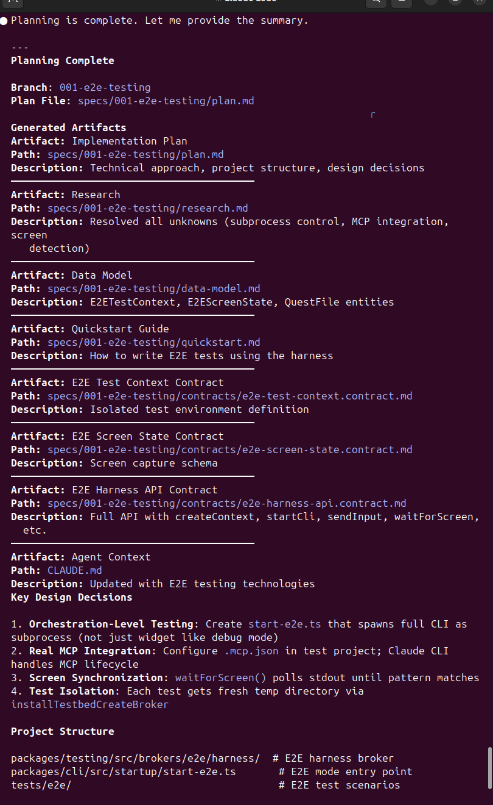
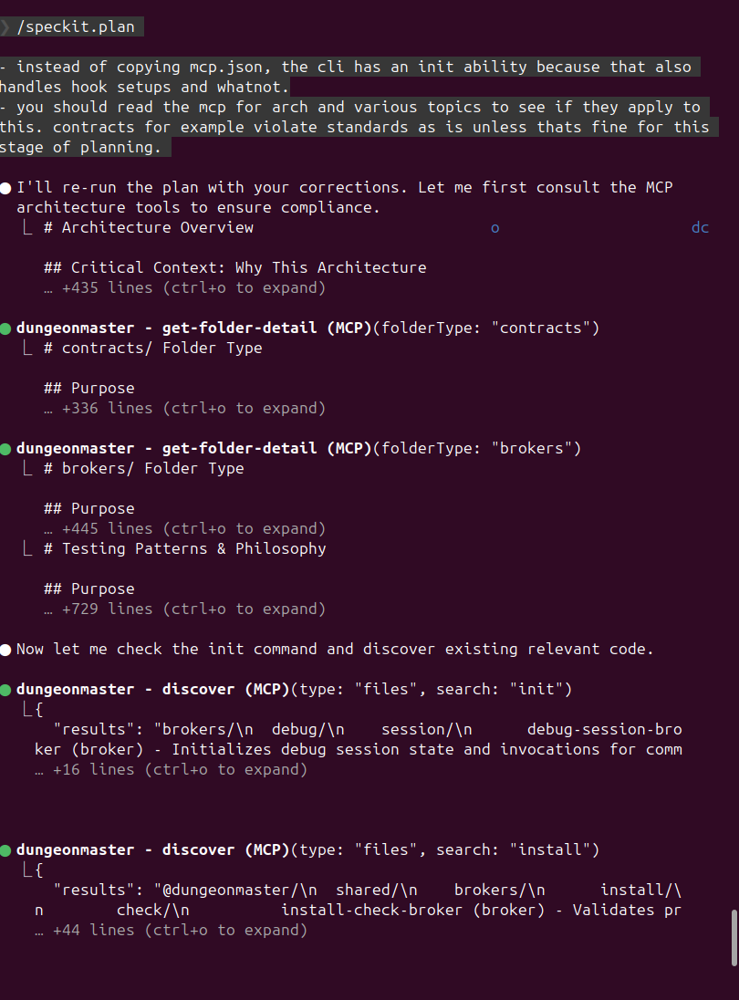
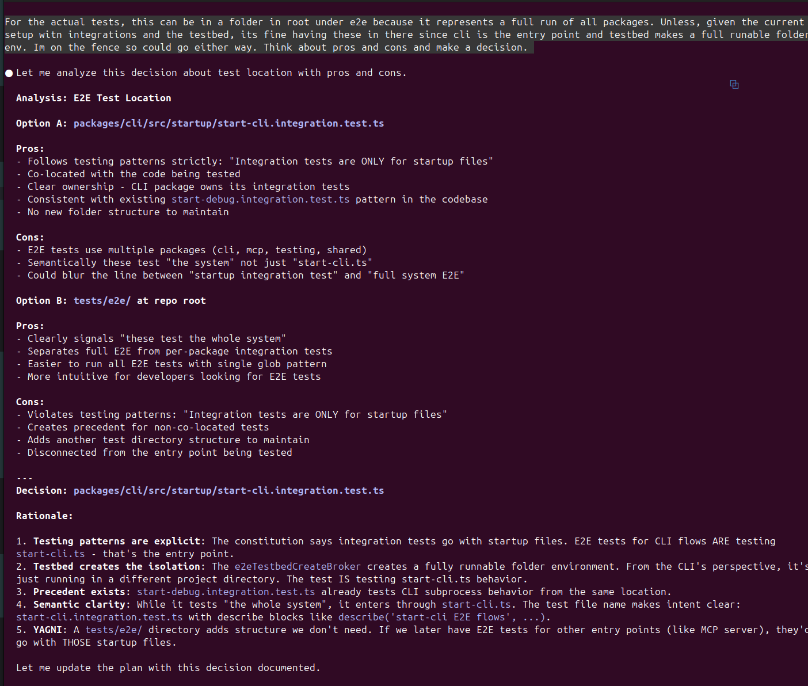

# Speckit POC

## Initial
- It has a similar init command like claude to dictate "these are the most important things in this repo"
- [constitution.md](.specify/memory/constitution.md)

## Pros
- Has configurable templates for plan/spec/tasks and agent files which is nice

## Cons
- Doesnt seem to auto commit at various task stages. You gotta manually tell it to.

## Modes

### specify
Switched to a new branch and used sub agent to explore against requirements.
Didnt ask me for clarifications, just said here's the plan, tweak if you want. 
[spec.md](specs/001-e2e-testing/spec.md)
[requirements.md](specs/001-e2e-testing/checklists/requirements.md)
Wrote em as user stories and BDD reqs which is nice.
Even without asking me follow-ups, pretty good spec plan. 
Keeps it very high-level

### plan
- It uses the consistution to validate the plan.... Oh constitutions is for spec gates.
- It writes to root claude for memory. 
- It made a wrong assumption about copying the mcp.json instead of using the cli init call.
- Really like the focus on contracts it makes. But it did bad assumptions that will mess with agents doing these.
- It adding actual code means that the sub agents generating will be more likely to just copy/paste which means if the syntax is bad, theyll write it bad.

#### Assets
- [data-model.md](specs/001-e2e-testing/data-model.md)
- [plan.md](specs/001-e2e-testing/plan.md)
- [quickstart.md](specs/001-e2e-testing/quickstart.md)
- [research.md](specs/001-e2e-testing/research.md)

#### Contracts
- [e2e-harness-api.contract.md](specs/001-e2e-testing/contracts/e2e-harness-api.contract.md)
- [e2e-screen-state.contract.md](specs/001-e2e-testing/contracts/e2e-screen-state.contract.md)
- [e2e-test-context.contract.md](specs/001-e2e-testing/contracts/e2e-test-context.contract.md)

I asked it to consider a point of view and did so and notated as history for plan.

### tasks
- Create pretty granular tasks and figured out dependancy ordering. It does say commit for each task so itll be interesting.

### execution
- Didn't write test files before implementation for contracts. 
- Opted to do all the work itself instead of sub agents
- It keeps track of task progress with the tasks.md