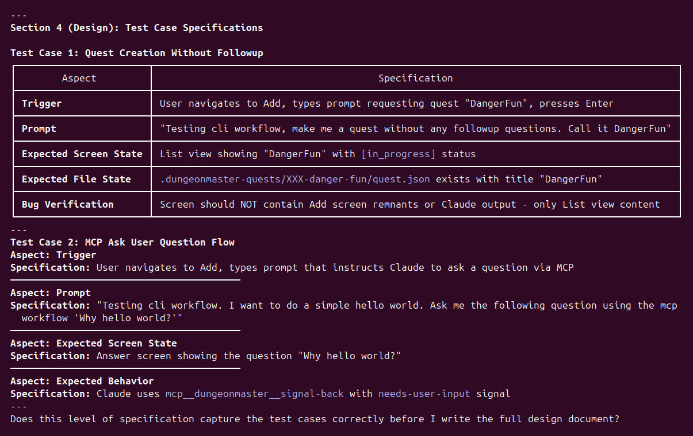
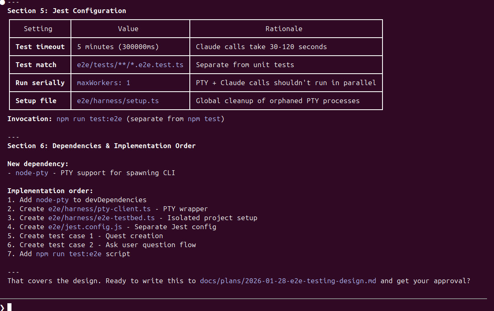
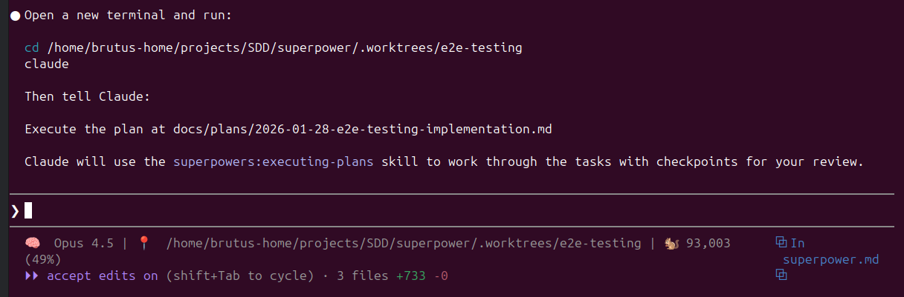
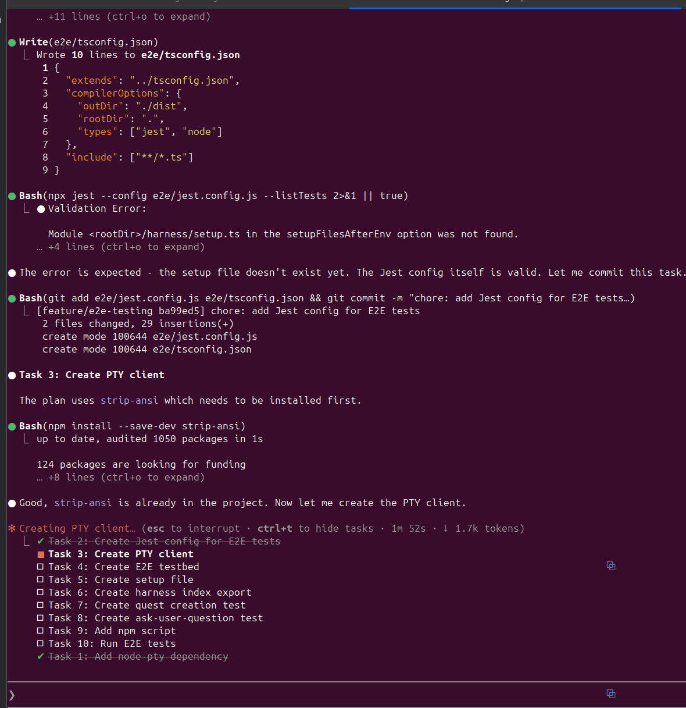

# Analysis

## Initial
Doesn't look too configurable.

## Readings
https://blog.fsck.com/2025/10/05/how-im-using-coding-agents-in-september-2025/
https://raw.githubusercontent.com/obra/dotfiles/6e088092406cf1e3cc78d146a5247e934912f6f8/.claude/CLAUDE.md

## Pros
Claude practices RED/GREEN TDD, writing a failing test, implementing only enough code to make that test pass, and then moving on.
- No slash commands, but does rely on recognzing context to then launch related skills
- Sets up worktrees by itself. Just need to give permission
- Ensures tests and build run properly before each checkpoint
- Was pretty good at committing at each stage and running tsx checks before doing. 

## Cons
- All skill based so not super deterministic right now
- This is just a claude session running skills/prompts. So you need to manage context window yourself for the orchastrator
- Per usual, if it gets stuck during execution mode, it makes decisions that might not be correct given context. 

## Modes
### Brainstorm
- CON: Didn't use my mcp to search for things per the claude md.
- PRO: Used the AskUserQuestion tool
- CON: Tried to get my approval on actual code which was annoying. I had to tell it to go explore more. I had to tell it we're in planning so manual steering. 

- After setting up worktrees and making sure repo was in a good state, then used the Writing plan skill.

#### Output
- It did keep brainstorm highlevel even though it was asking my approval on actual code syntax
[2026-01-28-e2e-testing-design.md](docs/plans/2026-01-28-e2e-testing-design.md)

### Writing Plan skill (implementation)
It did this in the same session as the Brainstorm. It put the implementation in the worktree but here's a copy of it:
[2026-01-28-e2e-testing-implementation.md](docs/plans/2026-01-28-e2e-testing-implementation.md)

It was at 50% context at this point

You have to actually change into the workspace tree if you do a new session:

### Execute Plan
It opted to do everything itself. Annoying.

- I had to steer it when it made a bad choice of skipping init in the testbed. 
